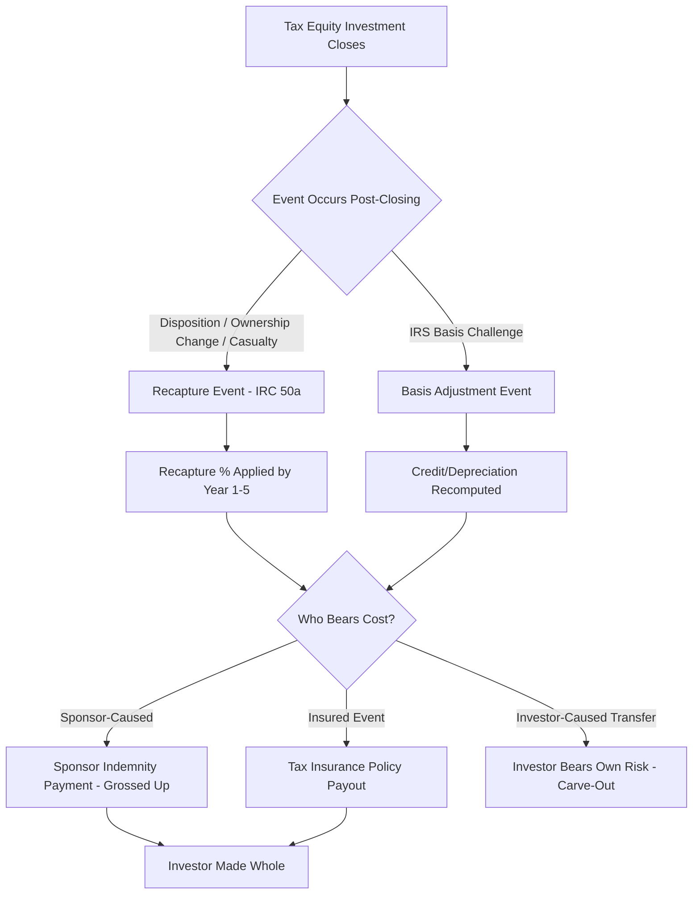

## Structuring Around Recapture and Basis Risk

### Overview

Recapture risk and basis risk are two of the most consequential risk categories in tax equity partnership structures (e.g., partnership flips, sale-leasebacks, and inverted leases) for renewable energy and other tax-credit-eligible assets. Both risks concern events that can claw back or reduce the tax benefits (Investment Tax Credit (ITC), Production Tax Credit (PTC), and depreciation) that tax equity investors rely on for their return. Structuring documents allocate, mitigate, and insure against these risks through indemnities, guarantees, structural covenants, and third-party insurance products.

### Recapture Risk

#### What Triggers Recapture

Under IRC §50(a), the ITC is subject to a five-year vesting/recapture schedule. If a "recapture event" occurs during this period, a portion of the credit must be repaid to the IRS.

**Key Points**

- Recapture percentage declines 20% per year: 100% in year 1, 80% in year 2, 60% in year 3, 40% in year 4, 20% in year 5, 0% thereafter.
- Common recapture triggers:
  - Disposition of the underlying energy property (or the partnership interest holding it, under certain ownership-change rules)
  - The property ceasing to be investment credit property (e.g., converted to personal use, or ceasing to qualify functionally)
  - A partner's interest in the partnership being reduced below a threshold (under Treas. Reg. §1.47-6), which can trigger a partial recapture allocated to that partner
  - Casualty loss or destruction of the property (unless replaced within the applicable period)
  - Foreclosure or repossession by a lender

#### Recapture Mechanics in Partnership Structures

Recapture is tested at the partner level under the "recapture percentage" rules of Treas. Reg. §1.47-6, meaning a decrease in a partner's proportionate interest in the partnership (not just a disposition of the underlying asset) can itself trigger recapture for that partner, independent of any sale of the project.

$$\text{Recapture Amount} = \text{ITC Claimed} \times \text{Applicable Recapture \%}$$

**Example**

A $10,000,000 ITC is claimed in Year 1. If a recapture event occurs in Year 3 (60% recapture rate), the investor must repay:

$$\$10{,}000{,}000 \times 0.60 = \$6{,}000{,}000$$

plus statutory interest under IRC §50(a)(1)(B).

### Structural Mitigants for Recapture Risk

#### 1. Flip Structure Design

- **Minimum ownership floors**: Partnership agreements typically require the tax equity investor's percentage interest not to drop below a specified threshold (often tied to the 1/3 minimum under Rev. Proc. 2007-65, though guidance has evolved with post-ITC-extension IRS guidance) to avoid a deemed reduction in interest.
- **Anti-abuse and lock-up covenants**: Sponsor is contractually restricted from taking actions (additional debt draws, dilutive capital calls, transfers) that would reduce the investor's proportionate interest below the recapture-safe threshold during the 5-year compliance period.
- **Transfer restrictions**: Sponsor equity (Class B/managing member interests) is typically subject to consent rights or outright transfer prohibitions during the recapture period unless the transferee assumes indemnity obligations.

#### 2. Indemnification and Guaranty Provisions

- **Sponsor recapture indemnity**: The sponsor (developer/managing member) indemnifies the tax equity investor, dollar-for-dollar (often grossed up for taxes on the indemnity payment itself), for any recapture amount plus interest and penalties triggered by sponsor-caused events (e.g., a sale of the project, a casualty not properly insured, or noncompliance).
- **Carve-outs**: Indemnities typically carve out recapture caused by investor-initiated transfers of its own interest (the investor bears its own risk if it independently triggers recapture by transferring its interest).
- **Guaranty backstop**: In thinly capitalized sponsor entities, a parent guaranty or letter of credit may back the indemnity to ensure collectability.

#### 3. Casualty and Insurance Requirements

- Property/casualty insurance covering full replacement value is a standard condition precedent and ongoing covenant.
- "Repair or replace" provisions requiring the sponsor to rebuild damaged property within a defined window (often tied to the recapture-safe-harbor repair period) to avoid a recapture-triggering disposition.

#### 4. Recapture Insurance (Third-Party)

- Specialty insurers (e.g., in the tax insurance market) offer **tax credit recapture insurance**, which pays the investor directly if a recapture event occurs, independent of sponsor solvency.
- This has become increasingly common as a substitute or supplement for sponsor indemnities, especially where the sponsor is a special-purpose, thinly capitalized entity with limited credit support. [Inference: market prevalence of this product has grown substantially in recent years, though exact market share figures are not standardized public data.]

### Basis Risk

#### What Basis Risk Means

Basis risk refers to the risk that the tax basis used to calculate the ITC (or depreciation) is later challenged or reduced by the IRS, resulting in less credit/depreciation than originally claimed. This is distinct from recapture (which claws back a credit correctly calculated but later disqualified by an event) — basis risk concerns whether the credit was calculated correctly from the outset.

**Key Points**

- ITC basis = eligible tax basis in "energy property," generally cost or fair market value depending on how the property was acquired/contributed.
- Fair market value (FMV) is central in structures where:
  - A developer sells the project to a partnership/lessor at a markup over development cost (common in sale-leasebacks and some flip structures using a "step-up" transaction)
  - The FMV substantially exceeds the developer's cost basis, creating IRS scrutiny risk over inflated valuations
- The IRS has issued numerous **Chief Counsel Advice (CCA)** memoranda and pursued audits challenging inflated FMV appraisals in solar and other renewable deals, particularly around inverted lease and sale-leaseback structures using appraised FMV substantially above cost.

#### Sources of Basis Risk

1. **Appraisal risk**: Independent appraisals supporting a step-up in basis may be challenged as overstated.
2. **Related-party transaction risk**: Transactions between related parties (sponsor-affiliated EPC contractors, common ownership) invite closer IRS scrutiny of whether the price reflects true arm's-length FMV.
3. **Cost segregation and eligible basis composition risk**: Misclassification of ineligible costs (e.g., land, certain interconnection costs, financing costs) as eligible basis.
4. **"Five-Year MACRS property" qualification risk**: Basis calculations depend on correct characterization of components as qualifying energy property versus non-qualifying property (e.g., certain transmission/substation assets, buildings).
5. **Double basis/reduction interactions**: ITC claims require a basis reduction (generally 50% of the credit amount under IRC §50(c)) for depreciation purposes — errors compounding across both credit and depreciation bases.

### Structural Mitigants for Basis Risk

#### 1. Independent, Defensible Appraisals

- Use of qualified, reputable, independent appraisers with renewable-energy-specific experience.
- Appraisals grounded in comparable market transactions and cost-based cross-checks (replacement cost approach cross-referenced against income and market approaches) rather than aggressive DCF assumptions alone.
- Contemporaneous documentation supporting FMV assumptions (executed PPAs, interconnection agreements, permits) at the time of the appraisal.

#### 2. Arm's-Length Transaction Structuring

- Where related parties are involved (e.g., developer-affiliated EPC), structuring the sale/contribution at documented, market-tested pricing, sometimes bolstered by third-party bids or comparable project data.
- Some deals bifurcate developer margin from EPC/hard costs transparently to make the basis composition auditable.

#### 3. Tax Opinions

- **Basis opinions** and **partnership flip opinions** from nationally recognized tax counsel are standard closing deliverables, typically opining "should" or "more likely than not" (MLTN) level of comfort that the claimed basis (or partnership allocations) will be respected.
- Opinion strength affects investor pricing (a "should" opinion generally commands better economics for the sponsor than a weaker "more likely than not" opinion, reflecting the lower residual risk to the investor).

#### 4. Basis/Value Indemnities

- **Basis indemnity**: Sponsor indemnifies the investor if the IRS successfully challenges and reduces the claimed basis, for the shortfall in credits/depreciation benefit (often capped and time-limited to the statute of limitations period).
- **Tax insurance for basis risk**: Similar to recapture insurance, specialty insurers offer **basis step-up insurance** (sometimes bundled with a broader "ITC insurance" policy) that pays the investor if the IRS disallows part of the claimed FMV basis. This has become a standard risk transfer tool in step-up transactions given the IRS's active audit posture in this area. [Inference: describing this as "standard" reflects broad market practice reported by tax equity market participants; adoption levels vary by deal size and sponsor.]

#### 5. Conservative Basis Positions

- Some sponsors deliberately understate FMV relative to the maximum defensible position (a "haircut" on appraised value) to reduce audit exposure at the cost of a smaller credit — a risk/return tradeoff negotiated between sponsor and investor.

### Interaction Between Recapture Risk and Basis Risk

While distinct, the two risks compound in deal structuring:

- A basis reduction from an IRS challenge does not itself trigger the recapture schedule — it is treated as a computational correction to the original credit — but it produces an analogous economic effect (credit clawback with interest).
- Recapture risk is time-bound (five years); basis risk exposure generally persists for the IRS statute of limitations on the relevant tax return (typically three years from filing, extendable to six years for substantial understatements, and unlimited for fraud).
- Tax equity investors typically require **both** categories of protection (indemnities and/or insurance) as closing conditions, often documented in a single consolidated indemnification article of the LLC/partnership agreement, distinguishing "Tax Credit Recapture Events" from "Basis Adjustment Events" as separately defined terms with potentially different caps, baskets, and survival periods.

### Structural Diagram: Risk Allocation Flow

### Sample Indemnity Provision Language (Illustrative)

**Example**

> "Sponsor shall indemnify, defend, and hold harmless the Class A Member from and against any Tax Credit Recapture Amount and any Basis Reduction Amount, together with related interest, penalties, and reasonable expenses (including a Tax Gross-Up), arising from (i) any Disposition of the Project or reduction of the Class A Member's Percentage Interest below the Minimum Percentage Interest caused by Sponsor or its Affiliates, (ii) any casualty not cured via Repair or Replacement within one hundred eighty (180) days, or (iii) any successful IRS challenge to the Eligible Basis of the Project resulting from an overstatement of Fair Market Value attributable to Sponsor's appraisal submissions; provided that no indemnity shall be owed for events caused solely by the Class A Member's voluntary Transfer of its own Interest."

### Practical Diligence Checklist

**Key Points**

- Confirm minimum percentage interest covenants are drafted consistently with Treas. Reg. §1.47-6 mechanics
- Verify appraisal methodology, appraiser independence, and comparable transaction support
- Confirm casualty insurance coverage amounts match full replacement cost, not depreciated value
- Review indemnity caps, baskets, survival periods, and whether they are grossed up for tax
- Determine whether recapture and/or basis insurance has been procured, and review policy exclusions (e.g., fraud, known-issue exclusions, retroactive date)
- Confirm tax opinion level ("should" vs. "more likely than not") and its effect on pricing
- Check statute-of-limitations alignment between indemnity survival period and IRS audit exposure window

### Conclusion

Structuring around recapture and basis risk requires layering contractual mechanics (minimum interest covenants, transfer restrictions), risk-shifting instruments (indemnities, guaranties), and increasingly, third-party insurance products, calibrated against the differing time horizons and legal triggers of IRC §50(a) recapture versus basis-related IRS challenges. Deal teams must align appraisal rigor, tax opinion strength, and indemnity/insurance coverage to produce a bankable risk allocation acceptable to tax equity investors' underwriting standards.

**Related Topics**

- Partnership Flip Structures: Cash Flow vs. Target IRR Flips
- IRC §50(c) Basis Reduction Mechanics and Depreciation Interplay
- Tax Equity Insurance Products: ITC, PTC, and Recapture Coverage
- Treas. Reg. §1.47-6 Minimum Ownership Interest Rules
- Cost Segregation Studies for Renewable Energy Basis Allocation
- IRS Audit Trends in Solar and Storage FMV Step-Up Transactions
- Sale-Leaseback vs. Inverted Lease Structuring Considerations
- Depreciation Recapture (IRC §1245/§1250) vs. ITC Recapture Distinctions