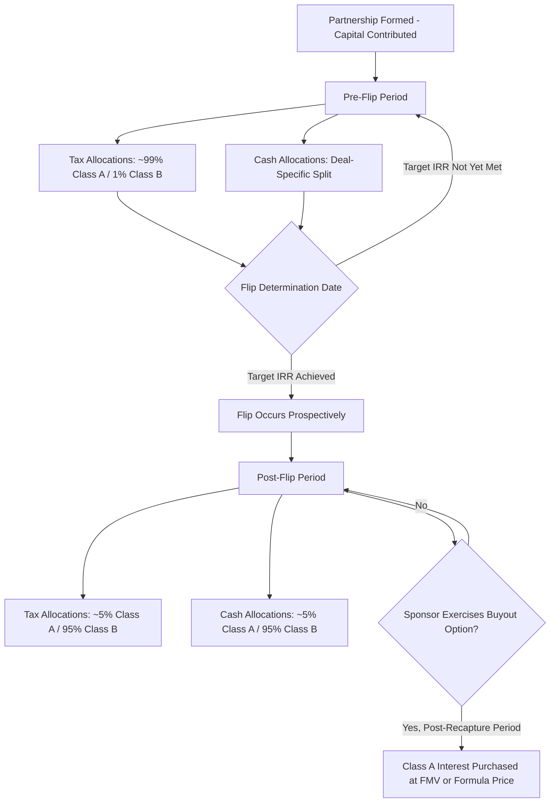

## Pre-Flip and Post-Flip Allocation Mechanics

### Overview

Partnership flip structures allocate tax benefits (ITC/PTC, depreciation) and cash distributions between the tax equity investor (typically the Class A Member) and the sponsor (typically the Class B Member/Managing Member) using two distinct allocation regimes that switch at the "flip point" — the moment the investor achieves its target yield. Understanding the mechanics of pre-flip versus post-flip allocations, and the triggers governing the transition, is fundamental to modeling, negotiating, and administering these deals.

### The Two-Period Structure

**Key Points**

- **Pre-Flip Period**: Tax equity investor receives a disproportionately large share of tax benefits and/or cash relative to its capital contribution (commonly 99% allocations in PTC deals, or a heavily weighted split in ITC deals).
- **Post-Flip Period**: Allocations "flip" to a smaller residual share for the investor (commonly 5%) and a much larger share for the sponsor (commonly 95%), reflecting that the investor has now achieved its target return.
- The flip is typically triggered by the investor reaching a **target Internal Rate of Return (IRR)** (a "yield-based flip") or, less commonly, a fixed date or fixed cash amount (a "fixed flip" or "time-based flip").

### Pre-Flip Allocation Mechanics

#### Tax Benefit Allocations

- **PTC deals (wind, and other PTC-eligible technologies)**: Allocations of taxable income/loss and PTCs are typically 99% to the Class A Member and 1% to the Class B Member during the pre-flip period, reflecting the investor's dominant economic interest while it is recovering its investment through credits and depreciation.
- **ITC deals (solar and other ITC-eligible technologies)**: The ITC itself is allocated in accordance with the partners' **"ITC allocation percentage"**, generally tracking the Class A Member's share of the partnership's profits or a specially designated ITC-sharing ratio (since the ITC is claimed in year one as a one-time credit, its allocation is often fixed at closing based on the Class A Member's initial capital interest, separate from ongoing income/loss allocations).
- Depreciation (typically MACRS 5-year property) follows the income/loss allocation percentage, generally matching the Class A Member's heavily weighted pre-flip share.

#### Cash Distribution Allocations

- Cash distributions during the pre-flip period are often allocated differently from tax allocations — commonly the Class A Member receives a smaller cash share (e.g., 2–20%, depending on deal structure) even while receiving 99% of tax attributes, because its primary pre-flip return driver is the tax benefits rather than cash.
- Some structures use a **"cash sweep"** or **"priority return"** mechanism, where a fixed preferred cash amount flows to the Class A Member before any sponsor promote.

#### Capital Account Mechanics

Allocations of income, loss, and credit must have "substantial economic effect" under Treas. Reg. §1.704-1(b) or otherwise be consistent with the partners' interests in the partnership under Treas. Reg. §1.704-1(b)(3). Capital accounts are maintained to track each partner's economic entitlement:

$$\text{Capital Account}_{t} = \text{Capital Account}_{t-1} + \text{Contributions} + \text{Income Allocated} - \text{Losses Allocated} - \text{Distributions}$$

**Example**

If the Class A Member contributes $40,000,000 and is allocated 99% of a $5,000,000 pre-flip year-one loss:

$$\text{Loss Allocated} = \$5{,}000{,}000 \times 0.99 = \$4{,}950{,}000$$

$$\text{Ending Capital Account} = \$40{,}000{,}000 - \$4{,}950{,}000 = \$35{,}050{,}000$$

### The Flip Point: Triggers and Determination

#### Yield-Based Flip (Most Common)

- The partnership agreement defines a **Target IRR** or **Flip Yield** — the annualized after-tax return the Class A Member must achieve, calculated on a defined cash-flow basis (contributions as outflows; tax benefits monetized plus cash distributions as inflows).
- A designated party (often the tax equity investor, or an independent accountant/administrative agent) calculates, on each **Flip Determination Date** (often quarterly or annually), whether the Class A Member's cumulative IRR has reached the target.
- Once the target IRR is achieved, allocations flip prospectively (not retroactively) from that date forward.

$$\text{IRR: } \sum_{t=0}^{n} \frac{CF_t}{(1 + \text{IRR})^t} = 0$$

where $CF_t$ represents net after-tax cash flows (contributions negative, tax benefit value and distributions positive) in period $t$.

#### Fixed/Time-Based Flip

- Less common; allocations flip on a specified calendar date or after a specified cumulative cash amount is distributed, regardless of realized IRR.
- Provides more certainty to the sponsor but shifts flip-timing risk to whichever party bears the shortfall if the fixed date arrives before/after the "natural" yield-based flip would have occurred.

#### True-Up Mechanisms

- Because IRR calculations depend on estimates (e.g., timing of tax benefit realization, or interim tax return positions), agreements often include a **true-up provision**: if the flip is later determined (e.g., upon final tax return filing or IRS resolution) to have occurred earlier or later than initially calculated, retroactive reallocation or a cash true-up payment corrects the discrepancy.

### Post-Flip Allocation Mechanics

#### Tax and Cash Allocations

- After the flip, both tax allocations and cash distributions typically shift to the residual sharing ratio (commonly 5% Class A / 95% Class B), reflecting that the sponsor now retains the substantial majority of ongoing economics.
- Depreciation in the post-flip period is minimal in most deals, since 5-year MACRS property is largely or fully depreciated by the time a typical flip occurs (commonly years 6–10 for wind PTC deals; can vary for solar ITC deals depending on the target yield and cash flow profile).

#### Buyout/Purchase Option Rights

- Many flip agreements grant the sponsor a **right of first offer (ROFO)** or **fixed-price purchase option** to buy out the Class A Member's residual interest after the flip (and often after the ITC recapture period has fully lapsed, to avoid triggering recapture on a disposition).
- Purchase price is typically the greater of fair market value or a formula price (sometimes tied to a percentage of the investor's remaining capital account or a fixed multiple), subject to constraints under IRS guidance to avoid recharacterizing the arrangement as a financing rather than genuine equity (see Historic Boardwalk Hall concerns and subsequent IRS safe harbor guidance, e.g., Rev. Proc. 2007-65 for wind, and analogous ITC partnership flip guidance).

### Allocation Flow Diagram

### Special Allocation Issues

#### Minimum Gain Chargeback and Qualified Income Offset

- Standard partnership tax provisions (minimum gain chargeback under Treas. Reg. §1.704-2(f), qualified income offset under Treas. Reg. §1.704-1(b)(2)(ii)(d)) are included as boilerplate safeguards to preserve the substantial-economic-effect safe harbor, overriding the stated percentage allocations if a partner's capital account would otherwise go negative beyond permitted limits.

#### Curative and Corrective Allocations

- If actual allocations in a given year would produce a capital account result inconsistent with the parties' intended economic deal (e.g., due to a loss limitation), corrective or curative allocations in subsequent years adjust for the discrepancy.

#### Section 704(b) vs. Section 704(c) Interactions

- Where a sponsor contributes appreciated property (e.g., a developed project) rather than cash, §704(c) requires built-in gain/loss to be allocated back to the contributing sponsor, which interacts with — and must be layered underneath — the pre-flip/post-flip percentage allocations.

### Illustrative Allocation Table

| Period | Income/Loss (Class A / Class B) | ITC/PTC (Class A / Class B) | Cash Distributions (Class A / Class B) |
| --- | --- | --- | --- |
| Pre-Flip | 99% / 1% | ~Investor's initial ITC share or 99% PTC | Deal-specific (often lower Class A cash %) |
| Post-Flip | 5% / 95% | N/A (PTC/ITC generally exhausted or reallocated) | 5% / 95% |

### Practical Modeling Considerations

**Key Points**

- Flip models must integrate depreciation schedules, ITC/PTC timing, and after-tax cash flows into a single IRR calculation consistent with the partnership agreement's defined methodology
- Sponsors and investors frequently negotiate the discount rate/timing conventions used to compute IRR (e.g., mid-year versus year-end convention), which can materially shift the modeled flip date
- Model sensitivity to variables such as curtailment, degradation (for solar), availability (for wind), and merchant power price assumptions directly affects when the flip occurs
- Because flip timing is inherently probabilistic, sponsors typically model a base case flip date but retain covenants addressing early or late flip scenarios (e.g., additional sponsor capital contributions if underperformance delays the flip beyond a backstop date)

### Conclusion

Pre-flip and post-flip allocation mechanics operationalize the core economic bargain of a partnership flip: front-loading tax benefits to the party with tax capacity (the investor) in exchange for capital, then reverting the bulk of long-term economics to the sponsor once the investor's target return is achieved. The precision of the flip-point determination — governed by IRR methodology, true-up mechanisms, and compliance with partnership tax allocation rules — is central to both the bankability of the deal and its durability under IRS scrutiny.

**Related Topics**

- Target IRR Calculation Methodologies and Discount Conventions
- Treas. Reg. §1.704-1(b) Substantial Economic Effect Requirements
- Section 704(c) Built-In Gain Allocations in Contributed-Asset Structures
- Sponsor Buyout and Purchase Option Structuring Post-Flip
- Structuring Around Recapture and Basis Risk
- Minimum Gain Chargeback and Qualified Income Offset Provisions
- Cash vs. Tax Allocation Divergence in Flip Structures
- Wind PTC vs. Solar ITC Flip Structure Differences