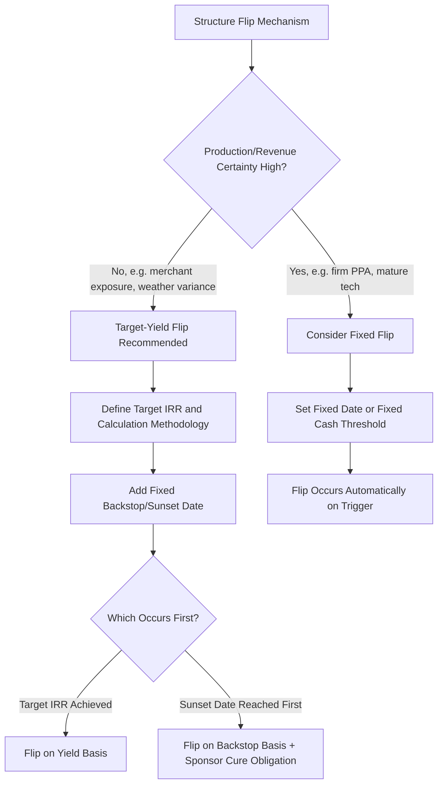

## Fixed Flip Versus Target-Yield Flip

### Overview

Partnership flip structures require a defined mechanism for determining when allocations and distributions transition from the pre-flip ratio to the post-flip ratio. Two principal methodologies dominate the market: the **fixed flip** (allocations change on a predetermined date or after a fixed cash/benefit threshold) and the **target-yield flip** (allocations change once the investor achieves a contractually defined IRR). The choice between them allocates timing risk, performance risk, and administrative complexity differently between the sponsor and the tax equity investor.

### Fixed Flip Structures

#### Mechanics

- The flip date (or flip trigger amount) is specified as a **fixed calendar date**, a **fixed number of years** after commercial operation, or a **fixed cumulative cash/tax benefit amount** delivered to the investor.
- Once the trigger is reached, allocations shift automatically to the post-flip ratio regardless of whether the investor's realized IRR is above, at, or below its originally targeted return.

**Key Points**

- Simplicity: no need for ongoing IRR modeling, quarterly recalculation, or an administrative agent dedicated to flip-date determination
- Certainty for the sponsor: the sponsor knows precisely when it regains the majority economic interest, aiding refinancing, buyout planning, and long-term asset management decisions
- Performance risk shifts more heavily to the investor: if the project underperforms (e.g., lower-than-modeled generation, higher curtailment, unplanned outages), the investor may not achieve its target IRR by the fixed date and has limited structural recourse to delay the flip
- Performance upside also can favor the investor if the project overperforms, since the investor continues receiving the pre-flip percentage until the fixed date even after its target return has technically been exceeded

#### When Fixed Flips Are Used

- More common in structures where the investor has strong confidence in production estimates (e.g., mature technology, strong resource data, firm long-term contracted revenue such as a fixed-price PPA)
- Sometimes used as a **backstop mechanism** layered on top of a target-yield flip (a "sunset date") rather than as the sole flip trigger — i.e., the flip occurs at the earlier of target-yield achievement or a fixed outside date, discussed further below

### Target-Yield Flip Structures

#### Mechanics

- The partnership agreement specifies a **Target IRR** (sometimes called the "Flip Yield"), representing the after-tax rate of return the Class A Member must realize on its invested capital, computed using an agreed cash-flow methodology.
- On each **Flip Determination Date**, cumulative after-tax cash flows to the investor (capital contributions as outflows; monetized tax benefits and cash distributions as inflows) are tested against the target using an IRR calculation.

$$\sum_{t=0}^{n} \frac{CF_t}{(1 + r^*)^t} = 0$$

where $r^*$ is the Target IRR and $CF_t$ is net after-tax cash flow in period $t$. The flip occurs in the period where cumulative realized IRR first equals or exceeds $r^*$.

**Key Points**

- Performance risk is borne more heavily by the sponsor: if the project underperforms, the flip is delayed until the investor's target yield is actually achieved, meaning the sponsor receives its larger residual share later than modeled
- Provides the investor a more precise, deal-specific return protection mechanism, since the flip is tied directly to actual realized performance rather than an assumed production/revenue trajectory
- Requires ongoing administrative infrastructure: quarterly or annual IRR recalculations, often performed by an independent calculation agent or the tax equity investor's asset management team, with dispute resolution provisions if the sponsor disagrees with the calculation
- Requires **true-up mechanisms** for interim estimates that are later revised (e.g., final tax return positions differing from initial estimates), potentially triggering retroactive reallocation or cash true-up payments between the parties

#### When Target-Yield Flips Are Used

- The dominant approach in modern wind and solar partnership flip transactions, particularly where production, weather, or merchant price variability create meaningful performance uncertainty
- Preferred by tax equity investors as the primary yield-protection mechanism, since it directly ties the duration of favorable allocations to whether the investor has actually reached its bargained-for return

### Hybrid Structures: Target-Yield Flip with Fixed Backstop

Many modern deals combine both mechanisms to balance investor protection with sponsor certainty:

- The **primary trigger** is the target-yield flip (protecting the investor's return).
- A **fixed outside date** (sometimes called a "sunset date" or "backstop flip date") caps how long the pre-flip period can extend, even if the target yield has not yet been achieved — often paired with a sponsor obligation to contribute additional capital, provide a make-whole payment, or otherwise cure the shortfall if the outside date arrives first.
- Conversely, some structures include a **minimum hold period** (an earliest possible flip date) even if the target yield is achieved sooner, preventing an unexpectedly early flip that could raise IRS scrutiny about whether the investor had a genuine, meaningful economic stake in the venture for a sufficient duration.

**Example**

A deal specifies: "The Flip Date shall occur on the earlier of (i) the Flip Determination Date on which the Class A Member's IRR first equals or exceeds 8.5%, or (ii) the tenth (10th) anniversary of the Commercial Operation Date, subject to Section 4.3 (Sponsor Shortfall Contribution)." This structure caps the investor's downside timing exposure while allowing early exit if performance is strong.

### Comparative Risk Allocation

| Factor | Fixed Flip | Target-Yield Flip |
| --- | --- | --- |
| Investor return protection | Weak (return risk borne by investor) | Strong (flip delays until yield achieved) |
| Sponsor timing certainty | High | Low to moderate (unless capped by backstop) |
| Administrative burden | Low | Moderate to high (ongoing IRR calculations) |
| Sensitivity to production/performance variance | High exposure for investor | Low exposure for investor; shifts to sponsor |
| Typical usage | Simpler deals, high production confidence | Standard in most modern wind/solar flips |
| Dispute potential | Low | Moderate (calculation methodology disputes) |

### Decision Flow Diagram

### IRS and Structuring Considerations

- Regardless of flip mechanism, the arrangement must reflect a genuine partnership with the investor bearing meaningful upside and downside risk, consistent with IRS guidance distinguishing bona fide partnership equity from a disguised financing (informed by safe harbor guidance such as Rev. Proc. 2007-65 for wind flip structures and subsequent IRS informal guidance addressing solar ITC flips).
- A target-yield flip is generally viewed as more clearly demonstrating genuine risk-sharing (since the investor's return is not guaranteed by a fixed date regardless of performance), which can support the durability of the structure's tax treatment. [Inference: this is a widely cited structuring rationale among tax equity practitioners rather than an explicit numerical IRS test.]
- Extremely short fixed-flip periods, or fixed flips paired with minimal investor downside exposure, invite heightened scrutiny over whether the investor holds a genuine equity interest versus a disguised loan.

### Practical Negotiation Points

**Key Points**

- Calculation agent selection (investor, independent third party, or joint calculation with dispute escalation procedures)
- Discount rate/timing convention for IRR (mid-year vs. year-end cash flow timing assumptions)
- Treatment of transaction costs, indemnity payments, and true-up payments within the IRR calculation
- Whether unresolved IRS audit adjustments toll or otherwise affect the Flip Determination Date
- Backstop date length and associated sponsor cure remedies (additional capital contribution, guaranty draw, or extension of pre-flip period)

### Conclusion

The choice between a fixed flip and a target-yield flip fundamentally allocates project performance risk between sponsor and investor. Fixed flips offer administrative simplicity and sponsor timing certainty but transfer performance risk to the investor; target-yield flips better protect investor returns and are viewed as more consistent with genuine partnership risk-sharing, at the cost of ongoing calculation complexity. Most modern transactions adopt a hybrid approach — a target-yield flip with a fixed backstop date — balancing investor protection against sponsor certainty.

**Related Topics**

- Pre-Flip and Post-Flip Allocation Mechanics
- Calculation Agent Selection and IRR Dispute Resolution Provisions
- Sponsor Shortfall and Make-Whole Capital Contribution Obligations
- Rev. Proc. 2007-65 Safe Harbor and Post-ITC Structuring Guidance
- Structuring Around Recapture and Basis Risk
- Merchant Price and Production Risk in Tax Equity Underwriting
- True-Up Mechanisms for Tax Benefit Timing Discrepancies