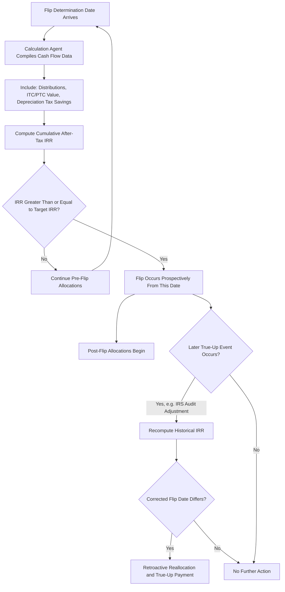

## Flip Date Calculations and Internal Rate of Return Targets

### Overview

The flip date determination process is the operational core of a target-yield partnership flip structure. It requires a precisely defined IRR calculation methodology, agreed cash-flow inputs, a designated calculation agent, and procedures for testing, disputing, and finalizing the flip date. Because the flip date determines when the sponsor regains the majority economic interest, the calculation mechanics are heavily negotiated and typically consume substantial diligence attention from both parties' tax and financial advisors.

### Defining the Target IRR

#### What the Target IRR Represents

The Target IRR (or "Flip Yield") is the negotiated after-tax rate of return the Class A (tax equity) investor requires on its invested capital, computed over the life of its investment using the partnership agreement's defined cash-flow conventions.

**Key Points**

- Target IRRs are negotiated based on the investor's required after-tax yield, informed by the risk profile of the technology, counterparty credit, contract structure (PPA vs. merchant), and prevailing tax equity market pricing
- The rate is fixed in the partnership agreement at closing and does not float with market conditions after that point
- IRR is computed on an **after-tax** basis, incorporating the value of monetized tax benefits (ITC/PTC and depreciation tax savings) alongside cash distributions

#### Core IRR Formula

$$\sum_{t=0}^{n} \frac{CF_t}{(1 + r)^t} = 0$$

The Flip Date is the earliest period $t^*$ at which solving for $r$ using cumulative cash flows through $t^*$ yields $r \geq r^*$ (the contractual Target IRR).

**Example**

Assume a Class A Member contributes $50,000,000 at closing (t=0) and receives the following net after-tax cash flow equivalents (cash distributions plus monetized tax benefit value) in subsequent years:

| Year | Net After-Tax Cash Flow |
| --- | --- |
| 0 | -$50,000,000 |
| 1 | $14,000,000 |
| 2 | $9,000,000 |
| 3 | $8,500,000 |
| 4 | $8,000,000 |
| 5 | $7,500,000 |
| 6 | $7,000,000 |

Solving iteratively for the rate that zeroes the NPV of cumulative flows through each year identifies the year in which cumulative IRR first reaches the Target IRR (e.g., 8.0%). If cumulative IRR crosses 8.0% between year 5 and year 6, the calculation agent typically interpolates to identify the specific **Flip Determination Date** within that period (often the closest quarter-end or agreed testing date).

### Cash Flow Components Included in the Calculation

#### Inflows to the Investor

1. **Cash distributions** actually received from the partnership under the pre-flip distribution percentage
2. **Value of ITC** (typically recognized in the calculation in the year claimed, at either the full credit amount or a risk-adjusted value depending on negotiated conventions)
3. **Value of PTC** (recognized annually as generated, based on actual production multiplied by the applicable per-kWh rate, adjusted for inflation indexing under IRC §45)
4. **Depreciation tax savings**: the value of MACRS deductions multiplied by the investor's assumed marginal tax rate
5. **True-up and indemnity payments** received (e.g., basis or recapture indemnity payments), depending on how the agreement treats these items in the calculation

#### Outflows from the Investor

1. **Initial capital contribution(s)** at closing (and any additional contributions during construction, in structures involving a construction-period equity commitment)
2. **Recapture repayments** or basis shortfall amounts borne by the investor for events not covered by sponsor indemnity or insurance
3. **Tax gross-up costs** in certain structures where the investor's own tax liability on receipt of indemnity payments is factored into net cash flow

### Calculation Agent and Testing Procedures

#### Designating the Calculation Agent

- Often the tax equity investor's asset management or fund administration team performs the initial calculation, subject to sponsor review rights
- Some deals use an **independent third-party accountant** as calculation agent to reduce potential conflicts, particularly in larger or multi-investor syndications
- The agreement typically specifies the **testing frequency** (quarterly is common) and the **information the sponsor must provide** (production data, revenue reports, tax return positions) to support each calculation

#### Dispute Resolution

- If the sponsor disagrees with a calculated flip date, agreements typically provide for:
  - A review period during which the sponsor can request supporting workpapers
  - Escalation to a mutually agreed independent accounting firm if the parties cannot resolve the dispute
  - In some agreements, binding expert determination provisions to avoid full litigation over calculation disputes

### True-Up Mechanisms

#### Why True-Ups Are Necessary

Interim flip calculations rely on estimates that may later prove inaccurate:

- Tax return positions filed on extension or amended after the initial calculation
- IRS audit adjustments to claimed credits or basis, finalized years after the original filing
- Production/revenue true-ups where preliminary metered data is later revised

#### True-Up Mechanics

- If a true-up reveals the flip should have occurred **earlier** than originally calculated, the agreement typically requires a **retroactive reallocation** of post-flip percentages back to the corrected date, often paired with a **cash true-up payment** from the sponsor to the investor (or vice versa) to restore the parties to the position they would have occupied had the correct date been used from the start.
- If the true-up reveals the flip should have occurred **later**, the reverse reallocation and payment obligations apply.

$$\text{True-Up Payment} = \left| \text{Amount Distributed Under Original Determination} - \text{Amount That Should Have Been Distributed Under Corrected Determination} \right|$$

### Sensitivity Factors Affecting Flip Timing

**Key Points**

- **Production/generation variance**: Actual energy output above or below P50/P90 estimates directly shifts revenue and thus cash flow timing
- **Curtailment and grid constraints**: Unplanned curtailment reduces revenue and delays the flip
- **Merchant price exposure**: For projects without a fixed-price PPA, wholesale power price volatility materially affects modeled versus actual cash flows
- **O&M and unplanned outage costs**: Higher-than-modeled operating costs reduce distributable cash, delaying the flip
- **Tax law changes**: Changes to tax rates, bonus depreciation rules, or credit values between modeling and actual realization can shift the after-tax value of tax benefits included in the IRR calculation
- **Financing structure interactions**: In deals with back-leverage debt at the sponsor level (structurally subordinate to the tax equity investor's position but still affecting overall project cash flow available for distribution), debt service coverage requirements can affect the cash actually available for distribution to the Class A Member

### Flip Date Determination Process

### Illustrative IRR Calculation Table (Simplified)

| Period | Cash Flow | Cumulative PV at Test Rate (8.0%) | Cumulative IRR to Date |
| --- | --- | --- | --- |
| 0 | -$50,000,000 | -$50,000,000 | N/A |
| 1 | $14,000,000 | -$37,037,037 | Negative |
| 2 | $9,000,000 | -$29,320,988 | Negative |
| 3 | $8,500,000 | -$22,573,988 | Negative |
| 4 | $8,000,000 | -$16,693,988 | Negative |
| 5 | $7,500,000 | -$11,588,988 | Approaching target |
| 6 | $7,000,000 | -$7,175,988 | Continuing to approach target |

[Note: This table illustrates the discounting mechanic only; actual flip determination requires solving for the discount rate that zeroes cumulative NPV, not merely discounting at the target rate — actual crossover timing depends on the full cash flow schedule beyond the periods shown.]

### Common Negotiated Variations

**Key Points**

- **Minimum hold period**: A floor preventing the flip from occurring before a specified early date, even if the target IRR is technically reached sooner, to preserve the appearance of genuine long-term equity participation
- **Backstop/sunset date**: A ceiling capping how long the pre-flip period can extend if underperformance delays the calculated flip indefinitely
- **Step-down target IRR**: Some deals reduce the target IRR incrementally over time as a negotiated concession, effectively making an early flip more achievable
- **Tax benefit valuation conventions**: Whether tax benefits are valued at full statutory value or a risk-adjusted/haircut value in the IRR calculation, which materially affects modeled flip timing

### Conclusion

Flip date calculations translate the parties' contractual bargain — a defined after-tax IRR — into an operational, periodically tested mechanism governing when economic allocations shift. The precision of the cash-flow inclusion rules, the choice and independence of the calculation agent, and robust true-up provisions for later-arising adjustments are essential to making the mechanism administrable and resistant to dispute, while the underlying sensitivity of flip timing to production, pricing, and tax-law variables makes this one of the most closely modeled aspects of partnership flip underwriting.

**Related Topics**

- Fixed Flip Versus Target-Yield Flip
- Pre-Flip and Post-Flip Allocation Mechanics
- Calculation Agent Selection and Dispute Resolution Provisions
- Tax Benefit Valuation Conventions in IRR Modeling
- Structuring Around Recapture and Basis Risk
- P50/P90 Production Estimates and Their Role in Tax Equity Underwriting
- Back-Leverage Debt Interaction with Tax Equity Cash Waterfalls