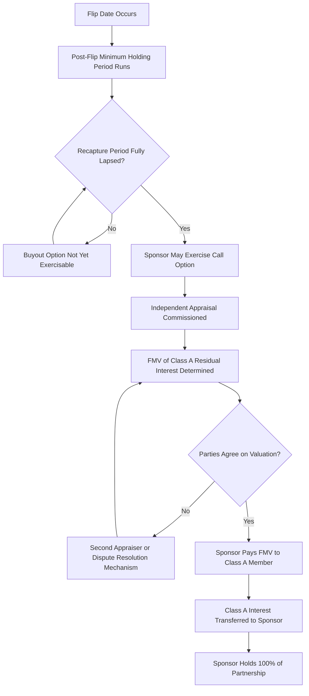

## Sponsor Call Options and Fair Market Value Purchase Rights

### Overview

After the flip date, the sponsor typically holds contractual rights to buy out the tax equity investor's residual partnership interest, allowing the sponsor to consolidate full ownership of the project once the investor's return has been achieved. These rights are structured carefully to preserve the deal's characterization as a genuine partnership rather than a disguised financing, and to avoid triggering adverse tax consequences such as ITC recapture or gain recognition issues. This topic covers the structuring, pricing, and timing constraints on sponsor call options and fair market value (FMV) purchase rights.

### Why Buyout Rights Exist

**Key Points**

- Tax equity investors are typically financial investors seeking a target return over a defined period, not long-term owners of operating energy assets; they generally want an exit mechanism once their return objective is met
- Sponsors want to consolidate 100% ownership post-flip to simplify long-term asset management, refinancing, and potential future sale of the project
- A structured buyout right provides certainty for both parties regarding the ultimate disposition of the investor's residual interest, avoiding an indefinite minority co-ownership arrangement

### Types of Buyout Rights

#### 1. Fixed-Price Purchase Option

- Grants the sponsor the right (but not the obligation) to purchase the Class A Member's interest at a **pre-agreed fixed price** or **formula-based price** (e.g., a percentage of the investor's remaining capital account, or a fixed multiple of trailing distributions).
- Historically scrutinized by the IRS where the fixed price is set below anticipated FMV, since a bargain purchase option can suggest the investor never held genuine equity risk (implicating the "call option" concerns raised in guidance following cases addressing sale-leaseback and partnership financing characterization, including the historic tax credit context of *Historic Boardwalk Hall v. Commissioner*).
- As a result, well-structured deals typically avoid a below-market fixed-price call option exercisable unilaterally by the sponsor; when fixed-price mechanisms are used, they are usually calibrated to approximate reasonably anticipated FMV or are structured as investor-held put rights rather than sponsor-held call rights (see below).

#### 2. Fair Market Value (FMV) Purchase Option

- The sponsor's call option is priced at the **fair market value** of the Class A Member's interest at the time of exercise, determined by an independent appraisal or agreed valuation methodology.
- This structure is broadly viewed as more defensible than a fixed-price option because it does not predetermine a bargain price, preserving the investor's genuine exposure to the interest's actual value at exercise. [Inference: this reflects a widely followed market practice responding to IRS scrutiny of below-market options, rather than a codified bright-line safe harbor.]
- FMV is typically determined by:
  - An independent third-party appraisal commissioned at the time of exercise
  - A pre-agreed valuation methodology (e.g., discounted cash flow of the investor's residual allocation percentage, income approach, or comparable transaction approach)
  - A dispute resolution mechanism (e.g., a second independent appraiser, or averaging of multiple appraisals) if the sponsor and investor disagree with the initial valuation

#### 3. Right of First Offer (ROFO)

- Rather than (or in addition to) a call option, some agreements grant the sponsor a **ROFO**: if the investor decides to sell its interest to a third party, the investor must first offer the interest to the sponsor on the same terms before marketing it externally.
- ROFOs are generally viewed as lower-risk from a tax characterization standpoint than a unilateral sponsor call option, since the investor retains the initiating decision to sell.

#### 4. Investor Put Option

- Some structures grant the **investor** (not the sponsor) a put right to sell its interest to the sponsor at FMV (or a formula price) after a specified date, giving the investor an exit mechanism while avoiding the tax characterization risk associated with a sponsor-held call.
- A put held by the investor is generally considered lower-risk than a call held by the sponsor because it does not constrain the investor's economic upside in the same way a sponsor call at a capped or below-market price would.

### Timing Constraints

#### Recapture Period Considerations

- Exercise of a buyout option that results in a **disposition of the investor's partnership interest** during the five-year ITC recapture period can trigger recapture under the ownership-change rules of Treas. Reg. §1.47-6.
- As a result, buyout options are typically structured to be exercisable only **after the recapture period has fully lapsed** (i.e., after the fifth anniversary of the placed-in-service date), or are structured so that any recapture triggered by an earlier exercise is addressed via indemnity.

#### Post-Flip Timing

- Buyout rights are generally exercisable only **after the flip date** has occurred, since the sponsor's incentive to buy out the investor is strongest once its allocation share and future value are already reduced to the residual (typically 5%) share.
- Some agreements impose a **minimum post-flip holding period** before the option becomes exercisable, reinforcing the appearance of genuine, sustained partnership participation by the investor.

### Structuring the FMV Determination

#### Appraisal Methodology Considerations

**Key Points**

- **Income approach**: Discounted cash flow of the investor's residual (typically 5%) share of projected future distributions and any remaining tax attributes
- **Market approach**: Comparable secondary-market transactions for similar residual tax equity interests (data availability can be limited given the private, negotiated nature of most secondary trades)
- **Minority discount considerations**: Because the investor's residual interest is typically a small, non-controlling stake, appraisers may apply a minority interest and/or marketability discount, which can meaningfully reduce the appraised value relative to a pro rata share of total project value

#### Illustrative FMV Calculation

$$FMV_{\text{Class A Residual}} = \sum_{t=1}^{n} \frac{D_t \times 0.05}{(1 + k)^t} \times (1 - \text{Discount}_{\text{minority/marketability}})$$

where $D_t$ is total projected partnership distributions in year $t$, $0.05$ represents the investor's post-flip residual percentage, $k$ is the discount rate reflecting the risk of the residual cash flow stream, and the discount factor accounts for minority interest and marketability considerations.

**Example**

If the residual 5% share of projected distributions has a discounted present value of $3,000,000 before adjustment, and the appraiser applies a combined 20% minority/marketability discount:

$$FMV = \$3{,}000{,}000 \times (1 - 0.20) = \$2{,}400{,}000$$

### Buyout Process Flow

### Tax Characterization Risk Factors

**Key Points**

- A below-market fixed call option price is the single most scrutinized feature, as it can suggest the investor's "equity" position was economically closer to a secured loan with a predetermined repayment amount than genuine equity at risk
- The IRS and courts have historically focused on whether the investor bore meaningful upside and downside risk throughout the investment period, not solely at exit — a favorable FMV buyout mechanism does not, by itself, cure other structural weaknesses (e.g., minimal at-risk capital, guaranteed minimum returns, or an absence of genuine profit-sharing during the pre-flip period)
- Practitioners generally advise obtaining a tax opinion addressing the overall partnership's characterization, which considers the buyout mechanism as one factor among several (capital contribution levels, allocation percentages, guarantees, and put/call terms collectively)

### Practical Negotiation Points

**Key Points**

- Whether the buyout right is structured as a sponsor call, investor put, ROFO, or some combination
- Selection and qualification requirements for the independent appraiser(s)
- Treatment of minority/marketability discounts in the appraisal methodology
- Timing constraints tied to the recapture period and any additional minimum holding period
- Allocation of appraisal costs between the parties
- Dispute resolution procedure if the parties' appraisals diverge materially

### Conclusion

Sponsor call options and FMV purchase rights provide the mechanism by which tax equity investors exit partnership flip structures once their target return has been achieved, while sponsors consolidate full project ownership. Because poorly structured below-market call options have historically drawn IRS scrutiny regarding genuine partnership characterization, market practice has converged on FMV-based buyout mechanisms — often paired with independent appraisals, minority discount considerations, and timing constraints tied to the lapse of the recapture period — to preserve the durability of the structure's tax treatment while still providing both parties a clear, negotiated exit pathway.

**Related Topics**

- Structuring Around Recapture and Basis Risk
- Pre-Flip and Post-Flip Allocation Mechanics
- Fixed Flip Versus Target-Yield Flip
- Historic Boardwalk Hall and Partnership Characterization Risk
- Independent Appraisal Standards for Tax Equity Residual Interests
- Minority Discount and Marketability Discount Application in Partnership Valuations
- ROFO and ROFR Structuring in Renewable Energy Partnership Agreements