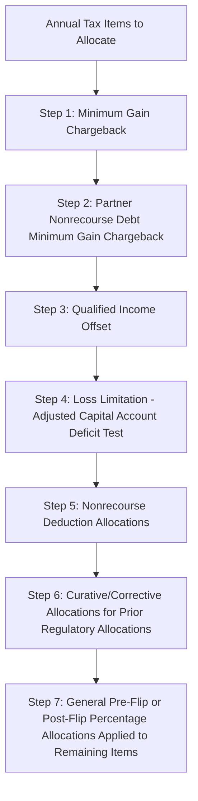

## Minimum Gain Chargebacks and Regulatory Allocations

### Overview

Partnership tax allocations in flip structures must satisfy the "substantial economic effect" safe harbor under Treas. Reg. §1.704-1(b) to be respected for federal income tax purposes. A core component of that safe harbor is a set of mandatory "regulatory allocations" — provisions that override the partnership agreement's stated percentage allocations in specific circumstances to prevent partners' capital accounts from reflecting economic results inconsistent with their actual liability exposure. The minimum gain chargeback and the qualified income offset are the two most important regulatory allocations in tax equity partnership agreements, alongside related curative and corrective allocation mechanisms.

### Why Regulatory Allocations Are Necessary

**Key Points**

- Partnership allocations of income, loss, deduction, and credit must have "substantial economic effect" (or be allocated in accordance with the partners' interests in the partnership) to be respected under IRC §704(b)
- The core test for economic effect requires that capital accounts be maintained properly, liquidating distributions be made in accordance with positive capital account balances, and any partner with a deficit capital account balance upon liquidation be unconditionally obligated to restore that deficit (the "capital account restoration" requirement) — or, more commonly in tax equity deals, that the partnership agreement include a **qualified income offset** in lieu of a deficit restoration obligation
- Because nonrecourse debt allows a partnership to generate deductions in excess of any partner's actual capital at risk, special rules (the nonrecourse deduction and minimum gain chargeback rules) exist to ensure that allocations of these deductions do not permanently distort capital accounts relative to the partners' real economic exposure

### Partnership Minimum Gain and Nonrecourse Deductions

#### What Is "Partnership Minimum Gain"

Partnership minimum gain (under Treas. Reg. §1.704-2(d)) is the amount of gain the partnership would recognize if it disposed of property subject to nonrecourse debt in full satisfaction of that debt, to the extent the debt exceeds the property's adjusted tax basis (or book value, for purposes of the capital account analysis).

$$\text{Partnership Minimum Gain} = \text{Nonrecourse Debt Outstanding} - \text{Adjusted Basis (or Book Value) of Property Securing the Debt}$$

**Example**

If a project is financed with $30,000,000 of nonrecourse construction/back-leverage debt secured by the project, and the project's adjusted basis (as reduced by depreciation) has declined to $22,000,000, partnership minimum gain equals:

$$\$30{,}000{,}000 - \$22{,}000{,}000 = \$8{,}000{,}000$$

#### Nonrecourse Deductions

- As depreciation deductions reduce the property's basis below the amount of nonrecourse debt securing it, the partnership generates **nonrecourse deductions** equal to the net increase in partnership minimum gain for the year.
- Nonrecourse deductions must be allocated in accordance with Treas. Reg. §1.704-2(e), generally in a manner reasonably consistent with allocations of some other significant partnership item attributable to the property securing the debt (often mirroring the general profit/loss allocation percentage).

### The Minimum Gain Chargeback Requirement

#### Purpose

The minimum gain chargeback rule (Treas. Reg. §1.704-2(f)) exists to prevent a partner from being allocated nonrecourse deductions that reduce its capital account, while that partner has no actual economic obligation to restore the resulting deficit, and then avoiding ever being allocated offsetting income when the minimum gain is reduced (e.g., through debt repayment or a taxable disposition).

**Key Points**

- If partnership minimum gain **decreases** during a taxable year (e.g., because nonrecourse debt is repaid or the secured property is disposed of), each partner must be allocated items of partnership income and gain for that year (and, if necessary, subsequent years) equal to that partner's share of the net decrease in minimum gain
- This chargeback is a **mandatory override** of the agreement's general allocation percentages — it applies notwithstanding any other allocation provision in the agreement, subject to specified exceptions (e.g., for partners who contribute capital to fund the debt repayment, or de minimis decreases)
- The chargeback ensures that a partner who previously benefited from nonrecourse deductions (which reduced its capital account without a corresponding funding obligation) is subsequently allocated the offsetting income, keeping capital accounts aligned with real economic exposure over the life of the partnership

#### Illustrative Mechanics

**Example**

Assume Class A Member was allocated $2,000,000 of nonrecourse deductions in prior years attributable to a decrease in the property's basis relative to outstanding nonrecourse debt (contributing to partnership minimum gain of $2,000,000 attributable to that member's share). In Year 8, the nonrecourse debt is refinanced and partially repaid, reducing partnership minimum gain by $500,000. Under the minimum gain chargeback provision, Class A Member must be allocated $500,000 of partnership gross income or gain in Year 8 (overriding whatever the stated pre-flip or post-flip percentage would otherwise dictate for that year), to the extent of its share of the minimum gain decrease.

### Qualified Income Offset

#### Purpose and Mechanics

The qualified income offset (Treas. Reg. §1.704-1(b)(2)(ii)(d)) addresses a different but related concern: unexpected allocations, distributions, or adjustments that cause a partner's capital account to go negative beyond amounts it is obligated (or deemed obligated) to restore.

**Key Points**

- If a partner unexpectedly receives an adjustment, allocation, or distribution described in Treas. Reg. §1.704-1(b)(2)(ii)(d)(4)–(6) (e.g., certain depletion adjustments, or an unexpected distribution) that creates or increases a deficit capital account balance beyond permitted limits, the qualified income offset requires that partner to be allocated items of income and gain, as quickly as possible, sufficient to eliminate the deficit
- Like the minimum gain chargeback, this is a mandatory override provision, standard in essentially all tax equity partnership agreements as part of satisfying the substantial economic effect safe harbor
- The qualified income offset works together with the deficit restoration obligation (or lack thereof) — most tax equity investors do **not** provide an unconditional deficit restoration obligation, making the qualified income offset (combined with allocation limitations tied to each partner's "Adjusted Capital Account Deficit") the mechanism that substitutes for actual capital account restoration in satisfying the regulatory safe harbor

### Interaction with Loss Limitation Provisions

#### Capital Account Deficit Limitations

- Partnership agreements typically limit loss/deduction allocations to a partner in any year to the amount that would not cause (or increase) an Adjusted Capital Account Deficit for that partner, reallocating any excess to other partners with sufficient capital account capacity.
- This loss limitation provision operates alongside the qualified income offset: the loss limitation prevents the deficit from arising in the first place (to the extent structurally possible), while the qualified income offset cures any deficit that nonetheless arises from unexpected adjustments.

#### Curative and Corrective Allocations

- Where regulatory allocations (minimum gain chargeback, qualified income offset, or nonrecourse deduction allocations) cause actual allocations in a given year to diverge from the parties' intended economic percentages, partnership agreements typically include **curative allocation** provisions directing that, to the extent possible, the partnership will make offsetting allocations of other items in later years to restore the parties to their intended overall economic position.
- These provisions are drafted to comply with Treas. Reg. §1.704-2(f)(5) and related guidance, which permits curative allocations specifically designed to offset the effect of minimum gain chargebacks, so long as they are provided for in the partnership agreement and reasonably consistent with the allocation of the tax items being cured.

### Priority Ordering in the Allocation Waterfall

Partnership agreements typically layer these provisions in a specific order of priority within the allocation article, since they must be applied sequentially before the general (pre-flip/post-flip) percentage allocations are applied to any remaining items:

### Partner Nonrecourse Debt Minimum Gain

- A related but distinct concept applies to "partner nonrecourse debt" (debt for which a partner, or a person related to a partner, bears the economic risk of loss under Treas. Reg. §1.752-2) — for example, a sponsor guaranty of otherwise nonrecourse project debt.
- Deductions attributable to partner nonrecourse debt must be allocated to the partner bearing the economic risk of loss for that debt (Treas. Reg. §1.704-2(i)(1)), and a corresponding **partner nonrecourse debt minimum gain chargeback** applies specifically to that partner when partner nonrecourse debt minimum gain decreases.
- This distinction matters in tax equity deals where the sponsor (rather than the partnership generally) has provided credit support (e.g., a guaranty or indemnity) that causes debt to be treated as partner nonrecourse debt rather than partnership nonrecourse debt for allocation purposes.

### Practical Drafting and Diligence Considerations

**Key Points**

- Confirm the agreement includes both a general minimum gain chargeback and a partner nonrecourse debt minimum gain chargeback provision, correctly cross-referenced to the debt structure actually in place
- Verify the qualified income offset language tracks the current regulatory text under Treas. Reg. §1.704-1(b)(2)(ii)(d)
- Confirm curative allocation provisions are drafted broadly enough to address the specific regulatory allocations anticipated in the deal (minimum gain chargebacks, nonrecourse deduction allocations) rather than only a generic catch-all
- Review how capital accounts are defined and maintained (book value vs. tax basis distinctions, §704(c) adjustments for contributed property) since minimum gain calculations depend on accurate capital account and basis tracking
- Confirm tax counsel's partnership allocation opinion specifically addresses whether the regulatory allocation package (as drafted) satisfies the substantial economic effect safe harbor, since this is foundational to the entire flip structure's tax treatment

### Conclusion

Minimum gain chargebacks and related regulatory allocations are technical but essential safeguards that allow tax equity partnership agreements to satisfy the substantial economic effect safe harbor under Treas. Reg. §1.704-1(b) and §1.704-2, notwithstanding the use of nonrecourse leverage and the absence of unconditional deficit restoration obligations from tax equity investors. These provisions operate as mandatory overrides to the stated pre-flip/post-flip percentages in specific triggering circumstances, and must be carefully drafted, sequenced, and paired with curative allocation mechanisms to preserve both the parties' intended economic bargain and the durability of the structure's tax characterization.

**Related Topics**

- Pre-Flip and Post-Flip Allocation Mechanics
- Treas. Reg. §1.704-1(b) Substantial Economic Effect Requirements
- Partner Nonrecourse Debt and Sponsor Guaranty Interactions
- Section 704(c) Built-In Gain Allocations in Contributed-Asset Structures
- Back-Leverage Debt Interaction with Tax Equity Cash Waterfalls
- Capital Account Maintenance and Book-Tax Basis Reconciliation
- Structuring Around Recapture and Basis Risk