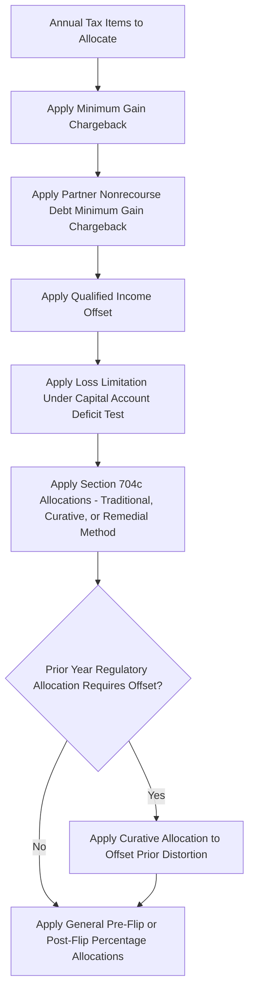

## Curative Allocations and Reallocation Mechanisms

### Overview

Curative allocations and related reallocation mechanisms are the corrective machinery that partnership flip agreements use to restore the parties' intended economic deal after mandatory regulatory allocations (minimum gain chargebacks, qualified income offsets, loss limitations) or other required tax adjustments (§704(c) built-in gain allocations, ceiling rule effects) have caused actual tax allocations to diverge from the agreed pre-flip/post-flip percentages. This topic addresses why curative allocations are necessary, how they are structured, and how they interact with the broader allocation waterfall.

### Why Reallocation Mechanisms Are Necessary

**Key Points**

- Substantial economic effect safe harbor compliance under Treas. Reg. §1.704-1(b) and §1.704-2 requires mandatory regulatory allocations (minimum gain chargebacks, qualified income offset, loss limitations) that override the partnership's stated percentage allocations in specific circumstances
- These mandatory overrides are necessary for tax validity but can cause the actual tax allocations received by a partner in a given year to differ from what the parties economically intended under the pre-flip/post-flip sharing ratios
- Without a corrective mechanism, these divergences could permanently distort the parties' bargained-for economic split, undermining the commercial intent of the flip structure even though each individual regulatory allocation is independently required
- Curative and corrective allocation provisions are drafted into the partnership agreement specifically to "undo," over time, the distortive effect of the mandatory regulatory allocations, restoring the parties as closely as possible to their intended economic position

### Curative Allocations Defined

#### Regulatory Basis

Treas. Reg. §1.704-2(f)(5) and related provisions permit a partnership agreement to specify **curative allocations** — allocations of income, gain, loss, or deduction in a manner that reasonably offsets the effect of a minimum gain chargeback (or other required regulatory allocation) in the same or a later year, so long as:

- The curative allocation is provided for in the partnership agreement
- The curative allocation is expected, as of the time it is provided for, to offset the regulatory allocation being cured
- The curative allocation is made as reasonably close in time as possible to the regulatory allocation it is intended to offset

**Key Points**

- Curative allocations are prospective corrective tools — they adjust *future* allocations of other tax items to compensate for a *past* regulatory allocation, rather than retroactively rewriting the earlier allocation itself
- Common curative allocation targets include reallocating gross income or gain items (rather than net income) to the specific partner who bore a disproportionate share of nonrecourse deductions or other regulatory allocations in a prior year
- Because curative allocations must be reasonably expected to offset the regulatory allocation, agreements typically specify the type of item (e.g., "book/tax gross income from Project operations") to be used for the curative allocation, rather than leaving the selection open-ended

### Distinguishing Curative Allocations from Corrective Allocations

While often used loosely as synonyms, practitioners sometimes distinguish:

| Term | Typical Usage |
| --- | --- |
| Curative Allocation | Specifically addresses distortions from **minimum gain chargebacks** and nonrecourse deduction allocations under Treas. Reg. §1.704-2(f)(5), reallocating future tax items to restore the intended split |
| Corrective Allocation | Broader term sometimes used for reallocating items to address any divergence between book and tax capital accounts or between intended and actual allocations, including those arising from §704(c) built-in gain/loss rules or ceiling rule limitations |

[Note: Terminology usage varies across partnership agreements and practitioners; the functional distinction — offsetting a specific mandatory regulatory allocation versus more general book-tax reconciliation — is more consistently applied than the labels themselves.]

### Interaction with Section 704(c) and the Ceiling Rule

#### The Ceiling Rule Problem

When a sponsor contributes appreciated property (e.g., a developed project with built-in gain, or built-in loss if development costs exceed FMV at contribution) to the partnership rather than contributing cash, §704(c) requires the partnership to allocate tax items with respect to that property in a manner that accounts for the difference between the property's tax basis and its book value (FMV at contribution).

- The **traditional method** under Treas. Reg. §1.704-3(b) is subject to the **"ceiling rule"**: tax allocations to the non-contributing partner (the Class A Member) cannot exceed the total tax item actually recognized by the partnership, even if the book allocation to that partner (under the general profit/loss percentages) would suggest a larger amount — creating a permanent, uncorrectable distortion under the traditional method alone.
- The **traditional method with curative allocations** under Treas. Reg. §1.704-3(c) allows the partnership to make additional curative allocations of *other* tax items (e.g., allocating additional tax depreciation from other partnership property to the non-contributing partner) to offset the ceiling rule distortion, so long as such curative allocations do not exceed the amount necessary to offset the ceiling rule effect.
- The **remedial allocation method** under Treas. Reg. §1.704-3(d) is a distinct, IRS-sanctioned alternative that creates notional tax items (rather than reallocating existing ones) to eliminate the ceiling rule distortion entirely — commonly elected in tax equity deals involving contributed property specifically because it more precisely restores the intended economic allocation without relying on the availability of other offsetting tax items.

**Example**

A sponsor contributes a project with a tax basis of $20,000,000 and a book value (FMV) of $45,000,000. The $25,000,000 built-in gain must be allocated to the sponsor under §704(c) as it is recognized (e.g., through cost recovery differences or upon disposition). If the traditional method's ceiling rule would prevent the Class A Member from receiving its full intended share of tax depreciation because total tax depreciation is limited to the (lower) tax basis, a curative allocation could reallocate other available tax deductions to the Class A Member to offset the shortfall, or the partnership could instead elect the remedial method to create an offsetting notional item.

### Priority Sequencing with Other Regulatory Allocations

Curative allocations for minimum gain chargebacks are typically sequenced after the mandatory regulatory allocations they are designed to offset, but the parties' underlying general allocation percentages are only applied to whatever remains:

### Drafting Considerations for Curative Allocation Provisions

**Key Points**

- **Specificity of offsetting items**: Well-drafted provisions identify which categories of income, gain, loss, or deduction are eligible to be used as curative allocations, rather than granting the general partner or calculation agent unconstrained discretion
- **Timing requirements**: Provisions should specify that curative allocations occur "as quickly as possible" or within a defined number of years following the regulatory allocation being cured, consistent with the "reasonably close in time" requirement of the regulations
- **Reasonable expectation standard**: The agreement (and supporting tax opinion) should reflect a reasonable, good-faith expectation at the time the provision is adopted that the curative allocation will actually offset the regulatory allocation — an after-the-fact curative allocation with no reasonable basis for the offset expectation risks being disregarded
- **Interaction with the flip calculation**: Because curative allocations affect capital accounts (and, in some structures, may be relevant inputs to the IRR-based flip date calculation if capital account or tax basis changes affect the value of allocated tax benefits), the partnership agreement should clarify how curative allocations interact with the Flip Determination Date methodology to avoid ambiguity or circularity

### Practical Diligence Checklist

**Key Points**

- Confirm the agreement specifies curative allocations for both minimum gain chargebacks and (if applicable) §704(c) ceiling rule effects, or confirm the remedial method has been properly elected as an alternative
- Verify the §704(c) method elected (traditional, traditional with curative allocations, or remedial) is expressly stated and consistent with the tax opinion's assumptions
- Review whether curative allocation provisions specify concrete offsetting item categories or leave undue discretion to the calculation agent or general partner
- Confirm tax counsel's allocation opinion addresses whether the curative/corrective allocation package, taken as a whole, supports respecting the overall allocation scheme under the partners'-interests-in-the-partnership standard
- Check whether curative allocations are properly excluded from (or appropriately integrated into) the cash-flow and tax-benefit inputs used in the target-yield IRR flip calculation

### Conclusion

Curative allocations and related reallocation mechanisms are the technical counterweight to the mandatory regulatory allocations required for substantial economic effect compliance, restoring the parties' intended pre-flip/post-flip economic bargain that would otherwise be distorted by minimum gain chargebacks, qualified income offsets, or §704(c) ceiling rule effects from contributed property. Properly drafted curative allocation provisions — specifying eligible offsetting items, timing, and a reasonable expectation of offset — are essential both to the tax durability of the overall allocation scheme and to preserving the commercial deal the sponsor and tax equity investor actually negotiated.

**Related Topics**

- Minimum Gain Chargebacks and Regulatory Allocations
- Pre-Flip and Post-Flip Allocation Mechanics
- Section 704(c) Methods: Traditional, Traditional with Curative Allocations, and Remedial
- Treas. Reg. §1.704-1(b) Substantial Economic Effect Requirements
- Capital Account Maintenance and Book-Tax Basis Reconciliation
- Flip Date Calculations and Internal Rate of Return Targets
- Structuring Around Recapture and Basis Risk