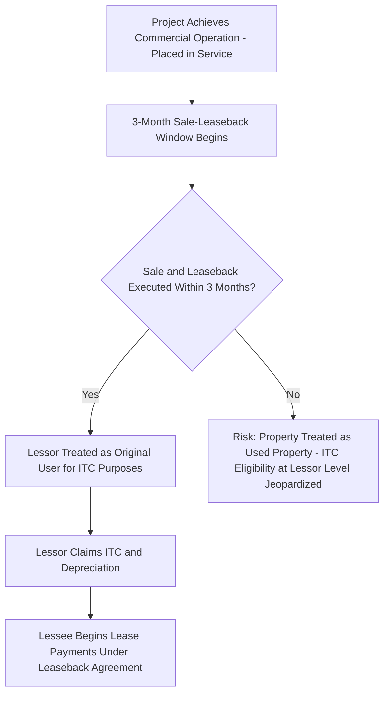

## Sale-Leaseback Mechanics and Timing Requirements

### Overview

The sale-leaseback structure is one of the principal alternatives to the partnership flip for monetizing tax credits and depreciation on renewable energy and other credit-eligible property. In a sale-leaseback, the project developer/sponsor sells the completed project to a tax equity investor (the lessor), who then leases the project back to the sponsor (the lessee) to operate. The lessor, as owner, claims the ITC and depreciation, while the lessee makes lease payments and operates the asset, ultimately (in most deals) reacquiring ownership through a purchase option. This topic covers the transactional mechanics, the critical statutory timing requirements, and the key structuring considerations distinguishing sale-leasebacks from partnership flips.

### Structural Overview

**Key Points**

- **Two parties, direct sale**: Unlike a partnership flip (where investor and sponsor become co-owners through a jointly held partnership), a sale-leaseback involves an outright sale of the project to the investor/lessor, followed by a separate lease agreement
- **Lessor claims tax benefits**: As the owner of the property, the lessor (tax equity investor) claims the ITC and depreciation deductions
- **Lessee operates and pays rent**: The sponsor, as lessee, retains operational control, sells power under the PPA (or merchant arrangement), and pays rent to the lessor, typically structured to approximate a debt-like fixed payment schedule
- **Often used for smaller or more standardized assets**: Historically more common for smaller-scale, standardized equipment (e.g., commercial and industrial solar, certain distributed generation) where the simplicity of a two-party lease is more efficient than a multi-party partnership structure, though it has also been used for larger utility-scale assets

### The 90-Day Rule (IRC §50(d) / Former §48(d) Sale-Leaseback Timing Requirement)

#### The Core Timing Requirement

For a sale-leaseback to allow the lessor to claim the ITC as if it were the original user of the property (rather than being treated as having acquired used property ineligible for original-use-based credit treatment), the sale and leaseback must occur within a specified period after the property is originally placed in service.

**Key Points**

- Under the sale-leaseback rules (incorporating the mechanics historically found in former IRC §48(d), as carried forward through IRC §50(d) cross-references and applicable Treasury guidance), if the original user of the property sells and leases back the property **within three months** of the date the property was originally placed in service, the property is treated, for credit purposes, as if it were originally placed in service on the date it is used by the lessee under the leaseback, preserving eligibility for the credit at the lessor level
- This is commonly referred to in practice as the **"90-day rule"** or **"3-month sale-leaseback window"**
- If the sale-leaseback occurs **after** this window, the transaction risks being treated as a sale of "used" property that does not qualify for the original-use requirement applicable to ITC-eligible energy property, jeopardizing the lessor's ability to claim the credit

#### Practical Timing Sequence

**Example**

A solar project reaches commercial operation (placed in service) on March 1. For the lessor to claim the ITC as if it were the original user, the sale to the lessor and the simultaneous or near-simultaneous leaseback to the original developer/operator must both be executed on or before May 30 (within three months of March 1). If the transaction does not close until July, the sale-leaseback structure would generally fail to qualify for original-use treatment at the lessor level under this rule. [Note: exact day-counting conventions and any applicable extensions should be confirmed against the specific statutory and regulatory text and current IRS guidance in effect at the time of the transaction.]

#### Consequences of Missing the Window

- If the sale-leaseback is not completed within the required window, alternative structures are typically pursued instead, most commonly an **inverted lease** (a master lease/pass-through lease structure under which the ITC is passed through to the lessee under IRC §50(d)(5) and Treas. Reg. §1.48-4, rather than being claimed directly by the owner-lessor)
- Attempting to force a late sale-leaseback into original-use treatment without satisfying the timing rule creates substantial risk of credit disallowance upon IRS examination

### Sale-Leaseback Transaction Mechanics

#### Step 1: Development and Construction

- The sponsor develops, permits, and constructs (or arranges construction of) the project, typically using its own capital, construction debt, or short-term bridge financing
- The sponsor secures a PPA or other offtake arrangement, interconnection agreements, and all necessary permits prior to or concurrent with the sale-leaseback closing

#### Step 2: Purchase Price Determination

- The purchase price paid by the lessor is generally intended to reflect the **fair market value** of the completed, operational project — the same FMV-basis considerations and appraisal scrutiny discussed in connection with ITC step-up transactions apply here (see basis risk considerations)
- Purchase price typically reflects the developer's cost basis plus a negotiated developer margin, supported by an independent appraisal, particularly where the parties are related or where the margin is significant relative to hard construction costs

#### Step 3: Simultaneous (or Near-Simultaneous) Sale and Leaseback Closing

- The sale of the project and the execution of the lease agreement are typically closed simultaneously (or in immediate succession) to ensure the 3-month original-use window is unambiguously satisfied and to avoid any period of ownership uncertainty
- Legal title, UCC filings (if applicable), and interconnection/PPA assignment or consent documentation must all be coordinated at closing

#### Step 4: Lease Term and Payment Structure

- Lease payments are typically structured on a level or step-up/step-down schedule designed to provide the lessor its target after-tax yield, factoring in the ITC, depreciation tax savings, and the stream of rental payments
- Lease terms commonly run for a period shorter than the property's full useful life but long enough to allow the lessor to realize its target return (often structured with reference to the applicable depreciation recovery period and/or a period tied to the ITC recapture schedule)

#### Step 5: End-of-Term Purchase Option

- Most sale-leasebacks provide the lessee a purchase option at the end of the lease term, typically at **fair market value** at that time (a **FMV purchase option**), consistent with the same tax characterization concerns discussed for sponsor call options in partnership flip structures — a bargain purchase option set well below anticipated FMV risks recharacterization of the arrangement as a financing (a conditional sale) rather than a true lease, which would undermine the lessor's ownership-based claim to the ITC and depreciation from inception
- Some structures instead use a fixed-price purchase option calibrated to reasonably approximate anticipated FMV, though FMV options (determined by appraisal at exercise) are generally viewed as more defensible from a true-lease characterization standpoint

### True Lease vs. Conditional Sale Characterization

#### Why This Distinction Is Critical

If the IRS or a court recharacterizes the sale-leaseback as a financing arrangement (a conditional sale/secured loan) rather than a genuine lease, the lessor would be treated as a lender rather than an owner, and the ITC/depreciation benefits claimed by the lessor would be disallowed retroactively.

**Key Points**

- Factors supporting true lease characterization generally include: the lessor bearing genuine residual value risk (i.e., the value of the property at lease end is not predetermined or guaranteed to the lessor), the absence of a bargain purchase option, meaningful lease terms relative to the property's useful life, and the lessor's ability to realize a reasonable profit from the transaction independent of tax benefits
- Factors that risk conditional-sale recharacterization include: bargain purchase options, lease terms approximating the full useful life of the property, rental payments structured to fully amortize the purchase price plus a lender-like return, and lessee guarantees eliminating the lessor's residual value risk
- Historic guidance on lease characterization (including longstanding IRS guidelines such as Rev. Proc. 2001-28 and Rev. Proc. 2001-29 addressing leveraged lease safe harbors, developed originally in other leasing contexts but frequently referenced by practitioners structuring energy sale-leasebacks) informs the structuring conventions used to support true lease treatment, alongside a tax opinion addressing this characterization risk directly

### Comparison: Sale-Leaseback vs. Partnership Flip

| Factor | Sale-Leaseback | Partnership Flip |
| --- | --- | --- |
| Ownership structure | Direct sale; lessor is sole owner | Co-ownership through partnership; both parties are partners |
| Tax benefit claimant | Lessor (100%) | Allocated per partnership percentages (pre-flip/post-flip) |
| Timing constraint | Strict 3-month original-use window | No comparable original-use timing constraint on partnership contributions |
| Exit mechanism | End-of-lease purchase option (FMV or fixed) | Post-flip sponsor call option or ROFO |
| Complexity | Generally simpler two-party structure | More complex multi-party allocation and capital account mechanics |
| Common technology/scale fit | Historically more common for smaller/standardized assets, though used at utility scale as well | Common across utility-scale wind and solar |

### Related Structural Variant: Inverted Lease

- When the 3-month sale-leaseback timing window cannot be met, or when the parties prefer a pass-through credit mechanism, the **inverted lease** (or "lease pass-through") structure is typically used instead
- In an inverted lease, the developer contributes the project to a partnership (rather than selling it outright), and that partnership leases the project to a separate operating entity (sometimes another affiliate of the developer); the ITC is then passed through from the owner-lessor partnership to the lessee under the special election mechanics of IRC §50(d)(5) and Treas. Reg. §1.48-4, allowing the tax equity investor (as a partner in the owner-lessor) to effectively receive the economic benefit of the credit without the strict original-use timing constraint applicable to a direct sale-leaseback
- This structural relationship is addressed in greater depth as a related but distinct topic

### Practical Diligence Checklist

**Key Points**

- Confirm the precise placed-in-service date and calendar-count the 3-month window to the sale-leaseback closing date
- Verify the purchase price is supported by an independent appraisal reflecting genuine fair market value, particularly for related-party transactions
- Review the lease term, payment schedule, and purchase option pricing against true-lease characterization risk factors
- Confirm the lessor retains genuine residual value exposure (i.e., the end-of-term purchase option is FMV-based or otherwise not a disguised bargain sale)
- Obtain a tax opinion addressing both (i) satisfaction of the original-use/timing requirement and (ii) true lease characterization
- Confirm coordination of PPA assignment/consent, interconnection agreement assignment, and any lender consents required at the sale-leaseback closing

### Conclusion

Sale-leaseback structures offer a direct, two-party alternative to the partnership flip for monetizing tax credits and depreciation, but they are constrained by a strict statutory timing requirement — the 3-month original-use window — that does not have a direct analog in partnership flip structures. Compliance with this timing rule, together with careful structuring to preserve true lease (rather than conditional sale) characterization through appropriate purchase option pricing and genuine residual value risk allocation to the lessor, are the central technical and tax-risk considerations distinguishing sale-leaseback mechanics from other tax equity monetization structures.

**Related Topics**

- Inverted Lease and Lease Pass-Through Structures Under IRC §50(d)(5)
- Structuring Around Recapture and Basis Risk
- Sponsor Call Options and Fair Market Value Purchase Rights
- True Lease vs. Conditional Sale Characterization Standards
- Rev. Proc. 2001-28 and Rev. Proc. 2001-29 Leveraged Lease Guidelines
- Original-Use Requirement for Investment Tax Credit Eligibility
- Appraisal and Fair Market Value Standards in Related-Party Asset Sales