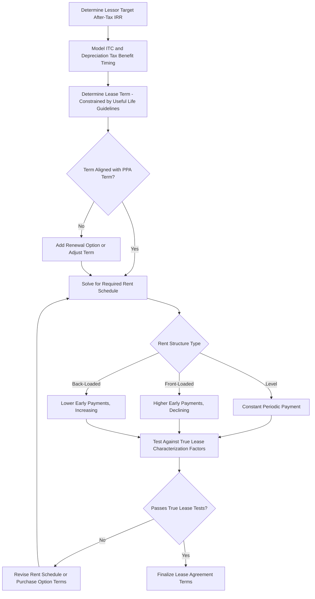

## Rent Structuring and Lease Term Considerations

### Overview

Rent structuring and lease term design are central to both the economics and the tax durability of sale-leaseback transactions. The rental payment schedule must simultaneously deliver the lessor's target after-tax yield, satisfy true-lease characterization requirements (avoiding conditional-sale recharacterization), and align with statutory and regulatory constraints on lease term length relative to the property's economic life. This topic addresses the mechanics of rent-setting, common payment structures, and the term-length considerations that govern sale-leaseback and inverted lease structuring.

### Rent Structuring Objectives

**Key Points**

- **Deliver lessor's target after-tax yield**: Rent, combined with the value of ITC and depreciation tax benefits, must produce the lessor's contractually targeted after-tax internal rate of return over the lease term
- **Preserve true lease characterization**: Rent must not be structured so that, combined with a bargain purchase option, it effectively amortizes the full purchase price plus a lender-like return (which risks conditional-sale recharacterization)
- **Match lessee's operating cash flow**: Rent payments are often sized to align with the lessee's expected revenue under its PPA or merchant sales, avoiding cash flow mismatches that could strain the lessee's ability to pay
- **Provide the lessor genuine residual value exposure**: Because true lease characterization depends partly on the lessor retaining meaningful residual risk, rent should not be set so high (relative to FMV) that the lessor's economics are fully protected regardless of the property's value at lease end

### Common Rent Structures

#### 1. Level (Fixed) Rent

- A constant periodic payment throughout the lease term, simplest to administer and model
- May not align well with a lessee's revenue profile if the underlying PPA has escalating or step-down pricing, or if production/revenue is expected to vary materially year to year (e.g., due to degradation in solar assets)

#### 2. Front-Loaded Rent

- Higher rent payments in early years, declining over the lease term
- Can help the lessor achieve its target yield earlier in the term, which may be relevant where the lessor's tax capacity or risk tolerance favors earlier cash recovery
- Must be structured carefully to avoid characterization concerns if front-loading is aggressive enough to resemble a rapid repayment of principal (a hallmark of a financing rather than a lease)

#### 3. Back-Loaded / Step-Up Rent

- Lower rent payments in early years, increasing over the lease term
- Can align with a lessee's cash flow profile if revenue is expected to grow (e.g., contracted price escalators in the PPA) or if the lessee needs lower payments during an initial ramp-up period
- IRS leveraged lease guidance and general true-lease principles scrutinize excessive back-loading, since a lease with minimal early payments and a large late "balloon" can resemble a financing with deferred principal repayment

#### 4. Percentage or Revenue-Linked Rent

- Rent tied in whole or in part to a percentage of the lessee's actual revenue or production output
- Less common in tax equity sale-leasebacks (which generally favor payment certainty for modeling the lessor's IRR) but can appear in hybrid structures or where merchant price exposure is shared between the parties
- Introduces additional modeling complexity for the lessor's target-yield calculation, since rent itself becomes a variable rather than a fixed input

### Rent-Setting Mechanics and the Lessor's Yield Model

#### Core Yield Equation

The lessor's after-tax IRR is a function of the purchase price paid (the initial outflow), the value of ITC and depreciation tax benefits (inflows concentrated in the early years), and the stream of rental payments received over the lease term (inflows spread across the term), net of the lessor's own tax liability on rental income.

$$\sum_{t=0}^{n} \frac{CF_t}{(1 + r)^t} = 0$$

where $CF_0$ is the negative purchase price outflow, and $CF_t$ for $t = 1 \ldots n$ includes after-tax rental income plus the value of tax benefits (ITC in year of eligibility, depreciation as claimed annually) received in each period.

**Example**

A lessor pays $40,000,000 to acquire a project. It claims a $12,000,000 ITC (30% of eligible basis) in Year 1 and MACRS depreciation over the following years. To achieve its target 7.5% after-tax IRR over an assumed 10-year lease term, the lease agreement's rent schedule is solved for (iteratively, in the underlying financial model) such that the combined after-tax value of rent plus tax benefits, discounted at 7.5%, equates to the $40,000,000 purchase price. If rent is structured as a level annuity, the required annual payment $A$ satisfies:

$$40{,}000{,}000 = \text{PV(Tax Benefits)} + A \times \left[\frac{1 - (1+r)^{-n}}{r}\right]$$

solving for $A$ once the present value of tax benefits and the target rate $r$ and term $n$ are specified.

### Lease Term Considerations

#### Statutory and Regulatory Term Constraints

**Key Points**

- Longstanding IRS leveraged lease guidance (originally developed in non-energy leasing contexts but widely referenced in structuring energy sale-leasebacks, including guidelines such as Rev. Proc. 2001-28 and Rev. Proc. 2001-29) generally supports true lease characterization where the lease term does not exceed a specified percentage of the property's estimated useful life (a commonly referenced benchmark in traditional leveraged lease practice is roughly 80% of the property's remaining useful life, though the precise percentage and its applicability depend on the specific guidance and facts involved)
- A lease term approaching or exceeding the property's full useful life increases the risk that the arrangement will be viewed as a disguised sale rather than a genuine lease, since the lessee would be using substantially all of the property's economic value, leaving the lessor with negligible genuine residual interest
- For ITC recapture purposes, lease terms are also commonly structured with awareness of the five-year recapture period, since a disposition-triggering event (including certain lease terminations or transfers) during that window can implicate recapture exposure

#### Balancing Term Length Against Recovery Period

- Depreciation recovery periods for most renewable energy property (5-year MACRS) are considerably shorter than typical lease terms (often 10-20+ years), meaning the bulk of depreciation tax benefits are realized in the early years of the lease regardless of the overall term length
- Lease term length is therefore driven primarily by (i) the lessor's targeted yield period, (ii) true-lease characterization constraints relative to useful life, and (iii) commercial alignment with the underlying PPA term (many sale-leaseback lease terms are structured to run coextensively with, or within, the PPA term to ensure the lessee has a revenue stream to fund rent throughout the lease)

#### End-of-Term Considerations

- As addressed in the sale-leaseback mechanics discussion, most leases conclude with a lessee purchase option, renewal option, or return of the property to the lessor
- Lease term and rent structuring must anticipate which of these outcomes is expected, since a lease term set to expire well before the end of the PPA term may require renewal provisions to avoid an operational gap

### Rent Structuring and Term Interaction Diagram

### True Lease Characterization Risk Factors Specific to Rent Design

**Key Points**

- **Avoid full payout structures**: Rent (plus any minimum purchase option payment) should not be structured to guarantee the lessor recovers its full purchase price plus a lender-like return regardless of the property's actual value at lease end — this pattern mirrors loan amortization rather than genuine lease economics
- **Avoid disguised interest characterization**: Excessively front-loaded or back-loaded rent schedules that closely track a loan amortization schedule (with an implied "interest" component declining as an implied "principal" balance is repaid) invite scrutiny that the arrangement is economically a financing
- **Residual value genuineness**: The lessor's expected residual interest (i.e., the value of the property at lease end, before consideration of any purchase option) should be a meaningful, unguaranteed component of the lessor's overall expected return — not reduced to a token amount by the rent and purchase option structure combined

### Tax Treatment of Rent for Each Party

- **Lessor**: Rental income is ordinary income to the lessor, taxed as received (or accrued, depending on method of accounting), net of depreciation deductions on the underlying property
- **Lessee**: Rental payments are generally deductible as ordinary business expense deductions (subject to any applicable limitations, such as those affecting related-party leases or specific anti-abuse rules), providing the lessee some tax benefit to offset the loss of direct ownership-based depreciation and credit claims

### Practical Negotiation Points

**Key Points**

- Selection of rent structure (level, front-loaded, back-loaded) balancing lessor yield timing preferences against lessee cash flow capacity
- Coordination of lease term with PPA term, including renewal option mechanics if terms are not coextensive
- Sizing the end-of-term purchase option to avoid bargain purchase option characterization risk while still providing the lessee a realistic buyout path
- Addressing casualty, condemnation, and early termination rent adjustment provisions
- Confirming the rent schedule and purchase option terms are consistent with the assumptions underlying the lessor's true-lease tax opinion

### Conclusion

Rent structuring and lease term design in sale-leaseback transactions require balancing the lessor's target after-tax yield against strict true-lease characterization requirements that constrain how aggressively rent can be front-loaded, back-loaded, or sized relative to the property's fair market value and useful life. Lease term length must be calibrated against useful-life guidelines to avoid conditional-sale recharacterization risk while remaining commercially aligned with the underlying power purchase agreement term, making rent and term design an integrated structuring exercise rather than two independent variables.

**Related Topics**

- Sale-Leaseback Mechanics and Timing Requirements
- True Lease vs. Conditional Sale Characterization Standards
- Sponsor Call Options and Fair Market Value Purchase Rights
- Rev. Proc. 2001-28 and Rev. Proc. 2001-29 Leveraged Lease Guidelines
- Flip Date Calculations and Internal Rate of Return Targets
- Inverted Lease and Lease Pass-Through Structures Under IRC §50(d)(5)
- Structuring Around Recapture and Basis Risk