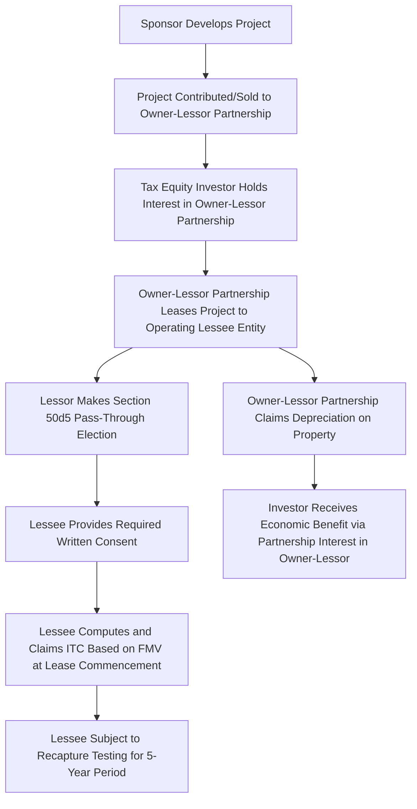

## Inverted Lease Pass-Through Election Mechanics

### Overview

The inverted lease (also called a "lease pass-through" structure) is a specialized structuring alternative that allows a tax equity investor to receive the economic benefit of the Investment Tax Credit through a statutory pass-through election, without requiring the strict sale-and-leaseback timing that constrains a direct sale-leaseback. This structure combines a partnership ownership layer with a lease arrangement and a specific IRC §50(d)(5) election that shifts the ITC from the technical owner-lessor to the lessee. This topic covers the statutory election mechanics, the entity structure required to implement it, and the key compliance considerations.

### Statutory Basis: IRC §50(d)(5) and Former §48(d)

#### The Pass-Through Mechanism

Under IRC §50(d)(5), which cross-references the pass-through election mechanics originally set out in former IRC §48(d), a lessor of investment credit property may elect to treat the lessee as having acquired the property, thereby allowing the **lessee** (rather than the owner-lessor) to claim the Investment Tax Credit.

**Key Points**

- The election is made by the **lessor** (the technical owner of the property), not the lessee, and once made is generally binding for the property's placed-in-service year
- Treas. Reg. §1.48-4 sets out the detailed mechanics and requirements for the pass-through election, including the specific written election statement and consent requirements
- Once the election is made, the lessee is treated as having "acquired" the property for ITC purposes (at an amount equal to the property's fair market value, not its cost to the lessor) and computes and claims the credit as if it were the owner, even though legal title remains with the lessor
- Unlike a direct sale-leaseback, there is **no equivalent 3-month original-use timing constraint** imposed by the pass-through election mechanism itself, making the inverted lease a common fallback where the sale-leaseback timing window has been missed, or a preferred structure from the outset for other commercial reasons

### Entity Structure of an Inverted Lease

#### Typical Structure

An inverted lease structure typically involves two layers:

1. **Owner-Lessor Partnership**: The developer/sponsor contributes the project (or the developer sells the project) to a partnership in which the tax equity investor holds an interest (often a very high percentage interest, sometimes exceeding what is seen in traditional partnership flips, since the primary investor benefit here flows through the pass-through election rather than through direct partnership allocation of the ITC itself). This partnership is the legal owner and **lessor** of the project.
2. **Operating Lessee Entity**: A separate entity — commonly wholly or majority owned by the sponsor/developer — leases the project from the owner-lessor partnership and operates it, selling power under the PPA or to the merchant market.

**Key Points**

- The owner-lessor partnership claims **depreciation** (since it retains legal ownership of the property for general tax purposes, aside from the specific ITC pass-through)
- The **lessee entity** claims the **ITC** as a result of the §50(d)(5) pass-through election, even though it does not hold legal title
- This bifurcation — depreciation to the owner-lessor, ITC to the lessee — is the defining structural feature that distinguishes an inverted lease from both a straight sale-leaseback (where the lessor claims both) and a standard partnership flip (where allocations of both items generally track the same or coordinated percentages)

### Making the Pass-Through Election

#### Procedural Requirements

Under Treas. Reg. §1.48-4, the lessor must make an election that includes specific required elements:

**Key Points**

- A written statement, generally attached to (or made available in connection with) the lessor's tax return for the year the property is placed in service, identifying the property and electing to pass through the credit to the lessee
- The lessee must provide a written consent (or the arrangement must otherwise satisfy the regulatory consent requirements) acknowledging its agreement to be treated as having acquired the property for credit purposes and to compute the credit consistent with the lessor's election
- The elected amount is based on the property's **fair market value** at the time the lease term begins, which becomes the lessee's basis for computing the credit — this reintroduces the same FMV determination and appraisal-support considerations relevant to basis risk in other structures
- The lessee must be a person that could otherwise have claimed the ITC directly had it owned the property (i.e., generally a taxable entity engaged in a trade or business, not a tax-exempt or governmental lessee, subject to applicable rules limiting credit eligibility for certain classes of lessees)

### Basis and Depreciation Mechanics

#### Owner-Lessor's Depreciation Basis

- The owner-lessor's depreciable basis in the property is generally its cost (or, in a contribution structure, its §704(c) carryover/stepped-up basis considerations as applicable), following ordinary depreciation basis rules, **without** the ITC-related basis reduction under §50(c) that would otherwise apply — because the owner-lessor is not the one claiming the credit, the basis reduction rule tied to credit claimants applies at the lessee's level with respect to its pass-through credit basis, not to the owner-lessor's depreciable basis in the underlying property
- [Inference: the precise basis reduction mechanics in pass-through lease structures involve technical coordination between §50(c) and the lessee's credit basis rather than the owner-lessor's depreciation basis; practitioners should confirm current regulatory and sub-regulatory guidance and structure the election documentation accordingly, as this is a technically dense area where careful tax counsel involvement is standard.]

#### Lessee's Credit Basis

- The lessee computes its ITC based on the fair market value amount specified in the pass-through election, and is subject to the standard ITC basis-reduction-for-depreciation-purposes coordination rules to the extent the lessee has any depreciable basis of its own in connection with the arrangement (which is typically minimal or none, since legal ownership and the associated depreciable basis remain with the owner-lessor)

### Recapture Considerations in Inverted Leases

**Key Points**

- Because the lessee is treated as the credit claimant, recapture exposure under IRC §50(a) is generally tested with respect to the lessee's continued use of the property as investment credit property and the continuity of the lease arrangement, rather than solely by reference to the owner-lessor's continued ownership
- A lease termination, an assignment of the lessee's interest, or cessation of qualifying use during the five-year recapture period can trigger recapture exposure allocable to the lessee (and, indirectly, affect the economics the tax equity investor bargained for at the owner-lessor level, depending on how the transaction documents allocate this risk between the sponsor/lessee side and the investor/lessor side)
- Transaction documents typically include indemnification provisions addressing which party bears recapture risk arising from lessee-side events versus owner-lessor-side events, paralleling (but not identical to) the recapture indemnity structures used in partnership flip and sale-leaseback deals

### Structural and Election Flow

### Comparison: Inverted Lease vs. Direct Sale-Leaseback vs. Partnership Flip

| Factor | Inverted Lease | Direct Sale-Leaseback | Partnership Flip |
| --- | --- | --- | --- |
| ITC claimant | Lessee (via §50(d)(5) election) | Lessor (as owner) | Partnership, allocated per agreement |
| Depreciation claimant | Owner-lessor partnership | Lessor (as owner) | Partnership, allocated per agreement |
| Original-use timing constraint | No equivalent 3-month rule | Strict 3-month window required | Not applicable in the same sense |
| Entity complexity | Higher (partnership plus separate lessee entity) | Lower (direct two-party lease) | Moderate to high (single partnership, multiple allocation layers) |
| Common use case | Utility-scale solar, and cases where sale-leaseback timing is impractical | Smaller/standardized assets, or where timing window is met | Utility-scale wind and solar broadly |

### Practical Diligence and Drafting Considerations

**Key Points**

- Confirm the pass-through election statement and lessee consent satisfy all procedural requirements of Treas. Reg. §1.48-4, including timing relative to the lessor's return filing
- Verify the FMV used for the lessee's credit basis is supported by an independent appraisal, given the same basis risk and IRS scrutiny concerns applicable to other FMV step-up transactions
- Confirm the lessee is a permissible pass-through recipient (a taxable entity that could itself have claimed the credit directly)
- Review recapture risk allocation between the owner-lessor partnership investor side and the lessee/sponsor side, and ensure indemnification and insurance provisions address both categories of triggering events
- Confirm the depreciation basis and any §704(c) considerations at the owner-lessor partnership level are correctly coordinated with the separate ITC pass-through mechanics at the lessee level
- Obtain a tax opinion addressing both the validity of the pass-through election and the overall characterization of the lease (true lease, not conditional sale) given the same characterization principles applicable to direct sale-leasebacks

### Conclusion

The inverted lease pass-through structure provides a statutory mechanism under IRC §50(d)(5) and Treas. Reg. §1.48-4 for shifting the Investment Tax Credit from a technical owner-lessor to an operating lessee, decoupling ITC claims from depreciation claims and avoiding the strict original-use timing constraint that governs direct sale-leasebacks. Its added entity complexity — requiring both an owner-lessor partnership and a separate lessee operating entity — is offset by structuring flexibility, making it a common choice both as a fallback when sale-leaseback timing cannot be met and as an affirmative structuring preference in its own right for certain utility-scale transactions.

**Related Topics**

- Sale-Leaseback Mechanics and Timing Requirements
- Rent Structuring and Lease Term Considerations
- Structuring Around Recapture and Basis Risk
- Treas. Reg. §1.48-4 Pass-Through Election Procedural Requirements
- True Lease vs. Conditional Sale Characterization Standards
- Section 704(c) Built-In Gain Allocations in Contributed-Asset Structures
- Appraisal and Fair Market Value Standards in Related-Party Asset Sales