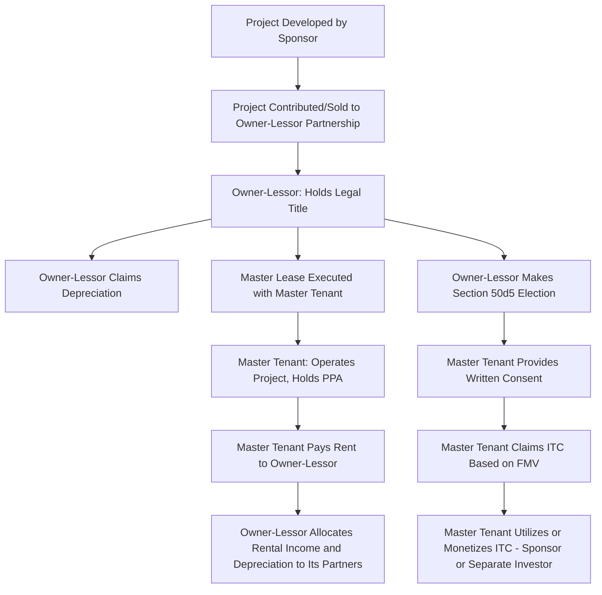

## Master Tenant and Owner Lessor Roles

### Overview

The inverted lease structure depends on a clear division of roles and tax attributes between two entities: the **Owner-Lessor**, which holds legal title to the project and grants the lease, and the **Master Tenant** (also called the master lessee or operating lessee), which leases the project, operates it commercially, and — via the IRC §50(d)(5) pass-through election — claims the Investment Tax Credit. This topic examines the distinct functions, tax attributes, capitalization, and risk allocation associated with each role, and how the two entities interact throughout the transaction lifecycle.

### The Owner-Lessor Entity

#### Function and Composition

**Key Points**

- The Owner-Lessor is typically structured as a partnership (or an LLC taxed as a partnership) in which the tax equity investor holds a substantial membership/partnership interest, with the sponsor or a sponsor affiliate typically holding a smaller residual interest
- The Owner-Lessor holds **legal title** to the project, making it the entity responsible for property-level obligations such as real property tax filings (where applicable), insurance as named insured/loss payee, and compliance with lender requirements if the project is debt-financed at this level
- The Owner-Lessor is the lessor under the master lease agreement with the Master Tenant, and is the party that makes the IRC §50(d)(5) pass-through election transferring ITC eligibility to the Master Tenant

#### Tax Attributes Retained by the Owner-Lessor

- **Depreciation**: The Owner-Lessor, as legal owner, claims MACRS depreciation on the project's depreciable basis, following ordinary basis rules (including any §704(c) considerations if the project was contributed by the sponsor with built-in gain relative to its tax basis)
- **Rental income**: The Owner-Lessor receives lease payments from the Master Tenant, taxed as ordinary income at the partnership level and allocated to its partners (including the tax equity investor) under the partnership agreement's allocation provisions
- **Residual interest in the property**: At the end of the lease term, the Owner-Lessor retains the underlying residual value of the project (subject to any purchase option or renewal terms), which is a component of the tax equity investor's overall expected return alongside the allocated depreciation benefits and rental income

#### Investor Economics at the Owner-Lessor Level

- Because the ITC itself is not claimed at the Owner-Lessor level (it passes through to the Master Tenant), the tax equity investor's return at this level is driven by its allocated share of depreciation tax savings and rental income, discounted to its target after-tax yield
- Partnership allocation percentages at the Owner-Lessor level are structured and modeled similarly in principle to a standard partnership flip (pre-return-of-capital heavy allocations, potentially shifting after a target yield is achieved), but the absence of the ITC as an allocable item at this level changes both the magnitude and timing profile of the investor's tax benefit stream compared to a standard flip

### The Master Tenant Entity

#### Function and Composition

**Key Points**

- The Master Tenant is typically wholly or majority owned by the sponsor/developer (or a sponsor affiliate), and is the entity that operates the project on a day-to-day basis
- The Master Tenant holds the leasehold interest under the master lease, and is generally the counterparty to the project's revenue contracts — it enters into (or receives an assignment of) the PPA or merchant offtake arrangements, and collects revenue from power sales
- The Master Tenant pays rent to the Owner-Lessor under the master lease, funded from its PPA/merchant revenue

#### Tax Attributes Held by the Master Tenant

- **Investment Tax Credit**: As a result of the §50(d)(5) pass-through election made by the Owner-Lessor (with the Master Tenant's required written consent), the Master Tenant computes and claims the ITC based on the property's fair market value at lease commencement, as if it were the owner for credit purposes
- **Operating deductions**: The Master Tenant deducts its rental payments to the Owner-Lessor as ordinary business expenses, along with other operating costs (O&M, insurance premiums it bears directly, administrative costs) incurred in running the project
- **No depreciation on the leased asset itself**: Because legal ownership (and the associated depreciable basis in the underlying project) remains with the Owner-Lessor, the Master Tenant generally does not depreciate the leased project property itself, aside from any of its own separately owned assets used in operations

#### Sponsor's Economic Position Through the Master Tenant

- The sponsor typically monetizes the ITC value indirectly — since the Master Tenant is sponsor-owned, the value of the credit claimed at the Master Tenant level accrues to the sponsor's own tax position (or is monetized through the sponsor's own tax equity or financing arrangements at that level, depending on the sponsor's tax capacity)
- Some structures involve a **separate tax equity investment directly into the Master Tenant** (sometimes called a "double-decker" or "two-tier" inverted lease arrangement) — a second tax equity investor invests in the Master Tenant specifically to utilize the pass-through ITC, distinct from the tax equity investor participating in the Owner-Lessor's depreciation and rental income economics. [Inference: this two-tier variant appears in market practice as a more complex option layering additional investors, though single-investor structures where the sponsor retains the Master Tenant's tax benefits directly are also common; the specific configuration depends on the sponsor's own tax appetite and deal economics.]

### Interaction Between the Two Entities

### Risk Allocation Between the Two Roles

#### Recapture Risk Allocation

**Key Points**

- Because the Master Tenant is the ITC claimant, recapture testing under IRC §50(a) is generally tied to continued qualifying use of the property and continuity of the lease arrangement from the Master Tenant's perspective
- Lease termination, an assignment of the Master Tenant's leasehold interest, or a Master Tenant-side ownership change that reduces its interest below applicable thresholds can trigger recapture exposure — transaction documents typically require the Master Tenant (or its sponsor parent) to indemnify against recapture triggered by such Master Tenant-side events
- The Owner-Lessor, as the depreciation claimant rather than the credit claimant, does not bear direct ITC recapture exposure from its own ownership changes in the same manner, though changes affecting the underlying lease or property use could still have downstream effects on the arrangement's integrity

#### Operational and Credit Risk Allocation

- The Master Tenant bears operational risk (production shortfalls, O&M cost overruns, offtake counterparty risk) since it collects PPA/merchant revenue directly and must fund rent regardless of operating performance, absent specific rent adjustment provisions
- The Owner-Lessor bears counterparty credit risk with respect to the Master Tenant's ability to pay rent, which is typically the sponsor's principal credit exposure point in the structure — lenders or investors at the Owner-Lessor level may require guarantees, letters of credit, or minimum debt service coverage-style covenants from the sponsor to backstop the Master Tenant's rent obligations

### Structuring and Governance Considerations

**Key Points**

- **Consent and coordination provisions**: The master lease and the Owner-Lessor partnership agreement must be drafted consistently regarding assignment restrictions, default remedies, and required consents, since a default under the lease can have direct consequences for the Owner-Lessor partnership's investors
- **Casualty and condemnation coordination**: Casualty loss provisions must address obligations at both levels — the Owner-Lessor's need to preserve its depreciable asset (or receive insurance proceeds reflecting its ownership interest) and the Master Tenant's need for rent abatement or termination rights if the property becomes unusable
- **Events of default cross-referencing**: A default by the Master Tenant under the master lease (e.g., failure to pay rent) typically triggers specific Owner-Lessor remedies (lease termination, re-leasing rights) that must be coordinated with the recapture and tax opinion assumptions underlying the original structuring
- **Affiliate transaction scrutiny**: Because the Master Tenant is typically sponsor-affiliated, the master lease terms (rent levels, term, purchase options) are subject to the same arm's-length and FMV-support scrutiny applicable to other related-party transactions in tax equity structures

### Comparative Role Summary

| Attribute | Owner-Lessor | Master Tenant |
| --- | --- | --- |
| Legal title to project | Yes | No (leasehold interest only) |
| Tax credit claimed | No (passes through) | Yes (via §50(d)(5) election) |
| Depreciation claimed | Yes | No (generally) |
| Holds PPA/offtake agreement | No (typically) | Yes |
| Primary revenue source | Rental income from Master Tenant | PPA/merchant power sales revenue |
| Typical ownership | Tax equity investor (majority) + sponsor (minority) | Sponsor (majority or wholly owned), or with separate ITC-focused investor |
| Primary risk borne | Master Tenant counterparty/rent credit risk | Operational, production, and offtake counterparty risk |

### Practical Diligence Checklist

**Key Points**

- Confirm the master lease and Owner-Lessor partnership agreement are cross-consistent on default, assignment, and consent provisions
- Verify the Master Tenant's capitalization and credit support (guarantees, letters of credit) are adequate to support the Owner-Lessor investor's rent-based return expectations
- Confirm the FMV used for the Master Tenant's ITC pass-through basis is independently supported, consistent with basis risk considerations applicable across the transaction
- Review recapture indemnification provisions to confirm they correctly allocate responsibility for Master Tenant-side triggering events
- If a two-tier structure with a separate Master Tenant-level investor is used, confirm coordination between the two investors' respective tax opinions and economic models to avoid inconsistent assumptions

### Conclusion

The Owner-Lessor and Master Tenant roles divide legal ownership, tax attributes, and operational responsibility across two coordinated entities in an inverted lease structure — the Owner-Lessor retaining title and depreciation while collecting rent, and the Master Tenant operating the project, collecting offtake revenue, and claiming the pass-through Investment Tax Credit. Because recapture risk, credit risk, and operational risk are held asymmetrically between the two entities, careful cross-drafting of the master lease and the Owner-Lessor partnership agreement is essential to ensure the structure functions coherently and remains defensible under IRS scrutiny.

**Related Topics**

- Inverted Lease Pass-Through Election Mechanics
- Sale-Leaseback Mechanics and Timing Requirements
- Rent Structuring and Lease Term Considerations
- Structuring Around Recapture and Basis Risk
- Two-Tier Inverted Lease Structures with Separate Master Tenant Investors
- True Lease vs. Conditional Sale Characterization Standards
- Appraisal and Fair Market Value Standards in Related-Party Asset Sales