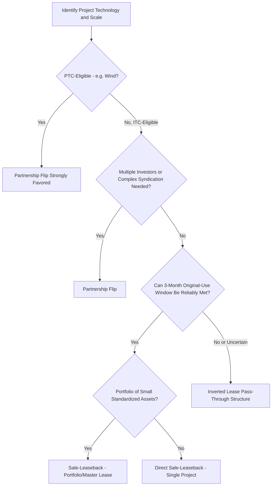

## Comparative Use Cases by Project Size and Technology

### Overview

Sale-leaseback and inverted lease structures are not uniformly applied across the renewable energy and tax-credit-eligible asset landscape. Structural choice is heavily influenced by project scale, technology type, ownership fragmentation, revenue contract structure, and the relative importance of speed-to-close versus long-term flexibility. This topic surveys how sale-leaseback, inverted lease, and (for comparative context) partnership flip structures map onto different project sizes and technologies in current market practice.

### Key Variables Driving Structural Choice

**Key Points**

- **Project scale**: Utility-scale projects (typically tens to hundreds of megawatts) versus distributed generation/commercial-and-industrial (C&I) scale projects (typically under 5-20 MW) face different transaction cost sensitivities, since legal and structuring costs are largely fixed regardless of deal size
- **Technology and asset homogeneity**: Standardized, modular technology (e.g., rooftop or ground-mount C&I solar) is more amenable to portfolio-level aggregation and simplified lease structures than large, bespoke utility-scale assets
- **Timing flexibility**: Whether the sale-leaseback's 3-month original-use window can realistically be satisfied given interconnection, commissioning, and financial close timelines
- **Number of tax equity investors and syndication needs**: Larger deals often require multiple tax equity investors or investor classes, favoring partnership flip structures that can more readily accommodate multiple partners than a two-party lease
- **Sponsor's own tax capacity**: Where the sponsor itself has tax appetite (e.g., a large utility or corporate sponsor), it may prefer structures like the inverted lease that allow it to retain and directly use the pass-through ITC via its own Master Tenant entity rather than "selling" all tax benefits to a third party

### Distributed Generation and Commercial & Industrial (C&I) Solar

#### Why Sale-Leasebacks Have Been Common Here

**Key Points**

- Smaller, more standardized system designs across a portfolio of many discrete sites make a straightforward two-party sale-leaseback administratively efficient relative to the multi-partner complexity of a partnership flip
- Many C&I and residential-adjacent portfolios are financed and tax-structured at the **portfolio level** (aggregating many individual small systems into a single lease or master lease facility with the tax equity investor), reducing per-project transaction costs
- The 3-month original-use timing window is often more manageable for smaller systems, which typically have faster, more predictable interconnection and commissioning timelines than utility-scale projects with complex transmission interconnection processes

#### Structural Variations at This Scale

- **Master lease/portfolio facility**: A single lease agreement (or a series of substantially similar leases) covering multiple small systems, allowing the tax equity investor to fund a portfolio incrementally as systems reach commercial operation, each within its own 3-month window
- **Fund structures**: Aggregation vehicles (sometimes structured as a fund investing across multiple sale-leaseback or partnership flip transactions) are common at this scale to achieve diversification and administrative efficiency for the tax equity investor

### Utility-Scale Wind

#### Historical Predominance of Partnership Flips

- Utility-scale wind has historically been dominated by the **partnership flip** structure, particularly given the Production Tax Credit's mechanics (an annual credit tied to actual electricity production over a 10-year period), which aligns naturally with an ongoing partnership allocation of income/loss and PTC over time, rather than a one-time credit event better suited to a sale-leaseback or inverted lease
- Because the PTC is generated annually based on production (unlike the ITC's one-time claim), the sale-leaseback and inverted lease structures — which are principally designed around a single point-in-time credit transfer — are less naturally suited to PTC monetization compared to the flip structure's ongoing allocation mechanics [Inference: this reflects the practical alignment between credit type and structure rather than an absolute legal bar; ITC elections for wind projects, where available under applicable law at the relevant time, could shift this calculus toward lease-based structures.]

### Utility-Scale Solar

#### Broader Structural Diversity

- Utility-scale solar, being ITC-eligible (a one-time credit claimed upon placed-in-service), is structurally compatible with all three primary approaches: partnership flip, direct sale-leaseback, and inverted lease
- **Partnership flip** remains common for large utility-scale solar, particularly where multiple tax equity investors syndicate a single large investment or where the sponsor prefers to retain a meaningful ongoing ownership stake and residual upside
- **Inverted lease** structures have seen substantial use in utility-scale solar specifically because they avoid the 3-month sale-leaseback timing constraint (which is harder to satisfy reliably for large projects with complex interconnection and commissioning schedules) while still allowing a clean separation of the ITC (to the Master Tenant) from depreciation and rental economics (to the Owner-Lessor investor)
- **Direct sale-leaseback** is used at utility scale as well, particularly where transaction timing can be reliably managed and the parties prefer the relative simplicity of a two-party structure over the added entity layer of an inverted lease

### Battery Storage and Co-Located/Hybrid Projects

#### Emerging Structuring Considerations

- Standalone battery storage (now independently ITC-eligible for storage technology under applicable current law) and hybrid solar-plus-storage projects introduce additional structuring complexity, since storage assets may have different useful life assumptions, different commissioning timelines, and potentially different basis and eligible-cost determinations than the co-located generation asset
- [Inference: given the relative recency of standalone storage ITC eligibility, market practice for allocating storage assets between sale-leaseback, inverted lease, and partnership flip structures continues to develop, and practitioners should confirm current guidance and market conventions when structuring hybrid or storage-inclusive transactions rather than relying solely on generation-asset precedent.]
- Co-located projects often require careful basis allocation between the generation and storage components, particularly where the components have different placed-in-service dates or eligibility bases, which can complicate satisfying the sale-leaseback timing window if the two components are commissioned at different times

### Comparative Use Case Table

| Project Type/Scale | Common Structure(s) | Primary Driver |
| --- | --- | --- |
| C&I / distributed solar portfolios | Sale-leaseback (often portfolio/master lease) | Standardization, faster interconnection timelines, lower per-deal transaction costs |
| Utility-scale wind | Partnership flip | PTC's annual, production-based mechanics align with ongoing partnership allocations |
| Utility-scale solar (single large project) | Partnership flip, inverted lease, or direct sale-leaseback | Investor syndication needs, timing certainty, sponsor tax capacity preferences |
| Utility-scale solar (complex interconnection/timing risk) | Inverted lease | Avoids strict 3-month original-use window |
| Standalone/co-located battery storage | Emerging; structure selection follows generation-asset precedent with basis allocation adjustments | Newer ITC eligibility, evolving market practice |

### Decision Framework Diagram

### Practical Considerations for Structural Selection

**Key Points**

- **Transaction cost sensitivity**: Smaller deals favor whichever structure minimizes fixed legal and diligence costs relative to deal size, often favoring standardized sale-leaseback documentation or fund-level aggregation
- **Investor market appetite**: Some tax equity investors have institutional preferences or established documentation platforms for one structure type over another, which can itself drive structural selection independent of pure technical optimization
- **Interconnection and commissioning timeline risk**: Larger, more complex utility-scale projects with higher interconnection timeline uncertainty should weigh the inverted lease's avoidance of the 3-month window against its added entity complexity
- **Sponsor's long-term ownership objectives**: Sponsors seeking to retain maximum long-term residual ownership and operational control may favor partnership flip structures with clear post-flip buyout rights, while sponsors more focused on near-term tax benefit monetization with less concern for long-term structure may find sale-leaseback or inverted lease arrangements administratively simpler

### Conclusion

The choice among partnership flip, sale-leaseback, and inverted lease structures is not a one-size-fits-all decision but rather a function of technology-driven credit mechanics (PTC's ongoing nature versus ITC's one-time claim), project scale and standardization, timing certainty around the original-use window, and investor syndication requirements. Utility-scale wind gravitates strongly toward partnership flips due to PTC mechanics, C&I and distributed solar often favor sale-leaseback structures at portfolio scale, and utility-scale solar exhibits the greatest structural diversity, with inverted leases serving as a common solution where timing risk makes a direct sale-leaseback impractical.

**Related Topics**

- Sale-Leaseback Mechanics and Timing Requirements
- Inverted Lease Pass-Through Election Mechanics
- Master Tenant and Owner Lessor Roles
- Pre-Flip and Post-Flip Allocation Mechanics
- Fixed Flip Versus Target-Yield Flip
- Standalone Battery Storage ITC Eligibility and Structuring Considerations
- Portfolio and Fund-Level Aggregation Structures for Distributed Generation Tax Equity