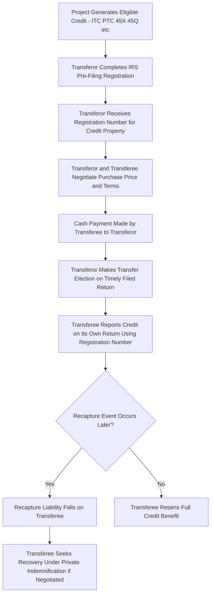

## Section 6418 Transfer Election Mechanics

### Overview

IRC §6418, enacted as part of the Inflation Reduction Act of 2022, introduced a fundamentally new monetization pathway for many clean energy tax credits: the ability for an eligible taxpayer to **sell** certain credits directly to an unrelated third-party buyer for cash, without requiring the buyer to hold any ownership or partnership interest in the underlying project. This "transferability" mechanism represents a significant departure from the traditional partnership flip, sale-leaseback, and inverted lease structures, which all require the tax equity investor to hold some form of ownership interest to claim credits directly. This topic covers the statutory election mechanics, eligible credits, procedural requirements, and key structuring considerations under §6418.

### Statutory Framework

#### Core Mechanism

**Key Points**

- Under §6418(a), an "eligible taxpayer" may elect to transfer all (or any specified portion) of an "eligible credit" to an unrelated taxpayer (the "transferee") in exchange for cash consideration
- The cash payment received by the transferor is **not includible in the transferor's gross income**, and the cash payment made by the transferee is **not deductible** by the transferee — the transaction is treated as a tax-free cash sale of the credit itself rather than a taxable exchange
- The transferee, upon a valid transfer election, is treated as the taxpayer with respect to the transferred credit for all purposes of the Code (subject to specific limitations, including certain passive activity and at-risk rules discussed below), and claims the credit on its own tax return
- Transfers are **cash-only**; the statute does not permit transfers in exchange for property or services, distinguishing this mechanism clearly from partnership equity investments

#### Eligible Credits

§6418 applies to a specified list of "eligible credits" enumerated in §6418(f)(1), which includes (among others) the Investment Tax Credit (§48 and successor §48E), the Production Tax Credit (§45 and successor §45Y), the Section 45X Advanced Manufacturing Production Credit, the Section 45Q Carbon Oxide Sequestration Credit, the Section 45V Clean Hydrogen Production Credit, and several other clean energy-related credits.

**Key Points**

- Eligibility for transfer under §6418 does not itself expand which projects qualify for the underlying credit — the project must independently satisfy all substantive eligibility requirements for the credit in question (e.g., placed-in-service requirements, prevailing wage and apprenticeship requirements where applicable for enhanced credit rates) before the resulting credit amount becomes eligible for transfer
- Certain credits eligible for **direct pay** under §6417 (available primarily to tax-exempt and governmental entities) overlap substantially with the list of §6418-eligible credits, but §6417 and §6418 are separate, mutually exclusive elections with respect to the same credit amount (a taxpayer cannot elect direct pay and also transfer the same credit)

### Eligible Taxpayers and Restrictions on Transferees

#### Who May Transfer (Sell) Credits

- Generally, any taxpayer that would otherwise be entitled to claim an eligible credit may elect to transfer it, **except** entities eligible for direct pay under §6417 as their primary monetization route (generally tax-exempt organizations, governmental entities, and certain other specified entities), which are directed toward the direct pay mechanism instead for credits they generate directly (though even direct-pay-eligible entities have specific coordination rules depending on credit type and entity classification)

#### Who May Purchase (Be a Transferee)

- The transferee must be **unrelated** to the transferor within the meaning of the statute's related-party rules (generally referencing common ownership/control thresholds analogous to those used elsewhere in the Code for related-party determinations)
- The transferee must have sufficient U.S. federal income tax liability to utilize the purchased credit, since the credit is subject to the same general limitations (including passive activity loss rules under §469 for individual and certain other transferees) that would apply had the transferee generated the credit itself
- Passive activity loss limitations under §469 apply to a transferee's use of a purchased credit in the same manner they would apply to a directly held credit, meaning individual transferees (and certain closely held entities) may face restrictions on using purchased credits to offset non-passive income, an important underwriting consideration for corporate versus individual transferee buyers

### Making the Transfer Election

#### Pre-Filing Registration Requirement

**Key Points**

- Before any transfer election can be made, the eligible taxpayer (transferor) must complete a **pre-filing registration** process with the IRS through its online registration portal, obtaining a registration number specific to the eligible credit property for the relevant taxable year
- The registration number must be included on both the transferor's and the transferee's tax returns for the transfer election to be valid — this requirement is a critical procedural gatekeeper, and a mismatched, missing, or improperly obtained registration number can invalidate the transfer
- Registration requires substantiating information about the underlying facility or project (location, technology type, credit type and amount, and other identifying details), and registration numbers are generally tied to a specific credit property and cannot be freely reused across unrelated properties or years without separate registration

#### Election Timing and Mechanics

- The transfer election is made on the transferor's timely filed original tax return (including extensions) for the taxable year the credit is determined, and generally cannot be made or revoked after that return is filed (subject to specific amended return procedures in limited circumstances)
- The transferee reports the purchased credit on its own tax return for the taxable year in which the transferor's tax year (with respect to that credit) ends, using the registration number provided by the transferor

### Recapture and Excessive Credit Transfer Risk

#### Recapture Risk Allocation

**Key Points**

- If a transferred credit is subsequently subject to recapture (e.g., an ITC recapture event under IRC §50(a) occurring within the five-year recapture period), the recapture liability is generally imposed on the **transferee**, not the original transferor — a significant risk allocation feature that reverses the typical assumption that risk stays with the project-owning party
- This recapture-follows-the-transferee rule is a central diligence and pricing consideration for credit buyers, who must independently assess the underlying project's recapture risk profile even though they hold no ownership interest in the project itself
- Transaction documents in the transferable credit market have developed to include seller (transferor) indemnification obligations to the buyer (transferee) for recapture risk, effectively re-allocating this statutory default back toward the party with direct knowledge of and control over the project — though the transferee remains the party directly liable to the IRS in the first instance regardless of any private indemnification arrangement

#### Excessive Credit Transfer Penalty

- Section 6418(g)(2) imposes a penalty on the transferor if the amount of credit actually transferred exceeds the amount properly determined and eligible for transfer (an "excessive credit transfer"), generally equal to 20% of the excess amount, unless the transferor demonstrates reasonable cause for the overstatement
- This creates a direct incentive for transferors to ensure rigorous substantiation of the credit amount (including underlying eligible basis, applicable credit rate including any bonus adders, and compliance with prevailing wage/apprenticeship or domestic content requirements affecting the credit rate) before completing a transfer, since the penalty falls on the transferor rather than the buyer

### Transfer Election Process Flow

### Pricing Considerations in the Transferable Credit Market

**Key Points**

- Transferred credits typically trade at a **discount to face value** (i.e., a buyer pays less than one dollar per one dollar of credit), reflecting the time value of money (payment timing relative to credit utilization), recapture and excessive-transfer risk borne by the buyer, and general market liquidity and diligence costs
- Discount rates (i.e., the size of the price haircut) vary by credit type, project risk profile, sponsor/transferor credit quality supporting any indemnity, and prevailing market supply/demand conditions for transferable credits, and have fluctuated over time as the market has matured. [Unverified: specific current market pricing benchmarks change frequently and should be confirmed against current market data rather than relied upon from general background knowledge, given the relatively recent and evolving nature of this market.]
- Unlike traditional tax equity structures, a §6418 transfer does not provide the buyer any depreciation, operating income allocation, or ownership-based economics — the buyer's entire return is the discount between the purchase price paid and the face value of the credit received, making pricing analysis considerably simpler than modeling a full partnership flip IRR

### Comparison: Section 6418 Transfer vs. Traditional Tax Equity Structures

| Factor | Section 6418 Transfer | Partnership Flip / Sale-Leaseback / Inverted Lease |
| --- | --- | --- |
| Ownership interest required | No | Yes |
| Depreciation benefit to buyer | No | Yes (in most structures) |
| Transaction complexity | Lower (cash sale of a specific credit amount) | Higher (partnership agreement, lease, or hybrid structure) |
| Recapture liability | Falls on transferee (buyer), subject to private indemnity | Allocated per partnership/lease indemnity provisions, typically to sponsor |
| Buyer's return driver | Discount to face value of credit purchased | Full after-tax IRR including tax benefits and cash distributions |
| Multi-year credit types (e.g., PTC) | Can be transferred annually as generated | Allocated annually through ongoing partnership interest |

### Practical Diligence Considerations for Transferees

**Key Points**

- Confirm the underlying project's eligibility for the credit type being purchased, including any bonus credit rate requirements (prevailing wage/apprenticeship, domestic content, energy community, low-income community adders) that affect the credit amount
- Verify the pre-filing registration was properly completed and the registration number corresponds to the specific credit property and year
- Assess recapture risk independently, since liability falls on the transferee notwithstanding any private indemnification arrangement with the transferor
- Confirm the transferor's creditworthiness to support any negotiated indemnification obligations for recapture or excessive credit transfer exposure
- Evaluate passive activity loss limitations under §469 if the transferee is an individual or a closely held entity subject to those rules

### Conclusion

Section 6418 transferability introduced a materially simpler cash-sale monetization pathway for clean energy tax credits, eliminating the need for buyers to hold ownership interests in underlying projects while introducing a distinct risk allocation model in which recapture liability follows the credit itself to the transferee. The mechanism's reliance on mandatory IRS pre-filing registration, cash-only consideration, and a transferor-side excessive credit transfer penalty creates a procedurally rigorous but structurally streamlined alternative to traditional partnership flip, sale-leaseback, and inverted lease structures, and has rapidly become a significant channel for tax credit monetization since its enactment.

**Related Topics**

- Direct Pay Elections Under Section 6417 for Tax-Exempt and Governmental Entities
- Structuring Around Recapture and Basis Risk
- Prevailing Wage, Apprenticeship, and Bonus Credit Rate Adders
- Passive Activity Loss Rules Under Section 469 as Applied to Purchased Credits
- Pricing and Discount Rate Trends in the Transferable Credit Market
- Indemnification Structuring in Section 6418 Credit Purchase Agreements
- Comparison of Transferability, Direct Pay, and Traditional Tax Equity Monetization