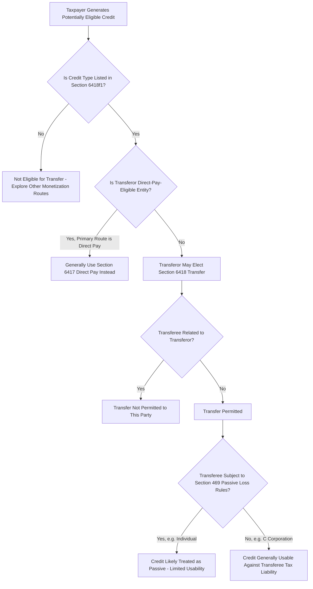

## Eligible Transferors, Transferees, and Credit Types

### Overview

The scope of IRC §6418 transferability depends on three interlocking eligibility questions: which taxpayers may sell (transfer) credits, which taxpayers may purchase them, and which specific credits qualify for transfer in the first place. Each dimension carries its own statutory conditions, restrictions, and practical underwriting implications. This topic examines these three eligibility dimensions in detail, building on the transfer election mechanics discussed previously.

### Eligible Transferors

#### General Rule

**Key Points**

- Any taxpayer that would otherwise be entitled to claim an "eligible credit" (as defined in §6418(f)(1)) may elect to transfer all or a specified portion of that credit to an unrelated transferee, provided the taxpayer is not itself claiming direct pay under §6417 with respect to the same credit amount
- Both C corporations and pass-through entities (partnerships and S corporations) can be eligible transferors, though the mechanics for pass-through entities involve an entity-level election (the partnership or S corporation itself makes the transfer election, rather than individual partners/shareholders electing separately with respect to their allocated shares)
- A partnership or S corporation that transfers a credit under §6418 allocates the resulting **tax-exempt income** (the cash proceeds, which are excluded from gross income under §6418(b)) to its partners/shareholders in the same manner the credit itself would have been allocated absent the transfer, preserving the relative economic entitlement of the partners even though the credit itself has been monetized through a sale rather than direct utilization

#### Entities Directed Toward Direct Pay Instead

- Applicable entities eligible for **direct pay** under §6417 — generally tax-exempt organizations, state and local governments, Indian tribal governments, the Tennessee Valley Authority, and rural electric cooperatives — are generally directed toward the direct pay mechanism as their primary route for monetizing credits they generate directly, since these entities typically have no tax liability against which a credit could otherwise be used
- However, the interaction between §6417 and §6418 for these entities has specific technical rules; for certain credits and certain entity types, coordination provisions determine which mechanism is available or required, and the two elections remain mutually exclusive with respect to the same credit amount
- Partnerships and S corporations, even if they have partners/shareholders that are themselves direct-pay-eligible entities, generally are not eligible for direct pay at the entity level for most credit types (subject to specific exceptions), meaning the entity would look to a §6418 transfer if it wishes to monetize credits in a manner other than allocation to its partners for direct use

### Eligible Transferees

#### General Requirements

**Key Points**

- The transferee must be **unrelated** to the transferor, applying related-party standards that generally reference common ownership or control thresholds consistent with related-party rules used elsewhere in the Code
- The transferee may be any taxpayer with U.S. federal income tax liability sufficient to use the credit, including individuals, C corporations, and other entities — there is no requirement that the transferee be engaged in the same or a related line of business as the transferor, distinguishing this sharply from traditional tax equity investment, which requires the investor to hold a genuine ownership stake
- Multiple transferees may purchase portions of a single credit from one transferor (the transferor may split a single eligible credit amount among multiple buyers), and a single transferee may purchase credits from multiple, unrelated transferors, enabling credit aggregation and portfolio diversification strategies for buyers

#### Passive Activity Loss and At-Risk Considerations

- Purchased credits remain subject to the same limitations that would have applied had the transferee generated the credit directly, most notably the **passive activity loss rules under IRC §469**
- For individual transferees (and certain closely held C corporations and personal service corporations subject to §469), a purchased credit may be treated as arising from a passive activity if the transferee does not materially participate in the activity generating the credit — since a credit purchaser by definition holds no operational involvement in the underlying project, purchased credits are generally treated as passive activity credits for individual buyers, which can significantly limit their usability against non-passive income
- This passive activity limitation is a primary reason the transferee market has been dominated by **C corporations** (which are generally not subject to the §469 passive loss limitations in the same manner as individuals, subject to specific exceptions for closely held and personal service corporations) rather than individual buyers. [Inference: this reflects the practical effect of the passive activity rules on buyer composition rather than an explicit statutory preference for corporate buyers; the statute itself does not exclude individuals, but the practical utility of purchased credits for many individual taxpayers is constrained by §469.]

### Eligible Credit Types

#### Statutory List Under Section 6418(f)(1)

The credits eligible for transfer under §6418 are specifically enumerated and include (among others):

**Key Points**

- **Investment Tax Credit** (IRC §48, and its technology-neutral successor §48E applicable to projects beginning construction after 2024)
- **Production Tax Credit** (IRC §45, and its technology-neutral successor §45Y)
- **Advanced Manufacturing Production Credit** (IRC §45X), covering eligible components such as solar and wind equipment, battery components, and critical minerals
- **Carbon Oxide Sequestration Credit** (IRC §45Q)
- **Clean Hydrogen Production Credit** (IRC §45V)
- **Clean Fuel Production Credit** (IRC §45Z)
- **Advanced Energy Project Credit** (IRC §48C)
- **Zero-Emission Nuclear Power Production Credit** (IRC §45U)
- Certain other specified credits addressing carbon capture, clean electricity, and related clean energy activities

[Note: The precise list and applicable technology-neutral successor provisions have been subject to legislative and regulatory developments since enactment; practitioners should confirm current statutory text and IRS guidance for the specific credit and taxable year at issue, as this is an area of active legislative and regulatory activity.]

#### Credits Not Eligible for Transfer

- Credits not included in the §6418(f)(1) list are not eligible for transfer under this mechanism, regardless of their clean energy character — transferability is a specific statutory grant applicable only to the enumerated credits, not a general rule applicable to all tax credits
- Certain **bonus credit amounts** (increases to the base credit rate attributable to satisfying prevailing wage and apprenticeship requirements, domestic content requirements, or energy community/low-income community location criteria) are generally transferable as part of the overall eligible credit amount, but the underlying qualification for each bonus adder must be independently substantiated, since an improperly claimed bonus amount transferred to a buyer would implicate the excessive credit transfer penalty discussed in the transfer mechanics topic

### Interaction Diagram: Transferor, Transferee, and Credit Type Eligibility

### Pass-Through Entity Mechanics in Detail

#### Entity-Level Election and Allocation of Proceeds

**Key Points**

- When a partnership or S corporation generates an eligible credit and elects to transfer it, the **entity itself** makes the transfer election and receives the cash proceeds, rather than the credit first being allocated to partners/shareholders who then individually transfer their shares
- The resulting tax-exempt income from the sale is allocated among the partners/shareholders in a manner consistent with how the credit itself would have been allocated under the partnership agreement or the entity's governing documents, preserving the economic entitlement structure the parties originally negotiated
- This entity-level mechanic is particularly relevant for renewable energy partnerships that might otherwise have used a traditional partnership flip structure — some sponsors now use a hybrid approach in which the partnership generates the credit, and rather than syndicating a full tax equity partner for the flip structure, the partnership itself transfers the credit under §6418 to a third-party buyer for cash, while the sponsor retains full ownership and the associated depreciation and operating economics
- This hybrid approach can simplify capital structures for smaller developers who might otherwise have needed to negotiate a full multi-party partnership flip solely to monetize tax benefits, since the transferability mechanism allows credit monetization without diluting ownership or requiring the complex allocation mechanics (minimum gain chargebacks, curative allocations, flip calculations) inherent in a partnership flip

### Comparative Table: Transferor and Transferee Profiles

| Party Type | Role Available | Key Constraint |
| --- | --- | --- |
| C Corporation | Transferor or Transferee | Generally not subject to §469 passive loss limits as a transferee, making it the dominant buyer profile |
| Individual | Transferor or Transferee | Subject to §469 passive activity loss limitations as a transferee, constraining usability of purchased credits |
| Partnership/S Corporation | Transferor (entity-level election) | Allocates tax-exempt proceeds to partners/shareholders per existing allocation provisions |
| Tax-Exempt/Governmental Entity | Generally directed to Direct Pay (§6417) | Mutually exclusive with §6418 transfer for the same credit amount |
| Related Party to Transferor | Not eligible as Transferee | Related-party restriction under §6418(f)(2) |

### Practical Considerations for Structuring Around Eligibility

**Key Points**

- Sponsors evaluating whether to pursue a §6418 transfer versus a traditional tax equity structure should assess whether their buyer pool realistically consists of C corporations with sufficient non-passive tax liability, since this affects both pricing and deal certainty
- Pass-through sponsors should confirm their partnership or operating agreement's allocation provisions properly address the treatment of tax-exempt income from a credit transfer, particularly if the agreement was originally drafted with only a traditional flip structure in contemplation
- Buyers should confirm their own tax profile (individual versus corporate, passive activity exposure, sufficient projected tax liability) before committing to a purchase, since a mismatch between the credit's usability and the buyer's tax position can result in the buyer being unable to use the purchased credit efficiently
- For bonus-rate-eligible credits, transferees should independently diligence the underlying project's compliance with prevailing wage, apprenticeship, domestic content, or energy community requirements, since these qualifications affect the transferable credit amount and carry excessive credit transfer penalty exposure

### Conclusion

Eligibility under §6418 operates across three distinct dimensions — permissible transferors (most taxpayers other than those primarily routed to direct pay), permissible transferees (any unrelated taxpayer with sufficient tax liability, though passive activity rules meaningfully constrain individual buyer utility), and eligible credit types (a specific statutory list covering the principal clean energy credits). Understanding how these dimensions interact, particularly the pass-through entity-level election mechanics and the passive activity loss constraints shaping buyer composition, is essential to correctly structuring and pricing a transferable credit transaction.

**Related Topics**

- Section 6418 Transfer Election Mechanics
- Direct Pay Elections Under Section 6417 for Tax-Exempt and Governmental Entities
- Passive Activity Loss Rules Under Section 469 as Applied to Purchased Credits
- Prevailing Wage, Apprenticeship, and Bonus Credit Rate Adders
- Technology-Neutral Credit Transition: Sections 48E and 45Y
- Hybrid Structures Combining Partnership Ownership with Section 6418 Transfers
- Indemnification Structuring in Section 6418 Credit Purchase Agreements