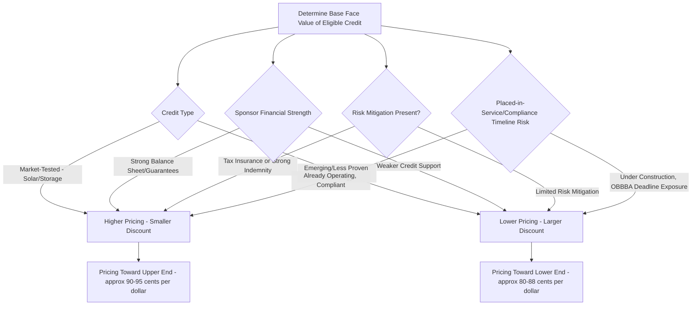

## Pricing Conventions in the Transfer Market

### Overview

The market for transferable tax credits under IRC §6418 has developed distinct pricing conventions since the mechanism's introduction under the Inflation Reduction Act of 2022. Unlike traditional tax equity investments, which require modeling a full after-tax IRR across depreciation, credits, and cash flow over many years, transferable credit pricing reduces largely to a single variable: the discount applied to the face value of the credit. This topic surveys current market pricing conventions, the factors driving discount rates, and how legislative developments have shaped the market's evolution.

### Core Pricing Convention: Cents on the Dollar

#### The Basic Framework

**Key Points**

- Transferable credits are priced as a **percentage of face value** (commonly expressed as "cents on the dollar"), representing the discount a buyer pays relative to the full credit amount it will claim
- Buyers typically acquire credits at 88 to 95 cents on the dollar, though pricing varies by transaction-specific risk factors [Concentro](https://www.concentro.io/blog/corporate-buyers-guide-to-clean-energy-tax-credits-2026)
- As of 2026, transferable credits average approximately 92.5 cents per dollar in the secondary market, reflecting continued market maturation and increased liquidity since the mechanism's early years [CBIZ](https://www.cbiz.com/insights/article/maximizing-opportunities-in-the-transferable-federal-tax-credit-marketplace)
- Other market surveys describe a somewhat wider historical range: buyers have generally purchased credits at a discount to face value, typically in the range of $0.90 to $0.95 per $1.00 of credit, while other market observations report pricing generally between approximately $0.82 and $0.92 per dollar of credit value, and broader market conditions, credit type, and perceived risk have historically produced pricing anywhere between roughly 80 and 95 cents per dollar of credit [An ultimate guide to transferable tax credits (updated 2026) | The Crux of It Blog +2](https://www.cruxclimate.com/insights/transferable-tax-credits)

[Note: Pricing benchmarks in this market shift frequently as liquidity, credit supply, and policy conditions evolve; the figures above reflect data available as of early-to-mid 2026 and should be reconfirmed against current market sources for any live transaction.]

#### Illustrative Discount Calculation

$$\text{Purchase Price} = \text{Face Value of Credit} \times (1 - \text{Discount Rate})$$

**Example**

If a buyer purchases a $1 million tax credit for $0.88 on the dollar, the buyer pays $880,000 in cash and receives the full $1,000,000 credit against its federal tax liability, generating $120,000 in immediate tax savings. [Tri-Merit](https://tri-merit.com/tax-credit-transfer/tax-credit-transfer-faq/)

$$\text{Buyer's Economic Gain} = \$1{,}000{,}000 - \$880{,}000 = \$120{,}000$$

### Factors Driving Discount Rates

#### Credit Type and Underlying Technology

**Key Points**

- Tax credits are subject to market supply and demand factors and are typically sold at a discount, with typical transactions ranging from a 6% to 15% discount off the total value of the credit [Cherry Bekaert](https://www.cbh.com/insights/articles/irc-section-6418-faq-transferring-energy-tax-credits/)
- Market-tested credits, such as those from established solar or battery storage projects, generally command higher prices (i.e., a smaller discount) and carry lower perceived risk [CBIZ](https://www.cbiz.com/insights/article/maximizing-opportunities-in-the-transferable-federal-tax-credit-marketplace)
- Sections 45X (advanced manufacturing) and 45Z (clean fuel production) credits have become increasingly popular in the transfer market because they offer steady credit generation, structural flexibility, and comparatively lower risk profiles relative to some project-based energy credits [CLA Connect](https://www.claconnect.com/en/resources/articles/25/transferable-energy-credits-remain-a-key-strategy-after-obbba)

#### Sponsor and Project Risk Profile

**Key Points**

- Pricing primarily depends on the sponsor's financial strength, the underlying technology, and overall market dynamics [Concentro](https://www.concentro.io/blog/corporate-buyers-guide-to-clean-energy-tax-credits-2026)
- Buyer diligence typically extends to confirming that the credit was properly generated and meets IRS eligibility requirements, including review of project documentation, verification of the eligible basis calculation, confirmation of IRS registration numbers, and evaluation of the seller's financial credibility [Tri-Merit](https://tri-merit.com/tax-credit-transfer/tax-credit-transfer-faq/)
- A principal risk buyers underwrite is seller failure — since the seller remains responsible for maintaining and operating the system and generating the energy credit throughout the five-year recapture period, a seller's bankruptcy or abandonment of the project can trigger recapture [Cherry Bekaert](https://www.cbh.com/insights/articles/irc-section-6418-faq-transferring-energy-tax-credits/)

#### Risk Mitigation Tools Affecting Pricing

**Key Points**

- Tax credit insurance is common for deals over $5 million and protects against audit, recapture, and compliance issues, while larger buyers may also rely on seller guarantees [CBIZ](https://www.cbiz.com/insights/article/maximizing-opportunities-in-the-transferable-federal-tax-credit-marketplace)
- The availability and strength of these risk mitigation tools (insurance coverage, seller indemnities, seller balance-sheet strength) directly affects the discount a buyer will accept — stronger risk mitigation generally supports pricing closer to par (a smaller discount), while weaker credit support or unproven technology pushes pricing toward the wider end of the discount range

### Transaction Structure and Timing

#### Deal Documentation and Closing Timelines

**Key Points**

- The **Tax Credit Transfer Agreement (TCTA)** is the definitive, binding contract that effects the transfer of credits under IRC §6418 and makes the commercial terms legally enforceable, and is the document where buyer protections are established [Concentro](https://www.concentro.io/blog/corporate-buyers-guide-to-clean-energy-tax-credits-2026)
- Core TCTA sections typically address sale mechanics (credit amount, price, cash payment requirement, and closing timing), seller representations regarding project eligibility, placed-in-service status, credit rate, basis, and compliance, along with forward-looking seller covenants [Concentro](https://www.concentro.io/blog/corporate-buyers-guide-to-clean-energy-tax-credits-2026)
- Deals facilitated through organized transfer marketplaces have closed in approximately three months on average, reflecting increasing standardization and process efficiency as the market has matured [Crux](https://www.cruxclimate.com/insights/transferable-tax-credits)

### 2026 Market Conditions and Legislative Developments

#### Post-OBBBA Market Environment

**Key Points**

- The One Big Beautiful Bill Act (OBBBA), enacted in 2025, preserved Section 6418 transferability rules despite earlier proposals to sunset or repeal them, and created generally favorable market conditions for buyers in 2026 while maintaining opportunities for renewable energy developers [Thomson Reuters](https://www.thomsonreuters.com/en/institute/articles/green-energy-tax-credits-survived)
- Transferability and direct pay both remain largely intact under the OBBBA, ensuring eligible taxpayers can continue to monetize credits even without sufficient federal tax liability of their own [Carr Riggs & Ingram](https://www.criadv.com/insight/energy-tax-credits-after-obbba/)
- 2026 market conditions have favored buyers due to a supply-demand imbalance, with an increased supply of certain credit types (particularly Section 45Z clean fuel production credits) affecting overall pricing dynamics [Thomson Reuters](https://www.thomsonreuters.com/en/institute/articles/green-energy-tax-credits-survived)
- The OBBBA introduced new conditions on the transfer market, including restrictions on transfers to certain foreign entities and accelerated compliance deadlines for wind and solar projects, which sponsors and buyers must factor into both eligibility diligence and pricing [CLA Connect](https://www.claconnect.com/en/resources/articles/25/transferable-energy-credits-remain-a-key-strategy-after-obbba)

#### New Compliance Deadlines Affecting Underlying Project Risk

- Projects that begin construction after July 4, 2026 must now be placed in service by the end of 2027 to qualify for the investment and production tax credits under Sections 48E and 45Y respectively, an accelerated timeline compared to the previous framework [CLA Connect](https://www.claconnect.com/en/resources/articles/25/transferable-energy-credits-remain-a-key-strategy-after-obbba)
- Under the original IRA framework, the Section 45Y production tax credit and Section 48E investment tax credit were slated to remain available until 2032, before the OBBBA's accelerated termination provisions shortened this runway for many wind and solar projects — a development that increases construction-timeline risk for credits generated by projects subject to the new deadlines, which buyers should factor into diligence and pricing for affected transactions [BDO](https://www.bdo.com/insights/tax/how-the-obbba-transforms-the-energy-tax-credit-transfer-market)

#### Deal Volume and Market Scale

- One major advisory firm reported having worked on close to 60 credit transactions over a recent 12-month period, illustrating the continued scale and activity level of the transfer market notwithstanding legislative uncertainty during the OBBBA's development and passage [CLA Connect](https://www.claconnect.com/en/resources/articles/25/transferable-energy-credits-remain-a-key-strategy-after-obbba)

### Pricing Factor Summary Diagram

### Practical Pricing Diligence Checklist

**Key Points**

- Confirm the specific credit type and its relative market liquidity/maturity (established ITC/PTC solar and wind versus newer credit categories such as 45X, 45V, or 45Z)
- Assess sponsor financial strength and the presence/strength of seller indemnification for recapture and excessive credit transfer risk
- Evaluate whether tax credit insurance is being used, particularly for larger transactions, and how that affects the negotiated discount
- Review the project's placed-in-service timeline against current statutory deadlines (including any OBBBA-driven acceleration) to assess construction and compliance timeline risk
- Confirm current market pricing benchmarks directly with transaction advisors or marketplace platforms at the time of any live deal, given how quickly this market's pricing conventions continue to evolve

### Conclusion

Pricing in the §6418 transfer market has converged on a cents-on-the-dollar discount framework, with recent market data suggesting an average around the low-to-mid 90s (cents per dollar of credit) as of 2026, though a meaningfully wider range persists depending on credit type, sponsor strength, risk mitigation tools, and underlying project compliance timelines. Legislative developments under the OBBBA have preserved the core transferability framework while introducing new compliance deadlines and buyer-side restrictions that continue to shape discount rates, making current market data essential for any active pricing analysis rather than reliance on historical benchmarks alone.

**Related Topics**

- Section 6418 Transfer Election Mechanics
- Eligible Transferors, Transferees, and Credit Types
- Tax Credit Insurance Products for Transfer Transactions
- Structuring Around Recapture and Basis Risk
- OBBBA Compliance Deadlines for Sections 48E and 45Y
- Indemnification Structuring in Section 6418 Credit Purchase Agreements
- Comparison of Transferability, Direct Pay, and Traditional Tax Equity Monetization