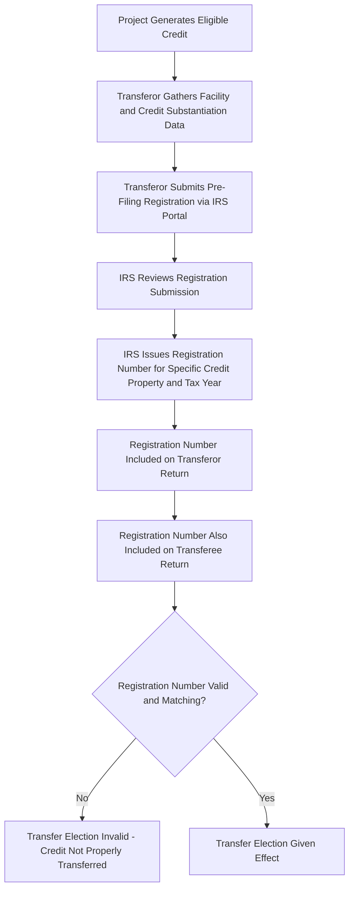
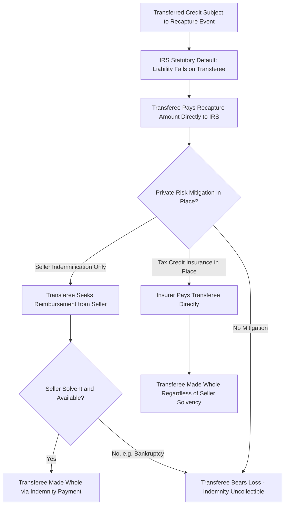

## Registration, Recapture, and Excessive Credit Transfer Penalties

### Overview

The IRC §6418 transfer mechanism operates within a compliance framework built around three interlocking components: a mandatory pre-filing registration process administered through an IRS online portal, statutory rules governing how recapture liability is allocated between transferor and transferee, and a penalty regime targeting overstated or improperly transferred credit amounts. Together, these components form the primary compliance and risk-allocation architecture that both sellers and buyers must navigate in any transferable credit transaction. This topic examines each component in detail, building on the transfer election mechanics and eligibility rules discussed previously.

### The Pre-Filing Registration Requirement

#### Purpose and Statutory Basis

**Key Points**

- Section 6418(g)(1) directs the Treasury Secretary to establish rules requiring a pre-filing registration process as a precondition to any valid transfer election, and Treasury has implemented this through an IRS online registration portal
- The registration requirement exists to give the IRS visibility into transferable credit transactions before they are claimed, supporting the agency's ability to track and monitor credit transfers and reduce the risk of duplicate or fraudulent claims
- No transfer election can be valid without a properly obtained registration number specific to the eligible credit property for the relevant taxable year — this is a strict procedural gatekeeper rather than a discretionary formality

#### Registration Process Mechanics

**Key Points**

- The transferor (the taxpayer generating the credit) completes the registration process, providing detailed substantiating information about the underlying facility or project, including its location, technology type, credit type, credit amount, and other identifying details specific to the credit property
- Registration numbers are generally tied to a **specific credit property** and **specific taxable year**, meaning a registration number cannot be freely reused across unrelated properties or subsequent years without separate registration
- Both the transferor's and the transferee's tax returns must include the registration number for the transfer election to be given effect — a missing, mismatched, or improperly obtained registration number can invalidate the transfer entirely, making registration accuracy a critical closing condition in any transfer transaction
- Because registration must generally be completed before the transferor's return is filed (and realistically well in advance, given portal processing timelines), transaction timelines for transferable credit deals typically build in adequate lead time for registration completion as a condition precedent to closing

#### Registration Process Flow

### Recapture Risk Allocation Under Section 6418

#### The Statutory Default: Recapture Follows the Transferee

**Key Points**

- If a transferred credit is later subject to recapture (most commonly an ITC recapture event under IRC §50(a) arising from a disposition, cessation of qualifying use, or ownership-interest reduction during the five-year recapture period), the recapture liability is imposed on the **transferee**, not the original transferor
- This is a significant departure from the risk allocation typical in traditional tax equity structures, where the sponsor generally indemnifies the investor for recapture risk while the investor holds no direct statutory recapture liability of its own — here, the buyer of a transferred credit is the party the IRS looks to directly for repayment
- The transferee's exposure exists **notwithstanding** the fact that it holds no ownership interest in, and no operational control over, the underlying project — a structural feature that makes recapture risk assessment a central diligence focus for any credit buyer, since the buyer cannot rely on ongoing operational visibility into the project the way a tax equity owner typically would

#### Seller-Side Risk Exposure: Bankruptcy and Abandonment

- The seller (transferor/project owner) remains responsible for maintaining and operating the system and generating the underlying energy credit throughout the five-year recapture period, even after the credit itself has been sold
- A seller declaring bankruptcy or abandoning the project during this period can trigger recapture, directly harming the buyer notwithstanding the buyer's complete lack of operational involvement — this scenario is one of the most closely underwritten risks in the transfer market given that the buyer's only recourse in such a case is typically a private indemnification claim against a potentially insolvent or unavailable seller

#### Private Indemnification as the Market Response

**Key Points**

- Because the statutory default places recapture liability on the transferee, the transferable credit market has developed standard **seller indemnification provisions** within the Tax Credit Transfer Agreement (TCTA), obligating the seller to reimburse the buyer for any recapture amount (plus related costs) triggered by seller-side events
- This private indemnification does not change the buyer's direct statutory liability to the IRS — the buyer remains the party the IRS collects from in the first instance — but it re-allocates the ultimate economic burden back to the seller (the party with direct knowledge of and control over the project), assuming the seller remains solvent and available to satisfy the indemnity
- **Tax credit insurance** has become a standard risk mitigation tool layered on top of (or in place of) seller indemnification, particularly for larger transactions, insuring the buyer directly against recapture, audit, and compliance-related credit disallowance regardless of the seller's ongoing solvency or availability — this insurance is commonly used for deals over $5 million and is a significant factor supporting tighter (less discounted) pricing in the transfer market
- Larger buyers may also require **seller guarantees** (parent company guarantees or similar credit support) as an additional backstop beyond a standalone indemnity from a potentially thinly capitalized project-level seller entity

#### Recapture Risk Allocation Diagram

### The Excessive Credit Transfer Penalty

#### Statutory Basis and Mechanics

**Key Points**

- Section 6418(g)(2) imposes a penalty on the **transferor** if the amount of credit purportedly transferred exceeds the amount properly determined and actually eligible for transfer — an "excessive credit transfer"
- The penalty is generally equal to **20% of the excessive amount**, applied in addition to the transferor's obligation to account for the overstated credit itself, unless the transferor can demonstrate reasonable cause for the overstatement
- Unlike the recapture liability discussed above (which falls on the transferee), the excessive credit transfer penalty falls squarely on the **transferor**, creating a bifurcated risk structure in which sellers bear the risk of overstating the credit amount at the time of transfer, while buyers bear the risk of later disqualifying events (recapture) affecting a properly calculated credit

#### What Constitutes an Excessive Transfer

- An excessive credit transfer can arise from a variety of substantive errors in the underlying credit calculation, including: overstated eligible basis (implicating the same basis risk concerns applicable to ITC step-up transactions generally), improperly claimed bonus credit rate adders (prevailing wage and apprenticeship compliance, domestic content requirements, energy community or low-income community location criteria), incorrect credit percentage calculations, or claiming credit for property that does not in fact qualify as eligible credit property
- Because bonus rate adders can substantially increase the credit percentage (and therefore the transferable amount), rigorous substantiation of adder eligibility is a critical due diligence point for transferors before finalizing a transfer, given that the 20% penalty applies to the excess amount attributable to any overstatement, including overstatement arising from an improperly claimed adder

#### Reasonable Cause Exception

- The transferor can avoid the excessive credit transfer penalty by demonstrating **reasonable cause** for the overstatement — a fact-specific standard generally requiring the transferor to show it exercised ordinary business care and prudence in determining the credit amount, notwithstanding the ultimate overstatement
- Robust contemporaneous documentation (engineering certifications, prevailing wage and apprenticeship compliance records, cost segregation studies, independent appraisals where fair market value is relevant to the basis calculation) supports both accurate credit determination in the first instance and, if an error nonetheless occurs, a stronger reasonable cause defense against the penalty

### Comparative Risk Allocation Summary

| Risk Category | Party Bearing Statutory Liability | Typical Private Risk Mitigation |
| --- | --- | --- |
| Recapture (post-transfer disqualifying event) | Transferee (buyer) | Seller indemnification, tax credit insurance, seller guarantees |
| Excessive credit transfer (overstatement at time of transfer) | Transferor (seller) | Robust substantiation, reasonable cause documentation, professional tax advice |
| Registration failure/mismatch | Effectively both parties (transfer invalidated) | Careful coordination and verification of registration numbers before closing |

### Practical Compliance Checklist

**Key Points**

- Confirm pre-filing registration is completed with sufficient lead time before the transferor's return filing deadline, and that the registration number is accurately reflected on both parties' returns
- For buyers: assess the underlying project's recapture risk profile independently, since statutory liability falls on the transferee regardless of any private indemnification arrangement
- For buyers: evaluate whether seller indemnification alone is sufficient or whether tax credit insurance should be obtained, particularly for larger transactions or where seller creditworthiness is uncertain
- For sellers: maintain rigorous substantiation of the credit amount, including eligible basis support and bonus rate adder compliance documentation, to minimize excessive credit transfer exposure and support a reasonable cause defense if an error is later identified
- For sellers: confirm ongoing compliance obligations (continued qualifying use, maintenance of prevailing wage/apprenticeship compliance where applicable) are tracked throughout the five-year recapture period, since a seller-side compliance lapse creates direct liability exposure for the buyer under the statutory recapture allocation rule

### Conclusion

The registration, recapture, and excessive credit transfer penalty rules together form a compliance architecture that allocates distinct risks to each party in a §6418 transfer: procedural registration failures can invalidate the transfer for both parties, recapture liability for post-transfer disqualifying events falls statutorily on the transferee notwithstanding its lack of ownership or operational control, and excessive credit transfer penalties for overstatement at the time of transfer fall on the transferor. This bifurcated risk structure has driven the development of standard market tools — private indemnification, tax credit insurance, and seller guarantees — that supplement the statutory framework and materially affect both transaction structuring and pricing in the transferable credit market.

**Related Topics**

- Section 6418 Transfer Election Mechanics
- Eligible Transferors, Transferees, and Credit Types
- Pricing Conventions in the Transfer Market
- Structuring Around Recapture and Basis Risk
- Tax Credit Insurance Products for Transfer Transactions
- Prevailing Wage, Apprenticeship, and Bonus Credit Rate Adders
- Indemnification Structuring in Section 6418 Credit Purchase Agreements