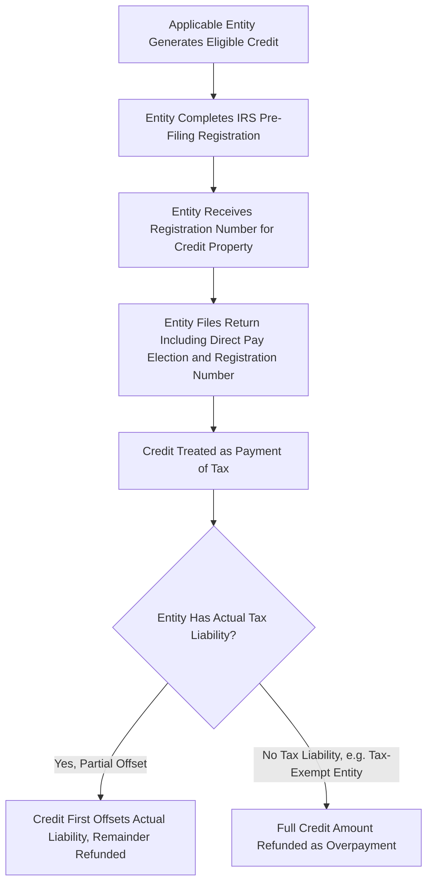

## Elective Pay for Tax-Exempt and Governmental Entities

### Overview

IRC §6417 "elective pay" (commonly called "direct pay") provides a fundamentally different monetization pathway from transferability, designed specifically for entities that have historically been unable to benefit from tax credits because they have little or no federal income tax liability against which a nonrefundable credit could be applied. Rather than selling a credit to a third party for cash, an applicable entity making a direct pay election treats the credit as a payment of tax, generating a refund (or offset) from the IRS as if the entity had overpaid its taxes by the credit amount. This topic addresses the eligible entities, eligible credits, election mechanics, and key interactions between direct pay and other monetization approaches.

### The Core Direct Pay Mechanism

#### How Elective Pay Works

**Key Points**

- Under §6417(a), an "applicable entity" making a valid election is treated as having made a payment of federal income tax equal to the amount of an otherwise-nonrefundable credit it would be entitled to claim, generating a refund of that amount (net of any actual tax liability) rather than a mere nonrefundable offset
- This mechanism effectively converts a tax credit into a **cash refund** for entities that would otherwise receive no benefit from a nonrefundable credit, since they typically have little or no federal income tax liability to offset in the first place
- Unlike a §6418 transfer, direct pay involves **no third-party buyer** — the applicable entity deals directly with the IRS, receiving payment from the government itself rather than from a private counterparty
- Because there is no third-party sale, there is no discount to face value analogous to transfer market pricing — an applicable entity that successfully elects direct pay generally receives the full credit amount (subject to the same substantive eligibility and calculation rules that would apply to any other claimant), though it must weigh this against direct pay's own procedural and timing requirements

### Applicable Entities

#### Statutory List of Eligible Direct Pay Entities

**Key Points**

- Section 6417(d)(1)(A) enumerates the categories of "applicable entities" eligible for direct pay, which generally include: tax-exempt organizations described in §501(a), state and local governments (and their political subdivisions), Indian tribal governments, the Tennessee Valley Authority, and rural electric cooperatives
- These entities share a common characteristic: they are generally organizations that either pay no federal income tax at all (tax-exempt organizations, governmental bodies) or have limited/specialized tax positions (rural electric cooperatives) that would otherwise make traditional nonrefundable tax credits of little or no practical value
- This category of entity was, prior to the enactment of §6417, effectively excluded from directly benefiting from most federal energy tax credits, since such entities could not generate the taxable income needed to use a nonrefundable credit — direct pay was specifically designed to close this gap and enable public-sector and nonprofit clean energy investment to receive comparable federal tax credit support to that available to taxable commercial developers

#### Limited Direct Pay Eligibility for Certain Other Taxpayers

- For a narrow set of specific credits (most notably certain provisions applicable to §45X Advanced Manufacturing Production Credits, §45V Clean Hydrogen Production Credits, and §45Q Carbon Oxide Sequestration Credits), the statute has historically permitted a limited, time-bound direct pay election even for otherwise-taxable entities that would not qualify as "applicable entities" under the general rule, subject to specific statutory conditions and phase-out provisions
- [Note: The scope and duration of this limited direct pay availability for non-applicable-entity taxpayers has been subject to specific statutory sunset provisions and subsequent legislative modification; practitioners should confirm current eligibility under the specific credit provision and taxable year at issue, given the technical and evolving nature of these limited-availability rules.]

### Eligible Credits for Direct Pay

**Key Points**

- The credits eligible for direct pay substantially overlap with, but are not identical to, the list of credits eligible for transfer under §6418 — both provisions cover the principal clean energy credits including the Investment Tax Credit (§48/§48E), Production Tax Credit (§45/§45Y), Advanced Manufacturing Production Credit (§45X), Carbon Oxide Sequestration Credit (§45Q), and Clean Hydrogen Production Credit (§45V), among others
- The precise scope of credits available to a given applicable entity under direct pay can depend on the entity's specific classification and the specific credit provision, since not every applicable entity category is eligible for every direct-pay-eligible credit type in every circumstance

### Direct Pay vs. Transfer: Mutual Exclusivity

#### Why the Two Elections Cannot Be Combined

**Key Points**

- A taxpayer cannot elect both direct pay under §6417 and transfer under §6418 with respect to the **same credit amount** — the two mechanisms are structured as mutually exclusive alternatives for monetizing a given unit of credit
- An applicable entity that is itself eligible for direct pay is generally directed toward that mechanism as its primary monetization route for credits it generates directly, since direct pay avoids the discount-to-face-value cost inherent in a third-party transfer
- However, the interaction between the two provisions involves specific technical coordination rules depending on entity type and credit category, and certain structuring scenarios (for example, a partnership with both taxable and applicable-entity partners, or joint ventures between taxable and tax-exempt parties) can raise more complex questions about which entity in a multi-party arrangement may make which election with respect to which portion of a jointly generated credit

### Election Procedure and Registration

#### Pre-Filing Registration Requirement

- Similar to the §6418 transfer mechanism, a direct pay election requires the applicable entity to complete a **pre-filing registration** process through the IRS online portal, obtaining a registration number specific to the credit property and taxable year before the election can be validly made
- The applicable entity must file the required election on a timely filed tax return (which, notably, requires many otherwise non-filing entities such as tax-exempt organizations and governmental bodies to file a return specifically to make this election, a procedural step that may be unfamiliar to entities without a regular federal tax return filing practice)

#### Election Timing Flow

### Recapture and Compliance Considerations Under Direct Pay

**Key Points**

- Applicable entities electing direct pay remain subject to the same substantive eligibility requirements and recapture rules (including IRC §50(a) recapture for ITC-eligible property) that would apply to any other credit claimant — direct pay changes how the credit is monetized, not the underlying substantive requirements for generating and maintaining credit eligibility
- Because the applicable entity is both the credit generator and the direct pay claimant (unlike a §6418 transfer, where recapture risk shifts to an unrelated third-party buyer), recapture risk under direct pay remains with the entity that owns and operates the underlying property, generally simplifying the risk allocation picture relative to a transfer transaction, since there is no third party whose interests must be separately protected against seller-side compliance failures

### Multi-Year Credit Considerations (Production Tax Credit)

- For production-based credits such as the PTC (§45/§45Y), an applicable entity generally must make (and the registration/election mechanics generally apply on) an annual basis corresponding to each taxable year in which production-based credit amounts are generated, since the credit itself accrues annually based on actual electricity production rather than as a single one-time amount
- This annual mechanic parallels considerations relevant to transferring PTC amounts under §6418 (also generally handled on an annual basis as the credit is generated), in contrast to the largely one-time nature of the ITC

### Comparative Table: Direct Pay vs. Transferability

| Factor | Direct Pay (§6417) | Transfer (§6418) |
| --- | --- | --- |
| Counterparty | IRS (government) | Unrelated third-party buyer |
| Eligible claimants | Specific "applicable entities" (tax-exempt, governmental, tribal, TVA, rural electric co-ops; limited exceptions for certain credits) | Broader range of taxpayers not eligible for/electing direct pay |
| Monetization value | Full credit amount (no market discount) | Discounted to a percentage of face value (market-negotiated) |
| Recapture risk allocation | Remains with the entity generating the credit | Shifts to the transferee (buyer) |
| Registration requirement | Yes, pre-filing registration required | Yes, pre-filing registration required |
| Filing requirement | May require otherwise non-filing entities to file a return | Applies to entities already generally subject to filing requirements |

### Practical Considerations for Applicable Entities

**Key Points**

- Confirm the entity's classification squarely fits within one of the enumerated "applicable entity" categories before relying on direct pay as the intended monetization route
- Build sufficient lead time into project and tax planning timelines for the pre-filing registration process and, where applicable, the establishment of a federal tax return filing practice for an entity that does not otherwise routinely file
- For production-based credits, plan for the annual registration and election cadence required to monetize each year's accrued credit amount
- Coordinate carefully in joint venture or partnership structures involving both taxable and applicable-entity participants, given the technical complexity of allocating direct pay eligibility and credit amounts among mixed ownership groups
- Maintain the same rigorous substantiation of eligible basis, credit rate calculations, and bonus adder compliance that would be required of any other credit claimant, since direct pay does not relax the underlying substantive eligibility standards

### Conclusion

Elective pay under §6417 provides tax-exempt organizations, governmental entities, tribal governments, and certain other specified applicable entities a mechanism to receive the full cash value of clean energy tax credits directly from the federal government, addressing a historical gap in which such entities could not benefit from nonrefundable credits due to their lack of taxable income. Operating as a mutually exclusive alternative to §6418 transferability, direct pay avoids the market discount inherent in a third-party sale while introducing its own procedural requirements — pre-filing registration, a potentially new tax return filing obligation, and, for production-based credits, an annual election cadence — that applicable entities must build into their clean energy project planning.

**Related Topics**

- Section 6418 Transfer Election Mechanics
- Eligible Transferors, Transferees, and Credit Types
- Pricing Conventions in the Transfer Market
- Registration, Recapture, and Excessive Credit Transfer Penalties
- Structuring Around Recapture and Basis Risk
- Joint Ventures Between Taxable and Tax-Exempt Entities in Clean Energy Projects
- Comparison of Transferability, Direct Pay, and Traditional Tax Equity Monetization