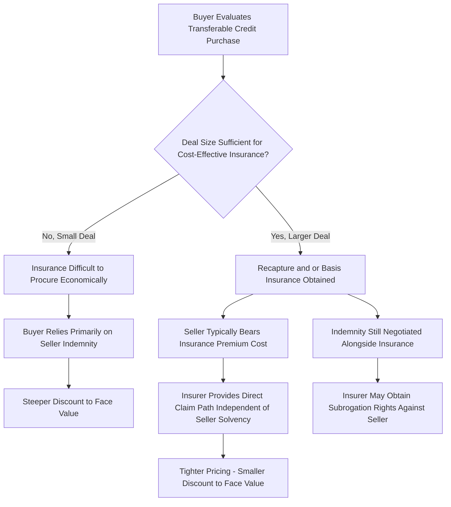

## Insurance Products for Transfer and Recapture Risk

### Overview

Tax credit insurance has become a central risk-mitigation tool supporting the transferable credit market established under IRC §6418, addressing the structural reality that credit buyers hold no ownership interest in, and no operational visibility into, the underlying projects generating the credits they purchase. Insurance products specifically targeting recapture risk and basis/cost-segregation risk have emerged alongside (and increasingly as an alternative to) private seller indemnification, materially influencing both deal structuring and pricing across the market. This topic examines the types of coverage available, how they interact with indemnification, and their effect on transaction economics.

### Why Insurance Emerged as a Market Necessity

**Key Points**

- As established in the discussion of registration and recapture rules, the statutory default under §6418 places recapture liability directly on the transferee (buyer), notwithstanding the buyer's lack of ownership or operational control over the underlying project
- Private seller indemnification alone leaves buyers exposed to seller insolvency, bankruptcy, or unavailability — a seller declaring bankruptcy or abandoning the project during the five-year recapture period can trigger recapture with no realistic prospect of recovery under a standalone indemnity
- Insurance addresses this gap by providing a buyer a direct claim against a well-capitalized, regulated insurer, independent of the seller's ongoing financial condition, making it a materially stronger form of risk transfer than indemnification alone for larger or higher-risk transactions

### Types of Coverage in the Tax Credit Insurance Market

#### Recapture Risk Insurance

**Key Points**

- Recapture insurance protects the buyer against the specific risk that a qualifying event (disposition, cessation of qualifying use, or an ownership-interest change during the applicable recapture period) will trigger IRC §50(a) recapture with respect to a purchased ITC
- This coverage responds directly to the seller-side operational risk discussed in the registration and recapture topic — most notably, a seller's bankruptcy or abandonment of the project during the five-year recapture window — insulating the buyer from a risk it cannot itself monitor or control given its lack of ownership stake

#### Basis and Cost Segregation Risk Insurance

**Key Points**

- Basis risk insurance addresses the risk that the eligible basis used to calculate the credit is later challenged or reduced by the IRS, a concern that is particularly significant in direct transfer transactions because, unlike traditional tax equity step-up structures, credits in a direct transfer are generally valued based on the seller's **cost basis** rather than a stepped-up fair market value, making accurate cost-basis documentation the central substantiation point
- A cost segregation analysis from a reputable third-party accounting firm is typically used to validate the cost basis for ITC-eligible energy property, and if a project does involve a basis step-up, buyers additionally diligence the transaction effectuating the step-up and the supporting valuation, since larger step-ups are generally understood to face increased IRS scrutiny
- Similar to recapture risk, basis risk is commonly covered by tax credit insurance, with the **seller typically bearing the cost** of the policy — a market convention that reflects the seller's role in generating and substantiating the underlying credit calculation

#### Coverage Combining Audit, Recapture, and Compliance Risk

- Broader tax credit insurance policies protect against audit, recapture, and compliance issues collectively, rather than isolating a single risk category, and this combined coverage is common for deals over approximately $5 million in credit value
- Buyers who elect not to purchase insurance, or who purchase uninsured credits, generally do so at a steeper discount to face value, reflecting the additional risk premium a buyer demands absent third-party insurance backing

### Indemnification as a Complement to Insurance

#### Standard Indemnity Provisions

**Key Points**

- Indemnities remain a key contractual protection for buyers in transferable tax credit transactions, offering contractual remedies if credits are later disallowed or recaptured, whether or not insurance is also present
- Because buyers do not participate in project cash flows the way a traditional tax equity owner would, they rely on these contractual protections (indemnities, insurance, or both) to mitigate risks tied to credit ineligibility or project noncompliance, rather than on operational visibility into the project itself
- Coverage and indemnity amounts are typically negotiated, with many buyers seeking indemnities equal to at least 100% of the credit value to cover potential penalties and interest that could arise from a disallowance or recapture event

#### Insurance and Indemnification Working Together

- In practice, insurance and seller indemnification are frequently layered rather than used as substitutes: the indemnity establishes the seller's contractual obligation, while insurance provides the buyer a source of recovery that does not depend on the seller's continued solvency, with the insurer sometimes obtaining subrogation rights against the seller in the event of a paid claim

### Deal Size and Market Segment Effects

#### Insurance Availability by Transaction Size

**Key Points**

- Pricing (and the availability of insurance) varies substantially by deal size: recapture and basis risk, relevant mainly to ITCs, has an outsized role in pricing for smaller transactions, precisely because insurance is difficult or not economically viable to procure at smaller deal sizes, given fixed underwriting and policy costs relative to the credit amount at stake
- Smaller tax credit amounts (for example, those below approximately $5 million to $10 million) may see a larger discount to face value, reflecting both the buyer's need to achieve sufficient net savings after transaction costs and the reduced availability of cost-effective insurance at that scale
- This dynamic means smaller sellers and smaller-project credits face a structurally different risk/pricing environment than large, insurable transactions, an important consideration for developers evaluating whether the transfer market is cost-effective for a given project size

#### Credit Type and Insurability

- ITCs tend to be more complex to insure than PTCs due to the combination of cost-basis risk and recapture risk unique to the one-time ITC claim, and as a result ITCs tend to trade at a larger discount than PTCs, which are claimed annually based on actual production and carry a comparatively simpler risk profile
- Credit types benefiting from finalized IRS regulations (such as §45X, following its October 2024 final regulations) have generally commanded more stable, premium pricing in the market, reflecting greater regulatory certainty and correspondingly lower perceived underwriting risk, whereas credits still operating under proposed or less mature guidance (such as §45Z at an earlier point in its regulatory life cycle) have exhibited a wider gap between buyer perception and pricing, creating both hesitation and, for buyers willing to underwrite the residual uncertainty, an incremental yield opportunity

### Insurance and Risk Mitigation Flow

### Diligence Materials Supporting Insurance Underwriting

**Key Points**

- Insurers (and buyers generally) typically require the engineering, procurement, and construction (EPC) agreement, an independent appraisal (where fair market value is relevant to the basis calculation), and a cost-segregation report as core diligence materials substantiating the credit amount and underlying basis
- Standardized, platform-based diligence checklists have emerged in the market to streamline document collection and verification, reflecting the market's move toward a more process-driven, digitally coordinated transaction workflow as transaction volume has grown
- Buyers should note that federal tax policy allows a transferable credit to be carried forward for a substantial period (commonly cited as up to 22 years) and carried back a shorter period (commonly cited as 3 years), which affects the buyer's own utilization planning independent of the insurance and indemnification analysis, since a buyer's ability to actually use the purchased credit against its own tax liability over time is a separate consideration from insurability of the credit itself

### Practical Considerations for Structuring Around Insurance

**Key Points**

- Sellers of smaller credit amounts should recognize that insurance may not be economically available and should plan pricing expectations accordingly, potentially bundling multiple smaller projects into a portfolio transaction to reach a scale where insurance becomes cost-effective
- Buyers should weigh the cost of insurance premiums (typically borne by the seller as a market convention, though this remains a negotiated term) against the discount reduction insurance can achieve, recognizing that insured transactions generally support tighter pricing
- Both parties should confirm whether the insurance policy responds to both recapture and basis/cost-segregation risk, or only one category, since combined policies and single-risk policies carry different scope and pricing
- Deal teams should confirm the specific credit type's regulatory maturity (finalized versus proposed regulations) as a factor in both insurability and expected pricing, since regulatory certainty materially affects insurer risk appetite and underwriting terms

### Conclusion

Tax credit insurance has become an essential risk-transfer mechanism in the §6418 transfer market, addressing the structural mismatch between a buyer's direct statutory recapture liability and its complete lack of operational control over the underlying project. Coverage for recapture and basis/cost-segregation risk, typically paid for by the seller and often layered alongside contractual indemnification, materially tightens pricing for larger, insurable transactions while leaving smaller deals more exposed to wider discounts, making insurance availability and cost a first-order structuring consideration alongside the underlying credit's technology type and regulatory maturity.

**Related Topics**

- Registration, Recapture, and Excessive Credit Transfer Penalties
- Pricing Conventions in the Transfer Market
- Structuring Around Recapture and Basis Risk
- Section 6418 Transfer Election Mechanics
- Cost Segregation Studies for Renewable Energy Basis Allocation
- Indemnification Structuring in Section 6418 Credit Purchase Agreements
- Credit Carryforward and Carryback Rules for Purchased Tax Credits