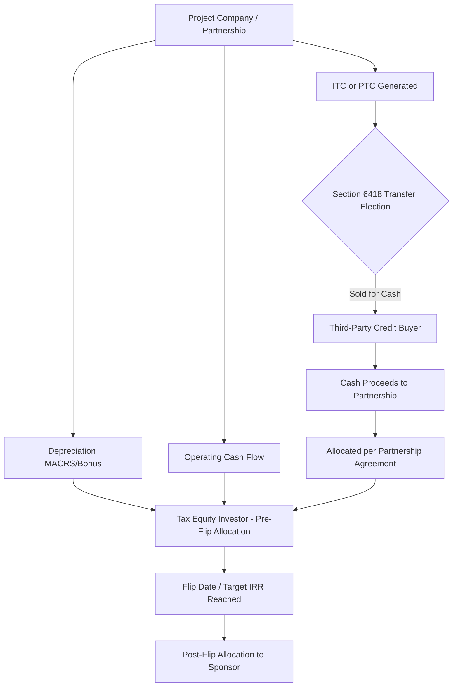

## The Combined Flip and Transfer Structure

### Overview

The Combined Flip and Transfer Structure is a tax equity monetization approach that layers a **partnership flip** with a **direct transfer of tax credits** under IRC §6418, introduced by the Inflation Reduction Act (IRA) of 2022. Rather than relying on the tax equity investor to *use* the credits within its own return, the partnership (or a partner in it) elects to sell some or all of the eligible credits for cash, while depreciation, cash flow allocations, and residual value continue to flip between the sponsor and the equity partner on a traditional schedule.

This structure emerged because §6418 transferability decoupled the credit itself from the depreciation and income/loss allocations. Historically, an investor's return in a flip deal came from three components: the Investment Tax Credit (ITC) or Production Tax Credit (PTC), depreciation (via MACRS/bonus depreciation), and a share of cash flow. Post-IRA, a project can now separate the credit component and sell it directly to a third-party buyer for cash, while a smaller, more specialized tax equity investor (or the sponsor itself) retains the depreciation and cash benefits through a flip partnership.

### Why This Structure Exists

**Key Points**

- Traditional tax equity investors (banks, insurers) have limited appetite and are typically the only parties who can efficiently use large, lumpy PTC/ITC amounts alongside depreciation.
- §6418 transferability opened the credit market to a much broader universe of buyers (any taxpayer with sufficient tax liability) who want *only* the credit, not depreciation, at a discount to face value.
- Sponsors get liquidity from two separate markets simultaneously: the transfer market (for credits) and the tax equity market (for depreciation/losses), which can reduce blended cost of capital versus a pure flip.
- Depreciation cannot be transferred under §6418 — only the credit can. This is why the flip partnership structure is still needed to monetize depreciation with an investor that can use it.

### Structural Mechanics

In a Combined Flip and Transfer deal:

1. **Partnership formation**: Sponsor and tax equity investor form a partnership (typical allocation: 99%/1% pre-flip, flipping to 5%/95% or similar post-target-date, following standard partnership flip conventions).
2. **Credit generation**: The partnership (as the owner of the eligible property) generates the ITC or PTC.
3. **§6418 election**: The partnership itself (not an individual partner) makes the transfer election, since the eligible credit property is owned at the partnership level. The partnership sells the credit for cash to one or more unrelated transferee(s).
4. **Cash allocation**: Transfer proceeds are allocated to partners under the partnership agreement — typically routed predominantly (or entirely) to the tax equity investor as a substitute for what would have been its credit allocation, or split per a negotiated waterfall.
5. **Residual flip economics**: Depreciation, operating cash flow, and any retained credits (if a partial transfer) continue to flip per the standard HLBV (Hypothetical Liquidation at Book Value) partnership flip mechanics.

### Partnership Allocation Rules Under §6418

**Key Points**

- Treasury regulations (Treas. Reg. §1.6418-2) require that the transfer election be made by the entity that directly owns the eligible credit property — for a partnership-owned project, that is the partnership itself, not individual partners.
- Once transferred, the cash proceeds are treated as tax-exempt income for purposes of increasing partners' outside basis and capital accounts under §6418(f)(1) and corresponding partnership rules, but the transferred credit itself is excluded from the partnership's own credit computation (no double-dipping).
- The partnership agreement must specify how transfer proceeds are allocated among partners — this allocation is a negotiated economic term, not dictated by statute, so partnership flip models must be rebuilt to reflect cash-in-lieu-of-credit rather than credit-in-kind.
- [Inference] Because the credit no longer flows through as a tax attribute to the tax equity investor, some deals restructure the investor's targeted return entirely around depreciation and cash, with the transfer cash proceeds effectively substituting for the ITC/PTC value the investor previously would have booked directly.

### Partial vs. Full Transfer Elections

A sponsor and tax equity investor can choose to transfer only a portion of eligible credits, retaining the rest for direct use by the investor. This creates a hybrid within the hybrid:

- **Full transfer**: 100% of the credit is sold for cash; investor's return derives solely from depreciation, cash flow, and its allocated share of transfer proceeds.
- **Partial transfer**: A portion of the credit is retained by the partnership for allocation to the tax equity investor in-kind, while the remainder is sold. This can be used to preserve investor demand for deals where the investor's return model still depends partly on direct credit ownership (e.g., for basis step-up planning under transferee rules).

**Example**

A 100 MW solar project generates a 40% ITC (30% base + adders for domestic content and energy community). The partnership elects to transfer 25% of the ITC basis directly to a corporate buyer at a 92-cent-on-the-dollar price for immediate cash, while retaining 75% of the ITC for allocation to the tax equity investor, who also receives 99% of depreciation pre-flip. The investor's yield is now built from: (a) 75% of ITC value in-kind, (b) 99% depreciation, (c) a negotiated share of the transfer cash from the sold 25%, and (d) minimal cash flow pre-flip.

### Risk Allocation and Recapture

**Key Points**

- Under §6418(g)(3), recapture risk for a transferred ITC generally shifts to the **transferee** (buyer), not the seller (partnership/investor), unless the transferee and transferor agree otherwise contractually — this is a major structural distinction from traditional flip deals where the tax equity investor bears recapture risk directly as the credit claimant.
- Because recapture risk sits with the buyer, transfer agreements typically include indemnification provisions requiring the seller (or sponsor) to cover the buyer's loss if a recapture event occurs (e.g., disposition of the property, cessation of qualified use) within the 5-year recapture period.
- [Unverified] Market practice on indemnity caps, escrow requirements, and insurance-backed recapture protection continues to evolve rapidly as the transfer market matures; specific deal terms vary significantly by counterparty and should be confirmed against current market documentation rather than assumed static.
- Depreciation recapture (as ordinary income under §1245/§1250 principles applied to energy property) remains with whichever partner is allocated the depreciation, following ordinary partnership flip recapture allocation rules — this is unaffected by the §6418 election on the credit.

### Due Diligence Considerations for Combined Structures

**Key Points**

- **Basis and eligible cost segregation**: Determining which portion of eligible basis is transferred versus retained requires clean basis studies, since partial transfers must be traced to specific percentages of qualified investment.
- **Registration requirements**: Both the partnership (transferor) and buyer (transferee) must comply with IRS pre-filing registration requirements under §6418(g)(1) and obtain a registration number for each eligible credit property before the credit can be transferred; failure invalidates the transfer.
- **Insurance**: Given that recapture and other diligence risks (e.g., credit qualification challenges) sit differently across the flip and transfer legs, deals frequently layer **tax credit insurance** to backstop both the transferee's recapture exposure and, separately, any structuring risk the tax equity investor perceives in the flip leg.
- **Single cash payment requirement**: Treas. Reg. §1.6418-2(h) requires that transfer consideration be paid in cash within a specified window; this timing constraint must be modeled alongside the construction/COD (commercial operation date) schedule and the flip partnership's capital contribution schedule.
- **Anti-abuse rules**: Treasury's anti-abuse regulations under §6418 scrutinize structures designed primarily to generate a tax benefit inconsistent with legislative intent — combined flip/transfer deals should have discernible, credible business purpose (accessing separate capital markets, hedging investor concentration risk) beyond pure basis-shifting or excessive markup.

### Investor Return Modeling Implications

Modeling a combined structure requires adjusting standard HLBV/flip models to treat transfer proceeds as a distinct cash inflow line rather than a tax credit line item:

$$IRR_{investor} = f\left(D_{dep}, C_{cash flow}, P_{transfer} \times \alpha, ITC_{retained} \times \beta \right)$$

Where $D_{dep}$ is the depreciation tax benefit, $C_{cashflow}$ is allocated operating cash, $P_{transfer}$ is total transfer proceeds with $\alpha$ representing the investor's negotiated allocation share, and $ITC_{retained} \times \beta$ represents any in-kind retained credit allocated at the investor's percentage $\beta$.

**Key Points**

- Because transfer proceeds are received as cash (versus a credit that reduces the investor's own tax liability), the *timing* of investor benefit shifts — cash arrives when the transfer transaction closes (often shortly after COD), whereas credit benefit historically was realized when the investor filed its return.
- [Inference] This timing shift can compress the investor's effective payback period on the credit-related portion of return, which may allow sponsors to negotiate a lower required yield on the retained flip economics, though actual pricing depends on prevailing transfer market discount rates at the time of the deal.
- Discount rates in the nascent transfer market (as of recent market data, ITC/PTC transfers have traded in roughly the 90–97 cents-per-dollar range depending on credit type, buyer creditworthiness requirements, and insurance wrap) directly affect how much cash the partnership receives, which flows through to the waterfall and investor IRR.

### Comparison to Pure Flip and Pure Transfer Structures

| Feature | Pure Partnership Flip | Pure Transfer Sale | Combined Flip + Transfer |
| --- | --- | --- | --- |
| Credit monetized via | Investor's direct tax return | Cash sale to third-party buyer | Cash sale for credit portion |
| Depreciation monetized via | Investor's direct tax return | Not applicable (no depreciation transfer) | Investor's direct tax return (flip) |
| Recapture risk holder | Tax equity investor | Buyer (transferee) | Split: buyer (credit), investor (depreciation) |
| Capital sources tapped | One (tax equity market) | One (transfer/credit buyer market) | Two (both markets) |
| Structuring complexity | Moderate | Low | High |

### Common Pitfalls

**Key Points**

- Failing to register eligible credit property before attempting a transfer election, which invalidates the transaction and can require unwinding cash already exchanged.
- Ambiguous partnership agreement language on how transfer proceeds are allocated relative to the flip's target IRR calculation, leading to disputes over whether proceeds count toward reaching the flip date.
- Overlooking that only the credit — not depreciation or cash flow — can be transferred, causing sponsors to mistakenly assume the entire tax benefit stack can be sold in one transaction.
- Underestimating diligence timelines: buyers in the transfer market often require extensive technical and legal diligence comparable to (or exceeding) traditional tax equity diligence, eroding the "speed" advantage sponsors sometimes assume transfers provide.

**Next Topics**

- Partnership Flip Structures: Fixed Flip vs. Fixed Yield Variants
- Section 6418 Transferability: Registration and Compliance Mechanics
- Tax Credit Insurance in Transfer Transactions
- HLBV Accounting for Hybrid Flip/Transfer Deals
- Direct Pay Election Under Section 6417 vs. Transferability
- Basis Step-Up and Inverted Lease Structures Compared to Flip/Transfer Hybrids