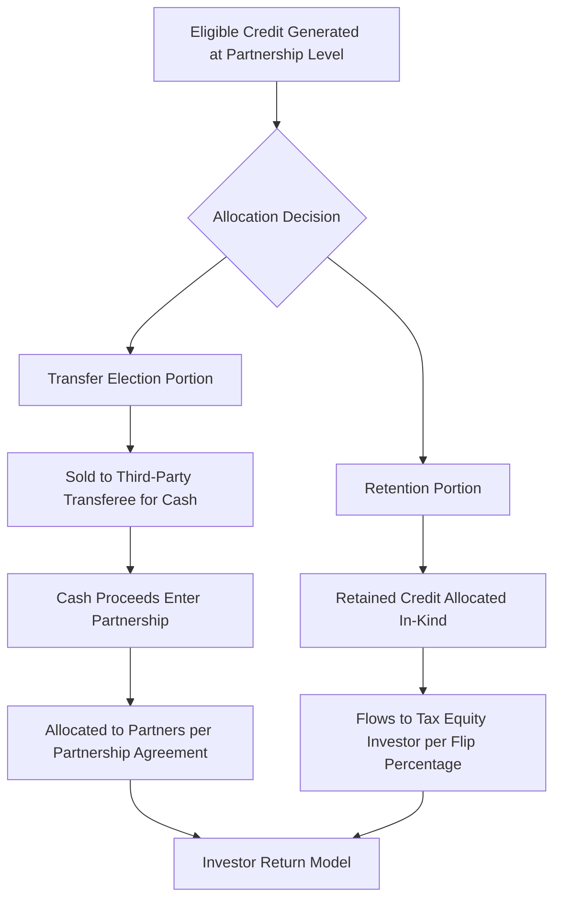

## Allocating Credits Between Sale and Partnership Retention

### Overview

Allocating Credits Between Sale and Partnership Retention refers to the structuring decisions and mechanical rules governing how a partnership that owns eligible energy credit property divides its tax credits between (a) credits sold for cash under an IRC §6418 transfer election and (b) credits retained and allocated in-kind to partners (typically the tax equity investor) under standard subchapter K rules. This is the core negotiation point in any hybrid flip/transfer deal, since the split determines each party's return profile, risk exposure, and the modeling approach used for the deal.

### Legal Framework Governing the Allocation Decision

**Key Points**

- The transfer election under §6418 must be made at the partnership level for partnership-owned eligible property, since the partnership — not the individual partners — is the taxpayer that directly owns the credit property and computes the credit under Treas. Reg. §1.6418-2(a).
- The *amount* of credit transferred versus retained is not fixed by statute; it is a **contractual and economic decision** embedded in the partnership agreement, subject to the general partnership allocation rules of §704(b) and the specific transfer mechanics of §6418.
- Treas. Reg. §1.6418-2(c) permits an "eligible taxpayer" (here, the partnership) to transfer "any portion of an eligible credit" it determines, meaning partial transfers are explicitly authorized — the partnership can sell 10%, 50%, or 100% of a given credit, or even make separate elections across different eligible credit properties within the same project.
- Because the transferred credit is excluded from the partnership's own credit pool once sold, the retained (unsold) portion is what continues to flow through the ordinary §704(b)/§704(c) allocation and capital account mechanics used in a standard partnership flip.

### The Allocation Decision Tree

### Drivers of the Sale vs. Retention Split

**Key Points**

- **Investor liquidity preference**: Some tax equity investors prefer cash-now proceeds from a transfer over waiting to realize credit value against their own tax liability; others prefer direct credit ownership because it may align better with their own tax planning (e.g., managing their effective tax rate or coordinating with other credit positions).
- **Discount pricing in the transfer market**: Selling credits typically nets less than 100 cents on the dollar (recent market observations generally cluster in the low-to-high 90s cents per dollar depending on credit type, buyer diligence requirements, and whether the transaction is insurance-wrapped). Retaining credit in-kind avoids this discount but requires an investor with sufficient tax appetite and risk tolerance to hold the credit directly.
- **Recapture risk allocation**: Because recapture risk generally shifts to the transferee under §6418(g)(3) for sold credits, sponsors and investors may prefer to sell the portion of credit exposed to higher recapture risk (e.g., property more likely to change use or ownership) and retain the lower-risk portion in-kind.
- **Basis and depreciation interplay**: Under §50(c), a partnership must reduce its depreciable basis by 50% of the ITC claimed (or the full amount for credits determined without regard to transfer treatment under specific rules), regardless of whether the credit is later sold or retained — meaning the basis reduction mechanics must be modeled consistently regardless of the split, since basis reduction is tied to credit *determination*, not the transfer decision itself.
- **Registration and diligence cost**: Each eligible credit property transferred requires separate IRS pre-filing registration under §6418(g)(1); sponsors sometimes limit the number of discrete transfer transactions to reduce registration and diligence overhead, favoring larger retained blocks handled through the simpler in-kind partnership allocation.

### Modeling the Split: Waterfall Mechanics

**Example**

A wind project generates a PTC credit stream with a 10-year value of $40 million (undiscounted). The sponsor and tax equity investor negotiate:

- 40% of annual PTC value transferred for cash at a 94-cent price, generating approximately $15.04 million in transfer proceeds over the credit period.
- 60% of annual PTC value ($24 million) retained and allocated 99% to the tax equity investor pre-flip.
- Transfer proceeds are allocated 90% to the investor / 10% to the sponsor under the partnership agreement, reflecting the investor's yield target.

The investor's blended return draws from: retained PTC (99% × $24M), its 90% share of transfer proceeds (90% × $15.04M), depreciation (99% pre-flip), and a minority share of operating cash flow.

$$V_{investor} = (0.99 \times PTC_{retained}) + (0.90 \times P_{transfer}) + D_{dep} + C_{cf,pre-flip}$$

**Key Points**

- The percentage split can vary by year rather than being static across the credit period — for PTC deals in particular, sponsors sometimes transfer a higher percentage in early years (when cash liquidity needs are greatest during ramp-up) and retain more in later years once operations stabilize.
- [Inference] Structuring the split to vary by year adds material modeling complexity, since HLBV capital account calculations must track the retained-credit allocation separately from the transferred-and-cash portion in each period, rather than treating the credit as a single fungible line item.
- The partnership agreement should explicitly define whether the flip's target IRR calculation includes transfer proceeds as investor "return" for purposes of measuring when the flip date is reached, since ambiguity here is a documented source of post-closing disputes.

### Section 704(b) and Capital Account Considerations

**Key Points**

- Cash proceeds from a transferred credit are generally treated as increasing the partnership's (and thus partners') capital accounts under §6418(f)(1), similar to tax-exempt income, meaning the retained portion of the credit (allocated in-kind) and the transferred portion (received as cash and allocated per the partnership agreement) can have **different capital account effects** that must be reconciled in the partnership's books.
- Because the transferred credit itself does not pass through to any partner as a credit (only the cash does), a partner receiving a disproportionate share of transfer cash relative to its overall economic interest may raise substantial economic effect concerns under §704(b) if not properly documented with corresponding economic risk allocations.
- [Inference] Practitioners generally structure the cash allocation from transfer proceeds to track the same percentage interests used for other partnership items (income, loss, and retained credit) to minimize the risk that the IRS challenges the allocation as lacking substantial economic effect, though the regulations do not mandate identical percentages.

### Practical Negotiation Points

**Key Points**

- **Buyer creditworthiness requirements**: Transferees typically require registration confirmation, insurance, and indemnification before closing, which can delay the "sale" portion of the split relative to the "retention" portion, creating timing mismatches that must be bridged in the partnership's cash management.
- **Single buyer vs. multiple buyers**: A partnership can transfer credit to more than one transferee (splitting a single year's credit among buyers), adding further complexity to the retention/sale allocation architecture.
- **True-up mechanisms**: Because credit amounts can be subject to later adjustment (e.g., cost segregation revisions, IRS audit adjustments), agreements typically include true-up provisions specifying how over- or under-allocations between the sold and retained portions are corrected after the fact.
- **Recapture indemnity flow-through**: Since recapture risk on sold credits sits with the transferee under §6418(g)(3) (absent contrary agreement), but the sponsor typically indemnifies the transferee, the retained-portion recapture risk (borne directly by the tax equity investor under ordinary flip mechanics) creates two distinct recapture risk pools that require separate risk allocation clauses in the partnership and transfer agreements.

### Common Pitfalls

**Key Points**

- Treating the sale/retention split as a one-time, deal-closing decision rather than a mechanism that may need to flex annually based on the partnership's evolving cash needs and the prevailing transfer market pricing.
- Failing to align the capital account treatment of transfer cash proceeds with the retained credit's in-kind allocation, creating §704(b) substantial economic effect exposure.
- Not registering each eligible credit property separately before finalizing which portion will be sold, resulting in transfer election delays that disrupt the negotiated cash flow schedule.
- Assuming discount pricing in the transfer market is static; [Unverified] actual per-dollar pricing for transferred credits fluctuates with buyer demand, credit type, and macroeconomic conditions, and should be confirmed against current market data at the time of structuring rather than assumed from prior deals.

**Next Topics**

- Section 704(b) Substantial Economic Effect in Hybrid Credit Structures
- Transfer Market Pricing Dynamics and Credit Discount Rates
- Multi-Year PTC Transfer Elections and Annual True-Up Mechanics
- Recapture Indemnification Drafting in Transfer Agreements
- Section 50(c) Basis Reduction Interaction with Transferred Credits
- Structuring Multiple Transferee Buyers for a Single Credit Property