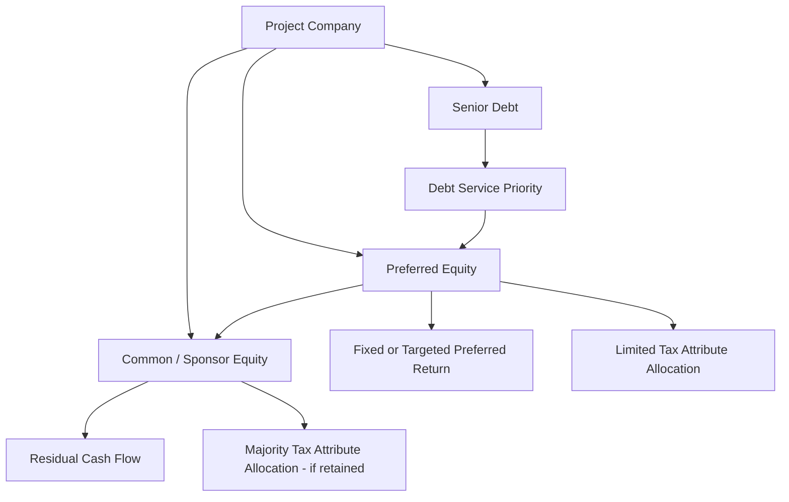

## Preferred Equity as an Alternative to Traditional Flip Partnerships

### Overview

Preferred Equity structures offer an alternative capital-raising mechanism to the traditional partnership flip for monetizing tax attributes (ITC, PTC, depreciation) generated by renewable energy or other credit-eligible projects. Rather than admitting a tax equity investor as a partner with a shifting profit/loss allocation that "flips" at a target date, a preferred equity structure treats the investor's capital as a preferred return instrument — economically closer to a fixed-income security layered inside (or alongside) the partnership — while still permitting the investor to receive an allocation of tax attributes sufficient to achieve its target yield.

### Structural Distinction from Partnership Flips

**Key Points**

- In a **traditional partnership flip**, the tax equity investor typically holds 99% of income, loss, and tax credit allocations pre-flip, with allocations shifting sharply (e.g., to 5%) once the investor achieves a target IRR, followed by continued nominal residual interest.
- In a **preferred equity structure**, the investor's return is defined predominantly as a stated preferred rate of return (e.g., a fixed or floating percentage) on its invested capital, paid through a priority distribution waterfall, with tax attribute allocations sized to support that yield rather than driving the return itself.
- Preferred equity investors generally receive a smaller allocation percentage of tax credits and depreciation than a traditional flip investor, since a portion of their return comes from cash preferred distributions rather than tax benefit value.
- [Inference] This structural difference tends to make preferred equity more attractive to investors with limited tax appetite (e.g., insurance companies focused on yield rather than large tax shelter capacity) or to sponsors seeking a "cleaner" balance sheet treatment that resembles debt more than a true partnership flip.

### Where Preferred Equity Sits in the Capital Stack

### Common Deployment Models

**Key Points**

- **Back-leverage preferred equity**: Sits alongside or below a traditional tax equity flip partnership, providing additional sponsor-side capital without diluting the tax equity investor's allocation, typically secured by the sponsor's residual/common interest in the partnership.
- **Sole monetization vehicle preferred equity**: Used in combination with a §6418 credit transfer (see Combined Flip and Transfer Structure) — the credit is sold for cash, and a preferred equity investor is brought in purely for the depreciation and cash flow benefit, receiving a fixed coupon-like return rather than participating in a flip.
- **Hybrid preferred/common structures**: The investor holds a preferred interest for a defined period (receiving priority distributions and a defined return), which can convert to or coexist with a smaller common interest post-target-return, blending features of both flip and preferred models.
- **Portfolio-level preferred equity**: Rather than being deployed at a single project, preferred equity can be structured at a holding company level across multiple projects, diversifying the investor's risk relative to a single-asset flip.

### Tax Treatment Considerations

**Key Points**

- For the arrangement to support the intended tax allocations, the preferred equity holder generally must be treated as a genuine partner for tax purposes (not simply a creditor), which requires attention to the multi-factor "debt vs. equity" analysis under case law and IRS guidance (e.g., meaningful upside/downside exposure, no unconditional promise to repay, non-fixed maturity features).
- If a preferred equity interest is recharacterized as debt by the IRS, the intended tax credit and depreciation allocations to that holder could be disallowed, since a lender cannot be allocated a partnership's tax attributes — this recharacterization risk is a central diligence focus in preferred equity deals.
- The partnership must ensure preferred equity allocations satisfy §704(b) substantial economic effect requirements notwithstanding the debt-like priority return, typically through carefully drafted liquidation preferences, deficit restoration obligations (or lack thereof), and capital account maintenance provisions.
- [Inference] Because preferred equity structures are more likely to be scrutinized for debt-equity characterization than traditional flip partnerships (which have a long history of IRS guidance, notably Rev. Proc. 2007-65 for wind and its successors), sponsors often build in more robust equity-like features (e.g., meaningful loss exposure, no fixed repayment date) specifically to withstand recharacterization challenges.

### Preferred Return Mechanics

**Example**

A solar project raises $20 million in preferred equity at a targeted 7% annual preferred return, senior to common/sponsor distributions but subordinate to senior debt service. The preferred holder also receives 20% of ITC and depreciation allocations (versus the 99% typical in a traditional flip) because a larger share of its return is delivered through the fixed preferred distribution rather than tax benefit.

$$Return_{pref} = (r_{pref} \times Capital_{invested}) + (\gamma \times ITC) + (\gamma \times D_{dep})$$

Where $r_{pref}$ is the stated preferred rate, and $\gamma$ is the (typically smaller) allocation percentage applied to tax credit and depreciation relative to a traditional flip investor.

**Key Points**

- Because the preferred return is often targeted rather than guaranteed (to preserve equity characterization), the actual realized return can vary if project cash flow is insufficient to fully service the preferred distribution in a given period, with unpaid amounts typically accruing (with or without compounding) to be paid in later periods.
- Some preferred equity structures include a "step-up" or "true-up" at exit (e.g., refinancing or sale) to ensure the investor achieves its targeted return even if periodic distributions fell short — this feature must be carefully documented to avoid characterization as a disguised guaranteed debt repayment.

### Comparison: Preferred Equity vs. Traditional Flip

| Feature | Traditional Partnership Flip | Preferred Equity |
| --- | --- | --- |
| Primary return driver | Tax credit + depreciation allocation | Fixed/targeted cash preferred return |
| Typical pre-flip tax allocation | ~99% to investor | Smaller allocation (varies, often 5–30%) |
| Return profile | Variable, tax-benefit-driven | Debt-like, more predictable cash coupon |
| Investor tax appetite needed | High | Lower |
| Recharacterization risk focus | Well-established (partnership flip guidance) | Higher scrutiny (debt vs. equity analysis) |
| Typical investor type | Banks, insurers with large tax capacity | Insurers, funds seeking yield-like returns |

### Interaction with Transferability (§6418)

**Key Points**

- Preferred equity has become increasingly attractive alongside §6418 transferability because sponsors can sell the ITC/PTC for cash and use a preferred equity investor solely to monetize depreciation and cash flow — eliminating the need for a large, tax-capacity-constrained flip investor entirely.
- [Inference] This combination can broaden the pool of potential capital providers for a project, since the preferred equity investor no longer needs the tax capacity to absorb a large ITC/PTC allocation, only enough to use the depreciation benefit and prioritize a cash coupon.
- Structuring diligence must still confirm that the preferred equity holder receives a sufficient, properly allocated share of depreciation (and any residual retained credit) to preserve genuine partner tax treatment.

### Common Pitfalls

**Key Points**

- Structuring the preferred return with features too closely resembling guaranteed debt repayment (fixed maturity, unconditional principal return, minimal loss exposure), which risks IRS recharacterization as debt and disallowance of tax attribute allocations.
- Under-allocating tax benefits relative to the preferred holder's economic risk, creating a mismatch that could fail the substantial economic effect test under §704(b).
- Assuming preferred equity automatically reduces overall cost of capital; [Unverified] actual blended cost of capital depends on the specific preferred rate negotiated, market conditions, and the residual value retained by the sponsor, and should be evaluated deal-by-deal rather than assumed favorable.
- Failing to coordinate the preferred equity documentation with any simultaneous §6418 transfer election, particularly around registration timing and cash flow sequencing between transfer proceeds and preferred distribution priority.

**Next Topics**

- Debt vs. Equity Characterization Tests for Preferred Tax Equity
- Section 704(b) Substantial Economic Effect in Preferred Structures
- Back-Leverage Preferred Equity Design and Sponsor Residual Protection
- Portfolio-Level Preferred Equity Across Multi-Project Holding Companies
- Preferred Equity Combined with Section 6418 Transfer Elections
- Historical IRS Safe Harbors for Partnership Flip vs. Emerging Preferred Equity Guidance