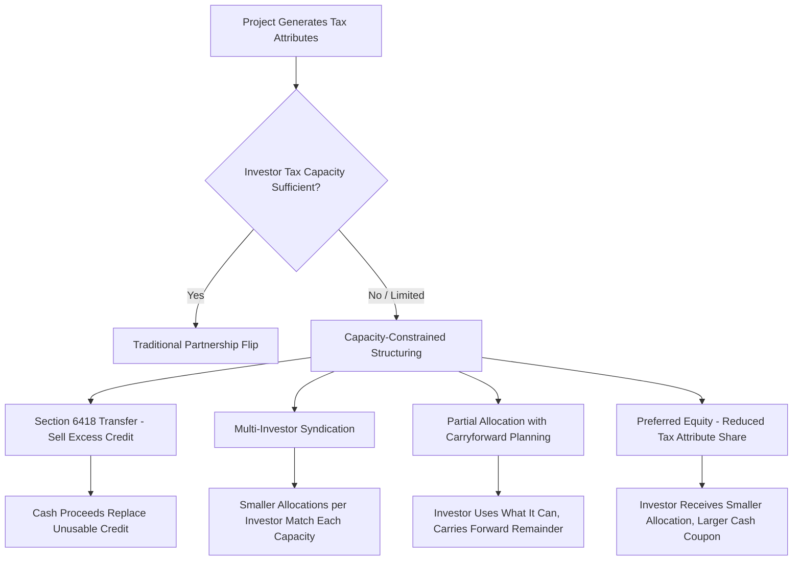

## Structuring Around Tax Capacity Constraints

### Overview

Structuring Around Tax Capacity Constraints refers to the set of techniques sponsors and investors use to monetize tax attributes (ITC, PTC, depreciation) generated by an energy project when the available or willing tax equity investor base has insufficient taxable income, passive activity limitations, or other capacity restrictions to absorb the full attribute stack. Tax capacity constraints have historically limited the tax equity market to a small pool of large financial institutions; the strategies in this topic address how to bridge that gap using transferability, structural allocation techniques, and investor diversification.

### The Core Constraint

**Key Points**

- A tax equity investor can only use tax credits and losses to the extent it has sufficient tax liability (for credits) or sufficient passive/active income of the right character (for losses, subject to §469 passive activity loss limitations for non-corporate investors and general offset rules for corporate investors).
- Traditional tax equity investors (large banks, insurers) have historically dominated the market precisely because they have large, predictable tax liabilities capable of absorbing significant ITC/PTC and depreciation allocations from a single project or portfolio.
- Smaller or newer entrants to the tax credit market — regional banks, corporates with variable earnings, insurance companies with narrower risk appetites — often have tax capacity that is present but limited, fluctuating, or uncertain year to year, creating a mismatch between project-level credit generation and investor absorption capacity.
- [Inference] This capacity mismatch, more than credit pricing alone, has historically been a binding constraint on the overall size of the tax equity market relative to the volume of eligible renewable energy investment, motivating both the IRA's transferability provisions and various structural workarounds developed by practitioners.

### Structuring Techniques to Address Capacity Constraints

### Section 6418 Transferability as the Primary Modern Solution

**Key Points**

- Direct credit transfer under §6418 is the most significant structural tool introduced to address capacity constraints, since it allows a project to sell credits for cash to *any* taxpayer with sufficient liability, rather than requiring the equity investor itself to have capacity — this decouples "who owns the project" from "who has tax capacity."
- A sponsor can now pair a tax equity investor whose capacity only covers depreciation (which passes through the traditional partnership structure) with an entirely separate transfer-market buyer whose sole role is absorbing the credit, expanding the effective universe of usable capital.
- Because transferability applies per eligible credit property, a single project's credits can even be split among multiple transferee buyers, each purchasing only the portion matching its own available tax capacity for that year.
- [Inference] This flexibility means the "capacity constraint" that used to be a single binary hurdle at the investor level has become a divisible problem — sponsors can now match project size to a combination of smaller capacity pools rather than needing one investor with enough capacity for the entire deal.

### Carryforward and Carryback Planning

**Key Points**

- When an investor's tax capacity is insufficient in the year a credit or loss is generated, unused general business credits (including ITC/PTC, as components of the general business credit under §38) can generally be carried back 1 year and carried forward up to 20 years under §39, though the value of a carried credit is diminished by the time value of money and the risk that future capacity remains uncertain.
- [Inference] Because carryforward defers monetization, this is typically viewed as a secondary or fallback planning tool rather than a primary structuring strategy — investors and sponsors generally prefer transfer or syndication approaches that produce more immediate value, reserving carryforward planning for credits that cannot otherwise be transferred or absorbed.
- Passive activity loss limitations under §469 similarly restrict how quickly a non-corporate or closely-held C corporation investor can use allocated losses; unused passive losses carry forward indefinitely but only become usable against future passive income or upon disposition of the interest, again pushing structuring toward transfer solutions where available.

### Multi-Investor Syndication

**Key Points**

- Rather than seeking a single tax equity investor sized to a project's full credit and depreciation output, sponsors can syndicate the deal among multiple smaller investors, each taking an allocation matched to its own available capacity.
- This approach increases transaction complexity (multiple partnership agreements or a single partnership with multiple tax equity members, each requiring separate diligence and negotiated terms) but broadens the pool of eligible capital providers beyond the largest institutions.
- [Inference] Syndication has become more administratively feasible as standardized diligence practices and market-standard documentation for partnership flips have matured, though it still generally carries higher transaction costs per dollar raised than a single-investor deal, which can make it more attractive for larger projects where the fixed diligence cost is amortized over a bigger capital raise.

### Portfolio and Platform-Level Structuring

**Key Points**

- Sponsors with multiple projects can aggregate them into a single portfolio-level tax equity or preferred equity vehicle, allowing an investor with a defined, predictable amount of annual tax capacity to commit to a program that generates a steady, appropriately-sized stream of attributes over time rather than one large lumpy allocation from a single project.
- This can smooth the capacity-matching problem: instead of a single project overwhelming an investor's capacity in one tax year, a portfolio structure can be sized so that annual credit generation across the portfolio consistently fits within the investor's known annual capacity.
- Platform-level deals also allow the sponsor to bring in different capital sources for different projects within the same platform, using transfer sales for some projects and traditional flip or preferred equity for others, based on which structure best matches available capacity at the time each project reaches commercial operation.

### Corporate Investor Considerations

**Key Points**

- Corporate tax equity investors must evaluate not just current-year taxable income but also alternative minimum tax considerations, the corporate AMT under §55 (as modified by the IRA for applicable corporations), and any interaction with other credit positions the corporation holds, since the general business credit under §38 is subject to overall limitation rules that cap the amount of credit usable against tax liability in a given year.
- [Inference] The corporate AMT modifications introduced by the IRA added a layer of complexity to capacity planning for large corporate investors, since AMT liability calculations can affect how much of a transferred or allocated credit can actually be used to reduce net tax owed in a given year, though the precise interaction depends on each investor's specific tax profile and should be modeled with current guidance rather than assumed.
- Sponsors structuring around a specific investor's capacity should request forward-looking capacity estimates (subject to confidentiality) to size allocations appropriately, since actual usable capacity can differ materially from a corporation's headline taxable income due to existing credit carryforwards, NOLs, or other offsetting items.

### Practical Diligence Checklist

**Key Points**

- Confirm the investor's projected tax liability and existing credit/NOL carryforward position for the years in which allocations or transferred credits would be usable.
- Model the interaction between any retained (in-kind) credit allocation and the investor's passive activity or general business credit limitations before finalizing the allocation split described in "Allocating Credits Between Sale and Partnership Retention."
- Evaluate whether a partial transfer, full transfer, syndication, or preferred equity approach (or some combination) best matches the actual, verified capacity of available capital sources for the specific tax years the project will generate attributes.
- Build sensitivity scenarios for capacity shortfalls (e.g., an investor's income dropping unexpectedly) and define contractual remedies (e.g., true-up mechanisms, ability to transfer previously-retained credit in a later year if still within registration and filing deadlines).

### Common Pitfalls

**Key Points**

- Assuming an investor's headline taxable income directly equals usable tax capacity without accounting for AMT, existing carryforwards, or general business credit limitation rules.
- Over-relying on carryforward as a primary monetization strategy, which defers and discounts value rather than solving the capacity constraint in the year attributes are generated.
- Structuring a single-investor deal sized to a project's full attribute output without confirming the investor's capacity is stable across all years the credit or depreciation will be generated, particularly for multi-year PTC projects.
- Failing to build flexibility into partnership and transfer documentation to allow a shift in the retained/transferred split in later years if an investor's capacity changes, since [Unverified] rigid single-point-in-time allocations can leave value on the table or force costly renegotiation if capacity assumptions prove inaccurate.

**Next Topics**

- Section 469 Passive Activity Loss Rules for Tax Equity Investors
- Corporate Alternative Minimum Tax Interaction with Transferred Credits
- General Business Credit Limitation and Carryforward Mechanics Under Section 38/39
- Multi-Investor Syndication Documentation and Diligence Standardization
- Portfolio-Level Tax Equity and Preferred Equity Platform Design
- Forward Capacity Forecasting Techniques for Corporate Tax Equity Investors