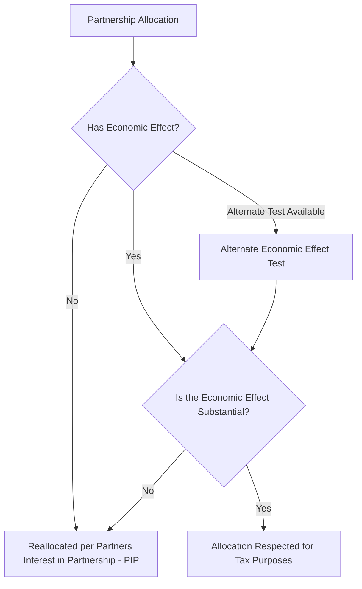

## Substantial Economic Effect Rules Under Section 704(b)

### Overview

Substantial Economic Effect (SEE) rules under IRC §704(b) and its accompanying Treasury regulations govern when a partnership's allocations of income, gain, loss, deduction, or credit among partners will be respected for federal tax purposes, as opposed to being reallocated by the IRS according to each partner's overall interest in the partnership. This body of rules is foundational to every tax equity flip, preferred equity, and hybrid transfer structure discussed elsewhere in this syllabus, since it determines whether the negotiated allocation percentages (99%/1%, flip splits, preferred returns) will actually be honored for tax purposes.

### Statutory Framework

**Key Points**

- §704(a) generally permits a partnership to allocate income, gain, loss, deduction, and credit among partners as specified in the partnership agreement.
- §704(b) overrides this general rule where an allocation either (i) is not specified in the partnership agreement, or (ii) lacks "substantial economic effect" — in either case, the allocation is instead determined according to the partners' interests in the partnership (PIP), a facts-and-circumstances standard the regulations are specifically designed to help taxpayers avoid having to rely on.
- Treas. Reg. §1.704-1(b) provides the operative framework, establishing both a general safe harbor test for "economic effect" and separate provisions addressing "substantiality," "alternate economic effect" tests, and special rules for specific allocation types (e.g., nonrecourse deductions, tax credits).
- The regulations distinguish between allocations that have economic effect *and* are substantial (fully respected), allocations with economic effect that fails the substantiality test (reallocated), and allocations lacking economic effect altogether (also reallocated according to PIP).

### The Two-Part Test: Economic Effect + Substantiality

### The General Test for Economic Effect

**Key Points**

- Under Treas. Reg. §1.704-1(b)(2)(ii)(b), an allocation has economic effect only if, throughout the full term of the partnership, the partnership agreement satisfies three requirements: (1) capital accounts are maintained in accordance with the regulatory rules, (2) liquidating distributions are required to be made in accordance with positive capital account balances, and (3) any partner with a deficit capital account balance following a liquidation must be unconditionally obligated to restore that deficit (a Deficit Restoration Obligation, or "DRO").
- Capital account maintenance rules require that each partner's capital account be increased by contributions and allocated income/gain, and decreased by distributions and allocated loss/deduction, tracked consistently with the regulatory requirements (generally following book, not tax, value for contributed property with a §704(c) difference).
- Because most tax equity investors are unwilling to accept an unconditional obligation to restore a capital account deficit (which would expose them to unlimited liability beyond their invested capital), most partnership flip structures instead rely on the **alternate economic effect test** rather than the general test.

### The Alternate Economic Effect Test

**Key Points**

- Treas. Reg. §1.704-1(b)(2)(ii)(d) permits an allocation to have economic effect, even without a full DRO, if the partnership agreement contains a **Qualified Income Offset (QIO)** provision and either limits loss allocations to the extent they would create a capital account deficit, or otherwise complies with the alternate test's requirements.
- A QIO provision requires that if a partner unexpectedly receives an adjustment, allocation, or distribution that creates or increases a deficit capital account balance beyond what is permitted, that partner will be allocated income and gain quickly enough to eliminate the deficit as promptly as possible.
- The alternate test is the dominant mechanism used in tax equity partnership flip structures because it allows investors to be allocated significant losses (e.g., accelerated depreciation) without a personal DRO, provided the QIO and related capital account limitation provisions are properly drafted and administered.
- Combined with the **minimum gain chargeback** requirements under Treas. Reg. §1.704-2 (for nonrecourse deductions), the alternate test framework allows partnerships financed partly with nonrecourse debt to allocate losses attributable to that debt to investors up to the amount of "partnership minimum gain," with a chargeback mechanism ensuring allocations are reversed if minimum gain decreases.

### The Substantiality Requirement

**Key Points**

- Even if an allocation has economic effect (under either the general or alternate test), it must also be "substantial" under Treas. Reg. §1.704-1(b)(2)(iii) — meaning there must be a reasonable possibility that the allocation will affect substantially the dollar amounts received by the partners from the partnership, independent of tax consequences.
- The regulations identify specific patterns presumed to lack substantiality: **"shifting" allocations** (where the overall tax liability of the partners for the year in question is reduced without any corresponding shift in economic consequences) and **"transitory" allocations** (allocations expected to be largely offset by other allocations in later years, again without meaningful long-term economic impact).
- A special "after-tax" substantiality test applies where an allocation has the "strong likelihood" of reducing the partners' aggregate tax liability without substantially affecting their shares of partnership economic items — this is a facts-and-circumstances inquiry frequently relevant to tax-benefit-heavy structures like renewable energy flips, where allocations are specifically designed around tax benefit optimization.
- [Inference] Because renewable energy partnership flips are inherently structured to maximize allocation of tax benefits (depreciation, credits) to the party best able to use them, careful drafting and adherence to established market structuring conventions (e.g., those historically informed by IRS guidance such as Rev. Proc. 2007-65 for wind, even though formally obsoleted, and its underlying principles) is used to support the position that allocations reflect genuine shifts in economic entitlement rather than pure tax-reduction shifting.

### Nonrecourse Deductions and Minimum Gain Chargeback

**Key Points**

- Deductions attributable to nonrecourse liabilities (common in leveraged renewable energy partnerships) cannot have "economic effect" in the traditional sense, since no partner bears the economic risk of loss for nonrecourse debt by definition — Treas. Reg. §1.704-2 provides a specialized safe harbor for these allocations.
- Under this safe harbor, nonrecourse deductions are deemed to have economic effect if allocated in a manner reasonably consistent with allocations of some other significant partnership item having substantial economic effect, and the partnership agreement contains both a minimum gain chargeback provision and satisfies other technical requirements (including proper capital account maintenance and a QIO).
- "Partnership minimum gain" is calculated as the amount of gain the partnership would recognize if it disposed of property subject to nonrecourse debt for no consideration other than satisfaction of that debt; increases and decreases in minimum gain drive the chargeback mechanics that keep loss allocations tethered to the amount of nonrecourse debt outstanding.
- Partner nonrecourse debt (loans from a partner or related party) is subject to a parallel but distinct set of rules under Treas. Reg. §1.704-2(i), requiring allocation of "partner nonrecourse deductions" to the partner bearing the economic risk of loss for that specific debt.

### Section 704(c) Interaction

**Key Points**

- Where a partner contributes property with a fair market value that differs from its tax basis, §704(c) requires that built-in gain or loss be allocated to the contributing partner, using one of several permitted methods (traditional method, traditional method with curative allocations, or remedial method) to prevent tax-basis disparities from shifting economic value between partners inappropriately.
- This is particularly relevant in tax equity structures where a sponsor contributes a developed project (with built-in value reflecting development activity) to the partnership, and the tax equity investor contributes cash — the §704(c) allocation ensures the pre-contribction built-in gain associated with the sponsor's contributed property is allocated back to the sponsor rather than diluted across all partners.

### Practical Application in Tax Equity Structures

**Key Points**

- Partnership flip agreements are drafted with extensive capital account maintenance provisions, QIO language, minimum gain chargeback provisions, and (often) a "stop-loss" mechanism limiting loss allocations to available capital account balances, all designed to satisfy the alternate economic effect test rather than requiring investors to accept a DRO.
- The "partners' interest in the partnership" (PIP) standard — the fallback if SEE is not satisfied — is intentionally vague and fact-intensive, which is precisely why practitioners invest heavily in satisfying the SEE safe harbors rather than relying on PIP to validate a negotiated allocation.
- Given the complexity and the significant tax consequences of a failed SEE analysis (reallocation of credits/losses potentially years after the return was filed, with associated interest and penalties), most sophisticated tax equity and preferred equity deals obtain a tax opinion addressing the SEE analysis as a condition to closing.
- [Inference] Because SEE analysis is highly dependent on the specific facts of capital contributions, allocation percentages, and the interaction of debt (recourse vs. nonrecourse) with capital accounts, no single "template" partnership agreement can be assumed to satisfy SEE for a new deal without being reviewed against that specific transaction's facts.

### Common Pitfalls

**Key Points**

- Drafting a QIO provision without also including the required limitation on loss allocations that would create an impermissible capital account deficit, undermining the alternate economic effect test's requirements.
- Overlooking the minimum gain chargeback requirement when a partnership uses nonrecourse debt, which can cause loss allocations attributable to that debt to fail to have economic effect.
- Assuming that because an allocation has economic effect, it automatically satisfies the separate substantiality requirement — the two are independent tests, and an allocation can have economic effect but still fail as a "shifting" or "transitory" allocation.
- Failing to properly track and true-up capital accounts on an ongoing basis (not just at drafting), since actual satisfaction of the general or alternate economic effect test depends on capital accounts being maintained in accordance with the regulations throughout the life of the partnership, not merely on the partnership agreement's language.

**Next Topics**

- Capital Account Maintenance Rules Under Treasury Regulation 1.704-1(b)(2)(iv)
- Minimum Gain Chargeback Mechanics for Nonrecourse Deductions
- Section 704(c) Allocation Methods: Traditional, Curative, and Remedial
- Deficit Restoration Obligations and Investor Risk Exposure
- Partners' Interest in the Partnership (PIP) as the Regulatory Fallback Standard
- Tax Opinion Practice for Substantial Economic Effect in Tax Equity Deals