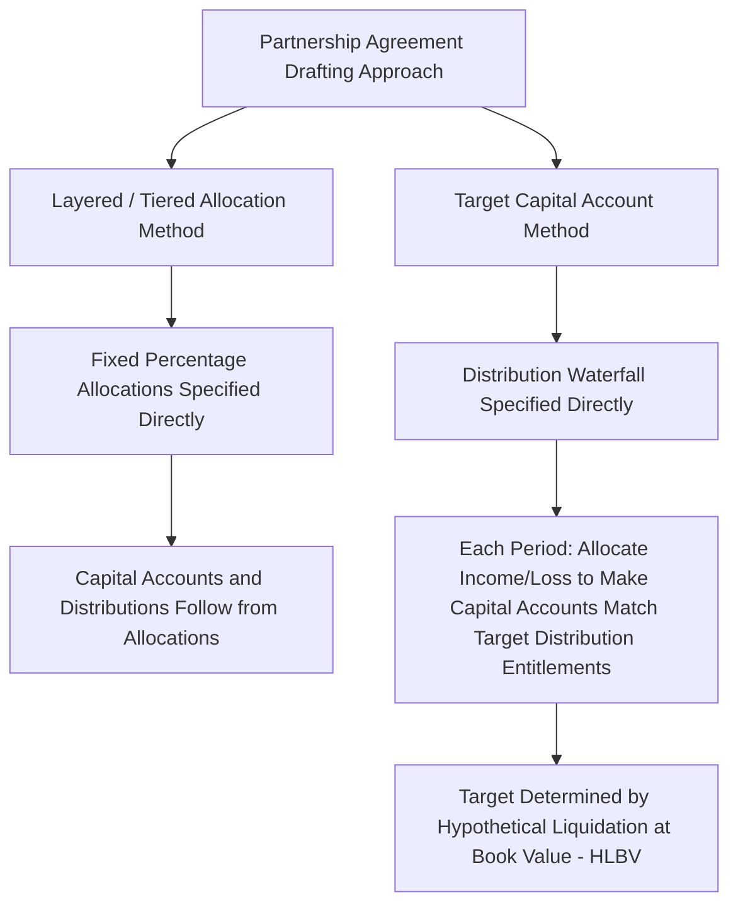

## Target Capital Account Allocation Methods

### Overview

Target Capital Account Allocation Methods refer to a drafting technique used in partnership agreements — including many tax equity flip and preferred equity structures — in which allocations of income, gain, loss, and deduction are determined by first specifying the *distributions* each partner is entitled to receive under the agreement's economic waterfall, then "backing into" the tax allocations each period needed to cause each partner's capital account to equal (or "target") the amount that partner would be entitled to receive if the partnership liquidated at that time. This approach contrasts with the more traditional "layered" or "tiered" allocation method, which specifies fixed percentage allocations directly (e.g., 99%/1%, flipping to 5%/95%) and lets capital accounts and distributions follow from those fixed allocation formulas.

### The Two Competing Drafting Approaches

**Key Points**

- Under the **layered/tiered method**, the partnership agreement specifies fixed percentage splits for income, gain, loss, deduction, and credit (e.g., 99% investor/1% sponsor pre-flip, 5%/95% post-flip), and distributions of cash generally follow parallel percentages or a separately specified waterfall, with capital accounts simply reflecting the cumulative effect of those specified allocations over time.
- Under the **target capital account method**, the partnership agreement instead specifies a detailed distribution waterfall (e.g., return of capital, then a preferred return, then split cash flow), and allocations of income, gain, loss, and deduction for each period are determined by a formula requiring the partnership to allocate items so that each partner's ending capital account equals what that partner would be entitled to receive in a hypothetical liquidation applying the stated distribution waterfall as of that date.
- The target method is explicitly contemplated as an acceptable approach to satisfying economic effect under Treas. Reg. §1.704-1(b)(2)(ii)(b), often described in practice as relying on the general "economic effect equivalence" test, provided the capital accounts are maintained properly and liquidating distributions in fact follow positive capital account balances.
- [Inference] The target method has become increasingly common in tax equity and, especially, preferred equity and hybrid structures because it allows the parties to negotiate and draft directly around the economics they actually care about (the distribution waterfall) rather than needing to reverse-engineer fixed percentage allocations that, in combination with the capital account mechanics, would organically produce the desired distribution outcome.

### Why Target Capital Accounts Are Common in Complex/Hybrid Deals

**Key Points**

- Complex distribution waterfalls — such as those found in preferred equity structures (a stated preferred return, followed by return of capital, followed by a residual split) or hybrid flip/transfer deals (where transfer proceeds, retained credit value, depreciation, and cash flow all interact) — can be difficult to translate into a single set of fixed percentage tax allocations that reliably produce the intended cash distribution result in every scenario.
- The target method effectively delegates that translation to a formula recalculated each period, rather than requiring the drafters to anticipate and pre-specify a percentage allocation scheme robust enough to handle every possible combination of project performance, timing, and cash flow variation.
- [Inference] This flexibility is particularly valuable in deals layering multiple economic features (e.g., a preferred return plus a residual flip, or retained credit allocations alongside sold-credit cash proceeds) because it reduces the risk that an unanticipated scenario causes the fixed percentage allocations to produce capital account balances inconsistent with what the parties actually intended to distribute.
- Preferred equity structures in particular often gravitate toward the target method because the "preferred return" concept is fundamentally a distribution-priority concept, which the target method directly implements, rather than something naturally expressed as a tax allocation percentage.

### Mechanics of the Target Capital Account Formula

**Key Points**

- Each period, the partnership first determines the hypothetical amount each partner would receive if all partnership assets were sold for their book value and the proceeds distributed according to the partnership agreement's specified distribution waterfall (return of capital, preferred return, residual splits, etc.) — this is the partner's "target" capital account balance for that period.
- The partnership then allocates the actual book income, gain, loss, and deduction for the period among the partners in whatever manner is necessary to bring each partner's actual capital account as close as possible to its target balance, subject to certain constraints (e.g., a partner's capital account generally cannot be allocated more loss than would reduce it below zero without an operative QIO/DRO mechanism, similar to any other §704(b)-compliant structure).
- Because tax allocations under this method are calculated as a "plug" to reach the target rather than being fixed in advance, actual allocation percentages can vary meaningfully from period to period based on the partnership's specific operating results, refinancings, or other events during that period.
- [Inference] This period-by-period recalculation requires more sophisticated modeling and tax return preparation processes than a simple fixed-percentage approach, since the tax allocation for any given year cannot be determined without first computing the full hypothetical liquidation waterfall as of that year, based on updated book values and prior capital account history.

### Comparison of the Two Methods

| Feature | Layered / Tiered Method | Target Capital Account Method |
| --- | --- | --- |
| What's specified directly | Fixed allocation percentages | Distribution waterfall |
| How allocations are determined | Direct percentage application | Calculated "plug" each period to match target |
| Best suited for | Simpler, well-defined flip structures | Complex, multi-tiered, or hybrid economic structures |
| Allocation percentage consistency | Stable percentages (pre/post flip) | Can vary period to period based on results |
| Modeling complexity | Lower (once flip trigger modeled) | Higher (requires full waterfall recalculation each period) |
| Common use case | Traditional single-investor ITC/PTC flips | Preferred equity, multi-tiered hybrid structures |

### Interaction with Section 704(b) Economic Effect

**Key Points**

- The target capital account method must still satisfy the general economic effect requirements — proper capital account maintenance, liquidating distributions following positive capital account balances, and either a DRO or a functioning QIO-based alternate test — the method changes *how the allocation percentage for a given period is determined*, not whether the underlying SEE framework applies.
- Substantiality analysis (shifting and transitory allocation concerns) applies equally to target capital account allocations as to fixed percentage allocations; the fact that an allocation is calculated via a target formula does not exempt it from scrutiny under the substantiality rules discussed in Substantial Economic Effect Rules Under Section 704(b).
- [Inference] Because the target method's allocation percentages are not fixed in the agreement, tax opinions addressing SEE compliance for target capital account structures often need to model multiple illustrative scenarios (rather than a single pre/post-flip percentage pair) to demonstrate that the formula reliably produces allocations with economic effect and substantiality across a reasonable range of outcomes.

### Practical Drafting and Modeling Considerations

**Key Points**

- Target capital account provisions require exceptionally precise drafting of the distribution waterfall itself (return of capital definitions, preferred return compounding conventions, catch-up provisions, residual split percentages), since the entire tax allocation mechanism depends on that waterfall being unambiguous.
- Financial models for target capital account deals must be built to recalculate the hypothetical liquidation waterfall at each period, layering in updated book values (including any book-up/book-down effects discussed in Capital Account Maintenance and Book-Ups), rather than simply applying a static percentage to each period's income or loss.
- [Unverified] Whether a specific deal is better served by the layered/tiered method or the target capital account method depends heavily on deal-specific complexity and the parties' comfort with each approach's tax compliance overhead; market practice varies and should be evaluated against the specific structure's waterfall design rather than assumed to favor one method universally.

### Common Pitfalls

**Key Points**

- Drafting an ambiguous or incomplete distribution waterfall, which directly undermines the target method since the entire allocation mechanism depends on the waterfall being precisely and unambiguously defined.
- Failing to build tax compliance processes capable of recalculating the target allocation each period, leading to inconsistent or delayed tax return preparation in structures using this method.
- Assuming that because the target method is "distribution-driven," it is exempt from substantiality analysis under §704(b) — the substantiality requirement applies regardless of which allocation drafting approach is used.
- Not modeling multiple performance scenarios when using the target method, potentially missing edge cases (e.g., underperformance or early refinancing) where the target formula could produce allocations that fail to have economic effect or substantiality.

**Next Topics**

- Distribution Waterfall Drafting: Preferred Returns, Catch-Ups, and Residual Splits
- Modeling Hypothetical Liquidation Waterfalls for Target Capital Account Structures
- Tax Compliance Processes for Period-by-Period Target Allocation Calculation
- Scenario Testing for Section 704(b) Compliance in Target Capital Account Deals
- Comparing Target Capital Account and Layered Methods for Preferred Equity Structures
- HLBV Accounting Differences Between Layered and Target Capital Account Approaches