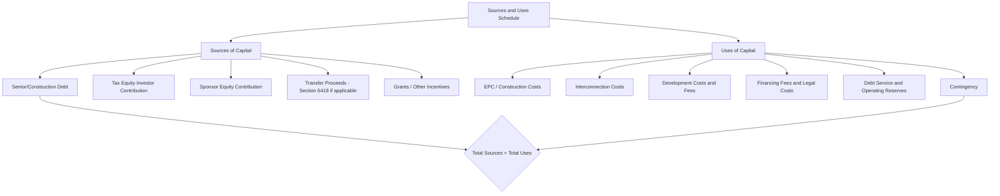

## Building the Sources and Uses Schedule

### Overview

Building the Sources and Uses Schedule refers to the foundational financial modeling exercise that identifies and quantifies every capital source funding a project (debt, tax equity, sponsor equity, transfer proceeds, grants) and every use of that capital (construction costs, financing fees, reserves, developer fees), ensuring the two sides balance precisely. In tax equity transactions, the sources and uses schedule is the first structural artifact built in any financial model, since it establishes the capital stack that every subsequent calculation — partnership allocations, flip timing, HLBV accounting, debt sizing — depends upon.

### Purpose and Placement in the Modeling Workflow

**Key Points**

- The sources and uses schedule is typically the first tab or section constructed in a project finance or tax equity model, because it establishes the total capitalization requirement and confirms all funding sources are sufficient to cover all identified costs before any downstream cash flow, allocation, or return calculations are built.
- It serves as a checkpoint for internal consistency: total sources must equal total uses exactly (to the last dollar), and any imbalance signals either a missing cost item, an unconfirmed funding source, or a modeling error that must be resolved before proceeding.
- The schedule is typically prepared at multiple points in a transaction's lifecycle — an early "estimated" version at financial close (based on projected costs and committed funding), and a final "actual" version at commercial operation date (COD) or "cost certification," once actual construction costs and final funding amounts are known — since the two can diverge meaningfully from initial projections.
- [Inference] Because ITC amount (and its subsequent §50(c) basis reduction) and depreciable basis are directly tied to the project's finalized eligible cost basis, the sources and uses schedule's "uses" side is not merely an internal financing exercise but effectively determines the raw inputs to the entire tax benefit calculation used throughout the rest of the model.

### Structure of the Schedule

### Sources of Capital: Line-Item Detail

**Key Points**

- **Senior/construction debt**: Sized based on projected cash flow (for term debt, typically via a debt service coverage ratio, or DSCR, methodology) or based on a percentage of eligible construction costs (for construction-period bridge debt), often converting from a construction facility to a term facility at COD.
- **Tax equity investor contribution**: The cash amount the tax equity investor commits to fund, typically disbursed in tranches tied to specific milestones (e.g., a portion at financial close, the balance at COD or after cost certification), reflecting the investor's assessment of construction and completion risk.
- **Sponsor equity**: The sponsor's own cash contribution, often sized as the residual amount needed to balance sources and uses after accounting for debt and tax equity, though sponsors may also use back-leverage debt or preferred equity (as discussed in Preferred Equity as an Alternative to Traditional Flip Partnerships) to reduce the amount of pure common equity required.
- **Transfer proceeds (if applicable)**: In hybrid structures involving a §6418 transfer election, anticipated cash proceeds from the credit sale may be included as a funding source, though timing is critical — transfer proceeds are typically not received until after the credit is generated (i.e., post-COD or per the applicable production period for PTC), so early-stage sources and uses schedules must distinguish between construction-period funding needs (which transfer proceeds generally cannot meet) and post-COD capital structure.
- **Grants and other incentives**: Any applicable state or utility incentive payments, rebates, or grants that reduce the net capital required from debt and equity sources.

### Uses of Capital: Line-Item Detail

**Key Points**

- **EPC/construction costs**: The largest use of funds for most renewable projects, covering equipment procurement (e.g., solar modules, wind turbines), balance-of-plant construction, and labor, typically governed by a fixed-price or cost-plus EPC contract.
- **Interconnection costs**: Costs to connect the project to the grid, which can vary significantly based on utility requirements and network upgrade obligations, and are sometimes subject to significant cost escalation risk during the development period.
- **Development costs and fees**: Costs incurred prior to financial close (permitting, land acquisition/lease costs, interconnection studies, legal fees during development) plus any development fee paid to the sponsor or developer, which is itself often a negotiated line item affecting the project's total eligible basis for ITC purposes.
- **Financing fees and legal costs**: Arrangement fees for debt, legal fees for negotiating partnership and financing documents, and any diligence costs (engineering reports, insurance review, appraisals) incurred as part of financial closing.
- **Reserves**: Debt service reserve accounts, operating reserve accounts, and major maintenance reserves, typically sized per lender or tax equity investor requirements as a specified number of months of debt service or operating expense.
- **Contingency**: A reserve for cost overruns during construction, sized as a percentage of hard costs, which both lenders and tax equity investors typically require to protect against completion risk.

### Balancing the Schedule and Its Downstream Effects

**Example**

A 150 MW solar project has total uses of $180 million (comprising $150 million EPC costs, $10 million interconnection, $8 million development fee, $7 million financing/legal fees, and $5 million contingency/reserves). Sources are structured as $70 million construction/term debt, $85 million tax equity investor contribution (sized to align with the investor's target allocation of ITC and depreciation), and $25 million sponsor equity, which together sum to the full $180 million in uses.

**Key Points**

- The size of the tax equity investor's contribution is not arbitrary — it is typically negotiated based on the investor's assessment of the present value of the tax benefits (ITC/depreciation) it will receive, discounted at its required rate of return, meaning the sources and uses schedule and the tax benefit/return model are developed iteratively rather than sequentially.
- [Inference] Because the tax equity contribution amount is effectively a function of the modeled tax benefit value, changes to eligible basis (which affects ITC amount and depreciable basis), the applicable ITC percentage (base rate plus any bonus adders, such as domestic content or energy community adders), or bonus depreciation percentage can all necessitate revisiting and rebalancing the sources and uses schedule even after an initial version has been prepared.
- In hybrid flip/transfer deals, the sources and uses schedule must carefully sequence the timing of transfer proceeds relative to construction funding needs, since transfer proceeds are generally unavailable until credit generation and registration are complete — meaning construction-period funding gaps must be bridged by debt or equity even if a transfer sale is planned for the credit once generated.

### Adjustments Between Financial Close and Cost Certification

**Key Points**

- The "estimated" sources and uses schedule prepared at financial close relies on budgeted or contracted costs, which can differ from actual costs incurred during construction due to change orders, delays, or unforeseen site conditions.
- At COD or cost certification, the schedule is trued up to reflect actual costs, which can trigger adjustments to the final ITC amount (since ITC is based on actual eligible basis, not budgeted basis) and, correspondingly, to the tax equity investor's final funding amount if the investment structure includes a true-up mechanism tied to final eligible basis.
- [Inference] Because actual construction costs frequently differ from initial budgets, well-structured tax equity agreements typically include contractual true-up provisions specifying how funding amounts and/or allocation percentages will be adjusted if final eligible basis (and thus final ITC) differs from the amount assumed at financial close, to avoid disputes when the cost certification schedule ultimately doesn't match the financial close estimate.
- Cost certification is also frequently supported by an independent engineer's or accountant's report confirming the project's final eligible basis calculation, which becomes a key diligence deliverable feeding into the finalized sources and uses schedule and the associated tax opinion addressing the ITC amount claimed.

### Common Modeling Conventions

**Key Points**

- Sources and uses schedules are typically presented in a simple two-column format (sources on one side, uses on the other) with each summing to the same total, often accompanied by a percentage-of-total breakdown for each line item to facilitate quick comparison against market benchmarks (e.g., debt as a percentage of total capitalization).
- Many models separate the schedule into distinct construction-period and permanent/term-period versions, since the capital structure (particularly debt) frequently changes structure (e.g., converting from a construction loan to a term loan) at or after COD.
- [Unverified] Typical debt-to-total-capitalization ratios and tax equity contribution percentages vary substantially by technology, project size, contract structure (e.g., presence of a long-term power purchase agreement), and prevailing capital market conditions; specific benchmark percentages should be confirmed against current market data rather than assumed static across market cycles.

### Common Pitfalls

**Key Points**

- Failing to distinguish between eligible and ineligible costs for ITC basis purposes when populating the "uses" side, which can lead to an incorrect calculation of the credit amount and, downstream, an incorrect tax equity contribution sizing.
- Building the schedule as a static, one-time exercise rather than iteratively updating it as tax benefit modeling assumptions (bonus adders, bonus depreciation percentages, cost certification results) evolve throughout the transaction.
- Neglecting to model the timing mismatch between construction funding needs and the availability of transfer proceeds in hybrid flip/transfer structures, potentially creating an unfunded construction-period gap if not addressed with bridge debt or additional equity.
- Omitting a well-sized contingency or reserve line item, which can force a disruptive re-negotiation of the capital stack mid-construction if actual costs exceed the budgeted uses.

**Next Topics**

- Eligible Basis Determination for Investment Tax Credit Calculation
- Debt Sizing Methodologies: DSCR-Based vs. Percentage-of-Cost Approaches
- Cost Certification Process and Independent Engineer Reports
- True-Up Mechanisms for Tax Equity Contributions Tied to Final Eligible Basis
- Construction-to-Term Debt Conversion Mechanics
- Timing Coordination Between Section 6418 Transfer Proceeds and Construction Funding