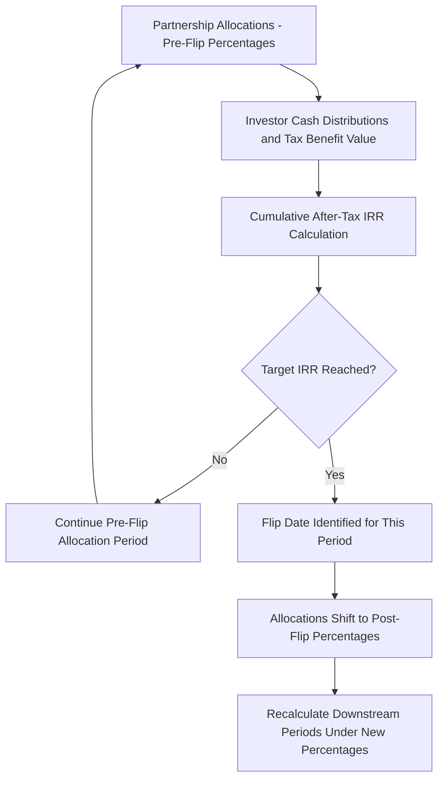

## Modeling the Flip Date and Investor Return

### Overview

Modeling the Flip Date and Investor Return covers the financial modeling techniques used to project when a tax equity investor achieves its negotiated target return in a partnership flip structure, and to calculate the resulting internal rate of return (IRR) that defines that flip trigger. This is one of the most technically demanding components of a tax equity model because the flip date and the return calculation are mutually dependent: the allocations that determine the investor's return also depend on knowing when the flip occurs, requiring iterative or circular calculation techniques.

### Defining the Flip Trigger

**Key Points**

- The "flip date" is the point at which the tax equity investor's cumulative after-tax return (incorporating both cash distributions received and the value of allocated tax benefits — ITC/PTC and depreciation) reaches a pre-negotiated target, most commonly expressed as a target after-tax IRR (e.g., 6-8%, though actual figures are deal-specific and vary with market conditions).
- Once the flip date is reached, the partnership agreement's allocation percentages shift prospectively from the pre-flip split (commonly around 99% investor/1% sponsor) to a smaller residual investor interest (commonly around 5%, though again deal-specific), as discussed in Special Allocations of Credits, Income, and Loss.
- Flip triggers can alternatively be structured around a fixed date (a "fixed flip") rather than a target IRR (a "fixed yield" or "flip on yield" structure); IRR-based triggers are more common in current market practice because they align the flip timing directly with the investor's actual realized return rather than an arbitrary calendar date that may not correspond to the investor's economics if performance deviates from projections.
- [Inference] The choice between fixed-date and yield-based flip triggers affects modeling complexity and risk allocation: a fixed-date flip is simpler to model (no circularity) but shifts performance risk more heavily onto whichever party bears the shortfall or windfall if actual returns diverge from projections at that date, while a yield-based flip more precisely protects the investor's target return at the cost of introducing timing uncertainty for the sponsor.

### The Circularity Problem

**Key Points**

- Because the flip date is defined by reference to the investor's realized IRR, and the investor's realized IRR depends on the allocations it receives (which themselves depend on whether the flip has occurred), a straightforward period-by-period forward calculation cannot directly solve for the flip date without either iteration or a specialized calculation approach.
- Financial models commonly resolve this circularity using one of two general approaches: (1) an iterative/goal-seek calculation, where the model runs multiple passes testing candidate flip dates until the modeled IRR at that date matches the target, or (2) a period-by-period sequential test, where each period is evaluated individually (using pre-flip allocations) to determine whether the cumulative IRR as of that period has reached the target, with the flip deemed to occur in the first period where it does.
- [Inference] The period-by-period sequential test approach is more commonly used in practice than continuous iteration because it more closely mirrors how the actual partnership agreement is typically drafted (testing IRR achievement at each distribution date) and avoids the computational instability that can arise from circular formula references in spreadsheet models, though many practitioners still use spreadsheet iterative calculation settings or dedicated circularity-breaking techniques (e.g., copy-paste-values macros) to manage the underlying circular reference.

### Components of the Investor's IRR Calculation

**Key Points**

- The investor's cash outflows consist of its capital contributions to the partnership, typically funded in tranches (e.g., a portion at financial close, the remainder at COD or upon cost certification), as established in the sources and uses schedule covered in Building the Sources and Uses Schedule.
- The investor's cash inflows/benefits consist of: (1) actual cash distributions received per the partnership agreement's distribution provisions, (2) the value of allocated tax credits (ITC and/or PTC) in the year realized, and (3) the value of allocated depreciation deductions, translated into an after-tax cash-equivalent benefit using the investor's assumed marginal tax rate.
- Depreciation's IRR contribution is calculated as the tax deduction amount multiplied by the investor's tax rate (yielding the tax savings from that deduction), recognized in the period the deduction is allocated — meaning depreciation timing (front-loaded under bonus depreciation and standard MACRS conventions) has an outsized effect on early-period IRR relative to a straight-line assumption.
- In hybrid structures involving a §6418 transfer election (as discussed in The Combined Flip and Transfer Structure), the investor's IRR calculation must be adapted to include its allocated share of transfer cash proceeds rather than (or in addition to) the value of an in-kind credit allocation, requiring the model to track cash-in-lieu-of-credit as a distinct input line from directly-allocated tax credit value.

### Illustrative IRR Build-Up

**Example**

A tax equity investor contributes $85 million total ($50 million at financial close, $35 million at COD) into a solar partnership. It is allocated 99% of a $60 million ITC (recognized in the COD year) and 99% of depreciation over the following 5-6 years under MACRS, together with 20% of operating cash flow pre-flip. Using a 21% assumed marginal tax rate for depreciation benefit calculation, the model computes each period's after-tax cash-equivalent benefit (ITC value + tax savings from depreciation + actual cash distributions), then calculates the cumulative IRR on the investor's net cash position as of each period-end. The model identifies the first period in which this cumulative IRR reaches the negotiated 7.5% target as the flip date.

$$IRR_{target} = IRR\left(-Capital_{t=0}, \sum_{t=1}^{n} \left[ Cash_t + ITC_t + (Dep_t \times \tau) \right] \right)$$

Where $Cash_t$ is the investor's allocated cash distribution in period $t$, $ITC_t$ is the allocated credit value recognized in period $t$, $Dep_t$ is the allocated depreciation deduction, and $\tau$ is the investor's assumed marginal tax rate.

**Key Points**

- Because the ITC is generally recognized as a single lump-sum benefit at COD (subject to the placed-in-service requirements and any applicable recapture period), while the PTC accrues over a 10-year production period, PTC-based flip models tend to have a materially different (typically longer) flip timeline than ITC-based models, all else equal, since the tax benefit is spread over a much longer period rather than front-loaded.
- Sensitivity analysis is a standard component of flip date modeling, since actual project performance (energy production, availability, pricing under any power purchase agreement) directly affects both the operating cash flow component of investor return and, for PTC deals, the credit amount itself — sponsors and investors typically model flip timing under multiple production scenarios (P50, P90, etc.) to understand the range of possible flip dates.

### Interaction with HLBV Accounting

**Key Points**

- While the flip date modeling described here is primarily a tax/cash-based IRR calculation used to determine when the partnership agreement's allocation percentages shift, the tax equity investor separately calculates its GAAP financial statement carrying value using HLBV accounting (as referenced in Capital Account Maintenance and Book-Ups), which is a distinct (though related) calculation based on capital account mechanics rather than IRR achievement.
- [Inference] Because HLBV and the tax-based IRR flip calculation use different mechanics (one based on hypothetical liquidation at book value, the other based on realized cash/tax benefit IRR), a project's flip date for tax allocation purposes and its GAAP equity method "flip" in HLBV reporting are conceptually related but not calculated identically, and practitioners maintain separate (though cross-referencing) models for each purpose.

### Practical Modeling Techniques

**Key Points**

- Most tax equity models are built with a monthly or quarterly time step for cash flow and IRR tracking, even though tax filings occur annually, because monthly granularity provides more precise identification of the exact flip date within a given tax year, which then must be reconciled to the specific allocation conventions the partnership agreement uses for mid-year flip events.
- Models typically include explicit "flip test" rows calculating cumulative IRR at each period-end and flagging the first period where the target is met, often with a toggle allowing the analyst to test alternative target IRRs or production scenarios without needing to rebuild the underlying allocation formulas.
- [Unverified] Specific modeling conventions (monthly vs. quarterly time steps, precise mid-year flip allocation treatment, choice of iterative vs. sequential-test circularity resolution) vary by modeling team and deal complexity, and should be confirmed against the specific partnership agreement's mechanical provisions rather than assumed to follow a single universal convention.

### Common Pitfalls

**Key Points**

- Failing to properly resolve the circularity between allocations and the IRR-based flip trigger, leading to either unstable spreadsheet calculations or an incorrect flip date determination.
- Using a single production/performance scenario (rather than a range) to project the flip date, understating the real-world uncertainty in flip timing given production variability, particularly for wind and other resource-dependent technologies.
- Conflating the tax-based flip IRR calculation with the separate HLBV accounting calculation used for GAAP financial reporting purposes, leading to confusion about which "flip" concept is being referenced in a given analysis.
- Neglecting to model the mid-year timing convention for when a flip is deemed to occur within a tax year, which can create ambiguity in how allocations should be prorated for that transition year absent clear partnership agreement provisions.

**Next Topics**

- Fixed Flip vs. Fixed Yield Structuring and Risk Allocation
- MACRS and Bonus Depreciation Timing Effects on Investor IRR
- Sensitivity Analysis and P50/P90 Production Scenarios in Flip Modeling
- Mid-Year Flip Allocation Conventions and Proration Mechanics
- HLBV Accounting Methodology Compared to Tax-Based Flip Calculations
- PTC-Based Flip Timelines Versus ITC-Based Flip Timelines