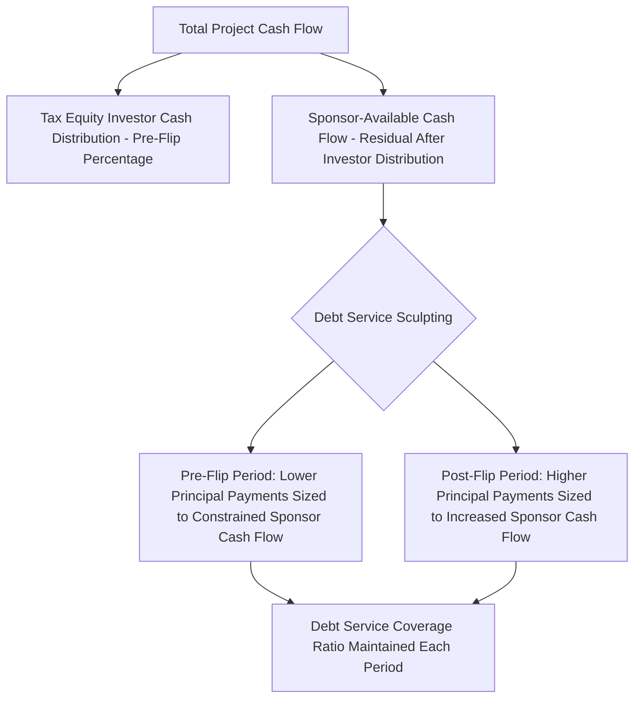

## Sculpting Debt Service Around Tax Equity Cash Flows

### Overview

Sculpting Debt Service Around Tax Equity Cash Flows describes the financial modeling and structuring technique of custom-tailoring a project's debt amortization schedule — rather than using a level (equal-payment) amortization — to fit the specific cash flow pattern available after tax equity investor distributions and reserve requirements are satisfied in each period. This is a standard practice in tax equity-financed renewable energy projects because the presence of a tax equity investor materially changes the cash available to service back-leverage or project-level debt compared to a conventional (non-tax-equity) project financing.

### Why Sculpting Is Necessary in Tax Equity Deals

**Key Points**

- In a traditional partnership flip, the tax equity investor typically receives a disproportionately large share of cash distributions (as well as tax benefits) during the pre-flip period, which reduces the cash available to the sponsor to service any sponsor-level (back-leverage) debt during that same period.
- A level amortization schedule (equal periodic principal-and-interest payments) assumes cash available for debt service is relatively stable each period — an assumption that breaks down in tax equity structures, where sponsor-level cash flow can be quite low pre-flip (due to the investor's large cash allocation) and then increase substantially post-flip (once the sponsor's cash allocation percentage jumps).
- "Sculpting" refers to structuring the debt repayment schedule so that principal repayment amounts are lower during the pre-flip period (when sponsor cash flow is constrained) and higher during the post-flip period (when sponsor cash flow increases), rather than forcing a uniform payment schedule that could strain sponsor liquidity pre-flip or leave excess unused debt capacity post-flip.
- [Inference] Because the flip date itself is often uncertain at the time debt is sized and structured (given the circularity and scenario-dependence discussed in Modeling the Flip Date and Investor Return), sculpted debt schedules are typically built with conservative production and flip-timing assumptions to ensure adequate debt service coverage even if the flip is delayed relative to the base case projection.

### The Sculpting Mechanic

**Key Points**

- Debt sizing under a sculpted schedule is typically driven by a minimum Debt Service Coverage Ratio (DSCR) requirement set by the lender — for each period, the maximum debt service payment is calculated as the sponsor-available cash flow for that period divided by the required minimum DSCR, and principal amortization is set accordingly (rather than assuming a fixed, level payment amount across the debt term).
- Because sponsor-available cash flow is typically much lower pre-flip, the sculpted schedule often results in minimal principal amortization (sometimes near-zero net of interest) during the pre-flip years, followed by an accelerated amortization schedule once the flip occurs and sponsor cash flow increases substantially.
- This approach maximizes the total amount of debt the project can support (since debt sizing is calibrated to the actual, uneven cash flow profile rather than an artificially smoothed level-payment assumption), which is generally advantageous to the sponsor by reducing the amount of higher-cost equity capital needed in the sources and uses schedule.

### Debt Service Coverage Ratio Mechanics in a Sculpted Structure

**Example**

A wind project's sponsor-available cash flow (after the tax equity investor's negotiated cash distribution percentage) is projected at $3 million per year pre-flip (years 1-7) and $9 million per year post-flip (years 8-15), reflecting the significant increase in sponsor cash allocation once the flip percentage shifts. With a lender-required minimum DSCR of 1.30x, the maximum debt service payable is approximately $2.3 million per year pre-flip ($3M ÷ 1.30) and approximately $6.9 million per year post-flip ($9M ÷ 1.30). The debt's principal and interest schedule is sculpted to these annually-varying maximum payment amounts, rather than using a single level payment computed from total available cash flow over the full term.

$$DebtService_t = \frac{CashFlow_{sponsor,t}}{DSCR_{min}}$$

**Key Points**

- Because interest expense declines as principal is paid down, and the sculpted schedule ties principal repayment to available cash flow rather than a fixed formula, sculpting typically requires iterative calculation (similar to the circularity issue in flip date modeling) since the interest portion of debt service depends on the outstanding principal balance, which itself depends on prior periods' amortization amounts.
- Lenders typically require the DSCR to be tested and maintained not only in the base case but also across a range of downside scenarios (lower production, delayed flip, higher operating costs), meaning the sculpted schedule is generally sized to the most conservative scenario the lender requires (often a P90 production case or similar downside sensitivity) rather than the sponsor's base case projection.

### Interaction with Reserve Requirements

**Key Points**

- Sculpted debt structures are typically paired with a debt service reserve account (DSRA), sized to cover a specified number of months of debt service (commonly 6 months, though deal-specific), providing a cash buffer if actual sponsor cash flow in a given period falls short of the sculpted debt service requirement.
- Because sculpting relies on relatively precise cash flow projections to size each period's debt service, and actual results can and do vary from projections (production variance, unexpected operating costs, flip timing shifts), the reserve account serves as the primary mitigant against the sculpted schedule's greater sensitivity to forecast error compared to a simpler level-payment structure.
- [Inference] Lenders generally view sculpted debt structures as requiring more robust and detailed cash flow modeling support (including the tax equity flip modeling components) than a conventional level-payment loan, since the entire repayment schedule is derived from, and therefore only as reliable as, the underlying project and tax equity cash flow projections.

### Comparison: Level Amortization vs. Sculpted Amortization

| Feature | Level Amortization | Sculpted Amortization |
| --- | --- | --- |
| Payment pattern | Equal periodic payments | Varies to match available cash flow each period |
| Fit with tax equity cash flow | Poor — assumes stable cash flow, but tax equity flip creates uneven sponsor cash flow | Designed specifically to match the uneven flip-driven cash flow pattern |
| Debt capacity supported | Generally lower, driven by the most constrained (pre-flip) period if level payments must be serviceable throughout | Generally higher, since debt sizing reflects the full, uneven cash flow profile rather than the worst single period |
| Modeling complexity | Lower | Higher — requires iterative interest/principal calculation and integration with flip timing model |
| Sensitivity to forecast error | Lower (fixed payment regardless of actual cash flow, so shortfalls draw on reserves directly) | Higher (schedule itself is derived from projections, so proper reserve sizing is critical) |

### Coordination with the Flip Date Model

**Key Points**

- Because sculpted debt service depends directly on the sponsor's post-tax-equity-distribution cash flow, which in turn depends on the pre-flip/post-flip cash allocation percentages and the timing of the flip itself, the debt sculpting model and the flip date model (covered in Modeling the Flip Date and Investor Return) must be built to interact — a change in assumed flip timing changes sponsor cash flow projections, which changes the sculpted debt schedule, which can in turn affect overall project economics and even, in some cases, feed back into the tax equity investor's return calculation if debt service affects distributable cash flow.
- [Inference] Given this interdependency, sophisticated tax equity models typically integrate the debt sculpting calculation and the flip date/IRR calculation into a single unified model (or a set of tightly linked models) rather than treating them as separate, independently-built exercises, to ensure changes to one assumption set are properly reflected in the other.

### Common Pitfalls

**Key Points**

- Sizing a sculpted debt schedule using only the base-case flip timing and production assumptions, without stress-testing against delayed flip scenarios or downside production cases that could leave insufficient sponsor cash flow to service the sculpted payment in a given period.
- Failing to properly integrate the debt sculpting calculation with the flip date/IRR circularity resolution technique, potentially compounding two separate circular calculations in a way that produces an unstable or incorrect model.
- Under-sizing the debt service reserve account relative to the sculpted schedule's sensitivity to forecast variance, leaving inadequate buffer if actual results diverge from the projections used to derive the sculpted payment amounts.
- [Unverified] Assuming a specific minimum DSCR or reserve sizing convention applies universally; actual lender requirements vary by technology, counterparty creditworthiness (e.g., power purchase agreement offtaker credit quality), and prevailing debt market conditions, and should be confirmed against current market terms for the specific transaction.

**Next Topics**

- Debt Service Coverage Ratio Methodology and Downside Scenario Testing
- Debt Service Reserve Account Sizing Conventions
- Construction-to-Term Debt Conversion and Its Effect on Sculpting
- Integrating Circular Calculations: Flip Timing and Debt Sculpting Together
- Back-Leverage Debt Structuring at the Sponsor Level
- P90 Production Scenarios and Their Role in Conservative Debt Sizing