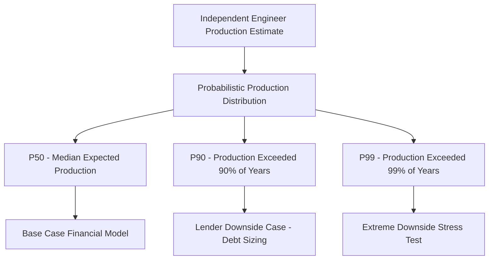

## Sensitivity Analysis on Production, Pricing, and Credit Value

### Overview

Sensitivity Analysis on Production, Pricing, and Credit Value covers the modeling discipline of systematically varying key uncertain inputs — energy production volumes, power/energy pricing, and tax credit value — to understand how each affects project economics, investor returns, flip timing, and debt sizing in a tax equity transaction. Because tax equity models combine physical performance risk (how much electricity a project actually generates), market risk (what that electricity is worth), and tax policy/market risk (what the credit is actually worth, especially in transfer transactions), sensitivity analysis is essential to stress-test the base case across the range of realistic outcomes lenders, investors, and sponsors need to underwrite.

### Why These Three Variables Are the Primary Sensitivity Drivers

**Key Points**

- **Production** directly drives both PTC value (which is calculated per unit of electricity generated and sold) and operating revenue for merchant or partially-merchant projects, making it the single most consequential variable for wind and solar projects relying on the PTC or on market-based revenue.
- **Pricing** affects revenue for any project with merchant exposure (no fixed-price offtake) or with a power purchase agreement (PPA) that includes variable, indexed, or partially-merchant pricing components, and separately affects the value of any transferred credit if credit transfer pricing itself fluctuates with broader capital market conditions.
- **Credit value** encompasses both (a) the calculated dollar amount of the ITC or PTC itself (dependent on eligible basis, applicable percentage including bonus adders, and — for PTC — actual production) and (b) for transfer transactions, the market discount rate at which the credit can actually be sold for cash under §6418, which is a distinct source of uncertainty from the credit's face value.
- [Inference] Because these three variables interact (e.g., lower production reduces both revenue and PTC value simultaneously, compounding the downside case), sensitivity analysis in practice typically examines not just each variable in isolation but also combined scenarios where multiple variables move unfavorably together, since isolated single-variable sensitivities can understate the severity of a genuinely adverse outcome.

### Standard Production Sensitivity Framework: Exceedance Probabilities

**Key Points**

- Production sensitivities for wind and solar projects are typically expressed using exceedance probability notation (P50, P75, P90, P99), derived from an independent engineer's resource assessment, where "P90" means the production level expected to be exceeded in 90% of years (i.e., a conservative, low-probability-of-shortfall estimate), and "P50" represents the median expected outcome.
- Lenders typically size debt service coverage and the sculpted debt schedule (as discussed in Sculpting Debt Service Around Tax Equity Cash Flows) using a P90 (or sometimes P99, for a single worst year) production case, reflecting a deliberately conservative planning assumption, while sponsors and tax equity investors often evaluate their expected returns using the P50 case as the base case.
- [Inference] This convention — debt sized to a conservative downside case, equity returns evaluated against the median case — creates a structural cushion in the capital structure, since actual production exceeding the P90 debt-sizing case in most years provides additional cash flow available to equity beyond what was assumed in debt sizing.
- For wind projects, production variability tends to be more pronounced than for solar (due to greater year-to-year and even multi-year wind resource variability), often resulting in a wider spread between P50 and P90 production estimates and, correspondingly, more material sensitivity of the flip date and investor IRR to the production scenario used.

### Pricing Sensitivity Considerations

**Key Points**

- For projects with a fixed-price, long-term PPA, pricing sensitivity is generally limited to counterparty credit risk (the risk the offtaker fails to pay) rather than market price variability, since the contracted price is fixed regardless of prevailing market conditions.
- For merchant or hybrid PPA/merchant projects, pricing sensitivity requires modeling a forward price curve (often sourced from third-party market price forecasts) and testing the project's economics against both the base-case forward curve and stress scenarios (e.g., sustained low power prices, given renewable buildout and its historical effect on wholesale price suppression in high-penetration markets).
- Hedging structures (e.g., financial hedges, hedged PPAs, or a "hedge sleeve" covering a portion of expected production) can be layered into the pricing sensitivity analysis, with the model needing to reflect how much of total expected output is protected from price variability versus exposed to merchant risk.
- [Inference] Because pricing risk is generally viewed as more within the sponsor's ability to mitigate through contracting (versus production risk, which is largely a function of resource variability outside anyone's control), lenders and tax equity investors often place a premium on well-structured, creditworthy offtake arrangements specifically to minimize the pricing sensitivity's impact on the overall risk profile of the deal.

### Credit Value Sensitivity: Two Distinct Layers

**Key Points**

- **Credit amount sensitivity**: For the ITC, this primarily reflects uncertainty in final eligible basis (subject to cost certification, as discussed in Building the Sources and Uses Schedule) and the applicable percentage, including whether bonus adders (domestic content, energy community, or low-income community bonus, where applicable) are ultimately achieved and substantiated — failure to qualify for an anticipated bonus adder can materially reduce the credit amount relative to the base case assumption. For the PTC, credit amount sensitivity is directly tied to the production sensitivity discussed above, since PTC value is computed per unit of electricity generated.
- **Credit monetization value sensitivity**: In transfer transactions under §6418, the credit's face value is distinct from the actual cash proceeds realized, which depend on the prevailing market discount rate for credit transfers at the time of sale — this discount rate is itself subject to market conditions (buyer demand, insurance costs, general credit market liquidity) that can shift between when a deal is structured and when the transfer actually closes.
- [Inference] Because credit monetization value sensitivity did not exist as a distinct risk category before §6418 transferability (traditional flip deals only faced credit *amount* uncertainty, not a separate market discount rate uncertainty), models for hybrid flip/transfer structures typically need an additional sensitivity layer not present in legacy tax equity models, testing a range of plausible transfer market discount rates against the base case assumed pricing.
- [Unverified] Specific ranges for transfer market discount rate sensitivities should be calibrated to current, observable market transaction data at the time of analysis rather than assumed static, since the transfer market is comparatively young and pricing conventions continue to evolve.

### Combined Scenario Analysis

**Example**

A solar-plus-storage project's financial model runs a base case (P50 production, contracted PPA base pricing, full anticipated ITC including domestic content bonus, no transfer discount since credit is retained in-kind) alongside a combined downside case (P90 production, no change to PPA-fixed pricing, denial of the domestic content bonus adder due to failure to meet sourcing thresholds, reflecting an ITC percentage 10 percentage points lower than the base case). The combined downside case shows the flip date extending from year 6 to year 8, illustrating how compounding a production shortfall with credit amount uncertainty produces a materially different outcome than either sensitivity tested in isolation.

**Key Points**

- Combined or "compounded" scenario testing (moving multiple variables unfavorably at once) is standard practice specifically because production, pricing, and credit value are not independent in their effect on investor returns — a downside production case that also happens to coincide with credit qualification uncertainty (e.g., marginal domestic content compliance) produces a materially worse outcome than either variable's isolated sensitivity would suggest.
- Tornado charts (ranking each sensitivity variable by its individual impact on a key output like investor IRR or flip date) are a common way to visually communicate which variables the model is most sensitive to, helping focus diligence and risk mitigation efforts on the highest-impact uncertainties.

### Practical Modeling Workflow

**Key Points**

- Sensitivity analysis is typically built using data tables, scenario managers, or toggle-switch input cells within the financial model, allowing the analyst to quickly re-run the full flip date, IRR, and debt sculpting calculations under each scenario without manually rebuilding the model.
- Given the circularity issues inherent in flip date modeling (discussed in Modeling the Flip Date and Investor Return) and debt sculpting (discussed in Sculpting Debt Service Around Tax Equity Cash Flows), sensitivity analysis in practice requires that circularity resolution techniques function correctly across every tested scenario, not just the base case — a common technical pitfall is a circularity-breaking macro or iterative calculation setting that works for the base case but produces errors or non-convergence under certain stress scenarios.
- Lenders and tax equity investors typically each run their own independent sensitivity analysis (sometimes using their own proprietary models rather than relying solely on the sponsor's model), meaning sponsors should expect their own sensitivity outputs to be cross-checked and potentially challenged during diligence.

### Common Pitfalls

**Key Points**

- Testing production, pricing, and credit value sensitivities only in isolation, without also running compounded downside scenarios that reflect the realistic possibility of multiple adverse factors occurring simultaneously.
- Treating credit amount sensitivity and credit monetization value sensitivity as a single combined variable in hybrid transfer structures, obscuring which specific risk (basis/qualification risk vs. market discount rate risk) is driving a given sensitivity result.
- Relying on a single independent engineer's production estimate without appropriately reflecting the full probabilistic distribution (P50 through P90 or P99) in sensitivity testing, understating true production-related uncertainty.
- Failing to verify that circularity resolution techniques (for flip timing and debt sculpting) remain stable and convergent across all tested sensitivity scenarios, not just the base case, potentially producing misleading or erroneous sensitivity outputs.

**Next Topics**

- Independent Engineer Production Estimates and Exceedance Probability Methodology
- Domestic Content and Energy Community Bonus Adder Qualification Risk
- Transfer Market Discount Rate Trends and Pricing Data Sources
- Tornado Chart Construction and Interpretation for Tax Equity Models
- Hedging Structures for Merchant and Hybrid PPA Revenue Risk
- Building Robust Circularity Resolution Techniques Across Sensitivity Scenarios