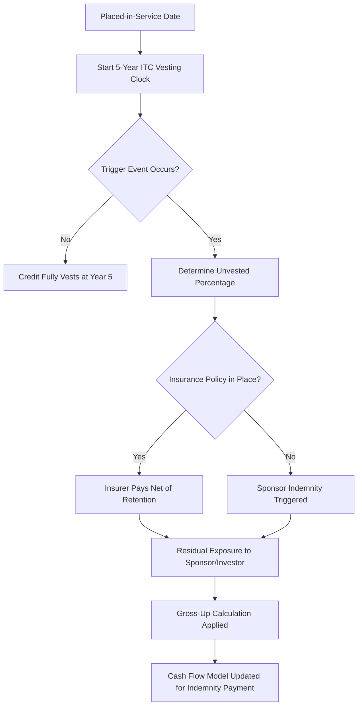

## Modeling Compliance and Recapture Risk Scenarios

### Overview

Recapture risk modeling quantifies the financial exposure created when a tax equity investor's claimed tax benefits (Investment Tax Credit, depreciation, or Production Tax Credit qualification) are subject to reversal due to a disqualifying event during a statutory compliance period. This is a core underwriting and structuring discipline in tax equity finance because recapture exposure directly affects investor pricing, indemnification structure, and the allocation of risk between sponsor and investor.

### Statutory Basis for Recapture

**Key Points**

- ITC recapture is governed by IRC Section 50(a): the credit vests ratably over a 5-year compliance period at 20% per year.
- If a "recapture event" occurs before the 5-year period ends, the unvested portion of the credit must be repaid (recaptured) in the year of the event.
- PTC does not have a formal statutory recapture mechanism, but qualification failures (e.g., failure to meet "beginning of construction" or placed-in-service requirements) can retroactively disqualify claimed credits, which functions similarly in transaction risk terms.
- Depreciation (MACRS) recapture risk is distinct: this refers to IRC Section 1245/1250 recapture on disposition, not the same mechanism as ITC vesting, though both are modeled together in tax equity because a single disqualifying event (e.g., sale of the project, cessation of business use) can trigger both.

The 5-year ITC vesting schedule:

| Year After Placed-in-Service | Vested % | Unvested (At-Risk) % |
| --- | --- | --- |
| Year 1 | 20% | 80% |
| Year 2 | 40% | 60% |
| Year 3 | 60% | 40% |
| Year 4 | 80% | 20% |
| Year 5 | 100% | 0% |

### Recapture Trigger Events

**Key Points**

Common triggering events modeled in a tax equity financial model:

- **Disposition of the property** — sale, foreclosure, or transfer of the ITC-eligible asset (or a partnership interest, under the "50% or more" ownership-change rule of Reg. 1.47-6) before the compliance period ends.
- **Cessation of qualified use** — the property stops being used in a manner that qualifies for the credit (e.g., repurposing, conversion to non-eligible use).
- **Casualty loss / destruction** — depending on facts, may trigger recapture on the destroyed portion unless replaced.
- **Change in tax-exempt or governmental use** — an increase in tax-exempt use percentage above thresholds under Section 168(h) can taint depreciation and ITC eligibility retroactively.
- **Partnership flip structural failures** — if the partnership allocation fails to meet the "partnership flip" safe harbor guidance (Rev. Proc. 2007-65, as informally referenced by practitioners, and its post-2007 successors/IRS guidance updates), the IRS could reallocate income/credits, which is modeled as a quasi-recapture event even absent a formal Section 50 trigger.
- **Related-party or step-transaction recharacterization** — IRS recharacterizing the tax equity investor's interest as debt rather than equity, collapsing the purported partnership allocations.

[Inference] The relative weighting an underwriter assigns to each trigger type is deal-specific and depends heavily on counterparty credit quality, technology risk, and structuring precedent; there is no universal industry-standard probability table for these events.

### Modeling Architecture: Recapture Liability Schedule

A recapture risk model is typically built as a satellite schedule feeding into the master partnership-flip or sale-leaseback cash flow model. Core components:

1. **Vesting schedule tracker** — tracks cumulative vested percentage by month/year for each ITC-eligible asset or asset pool.
2. **Trigger probability inputs** — scenario-weighted probabilities of each trigger event by year (informed by technology performance data, counterparty credit, and legal risk assessment).
3. **Exposure calculation** — for each year $t$, recapture exposure is:

$$E_t = C \times (1 - V_t)$$

where $C$ is the total ITC claimed and $V_t$ is the cumulative vested percentage at time $t$.

4. **Indemnification waterfall** — models how the recapture liability, if triggered, flows to the sponsor (via indemnity, guaranty, or holdback) versus remaining with the investor.
5. **Insurance offset** — many deals now layer tax insurance (recapture/investment tax credit insurance policies) that caps investor exposure; the model nets the insured recovery against gross exposure.

### Recapture Risk Insurance Layer

**Example**

A typical modeling structure for the insurance offset:



```
Gross Recapture Exposure (Year 2 event)     = $8,000,000
Insurance Policy Limit                       = $10,000,000
Retention/Deductible                         = $500,000
Insurer Payout                               = MIN(Gross Exposure - Retention, Policy Limit)
                                              = MIN($7,500,000, $10,000,000)
                                              = $7,500,000
Net Sponsor/Investor Residual Exposure       = $8,000,000 - $7,500,000 = $500,000
```

[Unverified] Specific retention levels, premium rates, and policy limits vary significantly by insurer, deal size, and technology, and should be confirmed against current market quotes rather than assumed from historical benchmarks.

### Scenario Framework

**Key Points**

A robust compliance/recapture model runs multiple scenario tiers:

- **Base case** — no recapture event; used for the investor's target yield calculation.
- **Early disposition scenario** — models a forced or voluntary sale/foreclosure in Years 1–3, calculating gross-up indemnity payments the sponsor must make to restore the investor to their target after-tax yield.
- **Casualty scenario** — partial destruction with insurance proceeds reducing but not eliminating recapture on the non-rebuilt portion.
- **Structural challenge scenario** — IRS successfully recharacterizes the flip partnership, causing full credit disallowance; modeled as a tail-risk scenario with legal opinion strength as a mitigating input.
- **Curable non-compliance scenario** — a compliance failure identified and cured within a safe-harbor cure period (where available), resulting in reduced or no recapture.

### Gross-Up Mechanics

When a recapture event occurs, sponsor indemnification obligations are usually structured as a "gross-up" to make the investor whole on an after-tax basis, not merely a reimbursement of the clawed-back credit. This is because the recaptured amount itself may be taxable income or interact with the investor's tax basis in ways that create a secondary tax cost.

A simplified gross-up formula:

$$\text{Indemnity Payment} = \frac{\text{Recaptured Credit} + \text{Interest on Recapture (Sec. 50(a)(2)(B))}}{1 - \text{Investor's Marginal Tax Rate}}$$

[Inference] The exact gross-up mechanics are heavily negotiated per deal and vary by whether the indemnity is structured as a single lump-sum true-up or an ongoing yield-maintenance mechanism; the formula above illustrates the conceptual approach rather than a fixed market-standard formula.

### Diagram: Recapture Risk Decision Flow



### Diagram: ITC Vesting Curve (svg_diagram)

<svg xmlns="http://www.w3.org/2000/svg" viewBox="0 0 640 360">
<text x="320" y="24" text-anchor="middle" font-size="16" font-family="sans-serif" font-weight="bold">ITC Vesting Curve Over 5-Year Compliance Period (svg_diagram)</text>
<line x1="70" y1="300" x2="600" y2="300" stroke="black" stroke-width="2" />
<line x1="70" y1="300" x2="70" y2="50" stroke="black" stroke-width="2" />
<text x="30" y="305" font-size="12" font-family="sans-serif">0%</text>
<text x="30" y="255" font-size="12" font-family="sans-serif">20%</text>
<text x="30" y="205" font-size="12" font-family="sans-serif">40%</text>
<text x="30" y="155" font-size="12" font-family="sans-serif">60%</text>
<text x="30" y="105" font-size="12" font-family="sans-serif">80%</text>
<text x="20" y="60" font-size="12" font-family="sans-serif">100%</text>
<text x="320" y="335" text-anchor="middle" font-size="13" font-family="sans-serif">Year After Placed-in-Service</text>
<polyline points="70,300 174,250 278,200 382,150 486,100 590,50" fill="none" stroke="#2b6cb0" stroke-width="3" />
<circle cx="174" cy="250" r="4" fill="#2b6cb0" />
<circle cx="278" cy="200" r="4" fill="#2b6cb0" />
<circle cx="382" cy="150" r="4" fill="#2b6cb0" />
<circle cx="486" cy="100" r="4" fill="#2b6cb0" />
<circle cx="590" cy="50" r="4" fill="#2b6cb0" />
<text x="174" y="270" text-anchor="middle" font-size="11" font-family="sans-serif">Y1</text>
<text x="278" y="220" text-anchor="middle" font-size="11" font-family="sans-serif">Y2</text>
<text x="382" y="170" text-anchor="middle" font-size="11" font-family="sans-serif">Y3</text>
<text x="486" y="120" text-anchor="middle" font-size="11" font-family="sans-serif">Y4</text>
<text x="590" y="70" text-anchor="middle" font-size="11" font-family="sans-serif">Y5</text>
<polygon points="70,300 174,300 174,250 70,300" fill="#f6ad55" opacity="0.4" />
<text x="640" y="345" text-anchor="end" font-size="10" font-family="sans-serif" fill="#555">Shaded wedge = at-risk (unvested) exposure in Year 1</text>
</svg>

### Sensitivity and Stress Testing

**Key Points**

Financial models should stress-test recapture exposure across:

- **Timing sensitivity** — how does indemnity magnitude change if the trigger occurs in Year 1 versus Year 4? (Exposure decreases linearly with vested percentage.)
- **Interest rate sensitivity** — Section 50(a)(2)(B) imposes interest on the recaptured amount from the original credit claim date; higher rate environments increase the total clawback.
- **Insurance counterparty risk** — model a scenario where the tax insurance carrier itself defaults or disputes the claim, leaving gross exposure uninsured.
- **Basis step-down interactions** — recapture of ITC also triggers a basis addition (50% of the recaptured credit is added back to basis under Section 50(c)(2)), which affects future depreciation and must be reflected in the amended tax return schedule within the model.

### Model Output Structure

**Output**

A well-built recapture module typically outputs:

1. Year-by-year vested/unvested percentage table.
2. Scenario-weighted expected recapture liability (probability-weighted across trigger scenarios).
3. Net exposure after insurance and indemnity layers.
4. Impact on investor IRR/target yield under each scenario (base, stress, tail).
5. Sponsor cash flow impact schedule showing timing and magnitude of indemnity obligations.

### Practical Example: Simplified Expected Value Calculation

**Example**



```
Assumptions:
  Total ITC Claimed              = $20,000,000
  Year of Model Analysis         = Year 2 (40% vested, 60% at risk)
  Trigger Probability (Year 2-5) = 3% annual (assumed, illustrative)
  Insurance Coverage             = 90% of gross exposure above $250,000 retention

Step 1 - Gross Exposure at Year 2:
  Unvested % = 60%
  Gross Exposure = $20,000,000 × 60% = $12,000,000

Step 2 - Insurer Recovery:
  Insured Portion = ($12,000,000 - $250,000) × 90% = $10,575,000

Step 3 - Residual Exposure:
  Residual = $12,000,000 - $10,575,000 = $1,425,000

Step 4 - Probability-Weighted Expected Liability:
  Expected Liability = $1,425,000 × 3% = $42,750
```

[Inference] The 3% annual trigger probability is an illustrative placeholder for teaching the calculation mechanics; real underwriting probabilities are derived from asset-specific technology performance data, sponsor track record, and legal risk memoranda, and should never be treated as a market benchmark.

### Integration with the Master Financial Model

The recapture schedule typically feeds three places in the master model:

- The **investor return waterfall**, adjusting after-tax IRR for the probability-weighted expected recapture cost.
- The **sponsor cash flow schedule**, reflecting any collateral, letter of credit, or holdback reserved against indemnity obligations.
- The **debt sizing / coverage ratio calculations** (if leveraged), since lenders often require recapture reserve accounts or additional debt service coverage cushions tied to unvested credit exposure.

### Related Topics

- Partnership Flip Structuring and Safe Harbor Guidance
- Tax Equity Investor Yield and IRR Waterfall Modeling
- Investment Tax Credit Insurance Underwriting
- Depreciation Recapture Under IRC Sections 1245/1250
- "Beginning of Construction" and Placed-in-Service Qualification Risk
- Debt Sizing and Coverage Ratios in Leveraged Tax Equity Deals
- Basis Step-Up and Step-Down Mechanics in ITC Transactions