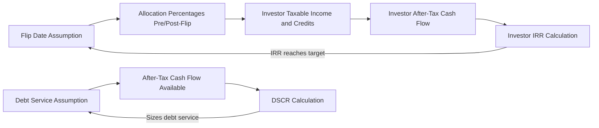
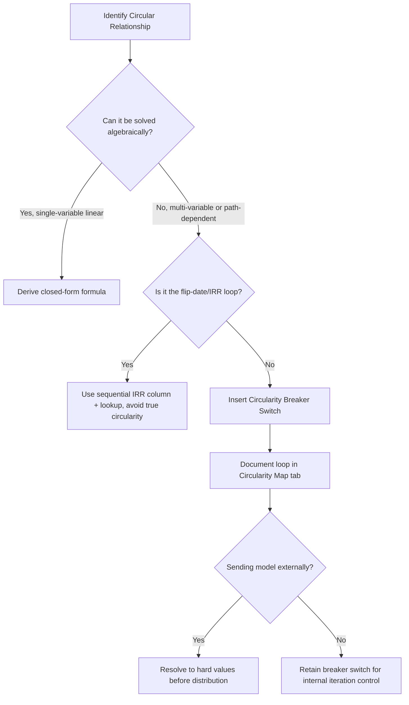

## Managing Circular References in Tax Equity Models

### Overview

Circular references are endemic to tax equity financial models because the core mechanics of a partnership flip or sale-leaseback structure create interdependent calculations: the allocation of tax benefits depends on the investor's after-tax yield target, which depends on the flip date, which depends on the cash flows and tax benefits being allocated. This module covers why circularity arises, how it manifests structurally in Excel/model architecture, and the standard techniques for managing, breaking, or controlling it without corrupting model integrity.

### Why Circularity Arises

**Key Points**

- The **flip point** (the date at which allocation percentages shift from the investor-favored split to the sponsor-favored split) is defined by the investor reaching a target after-tax IRR.
- The investor's after-tax IRR depends on the **timing and amount of tax benefits** (ITC, depreciation, PTC) allocated to them.
- Tax benefit allocation percentages are themselves often a function of **when the flip occurs**.
- This creates a loop: Flip Date → Allocations → Investor Cash Flow → Investor IRR → Flip Date.
- A second common circularity driver is **debt sizing tied to a debt service coverage ratio (DSCR)** that is itself a function of after-tax cash flow, which depends on the debt service being sized.
- A third driver is **fees or incentive distributions calculated as a percentage of the very cash flow being distributed** (e.g., an asset management fee computed on distributable cash after fees).

[Inference] The specific circularity structure varies by model architecture; some practitioners deliberately avoid true circularity by using prior-period balances or iterative flags, so not every tax equity model exhibits all three loop types described above.

### Diagram: Core Circularity Loop



### Manifestations in Model Architecture

**Key Points**

1. **IRR-seeking flip date** — the model must solve for the specific month/year the investor's cumulative after-tax IRR crosses the target threshold; this typically requires a lookup or goal-seek style mechanism rather than a direct formula, because the flip date itself changes the cash flows used to compute the IRR.
2. **Iterative fee calculations** — "management fee = 2% of cash available for distribution" where cash available for distribution is defined net of the management fee.
3. **Debt sizing circularity** — the debt amount affects interest expense, which affects after-tax income, which affects DSCR, which is the constraint used to size the debt amount.
4. **Gross-up indemnity circularity** — as discussed in recapture modeling, a gross-up payment to restore an investor's after-tax yield is itself taxable, requiring a gross-up on the gross-up.

### Technique 1: Excel Iterative Calculation

**Key Points**

- Excel's native **Iterative Calculation** setting (File → Options → Formulas → Enable iterative calculation) allows circular formulas to resolve through repeated recalculation until values converge within a specified tolerance.
- Settings typically used: **Maximum Iterations** (commonly 100), **Maximum Change** (commonly 0.001 or smaller for financial precision).
- **Risk**: Iterative calculation can silently produce unstable or non-convergent results if the circular loop is not well-behaved (e.g., oscillating rather than converging), and Excel will not always warn the user clearly when this happens.
- **Risk**: Iterative calculation makes the model prone to "circular reference creep" — the modeler forgets the loop exists, an error hides inside it, and it isn't caught because the model just keeps calculating a number rather than throwing the classic Excel circular reference warning.

[Unverified] Excel's default convergence behavior and warning thresholds can differ slightly across Excel versions (desktop vs. Microsoft 365 vs. legacy versions); if precise convergence behavior matters for the deal, it should be tested empirically in the specific Excel build being used.

### Technique 2: Circularity Breaker Switch

**Example**

The most widely used professional practice is inserting a **manual circularity breaker** — a binary toggle cell that lets the modeler cut the loop on demand, usually via a copy-paste-values macro or a manual switch feeding a conditional formula.



```
Cell: CircBreaker (named range), value = 0 or 1

Formula pattern:
Management_Fee = IF(CircBreaker = 1,
                     Prior_Period_Cash_Available * Fee_Rate,   ' breaks the loop using prior period
                     Cash_Available_Current_Period * Fee_Rate) ' true circular formula
```

When `CircBreaker = 1`, the model references a **prior-period (lagged) value** instead of the current-period value that creates the loop, temporarily breaking circularity so the model can be audited, error-checked, or rebuilt without Excel's iterative engine interfering. When set back to `0`, the "true" circular formula re-engages.

### Technique 3: Macro-Based Copy-Paste-Values

**Key Points**

- A VBA macro captures the converged circular values, then pastes them as **hard values** into a staging row, which the rest of the model references instead of the live circular formula.
- This is often combined with a **manual "Calculate Now" button** tied to the macro, giving the modeler explicit control over when the circularity is allowed to resolve, rather than letting Excel auto-iterate on every keystroke (which can cause severe recalculation lag in large models).
- Typical macro logic: (1) set iterative calculation on temporarily, (2) force a full recalculation, (3) copy the resolved circular cells, (4) paste-special as values into a shadow/staging area, (5) turn iterative calculation back off.

[Inference] Whether a firm uses native iterative calculation, a manual breaker switch, or a macro-driven copy-paste approach is largely a matter of house modeling standards; there is no single universal market practice, though the breaker-switch and macro approaches are generally preferred over leaving iterative calculation permanently enabled because they make the circularity auditable and controllable.

### Technique 4: Algebraic Pre-Solving (Avoiding Circularity Entirely)

**Key Points**

For some circular relationships, especially fee-on-distributable-cash and gross-up calculations, the circularity can be **eliminated algebraically** rather than iterated.

**Example** — Fee-on-net-of-fee circularity solved algebraically:

If:

$$\text{Fee} = r \times (\text{Cash} - \text{Fee})$$

Solving algebraically for Fee:

$$\text{Fee} = \frac{r \times \text{Cash}}{1 + r}$$

This closed-form solution can be entered directly as a non-circular formula, removing the need for iteration entirely. The same algebraic pre-solving approach is standard for **tax gross-up calculations**:

$$\text{Gross-Up} = \frac{\text{Target Net Amount} \times t}{1 - t}$$

where $t$ is the marginal tax rate — this avoids the "gross-up on the gross-up" circularity by solving the geometric series in closed form.

[Inference] Algebraic pre-solving is the most robust technique where it is mathematically feasible (single-variable linear circularities), but it becomes impractical for more complex, multi-variable circularities such as the full flip-date/IRR loop, where iterative or breaker-based approaches remain standard.

### Technique 5: Flip-Date Solved via Iterative Search Rather Than True Circularity

**Key Points**

Many practitioners avoid making the flip date a literal circular formula at all. Instead:

- The model calculates the investor's cumulative after-tax IRR **for every period** in a running column (not circular — this is just a sequential calculation).
- A separate lookup formula (e.g., `MATCH`/`INDEX` or `XLOOKUP`) scans that column to find the first period where cumulative IRR crosses the target threshold.
- The flip date is therefore **derived**, not solved circularly — allocations before that date use pre-flip percentages, and allocations after use post-flip percentages, but the IRR-per-period column itself does not depend on knowing the flip date in advance.

This is generally considered the **cleaner architecture** because it avoids Excel iterative calculation altogether for the highest-stakes circular relationship in the model (the flip date), confining true circularity to smaller, more controllable loops like fee calculations or debt sizing.

### Model Governance and Audit Practices

**Key Points**

- **Flag all circular cells explicitly** with cell comments or a dedicated "Circularity Map" tab documenting every intentional loop, its breaker mechanism, and its convergence tolerance.
- **Version control discipline**: before sending a model externally (e.g., to a tax equity investor's diligence team), circularity should be resolved to hard values or the breaker switch documented, since external reviewers unfamiliar with the model's iterative settings can misinterpret unstable or non-converging cells as errors.
- **Sensitivity/scenario toggles interact badly with circularity** — running a data table or scenario manager over a circular model can cause severe slowdowns or non-convergence; best practice is to run scenarios with the breaker engaged (using lagged/staged values) and only re-enable true circularity for final base-case validation.
- **#REF! and divergence errors**: a poorly bounded circular loop (e.g., a fee rate above 100% in the fee-on-net formula) can cause the iteration to diverge rather than converge; models should include a validation check comparing iteration count/change against expected convergence.

### Diagram: Circularity Management Decision Process



### Practical Example: Debt Sizing Circularity Walkthrough

**Example**



```
Step 1: Assume initial Debt Amount = $50,000,000 (seed value)
Step 2: Calculate Interest Expense = Debt Amount × Rate
Step 3: Calculate After-Tax Cash Flow = (EBITDA - Interest Expense) × (1 - Tax Rate)
Step 4: Calculate DSCR = After-Tax Cash Flow / Debt Service
Step 5: If DSCR < Minimum Required DSCR (e.g., 1.30x):
           Reduce Debt Amount and recalculate (Steps 2-4)
        If DSCR > Minimum Required DSCR:
           Increase Debt Amount and recalculate (Steps 2-4)
Step 6: Converge when DSCR = Minimum Required DSCR (within tolerance)
```

This is commonly implemented either through Excel iterative calculation directly, or through a **goal-seek/solver macro** that automates Steps 2–6 without relying on worksheet-level circular formulas at all — an alternative that avoids embedding circularity in the live formula structure.

### Common Pitfalls

**Key Points**

- Leaving iterative calculation permanently enabled across an entire workbook (rather than scoped to specific known loops) can mask unrelated formula errors elsewhere in the model, since Excel will keep recalculating instead of throwing a circular reference warning.
- Forgetting to reset the circularity breaker before final delivery, leaving a model referencing stale prior-period values instead of the intended converged circular result.
- Failing to document the convergence tolerance, leading downstream analysts to assume "the model is done calculating" when in fact it has stopped at the maximum iteration count without fully converging.
- Applying data tables/sensitivity analysis directly over circular cells without a breaker switch, causing severe performance degradation or unstable output across scenarios.

### Related Topics

- Partnership Flip Point Determination and IRR-Target Waterfalls
- Debt Sizing and DSCR-Constrained Structuring
- Modeling Compliance and Recapture Risk Scenarios
- Tax Equity Investor Yield and IRR Waterfall Modeling
- Excel Macro (VBA) Design Patterns for Financial Models
- Scenario and Sensitivity Analysis in Structured Finance Models