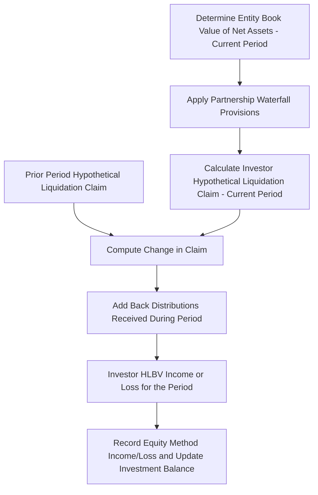
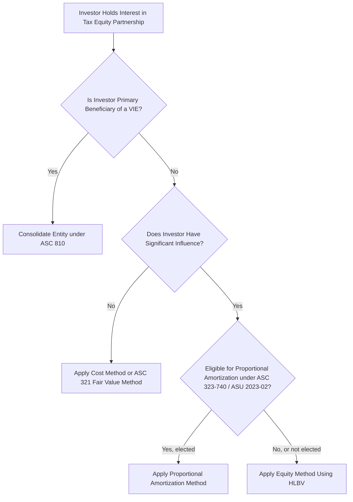

## Hypothetical Liquidation at Book Value Method

### Overview

The Hypothetical Liquidation at Book Value (HLBV) method is a balance-sheet-oriented equity accounting technique used to allocate income or loss from an investment in a partnership, LLC, or similar flow-through entity — most prominently in tax equity partnerships for renewable energy. Rather than allocating income based on stated ownership percentages, HLBV determines each partner's income allocation by measuring the change, period over period, in what each partner would hypothetically receive if the entity liquidated at book value on the balance sheet date.

### Why HLBV Exists

**Key Points**

- Tax equity partnerships (partnership flip structures) allocate cash, tax credits, and taxable income/loss according to complex, non-proportional, and time-varying formulas (e.g., 99%/1% pre-flip, 5%/95% post-flip) that do not track simple ownership percentages.
- Under U.S. GAAP, an investor with significant influence (typically 3%–50% ownership, or sometimes controlling but non-consolidated interests) generally applies the **equity method** of accounting (ASC 323).
- The equity method traditionally requires recognizing the investor's share of income/loss based on **substantive economic ownership**, which is difficult to determine directly when allocations are governed by a complex, multi-tiered distribution waterfall rather than a flat percentage.
- HLBV solves this by using the **partnership agreement's liquidation provisions** (the actual contractual waterfall that would apply if the entity were liquidated at book value) as a proxy for "substantive economic ownership" at each reporting date.

[Inference] HLBV became the dominant method specifically for tax equity partnership flip structures because those waterfalls change qualitatively over the life of the deal (pre-flip vs. post-flip allocation splits), which a static percentage-based equity method could not capture accurately; less complex equity investments generally do not require HLBV.

### Core Mechanics

**Key Points**

The HLBV calculation is performed at each reporting period (quarterly is standard for tax equity investors) using the following general steps:

1. **Determine the entity's book value of net assets** — total assets minus total liabilities, per GAAP books, as of the reporting date.
2. **Hypothetically liquidate at that book value** — apply the partnership/LLC agreement's actual liquidation waterfall (the same provisions that would govern a real liquidation) to determine how much each partner would receive.
3. **Calculate the claim amount for the current period** and the claim amount for the **prior period**.
4. **The investor's income/loss for the period equals**:

$$\text{HLBV Income (Loss)} = (\text{Current Period Claim} - \text{Prior Period Claim}) + \text{Distributions Received During Period}$$

This formula captures both the change in the hypothetical liquidation value and any actual cash distributed, since a distribution reduces the balance sheet claim without being an "economic loss" in itself.

### Diagram: HLBV Period-over-Period Calculation Flow



### Applying the Liquidation Waterfall

**Key Points**

The waterfall applied under HLBV mirrors the actual contractual liquidation provisions in the partnership/LLC agreement, typically including (in priority order):

1. Payment of the entity's liabilities and liquidation expenses.
2. Return of capital to partners with priority returns or preferred capital accounts (if any).
3. Allocation of remaining proceeds according to the **specific percentage splits defined for liquidation** — which may or may not be identical to the operating-period cash distribution percentages.
4. Any **make-whole or catch-up provisions** that adjust final allocations to true up capital account balances to the intended economic deal.

[Inference] The precision required in mapping the actual partnership agreement's liquidation article to the HLBV calculation is significant; errors in this mapping (e.g., using the operating distribution waterfall instead of the true liquidation waterfall specified in the agreement) are a commonly cited source of HLBV computation errors in practice, though the frequency of such errors is not something that can be objectively quantified here.

### Practical Numerical Example

**Example**



```
Simplified Facts:
  Entity Book Value of Net Assets - Beginning of Period  = $40,000,000
  Entity Book Value of Net Assets - End of Period         = $37,500,000
  Investor's Liquidation Waterfall Allocation             = 99% (pre-flip period)
  Cash Distribution Paid to Investor During Period        = $1,200,000

Step 1 - Investor's Hypothetical Claim, Beginning of Period:
   = $40,000,000 × 99% = $39,600,000

Step 2 - Investor's Hypothetical Claim, End of Period:
   = $37,500,000 × 99% = $37,125,000

Step 3 - Change in Claim:
   = $37,125,000 - $39,600,000 = ($2,475,000)

Step 4 - HLBV Income (Loss) for the Period:
   = ($2,475,000) + $1,200,000 (distribution received)
   = ($1,275,000)

Interpretation: The investor records a loss of $1,275,000 for the period under
the equity method, driven primarily by the entity's book value decline
(largely attributable to tax depreciation reducing GAAP net assets in early years),
partially offset by the cash distribution received.
```

[Inference] This example is illustrative of the calculation mechanics only; real HLBV calculations require full multi-tier waterfall modeling (capital accounts, minimum gain chargebacks, and catch-up provisions) that this simplified single-percentage illustration does not capture.

### Why Tax Equity Investments Frequently Show HLBV Losses Early and Income Later

**Key Points**

- In the early years of a partnership flip, the entity's book net assets **decline rapidly** because GAAP depreciation (often MACRS-based or a GAAP-specific depreciation policy) reduces the carrying value of the underlying project assets faster than cash is generated.
- Because the investor typically holds a high percentage allocation (e.g., 99%) during this pre-flip period, this book value decline flows through almost entirely to the investor as HLBV loss — frequently causing the investor's equity method investment balance to be **written down to zero** or reported as a liability if losses exceed the investment (subject to guidance on when losses in excess of investment should be recognized).
- After the flip point, the investor's allocation percentage drops sharply (e.g., to 5%), which limits further loss (or income) allocation to a much smaller share of ongoing changes in book value, even though the investor may still be receiving meaningful cash distributions.
- This produces the characteristic "large losses upfront, minimal income/loss thereafter" earnings pattern often observed in tax equity investor GAAP financial statements.

### Comparison: HLBV vs. Proportional/Percentage-of-Ownership Equity Method

| Dimension | HLBV Method | Proportional Ownership Method |
| --- | --- | --- |
| Basis for allocation | Actual liquidation waterfall in partnership agreement | Flat, static ownership percentage |
| Handles flip structures | Yes — captures pre-flip/post-flip allocation shifts | No — cannot reflect non-proportional waterfalls |
| Complexity | High — requires full waterfall/capital account modeling each period | Low — simple percentage multiplication |
| Common use case | Tax equity partnerships, complex JV structures | Simple JVs with pro-rata economics |
| GAAP basis | ASC 323 equity method, applying HLBV as the measurement technique | ASC 323 equity method, direct percentage application |

### Interaction with ASC 321/323 and Consolidation Analysis

**Key Points**

- Before applying HLBV, an investor must first determine the appropriate accounting model: whether the entity is a **variable interest entity (VIE)** requiring consolidation analysis under ASC 810, or whether equity method accounting under ASC 323 is appropriate.
- If the investor concludes it is not the primary beneficiary of a VIE (or the entity is a voting interest entity where the investor lacks control), and it has significant influence, the equity method applies, and HLBV becomes the mechanism for measuring that equity method income.
- Some investors, particularly certain financial institution tax equity investors, alternatively use the **proportional amortization method** (available for qualifying tax credit investments, historically limited to Low-Income Housing Tax Credit investments under ASC 323-740 and later expanded by ASU 2023-02 to other tax credit programs meeting specified criteria) instead of HLBV; the choice between HLBV/equity method and proportional amortization is an accounting policy election subject to specific eligibility criteria.

[Unverified] The exact scope of tax credit programs eligible for proportional amortization following ASU 2023-02 involves specific criteria (e.g., the investment must generate tax credits and other tax benefits, and substantially all of the return must be from tax credits and benefits) that should be verified against the current FASB codification and any subsequent amendments, since standard-setting in this area has been active in recent years.

### Common Practical Challenges

**Key Points**

- **Capital account complexity**: real partnership agreements include minimum gain chargebacks, qualified income offsets, and other Section 704(b) capital account maintenance provisions that must be correctly reflected in the hypothetical liquidation calculation, not just simplified percentage splits.
- **Timing of the flip point** in the HLBV model must track the same flip mechanics used in the tax/cash model (see flip-date circularity), since misalignment between the tax model's flip assumption and the accounting model's waterfall produces reconciliation differences.
- **Frequent remeasurement**: because HLBV requires a fresh liquidation calculation each period, changes in assumptions (e.g., revised depreciation estimates, revised cash flow forecasts affecting the entity's book value) can cause volatility in reported investor income from period to period.
- **Auditor scrutiny**: because HLBV is a judgment-intensive method requiring interpretation of complex partnership agreement provisions, it is a frequent area of auditor and technical accounting focus, particularly regarding whether the liquidation waterfall used matches the actual legal agreement terms precisely.

### Diagram: Decision Tree for Investor Accounting Method Selection



### Related Topics

- Proportional Amortization Method for Tax Credit Investments (ASU 2023-02)
- VIE Consolidation Analysis under ASC 810 for Tax Equity Structures
- Capital Account Maintenance and Section 704(b) Allocations
- Partnership Flip Point Determination and IRR-Target Waterfalls
- Managing Circular References in Tax Equity Models
- Modeling Compliance and Recapture Risk Scenarios
- GAAP vs. Tax Basis Differences in Renewable Energy Partnerships