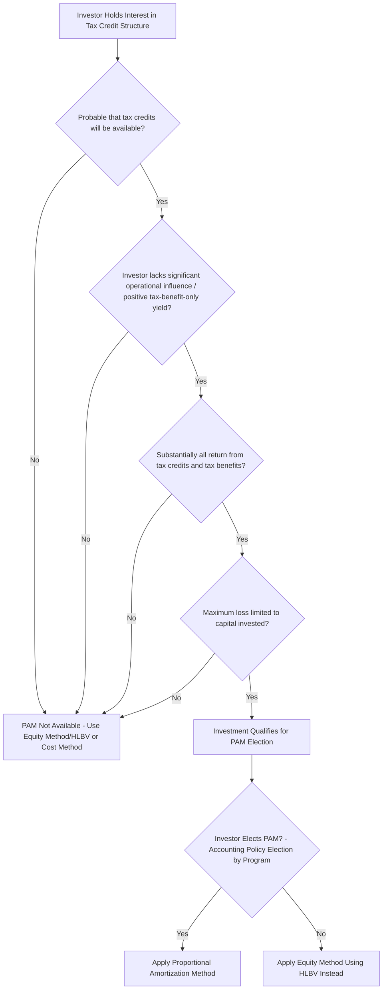

## Proportional Amortization Method Under ASU 2023-02

### Overview

ASU 2023-02, *Investments—Equity Method and Joint Ventures (Topic 323): Accounting for Investments in Tax Credit Structures Using the Proportional Amortization Method* (issued by FASB in March 2023), expanded the availability of the proportional amortization method (PAM) beyond Low-Income Housing Tax Credit (LIHTC) investments to other tax equity structures — most notably renewable energy investments generating Investment Tax Credits (ITC) and Production Tax Credits (PTC) — provided specific eligibility criteria are met. This method allows an investor to amortize the initial cost of a tax equity investment in proportion to the tax credits and other tax benefits received, presenting the net result as a single line within income tax expense (benefit) rather than as separate equity-method investment income/loss.

### Background: Why ASU 2023-02 Was Issued

**Key Points**

- Prior to ASU 2023-02, the proportional amortization method was available only to qualifying **affordable housing** (LIHTC) investments under legacy guidance (originally ASC 323-740, derived from EITF 94-1 and later codified).
- Renewable energy tax equity investors were generally limited to either the **equity method (using HLBV)** or, in some fact patterns, the **cost method** or fair value election under ASC 321.
- Stakeholders (particularly financial institutions and utilities investing in wind, solar, and other tax-advantaged energy projects) argued that HLBV produced earnings volatility that did not reflect the underlying economics of a tax-credit-driven investment, and that PAM's straight-line, cost-amortization-style presentation better matched how investors actually evaluate these investments internally.
- FASB responded by generalizing PAM eligibility criteria so that qualifying tax equity investments across a broader range of tax credit programs (not just LIHTC) could elect the method, effective for public business entities for fiscal years beginning after December 15, 2023, and for all other entities for fiscal years beginning after December 15, 2024, with early adoption permitted.

[Unverified] Effective dates and transition provisions should be verified against the final ASU text and any subsequent FASB staff Q&A or amendments, as standard-setting details are subject to interpretation nuances not fully captured in a general summary.

### Eligibility Criteria for Proportional Amortization

**Key Points**

An investment must meet **all** of the following conditions (as codified in ASC 323-740, as amended by ASU 2023-02) to qualify for a PAM election:

1. It is **probable** that the income tax credits allocable to the investor will be available.
2. The investor does not have the ability to exercise significant influence over the operating and financial policies of the underlying project *in a way that would call into question* application of the delayed equity contribution guidance — more specifically, the investor's projected yield based solely on the cash flows from the tax credits and other income tax benefits is positive.
3. The investor's return is derived from **income tax credits and other income tax benefits** (e.g., accelerated depreciation), and substantially all of the projected return is from these tax benefits, not from the receipt of tax-exempt income or other non-tax-benefit-driven returns.
4. The investor's **maximum potential loss** exposure is limited to its capital investment (i.e., the investor is not exposed to further losses beyond its investment, such as through guarantees or other obligations that would expose it to losses in excess of its investment).

[Inference] These four conditions are a general paraphrase of the codified criteria; the precise wording and the interaction between "substantially all of the return" and specific tax benefit types (ITC vs. PTC vs. accelerated depreciation) involves technical nuance that should be checked against the current ASC 323-740 text and any subsequent implementation guidance, since the criteria for PTC-generating investments in particular required specific interpretive attention when the ASU was finalized.

### Diagram: PAM Eligibility Decision Tree



### Core Mechanics of Proportional Amortization

**Key Points**

Under PAM, the investor:

1. **Amortizes the initial cost of the investment** in proportion to the income tax credits and other tax benefits allocated to the investor in each period, rather than tracking a fluctuating balance-sheet-based equity claim (as under HLBV).
2. **Presents the amortization expense net of the tax credits and other tax benefits received, within income tax expense (benefit)** on the income statement — this is the key presentation difference from the equity method, where HLBV income/loss is typically reported outside of tax expense (e.g., within pre-tax income or as a separate line).
3. Does **not** require period-by-period remeasurement of a hypothetical liquidation claim; instead, the amortization schedule is generally set at inception based on the projected pattern of tax credit and tax benefit delivery over the investment's expected life.

### Proportional Amortization Formula

The amortization for a given period is calculated as:

$$\text{Amortization Expense}_t = \text{Initial Investment} \times \frac{\text{Tax Benefits Recognized in Period } t}{\text{Total Expected Tax Benefits Over Investment Life}}$$

The net income statement impact within income tax expense (benefit) for the period is:

$$\text{Net Impact to Tax Expense}_t = \text{Tax Credits and Benefits Recognized}_t - \text{Amortization Expense}_t$$

### Practical Numerical Example

**Example**



```
Assumptions:
  Initial Investment (Investor Capital Contribution)     = $30,000,000
  Total Expected Tax Credits + Tax Benefits Over Life     = $36,000,000
  Tax Credits + Benefits Recognized in Year 1              = $9,000,000
     (25% of total expected tax benefits recognized in Year 1)

Step 1 - Proportional Amortization for Year 1:
   Proportion of Total Benefits Recognized = $9,000,000 / $36,000,000 = 25%
   Amortization Expense = $30,000,000 × 25% = $7,500,000

Step 2 - Net Impact to Income Tax Expense (Benefit) for Year 1:
   Net Impact = Tax Credits/Benefits Recognized - Amortization Expense
              = $9,000,000 - $7,500,000
              = $1,500,000 net benefit recognized within income tax expense (benefit)

Step 3 - Remaining Investment Balance, End of Year 1:
   = $30,000,000 - $7,500,000 = $22,500,000
```

[Inference] This example illustrates the general proportional amortization concept using a straight proportion-of-total-benefits approach; actual implementation may involve more granular period-by-period allocation schedules reflecting the specific timing of ITC recognition (typically front-loaded, e.g., substantially in the placed-in-service year) versus PTC or depreciation-driven benefits (spread over the credit or depreciation period), which affects the precise amortization curve.

### PAM vs. HLBV/Equity Method: Comparison Table

| Dimension | Proportional Amortization Method (PAM) | HLBV / Equity Method |
| --- | --- | --- |
| Measurement basis | Amortize cost in proportion to tax benefits delivered | Period-over-period change in hypothetical liquidation claim |
| Income statement presentation | Net within income tax expense (benefit) | Typically presented outside tax expense, often as pre-tax equity method income/loss |
| Volatility | Generally smoother, more predictable amortization pattern | Can produce large early losses and minimal later income due to book value/depreciation timing |
| Remeasurement frequency | Set at inception based on projected tax benefit schedule; adjusted for changes in projected benefits | Recalculated fresh every reporting period based on current book value |
| Eligibility | Requires meeting the four ASC 323-740 criteria (as amended) | Available whenever equity method applies (significant influence, no control) |
| Election | Accounting policy election, applied consistently to qualifying investments within a tax credit program | Not an election — follows from equity method applicability |

### Election and Consistency Requirements

**Key Points**

- The election to apply PAM is made **on a tax-credit-program-by-tax-credit-program basis** — meaning an investor could elect PAM for its ITC-generating solar investments while continuing to apply HLBV/equity method to other qualifying investments in a different tax credit program, but the election must be applied **consistently to all qualifying investments within a given program**.
- Once elected for a program, the entity generally cannot selectively apply PAM to some investments within that program and HLBV to others with similar facts — consistency within the elected population is required.
- Transition guidance under ASU 2023-02 permits either a **modified retrospective** or **retrospective** transition method for entities that already hold qualifying investments as of the adoption date.

[Unverified] The precise transition mechanics, including which prior periods must be restated under each transition option and any related disclosure requirements, should be confirmed against the ASU's transition and effective date section and any subsequent FASB clarifications, since transition elections often carry entity-specific nuances not captured in a general summary.

### Disclosure Requirements

**Key Points**

ASU 2023-02 introduced disclosure requirements for entities applying PAM, generally including:

- The nature of the tax credit programs in which the entity invests.
- The effect of tax credits and other income tax benefits recognized on the entity's financial position and results of operations.
- Amortization expense recognized within income tax expense (benefit) for the period.
- The balance of remaining tax equity investments accounted for under PAM.

[Unverified] The exact disclosure line items required are prescriptive under the amended ASC 323-740 disclosure paragraphs; preparers should reference the specific codification text for the complete disclosure checklist rather than relying on this general description.

### Interaction with Deal Structuring

**Key Points**

- Because PAM eligibility hinges on the investor's return being derived **substantially from tax credits and tax benefits** rather than from cash yield or residual value participation, deal structuring teams must coordinate closely with accounting/finance teams **before** finalizing partnership agreement economics, since a structure with meaningful residual value upside or significant cash-yield-driven returns for the investor could jeopardize PAM eligibility.
- The choice between structuring a deal to preserve PAM eligibility versus accepting HLBV/equity method treatment is a genuine trade-off investors weigh: PAM often produces more predictable, less volatile GAAP earnings, which can be a meaningful commercial consideration for tax equity investors evaluating competing investment opportunities, though it does not change the underlying economics or IRR of the deal itself — only its financial statement presentation.

### Related Topics

- Hypothetical Liquidation at Book Value (HLBV) Method
- VIE Consolidation Analysis under ASC 810 for Tax Equity Structures
- ASC 321 Fair Value Method for Equity Investments
- Legacy Proportional Amortization for LIHTC Investments (Pre-ASU 2023-02)
- Deal Structuring Considerations for PAM Eligibility
- Income Tax Expense Presentation and Effective Tax Rate Reconciliation for Tax Equity Investors
- Modeling Compliance and Recapture Risk Scenarios