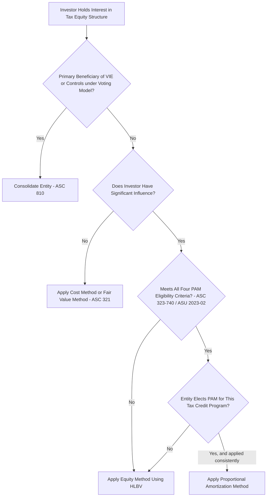
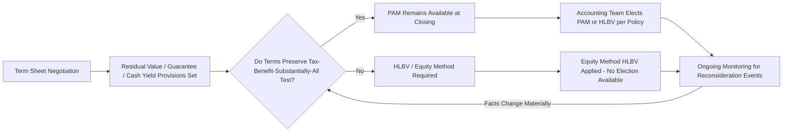

## Choosing Between Accounting Methods

### Overview

Selecting the appropriate GAAP accounting method for a tax equity investment is a multi-step technical assessment that moves through consolidation analysis, equity method applicability, and — where eligible — the choice between the proportional amortization method (PAM) and Hypothetical Liquidation at Book Value (HLBV). This module synthesizes the full decision framework, drawing together the consolidation (ASC 810), equity method (ASC 323/HLBV), fair value (ASC 321), and proportional amortization (ASC 323-740, as amended by ASU 2023-02) frameworks into a single practical decision path, along with the qualitative and commercial factors that inform the choice where more than one method is technically available.

### The Full Decision Sequence

**Key Points**

Accounting method selection for a tax equity investment generally proceeds through four sequential questions:

1. **Consolidation**: Is the investor the primary beneficiary of a variable interest entity (VIE), or does it otherwise control the entity under the voting interest model? If yes, consolidate.
2. **Significant influence**: If not consolidated, does the investor have significant influence over the entity (generally presumed at 3%–50% ownership for these structures, though influence is a facts-and-circumstances test, not a bright-line percentage)? If no, apply the cost method or fair value method under ASC 321.
3. **PAM eligibility**: If significant influence exists (equity method applies), does the investment meet the four criteria for proportional amortization under ASC 323-740 (as amended by ASU 2023-02)? If yes, the entity may elect PAM.
4. **Election and consistency**: If PAM-eligible, has the entity elected PAM for this tax credit program, and is that election applied consistently across all qualifying investments in the program? If PAM is not elected or not available, apply the equity method using HLBV.

### Diagram: Master Decision Tree for Accounting Method Selection

### Step 1: Consolidation Analysis (ASC 810)

**Key Points**

- Most tax equity partnership structures are analyzed as **variable interest entities (VIEs)** because the equity investors at risk (the sponsor's retained interest) often do not have sufficient equity at risk to finance activities without additional subordinated financial support, or because voting rights are not proportional to economics.
- The **primary beneficiary** is the party with (a) the power to direct the activities that most significantly impact the entity's economic performance, and (b) the obligation to absorb losses or the right to receive benefits that could be significant to the VIE.
- In typical partnership flip structures, the **sponsor** (developer) usually retains power over the significant activities (operating and maintaining the project, making major operational decisions), which often results in the **sponsor consolidating** the entity and the **tax equity investor accounting for its interest as a non-controlling, non-consolidated investment**.
- [Inference] This sponsor-consolidates/investor-does-not pattern is the typical market structure for partnership flip deals, but consolidation conclusions are always facts-and-circumstances-specific; a structure with different power and economics allocations could produce a different consolidation outcome, including scenarios where the tax equity investor itself must consolidate.

### Step 2: Significant Influence Assessment (ASC 323)

**Key Points**

- If the investor is not required to consolidate, the next question is whether the investor has **significant influence** over the entity's operating and financial policies.
- Significant influence is a **qualitative and quantitative** assessment; common indicators include representation on a governing board or management committee, participation in policy-making processes, material intercompany transactions, technological dependency, and extent of ownership.
- Tax equity investors in partnership flip structures typically **do** have significant influence (e.g., through approval rights over major decisions, budget approvals, or removal rights for the managing member for cause), even though they lack the power to direct day-to-day operations that would trigger consolidation.
- If significant influence is **absent** (rare in typical tax equity structures, but possible in passive, non-managing minority interests with no approval or protective rights beyond the ordinary), the investor applies the **cost method** or elects the **fair value option under ASC 321**.

### Step 3: PAM Eligibility Assessment

**Key Points**

Revisit the four eligibility criteria (detailed fully in the "Proportional Amortization Method Under ASU 2023-02" module):

1. Probable availability of allocated income tax credits.
2. Investor lacks the kind of influence that would call into question the tax-benefit-driven yield; the investor's projected yield based solely on tax credits and tax benefits is positive.
3. Substantially all of the investor's projected return derives from income tax credits and other income tax benefits.
4. Maximum loss exposure limited to the amount invested.

**A quick eligibility gate-check table:**

| Criterion | Typical ITC Solar/Wind Deal | Typical PTC Wind Deal | Deal with Meaningful Residual Value Upside for Investor |
| --- | --- | --- | --- |
| Tax credits probable | Usually yes | Usually yes | Usually yes |
| Return substantially from tax benefits | Usually yes | Requires closer analysis given multi-year PTC delivery profile | Often fails — cash/residual returns may be too significant |
| Loss capped at investment | Usually yes, if no investor guarantees | Usually yes | Depends on guarantee/recourse structure |
| Overall PAM eligibility | Typically eligible | Eligible, subject to structuring | Frequently ineligible |

[Inference] This table reflects general market tendencies observed in typical deal structures; PAM eligibility must always be assessed against the specific facts of each transaction rather than assumed based on technology type or credit type alone.

### Step 4: Electing Between PAM and HLBV Where Both Are Available

**Key Points**

Where an investment is technically PAM-eligible, the choice to elect PAM (versus continuing with HLBV/equity method) is influenced by several practical and commercial factors:

- **Earnings volatility preference**: PAM produces a smoother, more predictable amortization pattern tied to the projected delivery of tax benefits; HLBV can produce large early losses followed by minimal income, which some investors view as noisy relative to the deal's actual economics.
- **Presentation preference**: PAM nets the result within income tax expense (benefit), which some investors prefer because it keeps the tax-driven nature of the investment's return visible in the effective tax rate reconciliation, rather than embedding it in pre-tax equity method income/loss.
- **Systems and process readiness**: HLBV requires ongoing, period-by-period waterfall remeasurement infrastructure (capital account tracking, waterfall modeling); PAM requires an inception-date amortization schedule based on projected tax benefit delivery, which some finance teams find operationally simpler to maintain once established, though the initial schedule-setting exercise itself can be complex.
- **Consistency constraints**: because the PAM election must be applied consistently across all qualifying investments **within a given tax credit program**, an investor with a large portfolio of similar deals may weigh how a single election will apply across many current and future investments, not just the specific deal being evaluated.
- **Comparability across the portfolio**: an investor managing multiple tax credit programs (e.g., LIHTC, solar ITC, wind PTC) may elect PAM in some programs and retain HLBV in others, but should consider how the resulting financial statement presentation compares across its total tax equity portfolio for internal and external reporting clarity.

[Inference] These considerations are common practical factors cited in industry discussion of the ASU 2023-02 PAM expansion, but the relative weight given to each factor is inherently a matter of individual company judgment and reporting philosophy, not a standardized decision rule.

### Interaction with Deal Structuring Decisions

**Key Points**

- Because PAM eligibility depends on the investor's return being **substantially** tax-benefit-driven, structuring choices made well before closing — such as the size of any residual value participation, cash flow sweep mechanics, or minimum yield guarantees — can determine whether PAM remains available.
- Accounting and tax/structuring teams increasingly coordinate **during term sheet negotiation**, not just at financial statement close, because retrofitting a deal's structure post-closing to preserve PAM eligibility is generally not possible — the assessment is based on the investment's actual terms as negotiated.
- Some tax equity investors have developed **standard term sheet templates** designed to preserve PAM eligibility as a default structuring objective, reserving HLBV/equity method treatment for structures where PAM eligibility is not achievable or not desired.

### Ongoing Monitoring Requirements

**Key Points**

- Method selection is not necessarily a one-time determination: consolidation conclusions, significant influence assessments, and PAM eligibility should be **reassessed upon reconsideration events** — e.g., amendments to the partnership agreement, changes in governance rights, changes in projected tax benefit delivery that affect the "substantially all" test, or a change in the investor's other financial relationships with the entity that could create or eliminate a variable interest.
- If a previously PAM-eligible investment later fails a PAM criterion (e.g., a change in projected returns causes the substantially-all-tax-benefit test to fail), the entity would need to transition the investment to the equity method (HLBV), which introduces additional accounting complexity around measuring the investment's basis at the point of transition.

### Diagram: Interaction Between Structuring Decisions and Accounting Outcomes

### Summary Comparison of All Four Possible Outcomes

| Outcome | Governing Framework | Income Statement Presentation | Typical Trigger |
| --- | --- | --- | --- |
| Consolidation | ASC 810 | Full consolidation, NCI for investor's interest | Investor is primary beneficiary of VIE or controls under voting model |
| Cost / Fair Value Method | ASC 321 | Fair value changes in net income, or cost less impairment | No significant influence |
| Equity Method (HLBV) | ASC 323 | Equity method income/loss, typically outside tax expense | Significant influence exists; PAM not available or not elected |
| Proportional Amortization | ASC 323-740 (ASU 2023-02) | Net amortization within income tax expense (benefit) | Significant influence exists; PAM eligibility criteria met and elected |

### Related Topics

- Hypothetical Liquidation at Book Value (HLBV) Method
- Proportional Amortization Method Under ASU 2023-02
- VIE Consolidation Analysis under ASC 810 for Tax Equity Structures
- ASC 321 Fair Value Method for Equity Investments
- Significant Influence Assessment Under ASC 323
- Deal Structuring Considerations for PAM Eligibility
- Reconsideration Events and Transition Accounting Between Methods