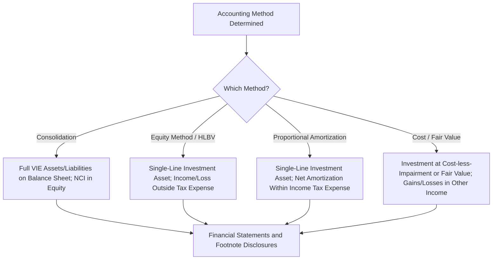

## Financial Statement Presentation and Disclosure

### Overview

Once the appropriate accounting method for a tax equity investment has been determined (consolidation, equity method/HLBV, proportional amortization, or fair value/cost method), the investor must translate that conclusion into specific balance sheet, income statement, and disclosure treatment. This module covers where each method's effects land in the financial statements, the required footnote disclosures under each framework, and the presentation nuances that distinguish tax equity investments from ordinary equity method holdings.

### Balance Sheet Presentation by Method

**Key Points**

- **Consolidation (ASC 810)**: The tax equity investor (if consolidating, atypical in the sponsor-consolidates pattern but possible depending on facts) presents the full assets and liabilities of the VIE on its balance sheet, with the other partner's interest presented as **noncontrolling interest (NCI)** within equity.
- **Equity Method / HLBV (ASC 323)**: The investment is presented as a **single-line asset** — "Investment in tax equity partnership" or similar — initially at cost, subsequently adjusted for the investor's share of HLBV income/loss and reduced by distributions received. If HLBV losses exceed the carrying value of the investment, the investment is typically written down to zero (with further losses generally not recognized beyond zero unless the investor has additional funding obligations or guarantees creating further exposure).
- **Proportional Amortization Method (ASC 323-740)**: The investment is also presented as a **single-line asset**, initially recorded at cost and subsequently amortized down over the life of the investment per the proportional amortization schedule — but unlike HLBV, the reduction in carrying value is a scheduled amortization tied to tax benefit delivery, not a remeasured liquidation claim.
- **Cost / Fair Value Method (ASC 321)**: The investment is presented at cost less impairment (if the practicability exception applies) or at fair value with changes recognized in net income, depending on the measurement alternative elected.

### Income Statement Presentation by Method

**Key Points**

This is the area of **greatest presentation divergence** between methods, and a frequent area of financial statement user confusion if not clearly disclosed:

| Method | Where the Effect Is Recognized | Typical Line Item |
| --- | --- | --- |
| Consolidation | Full revenue/expense of the VIE consolidated; NCI share backed out below net income | Various operating lines; "Net income attributable to noncontrolling interests" |
| Equity Method / HLBV | Investor's share of HLBV income/loss | Typically a distinct line within (or near) pre-tax income, e.g., "Equity in earnings (losses) of tax equity investments" — outside of income tax expense |
| Proportional Amortization | Net of tax credits/benefits recognized and amortization expense | Within "Income tax expense (benefit)" |
| Cost / Fair Value | Impairment losses (cost method) or fair value gains/losses (fair value method) | Typically within other income/expense or a fair value adjustments line |

[Inference] Exact line-item labeling varies by company and industry practice; the table reflects the general placement convention described in accounting literature and observed in practice, not a single mandated line-item name.

### Diagram: Presentation Flow From Method to Financial Statement Line

### Effective Tax Rate Reconciliation Impact

**Key Points**

- Because **PAM nets the tax credit benefit against amortization expense within income tax expense**, it directly affects the investor's **effective tax rate (ETR)** — the tax credits reduce reported tax expense, which is then reconciled in the standard ASC 740 rate reconciliation table (typically as a discrete reconciling item, e.g., "tax credits, net of amortization").
- Under **HLBV/equity method**, the tax credits themselves are still realized by the investor on its tax return, but the **GAAP income statement effect** of the underlying investment (the HLBV income/loss) is reported **outside** income tax expense, meaning the ETR reconciliation shows the tax credit as a discrete rate reconciling item, while the HLBV income/loss appears elsewhere in pre-tax income — creating two separate, sometimes offsetting, financial statement effects rather than one netted effect.
- This distinction is one of the primary reasons investors care about the PAM-vs-HLBV election: PAM produces a cleaner, single-line "cost of the tax credit investment" narrative within the tax provision, which analysts and investors may find easier to interpret than two separate line items.

### Required Disclosures — Proportional Amortization Method

**Key Points**

Per ASC 323-740 as amended by ASU 2023-02, entities applying PAM should disclose, at a minimum:

- The nature of their investments in tax credit structures and the tax credit programs in which they invest (e.g., ITC, PTC, LIHTC, New Markets Tax Credit).
- The effect of the tax credits and other tax benefits recognized on the financial statements, including the amount of tax credits and other tax benefits recognized during the period.
- The amount of amortization recognized as a component of income tax expense (benefit) for investments accounted for under PAM.
- The balance of remaining tax equity investments accounted for under the proportional amortization method.
- Any commitments or contingent commitments (e.g., unfunded capital commitments to the partnership).

[Unverified] This list synthesizes the general categories of disclosure introduced by ASU 2023-02; the precise disclosure paragraph language and any quantitative thresholds should be confirmed against the current ASC 323-740 disclosure section, as disclosure requirements are often more granular and prescriptive than a general summary can fully capture.

### Required Disclosures — Equity Method / HLBV Investments

**Key Points**

Standard ASC 323 equity method disclosures apply, generally including:

- The name of each significant investee and the percentage ownership (or an appropriate description of the allocation mechanics where ownership percentage is not representative of the economics, such as flip structures).
- Summarized financial information of the investee(s) (assets, liabilities, revenues, net income) when investments are individually or in the aggregate significant.
- The accounting policies followed with respect to investments in common stock (or partnership interests), including a description of the HLBV methodology used.
- Any difference between the carrying amount of the investment and the underlying equity in net assets, and the accounting treatment of that difference (e.g., basis differences related to depreciation timing).
- Restrictions on the ability of investees to transfer funds (e.g., distribution restrictions common in tax equity partnership agreements pending flip or other conditions).

### Required Disclosures — Consolidated VIEs

**Key Points**

Per ASC 810, a reporting entity that consolidates a VIE should disclose:

- The **carrying amounts and classification** of the VIE's assets and liabilities included in the consolidated balance sheet, including identification of assets that can only be used to settle VIE obligations and liabilities for which creditors do not have recourse to the general credit of the primary beneficiary.
- Terms of arrangements that could require the reporting entity to provide financial support to the VIE.
- Any significant judgments and assumptions made in determining whether the entity is the primary beneficiary.

### Combined Illustrative Disclosure Table (Portfolio Approach)

**Example**

A tax equity investor with a diversified portfolio across programs and methods might present a summary disclosure table similar to:

| Tax Credit Program | Accounting Method | Carrying Value (End of Period) | Tax Credits/Benefits Recognized (Period) | Amortization/HLBV Income (Loss) (Period) |
| --- | --- | --- | --- | --- |
| Solar ITC Portfolio | Proportional Amortization | $145,000,000 | $28,500,000 | ($26,100,000) amortization |
| Wind PTC Portfolio | Equity Method (HLBV) | $62,000,000 | $9,750,000 (tax credit only, separate line) | ($4,200,000) HLBV loss |
| LIHTC Portfolio | Proportional Amortization | $210,000,000 | $31,000,000 | ($29,800,000) amortization |

[Inference] This illustrative table format reflects a plausible way a diversified tax equity investor might organize portfolio-level disclosure to aid financial statement users in comparing programs accounted for under different methods; it is not a mandated disclosure format, and actual company disclosures vary in structure and granularity.

### Segment Reporting and MD&A Considerations

**Key Points**

- Beyond footnote disclosure, tax equity investments often warrant discussion in **Management's Discussion and Analysis (MD&A)**, particularly regarding: (a) the impact of tax credit investment activity on the effective tax rate, (b) expected future funding commitments, and (c) any known trends (e.g., changes in tax credit program availability, such as shifts driven by legislative changes to ITC/PTC eligibility) that could affect future investment levels or accounting outcomes.
- For financial institutions with tax equity investment portfolios material to capital or earnings, **segment disclosures** may separately identify the tax equity investment portfolio's contribution to segment results, particularly where the effective tax rate impact is a meaningful driver of overall profitability.
- **Non-GAAP or supplemental metrics**: some investors present supplemental disclosures on the "cash yield" or "IRR" of their tax equity portfolio in earnings materials, distinct from GAAP presentation, providing investors with the underlying deal economics that GAAP HLBV or PAM presentation may not fully convey on its own.

### Transition and Comparative Period Presentation

**Key Points**

- Entities adopting ASU 2023-02 and electing to transition existing HLBV-accounted investments to PAM must apply the elected transition method (modified retrospective or retrospective) consistently and disclose the nature of and reason for the change, along with the quantitative effect on affected financial statement line items for the periods presented.
- Where a **retrospective transition** is elected, prior period comparative financial statements are restated to reflect PAM presentation as if it had been applied throughout the periods presented, which requires recasting prior period income tax expense, pre-tax equity method income/loss, and the related ETR reconciliation table.
- Where a **modified retrospective transition** is elected, prior periods are not restated, and a cumulative-effect adjustment is generally recognized in the opening balance of retained earnings (or other appropriate equity component) in the period of adoption, with disclosure of the nature and amount of that adjustment.

[Unverified] The specific mechanics distinguishing the modified retrospective and retrospective transition options, and any required tabular reconciliation of previously reported to recast amounts, should be verified against the ASU's transition guidance, since transition disclosure requirements are often detailed and entity-specific in application.

### Common Presentation Pitfalls

**Key Points**

- Presenting HLBV income/loss **within** income tax expense (mirroring PAM presentation) when the equity method is actually being applied — this misstates the nature of the equity method result and can distort the effective tax rate reconciliation.
- Failing to disaggregate disclosure across tax credit programs when an investor holds investments accounted for under **different methods** (e.g., PAM for solar ITC, HLBV for wind PTC), producing footnotes that obscure rather than clarify how each portfolio segment performs.
- Omitting disclosure of **unfunded commitments** to tax equity partnerships, which can be material given the multi-year capital contribution schedules common in these structures.
- Inconsistent labeling of the investment line item across periods (e.g., switching between "Investment in tax equity partnerships" and "Other investments") without clear disclosure, which can obscure trend analysis for financial statement users.

### Related Topics

- Hypothetical Liquidation at Book Value (HLBV) Method
- Proportional Amortization Method Under ASU 2023-02
- Choosing Between Accounting Methods
- ASC 740 Effective Tax Rate Reconciliation Mechanics
- VIE Consolidation Disclosures Under ASC 810
- Transition Accounting and Cumulative-Effect Adjustments
- Unfunded Capital Commitment Disclosure in Tax Equity Partnerships