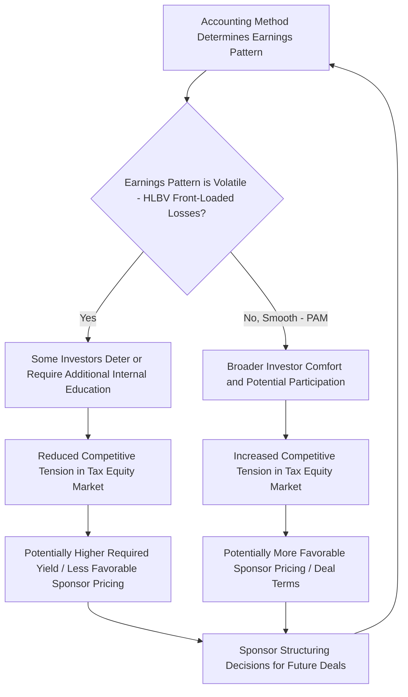

## Effect of Accounting Treatment on Investor Appetite

### Overview

GAAP accounting treatment is not merely a reporting formality for tax equity investments — it materially influences which institutions are willing to invest, how much capital they allocate, the pricing they demand, and the structures they will accept. This module examines how the choice between consolidation, equity method (HLBV), and proportional amortization (PAM) feeds back into investor demand, capital allocation decisions, and deal structuring behavior across the tax equity market.

### Why Accounting Treatment Matters to Investors

**Key Points**

- Most tax equity investors are **regulated financial institutions** (banks, insurance companies) or **large corporates** for whom reported GAAP earnings, effective tax rate (ETR), and regulatory capital treatment are closely scrutinized by regulators, rating agencies, and equity analysts.
- A tax equity investment's **economic return (IRR)** is set contractually and does not change based on the accounting method selected — but the **pattern, timing, and location of reported earnings** absolutely does change, and that reported pattern affects internal capital allocation decisions, incentive compensation tied to reported earnings, and external investor/analyst perception.
- Because tax equity deals are often held for 5–10+ years, the cumulative earnings volatility introduced by a chosen accounting method compounds across a large multi-deal portfolio, making method selection a portfolio-level strategic consideration, not just a per-deal bookkeeping choice.

[Inference] The degree to which accounting treatment drives investment appetite (versus underlying economics) varies by investor type; sophisticated tax equity investors with dedicated tax credit investment groups may weight economics more heavily, while investors newer to the asset class or those with less internal accounting flexibility may weight GAAP presentation more heavily. This is a general market tendency, not a documented universal rule.

### HLBV Volatility as a Historical Barrier to Entry

**Key Points**

- Before ASU 2023-02, the HLBV method was the primary GAAP option for many tax equity structures outside of LIHTC, and its characteristic **front-loaded loss pattern** was widely cited by market participants as a deterrent to investor participation, particularly among investors unfamiliar with tax equity earnings mechanics.
- A tax equity investment applying HLBV can show **significant GAAP losses in years 1–3**, even though the investment is generating a strong contractual after-tax IRR once tax credits, depreciation benefits, and eventual cash distributions are considered — this mismatch between "GAAP loss" and "actual positive economic return" historically confused investors, analysts, and in some cases internal risk committees evaluating whether to approve additional tax equity allocations.
- Financial institution investors in particular have historically needed to build **internal investor education processes** (for credit committees, boards, and external analysts) explaining why HLBV losses in early years do not indicate an underperforming or troubled investment.
- [Inference] This dynamic is widely discussed as a contributing factor to the tax equity market's historically concentrated investor base (a relatively small number of large banks and insurers), though the relative weight of accounting complexity versus other participation barriers (structuring complexity, deal size minimums, tax capacity requirements) cannot be precisely apportioned from general market commentary alone.

### How ASU 2023-02 Was Expected to Expand the Investor Base

**Key Points**

- By making PAM available to renewable energy and other tax credit investments (not just LIHTC), ASU 2023-02 was widely expected by market participants to **reduce a structural accounting barrier** that had discouraged some potential investors — particularly those newer to tax equity or those whose internal reporting processes were not built to explain HLBV volatility.
- PAM's smoother, cost-amortization-style presentation, netted within income tax expense, was viewed as more intuitive for boards, analysts, and regulators to interpret: the tax credit investment functions similarly, in presentation terms, to a discount on tax expense rather than a volatile equity method result.
- Renewable energy industry associations and market commentators publicly supported the ASU during its comment period specifically on the basis that it could **broaden the investor base** for wind, solar, and storage tax equity, potentially increasing the overall supply of tax equity capital available to project developers.

[Unverified] Whether ASU 2023-02 has, in the years since issuance, produced a measurable expansion in the actual population of tax equity investors (as opposed to simply changing accounting treatment for existing investors) is an empirical market question that would require current market data to assess; this section describes the rationale and expectations articulated around the standard's issuance, not a confirmed subsequent outcome, and should be checked against current market reporting for the latest state of investor participation trends.

### Pricing Implications

**Key Points**

- Accounting treatment can influence **investor pricing (required yield)** indirectly: an investor facing GAAP earnings volatility under HLBV may build in additional yield compensation, or may simply decline to participate, reducing competitive tension and potentially raising the cost of tax equity capital for sponsors in a given deal.
- Conversely, PAM eligibility can make a deal **more attractive on a risk-adjusted GAAP-presentation basis**, potentially widening the pool of interested investors and improving competitive pricing dynamics for sponsors, all else being equal.
- **Structuring toward PAM eligibility** (e.g., limiting investor residual value participation to preserve the "substantially all tax benefit" test) can itself have an economic cost — if an investor would otherwise have valued residual upside participation, removing it to preserve PAM eligibility may require the sponsor to offer a higher current-period tax equity price or greater tax benefit allocation elsewhere to compensate the investor for the forgone upside.

[Inference] The relationship between accounting treatment and pricing is discussed qualitatively in tax equity market commentary, but precise quantification of a "PAM pricing premium" or "HLBV pricing discount" would require proprietary deal data not available for general reference; this section describes the directional logic market participants commonly articulate, not a measured pricing differential.

### Effect on Investor Type and Portfolio Strategy

**Key Points**

- **Banks and insurance companies** subject to significant regulatory capital and earnings scrutiny have historically been the dominant tax equity investor class; their appetite is particularly sensitive to GAAP presentation because reported earnings volatility can affect regulatory capital ratios, analyst-facing earnings guidance, and rating agency commentary.
- **Corporates with less regulatory earnings scrutiny** (e.g., some technology companies or industrials with tax equity programs) may weight GAAP volatility less heavily relative to the underlying economics and ESG/sustainability objectives associated with renewable energy tax equity investments.
- The **election consistency requirement** under PAM (applied consistently within a tax credit program) means large, diversified tax equity investors must think about accounting method selection at a **program level**, potentially influencing how they structure new deal pipelines to align with an existing PAM election, or conversely deciding to segregate new investment types into distinct programs to preserve flexibility.

### Diagram: Feedback Loop Between Accounting Treatment and Investor Appetite

### Structuring Behavior Shifts Driven by Accounting Considerations

**Key Points**

- Sponsors and their advisors increasingly evaluate **PAM eligibility preservation** as an explicit structuring objective during term sheet negotiation, sometimes trading off certain investor upside participation rights specifically to keep the deal within PAM's "substantially all tax benefit" criterion.
- Deal teams may present **side-by-side accounting impact analyses** to prospective investors early in the marketing process (showing projected HLBV versus PAM earnings patterns) as part of the investor pitch, particularly for investors newer to a given asset class or credit type, to proactively address the GAAP volatility question before it becomes a diligence obstacle.
- For **PTC-based wind deals**, where the multi-year credit delivery profile and generation-based variability can complicate the "substantially all tax benefit" PAM test relative to a more front-loaded ITC solar deal, sponsors and investors may need more detailed technical accounting analysis before committing to a structure, potentially affecting deal timelines.

### Interaction with Broader Tax Equity Market Capacity

**Key Points**

- The overall supply of tax equity capital in the market is influenced by many factors beyond accounting treatment — including tax law changes affecting credit availability and transferability (e.g., the Inflation Reduction Act's introduction of **transferability** and **direct pay** options as alternatives to traditional tax equity partnerships), interest rate environment, and general investor risk appetite for renewable energy assets.
- [Inference] Accounting treatment should be understood as one contributing factor among several structural and macroeconomic factors affecting tax equity market capacity and investor appetite, rather than the dominant driver; overall market capacity dynamics are better assessed through current market surveys and transaction volume data than through accounting standard analysis alone.
- The emergence of **credit transferability** under IRC Section 6418 has itself created a partial substitute for traditional tax equity structures in some cases, meaning that accounting treatment considerations under ASC 323/810 are increasingly evaluated by sponsors **alongside** the simpler alternative of selling credits directly to a taxable buyer without the equity method or PAM complexity at all — a dynamic that indirectly affects how much weight accounting presentation carries in a sponsor's overall capital-raising strategy.

### Summary Table: Investor Appetite Considerations by Method

| Method | Typical Investor Comfort Level | Key Appetite Driver | Common Investor Type Most Affected |
| --- | --- | --- | --- |
| Consolidation | N/A (typically sponsor-side outcome) | Full balance sheet/earnings absorption | Sponsors, not tax equity investors |
| Equity Method (HLBV) | Requires investor sophistication/education | Front-loaded loss volatility | Banks, insurers with earnings/regulatory scrutiny |
| Proportional Amortization (PAM) | Generally higher comfort, smoother presentation | Predictable amortization within tax expense | Broader investor base, including newer entrants |
| Cost / Fair Value | Less common for typical tax equity structures | Straightforward but less common fit for these deals | Passive minority investors without significant influence |

### Related Topics

- Hypothetical Liquidation at Book Value (HLBV) Method
- Proportional Amortization Method Under ASU 2023-02
- Choosing Between Accounting Methods
- Financial Statement Presentation and Disclosure
- Tax Credit Transferability Under IRC Section 6418
- Tax Equity Market Capacity and Investor Base Trends
- Deal Structuring Considerations for PAM Eligibility