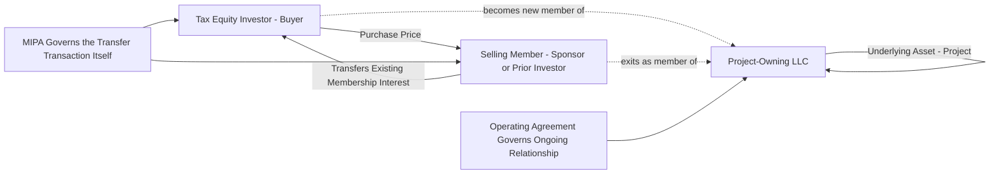

## Membership Interest Purchase Agreements


### Overview

A Membership Interest Purchase Agreement (MIPA) is the acquisition document used when a tax equity investor purchases an existing membership interest in an LLC that owns (directly or indirectly) a renewable energy project, as opposed to making a direct capital contribution to a newly formed partnership. MIPAs are common in transactions where the sponsor has already formed and, in some cases, operated the project-owning entity before bringing in the tax equity investor, or where a tax equity investor is acquiring an interest from another existing investor (a secondary transfer). This module covers the structure, key provisions, and tax/accounting interaction points distinguishing a MIPA from a direct operating agreement capital contribution structure.

### MIPA vs. Direct Capital Contribution: Structural Distinction

**Key Points**

- Under a **capital contribution structure**, the tax equity investor becomes a member by contributing cash directly to the LLC in exchange for a newly issued membership interest, governed by the operating agreement.
- Under a **MIPA structure**, the tax equity investor purchases an **existing membership interest** from an existing member (typically the sponsor or an affiliate, or in secondary transactions, another tax equity investor), with proceeds flowing to the selling member rather than into the entity itself.
- The choice between these structures affects **basis step-up considerations, transfer tax treatment, assumption of pre-existing liabilities, and the timing of when the project must already exist** (a MIPA generally implies the interest being purchased already exists and often that the project has some level of completion or is already placed in service, whereas capital contribution structures are common for pre-construction or construction-stage investments).
- [Inference] The relative prevalence of MIPA structures versus direct capital contribution structures varies by deal type; MIPAs are particularly common in secondary market transactions (an existing tax equity investor selling its interest to another investor) and in acquisitions of interests in operating (already placed-in-service) projects, though this is a general market tendency rather than a fixed rule.

### Core MIPA Structure and Sections

**Key Points**

A typical MIPA follows a standard M&A purchase agreement architecture, adapted for the tax equity/renewable energy context:

1. **Purchase and sale provisions** — identification of the specific membership interest(s) being sold, purchase price, and closing mechanics.
2. **Purchase price adjustments** — working capital adjustments, post-closing true-ups tied to actual versus estimated project performance metrics, or holdbacks pending resolution of open items (e.g., outstanding permits, interconnection milestones).
3. **Representations and warranties** — extensive reps regarding the target entity, the underlying project, title to assets, tax matters, compliance with law, environmental conditions, material contracts (PPA, interconnection agreement, EPC contract, O&M agreement), and absence of undisclosed liabilities.
4. **Covenants** — pre-closing covenants (operating the business in the ordinary course, cooperation on regulatory approvals) and post-closing covenants (further assurances, tax return cooperation, confidentiality).
5. **Conditions to closing** — customary conditions (accuracy of reps at closing, no material adverse effect, receipt of required consents/approvals, delivery of closing deliverables) plus renewable-energy-specific conditions (interconnection agreement in place, PPA effectiveness, permits obtained, independent engineer's report, tax equity-specific diligence items).
6. **Indemnification** — allocation of post-closing liability risk between buyer (investor) and seller (sponsor/prior member), including survival periods, caps, baskets/deductibles, and specific indemnities for tax matters (including recapture risk).
7. **Tax matters provisions** — allocation of responsibility for pre-closing versus post-closing tax liabilities, treatment of the transaction for tax purposes, and cooperation on tax return preparation and any IRS examination.

### Diagram: MIPA Transaction Structure and Cash/Interest Flow



### Key Diligence Areas Specific to Tax Equity MIPAs

**Key Points**

- **Tax basis and eligible basis confirmation** — buyer's diligence must confirm the ITC-eligible basis calculation underlying the target entity's tax model, since the buyer is stepping into an existing capital account and allocation structure rather than establishing one fresh.
- **Recapture exposure review** — because the interest being acquired may already be partway through (or entirely past) the 5-year ITC compliance period, diligence must assess what recapture exposure, if any, attaches to the interest, and whether the transfer itself could trigger a recapture event under the ownership-change rules (a transfer of 50% or more of a partner's interest can itself be a recapture trigger).
- **Existing operating agreement review** — since the MIPA buyer is stepping into rights and obligations under an **already-existing operating agreement**, diligence must confirm that agreement's flip mechanics, consent rights, and allocation provisions align with the buyer's expectations, as the MIPA typically does not rewrite the operating agreement (though it may be amended concurrently with closing).
- **Existing project contracts** — PPA, interconnection agreement, EPC/O&M agreements, and any existing financing (construction or term debt) must be reviewed for change-of-control provisions that could be triggered by the membership interest transfer.
- **Historical tax return review** — because the interest already has a history, the buyer inherits (or must carefully carve out via indemnity) exposure to historical tax positions taken by the entity before the buyer's involvement.

[Inference] The relative depth of diligence in each area is deal- and buyer-specific; the areas listed reflect commonly emphasized diligence categories in tax equity secondary and existing-interest acquisitions based on general market practice, not a fixed checklist mandated by any single authority.

### Purchase Price Mechanics

**Key Points**

- Purchase price is typically determined based on the **discounted value of the remaining projected tax benefits and cash distributions** attributable to the interest being acquired, reflecting the buyer's required after-tax yield on the remaining life of the investment.
- **Purchase price adjustment mechanisms** commonly include:
  - True-ups based on actual project performance (e.g., energy production) between signing and closing.
  - Adjustments for changes in the tax model assumptions (e.g., revised eligible basis, updated depreciation schedules) discovered during diligence.
  - Escrow or holdback amounts pending resolution of identified open items (permitting, interconnection, warranty claims).
- Where the interest being purchased is from an **existing tax equity investor** (a secondary sale), pricing dynamics differ from a primary sponsor-to-investor sale because the selling investor has already realized some portion of the tax benefits, meaning the buyer's return is based on the **remaining** (not full) stream of future benefits.

### Tax Treatment of the Purchase

**Key Points**

- A purchase of a membership interest in an entity treated as a **partnership** for tax purposes generally results in the buyer acquiring a Section 743(b) basis adjustment opportunity if the partnership has (or makes) a **Section 754 election**, allowing the buyer to step up its share of the inside basis of partnership assets to reflect the purchase price paid, which can affect future depreciation deductions available to the buyer.
- Absent a Section 754 election, the buyer's outside basis in the membership interest reflects the purchase price, but the buyer's share of inside basis (and therefore depreciation) does not adjust to match, potentially creating a mismatch that reduces the buyer's near-term tax benefits relative to what a fresh capital contribution structure might provide.
- [Unverified] Whether making (or having in place) a Section 754 election is advantageous depends on the specific relationship between purchase price and the selling member's existing capital account/inside basis, and requires deal-specific tax modeling; this is a standard partnership tax consideration but its numerical impact cannot be generalized without deal-specific facts.
- The purchase may also raise **technical termination** considerations for the underlying partnership under prior law concepts, though the technical termination rule under former Section 708(b)(1)(B) was repealed for partnership taxable years beginning after December 31, 2017, meaning a sale of a partnership interest — even a large one — generally no longer causes automatic technical termination of the partnership for federal tax purposes.

### Indemnification Structure Specific to Tax Matters

**Example**

A typical tax-specific indemnification structure in a MIPA might include:



```
Pre-Closing Tax Indemnity (Seller to Buyer):
  - Covers tax liabilities and recapture exposure attributable to periods
    before closing, including any recapture triggered by pre-closing events
    (even if the recapture "crystallizes" after closing due to a later
    compliance period trigger tied to a pre-closing act).

Post-Closing Tax Indemnity (Buyer to Seller, less common but sometimes mutual):
  - Covers tax positions or elections made by the buyer post-closing that
    could affect seller's residual interest (if seller retains any) or
    seller's own indemnification exposure on other deals in a portfolio sale.

Survival Period: Tax representations and the related indemnity often survive
  for a longer period than general representations (e.g., through the
  expiration of the applicable statute of limitations plus a defined tail),
  reflecting the multi-year nature of ITC recapture exposure (5-year
  compliance period) and potential IRS audit cycles.
```

[Inference] The specific survival periods, caps, and basket amounts shown are illustrative of common M&A indemnification structuring logic applied to the tax equity context; actual negotiated terms vary significantly by deal size, counterparty relationship, and the presence of any tax credit insurance policy that may substitute for or supplement seller indemnification.

### Interaction with Tax Credit Insurance

**Key Points**

- MIPAs increasingly reference or are conditioned upon the buyer's (or seller's) procurement of a **tax credit insurance policy** covering recapture and disallowance risk, which can reduce reliance on seller indemnification and simplify negotiation of indemnity caps and survival periods.
- Where insurance is in place, the MIPA's tax indemnification provisions are typically drafted to **coordinate with the insurance policy** — e.g., providing that the buyer must first pursue recovery under the insurance policy before seeking indemnification from the seller for covered losses, with the seller's indemnity effectively serving as a backstop for any gap in coverage (retention amounts, policy exclusions, or a claim denial).

### Closing Deliverables Checklist (Illustrative)

**Example**

Common closing deliverables in a tax equity MIPA include:

- Assignment and assumption of membership interest.
- Amended and restated (or joinder to existing) operating agreement reflecting the buyer as a member.
- Officer's certificates confirming accuracy of representations as of closing.
- Legal opinions (tax opinion regarding partnership classification and allocation validity; corporate/LLC opinions regarding due authorization and enforceability).
- Payoff letters and lien releases for any existing project-level debt being refinanced or assumed.
- Evidence of required third-party consents (PPA counterparty, interconnection utility, existing lenders).
- Tax credit insurance policy binder (if applicable) naming the buyer as an insured party.

### Related Topics

- Limited Liability Company and Partnership Operating Agreements
- Modeling Compliance and Recapture Risk Scenarios
- Tax Credit Insurance Policy Structuring
- Section 754 Elections and Partnership Basis Adjustments
- Secondary Market Transactions in Tax Equity Interests
- VIE Consolidation Analysis under ASC 810 for Tax Equity Structures
- Purchase Price Allocation and Working Capital Adjustment Mechanics