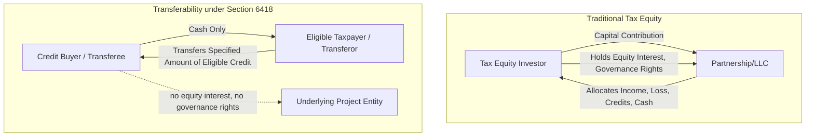

## Tax Credit Transfer Agreements


### Overview

Tax Credit Transfer Agreements are the contractual instrument enabling the sale of eligible federal income tax credits directly to unrelated taxable buyers under IRC Section 6418, as introduced by the Inflation Reduction Act of 2022. This "transferability" mechanism represents a structurally simpler alternative to traditional tax equity partnership arrangements, allowing an eligible taxpayer to sell all or a portion of certain credits for cash without requiring the buyer to hold an equity interest in the underlying project, be allocated income/loss, or engage in complex partnership flip structuring.

### Statutory Framework: IRC Section 6418

**Key Points**

- Section 6418 permits an **"eligible taxpayer"** to elect to transfer all or any portion of an **"eligible credit"** to an unrelated **"transferee taxpayer"** in exchange for cash consideration.
- Eligible credits include the Investment Tax Credit (Section 48, and the technology-neutral successor Section 48E), the Production Tax Credit (Section 45, and its technology-neutral successor Section 45Y), and a number of other specified credits (e.g., Section 45Q carbon capture, Section 45V clean hydrogen, Section 45X advanced manufacturing production credit).
- The cash paid by the transferee for the credit is **not includible in the transferor's gross income**, and is **not deductible** by the transferee — the transfer is treated as a tax-free cash payment for a tax attribute rather than a taxable sale of property in the ordinary sense.
- The transferee taxpayer, not the transferor, then claims the credit on its own tax return, subject to the same limitations that would have applied to the transferor (e.g., passive activity loss limitations under Section 469, and the general business credit limitations under Section 38).
- Transfers must be made for **cash only** — no other property or services may be exchanged as consideration for the transferred credit.

[Unverified] The precise list of eligible credits and any subsequent legislative or regulatory modifications should be verified against the current Internal Revenue Code and Treasury Regulations, as this is an area of relatively recent legislation subject to ongoing IRS guidance development and potential future legislative amendment.

### Diagram: Transferability Transaction Structure vs. Traditional Tax Equity



### Core Elements of a Tax Credit Transfer Agreement

**Key Points**

A Tax Credit Transfer Agreement (sometimes called a Credit Purchase and Sale Agreement) typically includes:

1. **Identification of the transferred credit** — the specific credit type (e.g., Section 48 ITC, Section 45 PTC), the taxable year(s) to which it relates, and the specific dollar amount or percentage of the total credit being transferred.
2. **Purchase price and payment mechanics** — the agreed price (commonly expressed as a discount to face value of the credit, reflecting the time value of money, risk of disallowance, and market liquidity considerations), and the timing of payment (which may be phased, e.g., partial payment at signing/commitment and the balance at or after the credit is confirmed available, such as after the project is placed in service or after the relevant tax year closes).
3. **Representations and warranties** — the transferor represents as to its eligibility to generate and transfer the credit, including compliance with all requirements to claim the underlying credit (e.g., placed-in-service status, prevailing wage and apprenticeship compliance where applicable to the credit rate, and beginning-of-construction requirements).
4. **Registration and IRS pre-filing requirements** — the transferor must complete a **pre-filing registration** with the IRS and obtain a registration number for each eligible credit property before the credit can be transferred, and the transfer election must be made on the transferor's timely filed tax return (including extensions).
5. **Indemnification for credit disallowance/recapture** — provisions addressing what happens if the IRS later disallows or reduces the credit, or if a recapture event occurs; notably, under Section 6418, the **transferee bears the risk of any recapture** in most circumstances (the recapture liability generally follows the credit to the transferee), which is a significant structuring difference from traditional tax equity, making this indemnification/insurance provision especially important to the buyer.
6. **Excessive credit transfer penalty provisions** — Section 6418 imposes a penalty on the transferee (with a reasonable cause exception) if the credit amount transferred exceeds the amount actually allowable, generally equal to 20% of the excess, and the agreement typically addresses how this risk is allocated contractually (via indemnity or insurance) even though the statutory penalty itself falls on the transferee.
7. **Insurance requirements/coordination** — many transfer agreements require or reference **tax credit insurance** covering the risk of credit disallowance, recapture, or the excessive credit transfer penalty, given that the transferee has no ability to control or monitor the underlying project's ongoing compliance in the way a traditional tax equity investor with governance rights would.
8. **Closing conditions** — completion of IRS pre-filing registration, confirmation of placed-in-service status (for ITC) or production milestones (for PTC), delivery of tax opinions, and often a fully bound insurance policy as a condition precedent to funding.

### Key Structural Differences from Traditional Tax Equity Documentation

**Key Points**

| Dimension | Traditional Tax Equity (Operating Agreement) | Tax Credit Transfer Agreement (Section 6418) |
| --- | --- | --- |
| Buyer's role | Equity member with governance/consent rights | Pure credit purchaser, no equity interest |
| Consideration | Capital contribution to the entity | Cash paid directly to the transferor |
| Ongoing relationship | Multi-year partnership relationship through the flip | Largely a point-in-time (or per-credit-year) transaction |
| Recapture risk allocation | Generally borne by sponsor via indemnity, sometimes insured | Statutorily borne by the transferee, heightening the importance of insurance/indemnity |
| Depreciation benefits | Investor typically receives allocated depreciation benefits | Transferee receives only the credit — depreciation stays with the seller/project owner |
| Accounting treatment for buyer | HLBV or PAM equity method accounting | Generally accounted for as a purchase of the credit itself, not an equity method investment — buyer accounting is comparatively simpler as it does not require consolidation, HLBV, or PAM analysis |
| Governance complexity | High — capital accounts, flip mechanics, consent rights | Low — no partnership interest is created |
| Typical closing timeline | Often lengthy, multi-workstream diligence | Can be faster, particularly for post-placed-in-service transfers |

[Inference] The relative simplicity and speed advantages of transferability transactions compared to traditional tax equity are widely discussed in market commentary as a key driver of the mechanism's adoption since 2023, but a rigorous quantitative comparison of closing timelines or transaction costs across structures would require current market transaction data.

### Pre-Filing Registration Requirements

**Key Points**

- Before any transfer can occur, the eligible taxpayer must complete **pre-filing registration** through the IRS's online registration portal, providing detailed information about the eligible credit property, the taxpayer, and the anticipated credit amount.
- The IRS issues a **unique registration number** for each eligible credit property, which must be included on the transferor's tax return and reported to the transferee; this registration number is specific to the property and the taxable year and generally cannot be reused for multiple transfers of credits from the same property across different years without updated registration information.
- The transfer agreement typically includes a **covenant requiring the transferor to complete and maintain accurate pre-filing registration**, with related representations that the registration information provided is complete and accurate, since errors or omissions in registration can jeopardize the transferee's ability to claim the credit.

[Unverified] The precise mechanics and current procedural requirements of the IRS pre-filing registration portal are subject to IRS administrative guidance that may be updated periodically; parties to a transfer agreement should confirm current procedural requirements directly against the applicable IRS instructions and forms in effect at the time of the transaction.

### Excessive Credit Transfer Risk and Indemnification Design

**Example**

A representative structure for allocating excessive credit transfer risk in the agreement:



```
Scenario: IRS later determines that only 90% of the transferred credit amount
          was properly allowable (a $1,000,000 credit transfer, with $100,000
          determined excessive).

Statutory Consequence: Transferee is liable for the $100,000 excessive amount
          plus a 20% penalty ($20,000), absent reasonable cause, per Section 6418(g)(2).

Contractual Allocation (typical transfer agreement approach):
  1. Transferor indemnifies transferee for the excessive credit amount and
     associated penalty, interest, and reasonable costs of defense, subject
     to negotiated caps and survival periods.
  2. Tax credit insurance, if procured, may respond to some or all of this
     exposure, with the transferor typically responsible for procuring
     and maintaining the policy (or the transferee doing so with premium
     cost negotiated into the purchase price).
  3. Purchase price is often set at a discount to face value in part to
     reflect the transferee's residual retained risk even after
     indemnification and insurance layers are applied.
```

[Inference] This example illustrates the general risk-allocation logic commonly discussed in transferability market commentary; specific indemnification caps, survival periods, and insurance program designs are individually negotiated and vary by transaction size, credit type, and counterparty creditworthiness.

### Buyer (Transferee) Accounting Considerations

**Key Points**

- Because the transferee does not acquire an equity interest, the purchase is generally **not** subject to VIE consolidation analysis (ASC 810), equity method accounting (ASC 323), or the HLBV/PAM frameworks discussed elsewhere in this course — those frameworks apply specifically to equity investments in flow-through entities, not to a direct purchase of a tax credit.
- The purchase is typically accounted for as the **acquisition of an intangible asset or a prepaid tax asset** at the discounted purchase price, which is then recognized to reduce income tax expense when the credit is utilized on the transferee's tax return, though the specific accounting model applied (and whether by analogy to existing intangible asset or income tax guidance) has been an area of evolving accounting practice given the relative novelty of the transferability mechanism under U.S. GAAP.
- [Unverified] Because Section 6418 transferability is a relatively recent statutory mechanism, buyer-side GAAP accounting treatment has been subject to ongoing accounting industry discussion and interpretation; readers should confirm the current authoritative or prevailing accounting guidance (including any AICPA, FASB staff, or accounting firm technical guidance issued since this content's underlying knowledge was compiled) before finalizing accounting treatment for a specific transaction.

### Market Positioning: When Transferability Is Used Instead of Traditional Tax Equity

**Key Points**

- Transferability is frequently used by **smaller developers or projects** for which the complexity and minimum deal-size thresholds of traditional tax equity partnerships are not cost-effective, since a transfer agreement avoids the need to form and maintain a complex partnership flip structure.
- It is also used by sponsors seeking **incremental capital alongside an existing tax equity partnership** — e.g., transferring a portion of credits not otherwise efficiently monetized through the partnership structure, or monetizing credits from a portfolio of smaller projects that would not individually justify a traditional tax equity partnership.
- Some sponsors use transferability as a **bridge or interim monetization tool** while a larger traditional tax equity partnership is being negotiated, given the potentially faster execution timeline for straightforward transfer transactions.
- **Depreciation benefits are not transferable** under Section 6418 — only the credit itself. Sponsors retaining depreciation benefits (rather than allocating them to a tax equity investor) must have sufficient tax capacity of their own to use those benefits, which is a key factor in deciding between transferability and traditional tax equity for a given sponsor's overall tax position.

### Related Topics

- Modeling Compliance and Recapture Risk Scenarios
- Tax Credit Insurance Policy Structuring
- Limited Liability Company and Partnership Operating Agreements
- Membership Interest Purchase Agreements
- Effect of Accounting Treatment on Investor Appetite
- Prevailing Wage and Apprenticeship Requirements Under the Inflation Reduction Act
- IRS Pre-Filing Registration Procedures for Credit Transfers