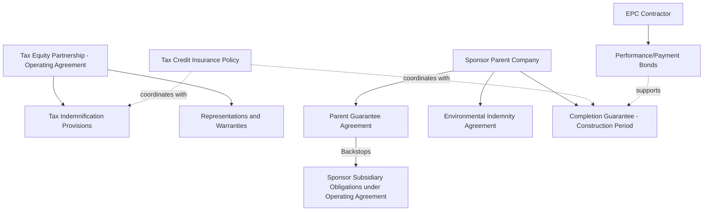
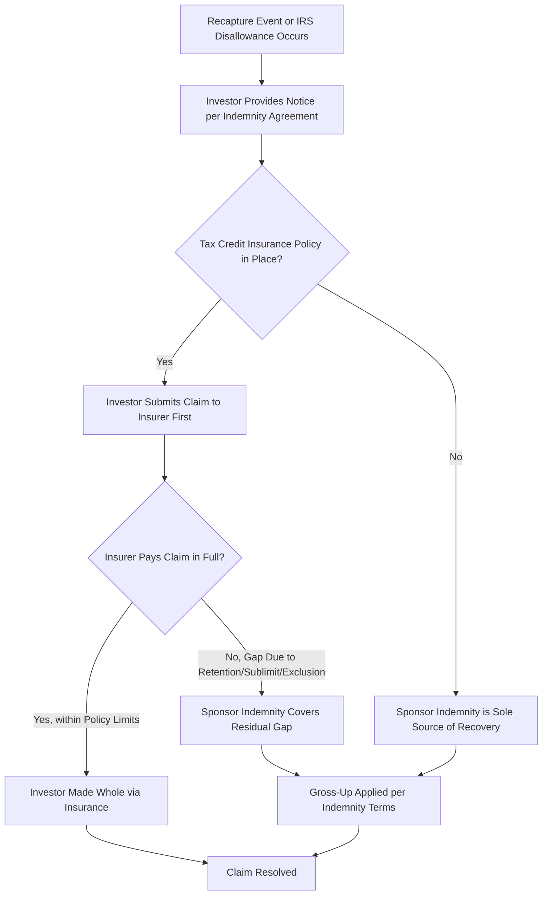

## Guarantees, Indemnities, and Support Agreements


### Overview

Guarantees, indemnities, and support agreements form the risk-allocation backbone of a tax equity transaction, sitting alongside the operating agreement and purchase agreements to address specific categories of risk that the parties agree should not rest with the tax equity investor. These instruments range from parent company guarantees backstopping sponsor obligations to narrowly scoped tax indemnities covering recapture exposure, and they interact closely with tax credit insurance where such coverage is procured.

### Purpose and Role in the Deal Structure

**Key Points**

- Tax equity investors generally seek a **passive, credit-like risk profile** — they want exposure to the tax benefits and cash flows of the project, not operational or credit risk of the sponsor or the underlying project counterparties.
- Guarantees, indemnities, and support agreements exist to **shift specific enumerated risks back to the sponsor (or its creditworthy parent)**, so that the investor's actual risk profile matches its underwriting assumptions.
- These instruments are typically **separate, freestanding documents** (or schedules/exhibits to the operating agreement) rather than provisions embedded solely within the operating agreement itself, particularly where a **parent guarantor** that is not itself a party to the operating agreement needs to be bound.

### Diagram: Risk Allocation Architecture Across Support Documents



### Categories of Guarantees

**Key Points**

1. **Parent (corporate) guarantees** — a creditworthy parent company guarantees the performance obligations of a thinly capitalized project-level or holdco-level sponsor subsidiary. Common where the operating entity itself has minimal assets beyond the project and would otherwise present unacceptable counterparty credit risk to the investor.
2. **Completion guarantees** — the sponsor (or parent) guarantees that construction of the project will be completed by a specified date and in accordance with agreed specifications, often including a guarantee to fund any cost overruns beyond a contingency budget.
3. **Performance guarantees / production guarantees** — guarantees regarding minimum energy production or performance levels, sometimes coupled with liquidated damages if the project underperforms relative to modeled expectations (particularly relevant to PTC-based deals where the credit amount is directly tied to actual production).
4. **Environmental guarantees/indemnities** — addressing pre-existing or newly discovered environmental conditions at the project site, often with the parent or sponsor bearing responsibility for remediation costs.
5. **Debt service guarantees** — where project-level debt exists, a guarantee (often limited or capped) of debt service obligations to protect against a scenario where project cash flow is insufficient, which could otherwise create downstream risk to the tax equity investor's position in the capital structure.
6. **"Bad boy" guarantees (non-recourse carve-out guarantees)** — common in financings with nonrecourse project debt, guaranteeing that the sponsor will be liable for specific "bad acts" (fraud, willful misconduct, unauthorized transfers, voluntary bankruptcy filings) that would otherwise cause the nonrecourse debt to become recourse.

[Inference] Not all six guarantee types are present in every deal; which guarantees are required depends on the project's risk profile (construction-stage vs. operating, leveraged vs. unleveraged, technology type) and the specific concerns identified during the investor's diligence process. This list reflects commonly discussed categories in tax equity market practice rather than a fixed universal checklist.

### Categories of Indemnities

**Key Points**

1. **Tax indemnities** — the most heavily negotiated indemnity category in tax equity deals, covering:
   - **Recapture indemnities**: sponsor indemnifies the investor for ITC recapture triggered by a disqualifying event (see the earlier recapture risk module), typically including the gross-up mechanics needed to make the investor whole on an after-tax basis.
   - **Structuring/disallowance indemnities**: coverage if the IRS successfully challenges the partnership's tax treatment (e.g., recharacterizing the investor's interest as debt, or disallowing claimed credits due to eligible basis overstatement).
   - **Change in law indemnities** (less common, more heavily negotiated): addressing risk that legislative or regulatory changes reduce or eliminate expected tax benefits after closing, though many sponsors resist providing broad change-in-law protection.
2. **General representation and warranty indemnities** — standard M&A-style indemnification for breaches of representations regarding title, compliance with law, material contracts, and absence of undisclosed liabilities.
3. **Environmental indemnities** — often a standalone, uncapped or specially capped indemnity given the potentially significant and long-tail nature of environmental remediation costs.
4. **Third-party claims indemnities** — covering claims by contractors, landowners, or other third parties arising from project construction or operation.

### Structuring the Tax Indemnification Provision

**Key Points**

A well-structured tax indemnification provision typically addresses:

- **Trigger definition** — precisely what constitutes an indemnifiable "tax event" (recapture event, disallowance, structural challenge outcome).
- **Gross-up mechanics** — as discussed in the recapture risk module, the indemnity payment is typically grossed up so the investor is made whole on an after-tax basis, not merely reimbursed dollar-for-dollar for the lost credit.
- **Notice and cooperation obligations** — requiring the investor to promptly notify the sponsor of any IRS inquiry or audit that could give rise to an indemnifiable event, and to cooperate (often subject to sponsor's right to control or participate in the defense) in contesting the IRS's position.
- **Survival period** — tax indemnities typically survive for an extended period reflecting the length of the ITC compliance period (5 years) plus the applicable statute of limitations for IRS assessment, and are often specifically carved out from the general indemnity survival period (which may be shorter) applicable to ordinary representations.
- **Caps and baskets** — whether the tax indemnity is subject to the same aggregate liability cap as general indemnities, or is treated as an uncapped "fundamental" indemnity given the magnitude of potential recapture exposure relative to deal size.

[Inference] Whether tax indemnities are capped, and at what level relative to the investor's total capital contribution, is one of the most heavily negotiated points in tax equity documentation; market practice varies by sponsor creditworthiness, deal size, and whether tax credit insurance is also in place to backstop some of the exposure.

### Interaction with Tax Credit Insurance

**Key Points**

- Where the sponsor and investor have procured a **tax credit insurance policy** (also called ITC/PTC insurance or tax equity insurance), the indemnification and guarantee documents are typically drafted to **coordinate** rather than duplicate coverage:
  - The insurance policy often serves as the **primary source of recovery** for covered tax risk (recapture, disallowance), with the sponsor's indemnity serving as a **secondary backstop** for amounts not covered due to policy retentions, sublimits, or exclusions.
  - The support agreements typically include **subrogation and cooperation provisions** ensuring the insurer's rights are preserved (e.g., requiring the investor to pursue the insurance claim first, and requiring the sponsor to cooperate with the insurer's claims process).
  - Some deals **reduce or eliminate the sponsor's indemnity cap** specifically because the insurance layer is expected to absorb most or all of the exposure, changing the negotiated risk allocation compared to an uninsured deal.

### Completion Guarantee Mechanics (Construction-Stage Deals)

**Example**

For construction-stage investments where the tax equity investor funds before or around commercial operation, a completion guarantee typically addresses:



```
Guaranteed Obligations:
  - Achievement of "Substantial Completion" or "Commercial Operation Date"
    by an outside date (with defined force majeure carve-outs).
  - Funding of cost overruns beyond the approved construction budget and
    contingency reserve, up to the guarantor's exposure (which may be
    capped or uncapped depending on negotiation).
  - Delivery of specified completion deliverables (final lien waivers,
    as-built surveys, independent engineer completion certificate).

Guarantor's Remedies if Called Upon:
  - Right to step in and complete construction directly, or
  - Obligation to pay a specified completion guaranty amount to the
    partnership to fund completion by another party.

Release/Termination:
  - Guarantee typically terminates upon achievement of Substantial
    Completion and satisfaction of specified post-completion conditions
    (e.g., final completion tests, resolution of outstanding punch-list items).
```

[Inference] This structure reflects commonly discussed completion guarantee mechanics in project finance and tax equity market practice; specific triggers, caps, and step-in rights are individually negotiated based on the EPC contractor's creditworthiness, the technology's construction risk profile, and the presence of independent completion bonds or letters of credit from the EPC contractor itself.

### Support Agreements Beyond Guarantees and Indemnities

**Key Points**

- **Equity Contribution Agreements** — a parent company's commitment to fund equity contributions to the sponsor subsidiary as needed to meet obligations under the operating agreement, distinct from a direct guarantee but serving a similar credit-support function.
- **Keep-well agreements** — a parent's commitment to maintain the sponsor subsidiary's net worth or liquidity at a specified minimum level, providing indirect assurance of the subsidiary's ability to perform without a direct payment guarantee.
- **Letters of credit** — issued by a bank on behalf of the sponsor in favor of the investor, providing a liquid, drawable form of credit support for specific obligations (often used for completion guarantees or as security for indemnification obligations, sometimes as an alternative to or in combination with a parent guarantee).
- **Consent and estoppel agreements from third parties** — while not guarantees in the traditional sense, agreements from the offtaker (under the PPA), interconnecting utility, or landowner acknowledging the investor's interest and providing notice/cure rights are often required as closing conditions, functioning as a form of support for the investor's position.

### Diagram: Tax Indemnity Claim and Insurance Coordination Flow



### Common Negotiation Points

**Key Points**

- **Guarantor creditworthiness thresholds** — investors often negotiate minimum credit rating or net worth requirements for any parent guarantor, with replacement guarantor rights if the original guarantor's credit deteriorates below the threshold.
- **Cap stacking** — where multiple indemnities and guarantees exist (general R&W indemnity, tax indemnity, environmental indemnity, completion guarantee), parties negotiate whether caps are **shared** across categories or **separate and additive**, which significantly affects the sponsor's aggregate maximum exposure.
- **Basket/deductible thresholds** — minimum claim thresholds before indemnification obligations are triggered, and whether baskets are "tipping" (full recovery once exceeded) or "true deductible" (only amounts above the threshold recoverable).
- **Step-in and cure rights** — the extent to which the investor (or an agent on its behalf) can step in to cure a sponsor default directly, particularly for completion guarantees, rather than relying solely on a monetary remedy.
- **Interaction with insurance procurement costs** — negotiation over which party bears the cost of tax credit insurance premiums, and how that cost allocation affects the overall economics and pricing of the tax equity investment.

### Related Topics

- Modeling Compliance and Recapture Risk Scenarios
- Tax Credit Insurance Policy Structuring
- Limited Liability Company and Partnership Operating Agreements
- Membership Interest Purchase Agreements
- Tax Credit Transfer Agreements
- Nonrecourse Carve-Out Guarantees in Project Finance
- EPC Contract Structuring and Completion Risk Allocation