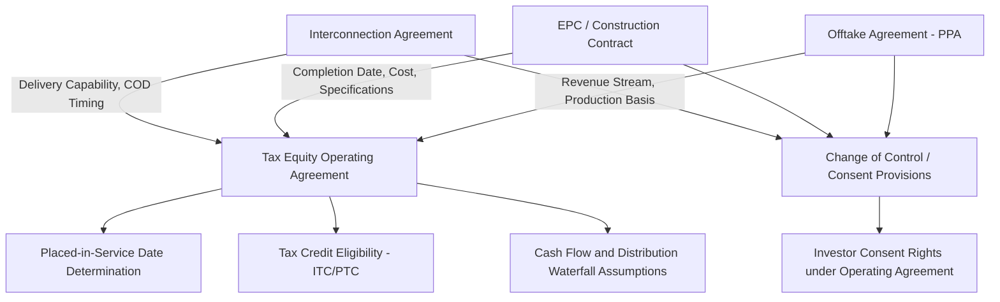
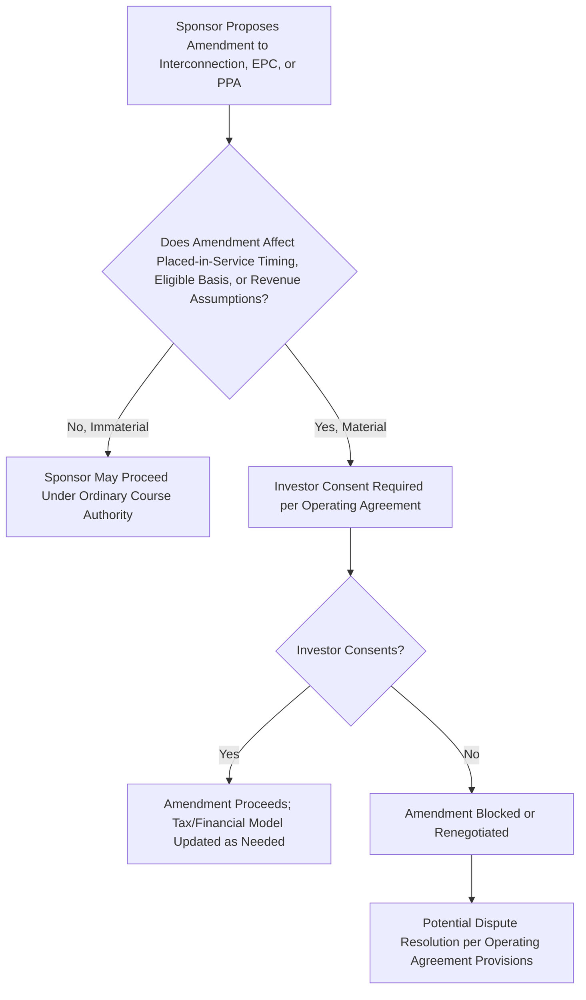

## Interaction with Interconnection, Construction, and Offtake Agreements


### Overview

A tax equity transaction does not exist in isolation — it sits atop a stack of pre-existing (or concurrently negotiated) project-level contracts, most centrally the interconnection agreement, the construction/EPC contract, and the offtake agreement (power purchase agreement or similar). This module examines how tax equity documentation must interface with these agreements: what the tax equity investor needs from each, how consent and step-in rights are negotiated, and how risk in the underlying commercial contracts flows back into the tax equity structure's diligence, representations, and indemnities.

### Why These Agreements Matter to the Tax Equity Investor

**Key Points**

- The **interconnection agreement** determines whether and when the project can physically deliver electricity to the grid — a project that cannot interconnect cannot generate revenue, cannot be placed in service in the manner contemplated, and cannot support the tax credit and cash flow projections underlying the investor's return.
- The **construction/EPC contract** determines whether the project will actually be built on time, on budget, and to the specifications assumed in the tax and financial models — construction delay or cost overrun risk directly threatens the placed-in-service timing that governs ITC eligibility and the beginning-of-construction analysis.
- The **offtake agreement** (PPA, or in some markets a hedge/tolling arrangement) determines the project's revenue stream, which underlies both the cash distributions to the investor and, for PTC deals, the very calculation of the credit itself (since PTC is tied to production and sale of electricity).
- Because the tax equity investor's return depends on **all three** of these operating comfortably within modeled assumptions, tax equity documentation typically requires the investor's review, and in some cases consent rights over, material terms and amendments to each.

### Diagram: Interaction Map Between Tax Equity Documents and Project Contracts



### Interconnection Agreement Interaction

**Key Points**

- Tax equity investors typically require diligence confirmation that the interconnection agreement is **fully executed, in good standing, and not subject to unresolved study restudy risk** (e.g., cluster study delays, network upgrade cost allocation disputes) before funding, since interconnection delays are a leading cause of project timeline slippage in many markets.
- **Assignment and consent provisions**: interconnection agreements typically require utility/transmission provider consent to any assignment; tax equity documentation must confirm this consent has been obtained (or is not required given the transaction structure) since the tax equity investor is often acquiring or financing an interest in the entity holding interconnection rights, not the rights directly.
- **Network upgrade cost risk**: the allocation of responsibility for network upgrade costs identified during interconnection studies is typically diligenced and, where material, addressed through purchase price adjustments, escrow, or specific representations in the operating agreement or MIPA regarding known versus unknown upgrade obligations.
- **Interconnection milestone deadlines**: many interconnection agreements impose milestone deadlines (e.g., commercial operation by a specified date) with financial security postings (interconnection security deposits) at risk if missed; tax equity documentation often requires ongoing compliance covenants and reporting obligations regarding interconnection milestone status.

[Inference] The specific interconnection risk allocation approach (purchase price adjustment vs. escrow vs. representation-only) varies significantly by the maturity of the interconnection process at the time of tax equity closing (e.g., pre-NTP vs. post-COD investments) and by regional grid operator practices; this description reflects general practice patterns rather than a single standardized approach.

### Construction/EPC Contract Interaction

**Key Points**

- For **construction-stage tax equity investments**, the operating agreement and related support agreements are heavily keyed to the EPC contract's terms:
  - **Completion guarantees** (see the prior module) are often calibrated directly against the EPC contract's guaranteed substantial completion date and liquidated damages provisions, effectively passing through EPC-level delay protection to the tax equity investor.
  - **Assignment of EPC warranties and performance guarantees** to the project entity (and indirectly benefiting the investor as a member) is a standard diligence and closing deliverable requirement.
  - **Independent engineer review** of the EPC contract's technical specifications, budget, and schedule is typically a condition precedent to investor funding, providing third-party validation that the construction contract supports the assumptions in the tax and financial models.
- **Change order and amendment consent rights**: tax equity operating agreements commonly require investor consent (or at least notice) for material EPC contract change orders that could affect the project's eligible basis calculation, the placed-in-service timeline, or the budgeted cost that underlies the tax model's depreciable basis.
- **Cost overrun funding mechanics**: the operating agreement typically specifies whether cost overruns beyond the approved budget and contingency are funded by the sponsor (via a completion guarantee, as discussed in the prior module), by additional investor capital contributions (less common, and typically requiring investor consent), or by project-level debt draws.
- **Eligible basis interaction**: because ITC-eligible basis is generally based on the depreciable cost basis of qualifying property, the EPC contract's itemized pricing (and any allocation between eligible and non-eligible costs, such as certain interconnection or transmission costs that may not be ITC-eligible) is directly scrutinized in tax model diligence, making EPC contract accuracy a foundational input to the tax equity investor's credit sizing.

### Offtake Agreement (PPA) Interaction

**Key Points**

- The PPA (or equivalent revenue arrangement, such as a hedge agreement in merchant markets) is diligenced for:
  - **Offtaker creditworthiness** — since the project's revenue stream, and therefore its ability to service any project debt and make distributions to the investor, depends on the offtaker's ability to pay over the PPA term.
  - **Pricing and escalation mechanics** — confirming that modeled revenue assumptions match the actual PPA pricing structure (fixed price, escalating price, index-based, or a percentage of a market reference price).
  - **Term length relative to the tax equity investment horizon** — a PPA term shorter than the anticipated flip period or debt tenor can introduce merchant price risk into later years of the investment, which tax equity investors typically want clearly identified and stress-tested.
  - **Curtailment and force majeure provisions** — provisions allowing the offtaker or grid operator to curtail generation (common in some renewable markets with transmission constraints) directly affect both revenue and, for PTC deals, the credit amount itself, since curtailed generation is generally not eligible for PTC.
- **Change of control and assignment provisions**: similar to the interconnection agreement, PPAs typically restrict assignment and may require offtaker consent to changes in ownership of the project entity, making PPA consent a standard closing condition for tax equity transactions and a standard restriction referenced in the operating agreement's transfer provisions.
- **Consent and estoppel certificates**: tax equity investors commonly require an **estoppel certificate** from the offtaker confirming the PPA is in full force and effect, there are no known defaults, and (where relevant) acknowledging the investor's or lender's interest and providing notice/cure rights in the event of a project-entity default.
- **PTC-specific production true-up mechanics**: because PTC amounts depend on actual metered production and sale, the operating agreement's cash and tax allocation provisions must align with how the PPA measures and settles delivered energy, since discrepancies between the PPA's metering/settlement mechanics and the tax model's production assumptions can create reconciliation issues affecting both cash distributions and credit calculations.

### Diagram: Consent Rights Flow for Material Project Contract Amendments



### Closing Deliverables Tying These Agreements to the Tax Equity Closing

**Example**

Representative closing deliverables that connect the three underlying project contracts to the tax equity documentation package:



```
- Fully executed Interconnection Agreement, in good standing, with consent to
  transaction (if required) obtained from the interconnecting utility/ISO.
- Fully executed EPC Contract (or, for post-construction deals, evidence of
  Substantial Completion and final completion certificate from the
  independent engineer), with all EPC warranties assigned to the project entity.
- Fully executed PPA (or offtake arrangement), with an executed consent
  and/or estoppel certificate from the offtaker.
- Independent engineer's report addressing technical feasibility, EPC
  contract adequacy, and interconnection status.
- Title insurance and/or real property diligence confirming site control
  consistent with the interconnection point and construction footprint.
- Confirmation that no unresolved change orders or amendments to any of the
  three agreements are pending that would affect the tax or financial model.
```

[Inference] This closing deliverables list reflects commonly discussed items in project finance and tax equity closing checklists; the precise list and sequencing depend on whether the transaction closes pre-construction, at notice-to-proceed, or post-commercial-operation, since diligence emphasis shifts significantly across these stages.

### Cross-Referencing Risk Allocation Across Documents

**Key Points**

- Risk identified in any of the three underlying project contracts (e.g., an offtaker credit concern, an EPC contractor with limited balance sheet strength, or interconnection network upgrade cost uncertainty) typically **flows through** into the tax equity documentation as:
  - A specific representation and warranty qualification or disclosure schedule item.
  - A condition precedent to funding (e.g., requiring resolution of an open interconnection study item before closing).
  - A specific indemnity carve-out or heightened indemnification provision.
  - An adjustment to the purchase price or capital contribution schedule (e.g., holding back a portion of investor capital pending satisfaction of a specific project-contract-related condition).
- This cross-referencing requires close coordination among the deal team's project finance, tax, and corporate/M&A counsel work streams, since a risk identified in EPC or interconnection diligence often has both a commercial contract-drafting solution and a tax-equity-documentation solution that need to be consistent with one another.

### Related Topics

- Limited Liability Company and Partnership Operating Agreements
- Guarantees, Indemnities, and Support Agreements
- Membership Interest Purchase Agreements
- Modeling Compliance and Recapture Risk Scenarios
- Independent Engineer Review in Project Finance Diligence
- Offtaker Creditworthiness Analysis in Renewable Energy Financing
- Interconnection Queue Reform and Network Upgrade Cost Allocation