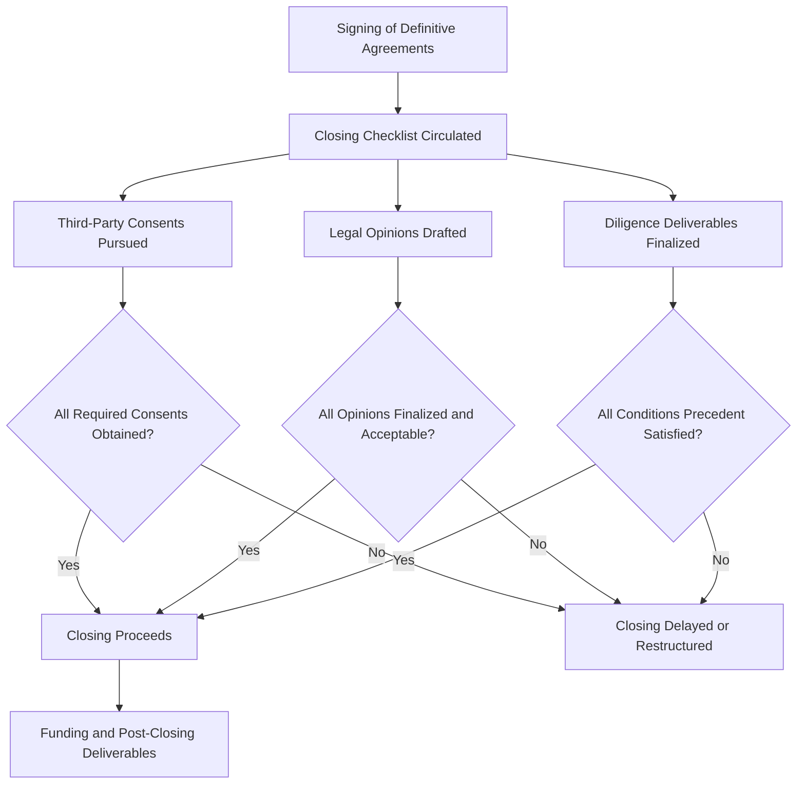
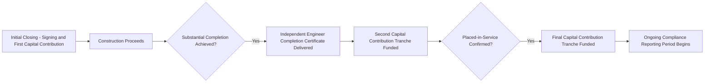

## Consents, Opinions, and Closing Deliverables


### Overview

The closing of a tax equity transaction requires assembling a substantial package of third-party consents, legal opinions, and other deliverables that collectively confirm the deal is legally sound, the project is ready to receive investment, and the parties' respective closing conditions have been satisfied. This module consolidates the closing mechanics referenced throughout the prior legal documentation modules into a single framework covering what consents are needed, what opinions are typically delivered, and how the overall closing checklist is organized and executed.

### The Function of Closing Deliverables

**Key Points**

- Closing deliverables serve as the **evidentiary confirmation** that all conditions precedent to closing (set out in the operating agreement, MIPA, or transfer agreement) have been satisfied, allowing the parties to proceed with funding.
- They also serve a **risk allocation function**: certain deliverables (like legal opinions) shift or confirm the allocation of legal risk between the parties, since an opinion giver's professional liability creates an additional layer of assurance beyond the sponsor's own representations.
- Deliverables are typically organized into a **closing checklist** maintained by deal counsel, tracking responsible party, status, and any open items through to closing (and sometimes through defined post-closing periods for deliverables that cannot be finalized until after funding).

### Diagram: Closing Deliverables Workflow



### Categories of Required Consents

**Key Points**

1. **Third-party contractual consents** — as discussed in the interconnection/construction/offtake module, consents from the interconnecting utility, EPC contractor (for warranty assignment), and offtaker (for PPA assignment or acknowledgment) are commonly required where the underlying contracts restrict assignment or changes of control.
2. **Lender consents** — where project-level or portfolio-level debt already exists, the lender's consent to the tax equity investor's admission as a member (and often to the specific terms of the operating agreement, given the lender's interest in the project's cash flow waterfall) is typically required under the existing loan agreement's change-of-control or additional equity provisions.
3. **Governmental and regulatory consents** — depending on jurisdiction and project type, consents or notifications may be required from state public utility commissions, environmental permitting authorities, or other regulators; large or foreign-investor-involved transactions may also require review under the Committee on Foreign Investment in the United States (CFIUS) framework if applicable.
4. **Organizational consents** — internal corporate/LLC approvals (board resolutions, member consents) authorizing each party to enter into the transaction, confirming due authorization.
5. **Landowner/lease consents** — where the project site is leased rather than owned, landlord consent or estoppel confirming the lease is in good standing and consenting to the financing/investment structure.

[Inference] The specific consent list required for any given transaction depends heavily on the project's contractual and financing history; a construction-stage, unlevered, single-site project will typically require a substantially shorter consent list than an operating, levered, multi-site portfolio transaction. This general categorization reflects commonly discussed consent categories in project finance and tax equity practice.

### Categories of Legal Opinions

**Key Points**

Legal opinions delivered at closing typically fall into these categories:

1. **Corporate/organizational opinions** — confirming the relevant parties are validly formed and in good standing, that entering into the transaction documents has been duly authorized, and that the documents are enforceable against the party (subject to customary qualifications for bankruptcy, equitable principles, etc.).
2. **Tax opinions** — among the most heavily scrutinized opinions in tax equity transactions, typically addressing:
   - Classification of the entity as a **partnership** for federal tax purposes (not a corporation or disregarded entity).
   - Validity of the **special allocations** under the substantial economic effect rules (Section 704(b)).
   - The tax equity investor's status as a genuine **"partner"** for tax purposes (as opposed to the arrangement being recharacterized as a loan, a service arrangement, or some other transaction), addressing the multi-factor "partner vs. lender" analysis courts and the IRS have applied in this area.
   - Availability and proper allocation of ITC/PTC to the investor in the amounts contemplated by the tax model.
3. **UCC/security interest opinions** — where project-level financing exists, opinions regarding perfection of security interests (relevant to lender-financed transactions, and to the tax equity investor's own diligence regarding what liens encumber the project or the membership interests).
4. **No-conflicts/no-violation opinions** — confirming that entering into the transaction does not violate the party's organizational documents, applicable law, or (to counsel's knowledge) any material agreement to which the party is bound.
5. **Regulatory opinions** — addressing specific regulatory status questions relevant to the project type (e.g., status under the Public Utility Regulatory Policies Act (PURPA), or Federal Power Act considerations for certain generation facilities), where applicable.

[Unverified] The precise scope, customary qualifications, and market-standard language for each opinion category (particularly the "partner vs. lender" tax opinion, which is one of the more technically nuanced opinions in this space) is the subject of extensive tax opinion practice and case law (including long-standing partnership tax doctrine); parties should rely on current opinion counsel's assessment of market-standard scope and qualifications rather than a general summary, as this area involves significant professional judgment calibrated to the specific facts of each transaction.

### The "Partner vs. Lender" Tax Opinion in Detail

**Key Points**

- Because the IRS has, in certain circumstances, challenged whether a tax equity investor's interest should be respected as genuine partnership equity (as opposed to a disguised loan or fee-for-services arrangement), tax counsel's opinion on this point is a **cornerstone deliverable** in most partnership flip transactions.
- The analysis generally considers factors such as: the investor's exposure to the entrepreneurial risk of the venture (both upside and downside), whether the investor's return is tied to a fixed rate of return (loan-like) versus a variable return tied to project performance, the investor's participation in management and governance, and the substance of the investor's capital contribution relative to its stated return expectations.
- The strength of this opinion (e.g., "should" level versus "more likely than not" level of comfort, which are standard opinion confidence tiers in tax practice) is a factor investors weigh heavily in underwriting, and is sometimes a specific negotiation point regarding what opinion level the sponsor's counsel is willing and able to deliver.

[Inference] The specific market-standard opinion confidence level (e.g., "should" vs. "more likely than not") expected in a given deal varies based on deal structure conservatism, sponsor track record, and investor risk tolerance; this is a matter of case-by-case negotiation and professional judgment by tax counsel rather than a fixed rule applicable to all transactions.

### Standard Closing Deliverables Checklist

**Example**

A representative (illustrative) tax equity closing checklist, organized by category:



```
CORPORATE/ORGANIZATIONAL
  - Certificates of good standing / formation for all transaction parties
  - Board/member resolutions authorizing the transaction
  - Officer's certificates confirming accuracy of representations at closing
  - Incumbency certificates

TRANSACTION DOCUMENTS
  - Fully executed Operating Agreement (or amended and restated version)
  - Fully executed Purchase Agreement (MIPA) or Transfer Agreement, as applicable
  - Guarantee Agreements, Indemnity Agreements, and other support agreements
  - Assignment and assumption agreements for any transferred contracts

THIRD-PARTY CONSENTS
  - Interconnection agreement consent (if required)
  - PPA/offtake agreement consent and estoppel certificate
  - EPC contract warranty assignment consent
  - Lender consent (if project debt exists)
  - Landlord/lease consent or estoppel (if applicable)

LEGAL OPINIONS
  - Corporate/organizational opinion(s)
  - Tax opinion (partnership classification, allocations, partner status)
  - No-conflicts opinion
  - UCC/security interest opinion (if applicable)

DILIGENCE AND TECHNICAL DELIVERABLES
  - Independent engineer's report
  - Title insurance policy or title diligence memorandum
  - Environmental Phase I (and Phase II, if warranted) reports
  - Insurance certificates (property, liability, and tax credit insurance if applicable)
  - Tax model and independent model review/audit deliverable

FINANCIAL/FUNDING DELIVERABLES
  - Funds flow memorandum
  - Wire instructions and payoff letters (for any refinanced debt)
  - Evidence of insurance premium payment (if condition to closing)
```

[Inference] This checklist illustrates commonly referenced deliverable categories in tax equity closings; the actual deliverable list, sequencing, and which items are conditions precedent to closing versus post-closing covenants vary by transaction structure, project stage, and the specific requirements negotiated by the parties' counsel.

### Post-Closing Deliverables and Covenants

**Key Points**

- Some deliverables cannot be finalized until after funding and are instead documented as **post-closing covenants** with specified deadlines — common examples include final as-built surveys, final lien waivers pending last payments to subcontractors, and finalized IRS pre-filing registration confirmations for any transferred credits.
- **Placed-in-service confirmation deliverables** (for construction-stage investments) are often structured as a distinct **post-closing milestone** requiring delivery of an independent engineer's placed-in-service certification, triggering a subsequent capital contribution tranche from the investor (common in multi-draw funding structures).
- **Ongoing compliance certificates** — ongoing reporting obligations (e.g., periodic officer's certificates confirming continued compliance with tax credit eligibility requirements, prevailing wage/apprenticeship compliance where applicable, and absence of recapture-triggering events) are frequently required on a periodic basis throughout the ITC compliance period, not just at initial closing.

### Diagram: Multi-Tranche Funding Tied to Deliverable Milestones



### Coordination Across Workstreams

**Key Points**

- Because closing deliverables span corporate, tax, real estate, environmental, and regulatory workstreams, tax equity closings typically involve **coordinated closing calls** among deal counsel, tax counsel, the independent engineer, title/survey providers, and (where applicable) insurance brokers, to ensure all conditions are tracked to resolution in parallel rather than sequentially.
- A **closing binder or closing set** is typically compiled and distributed to all parties following closing, consolidating all executed documents, opinions, and certificates into a single reference set — this closing set later becomes a key diligence source for any subsequent secondary sale (MIPA) transaction or refinancing involving the same project.

### Related Topics

- Limited Liability Company and Partnership Operating Agreements
- Membership Interest Purchase Agreements
- Tax Credit Transfer Agreements
- Guarantees, Indemnities, and Support Agreements
- Interaction with Interconnection, Construction, and Offtake Agreements
- Partner vs. Lender Tax Classification Analysis
- Independent Engineer Review in Project Finance Diligence