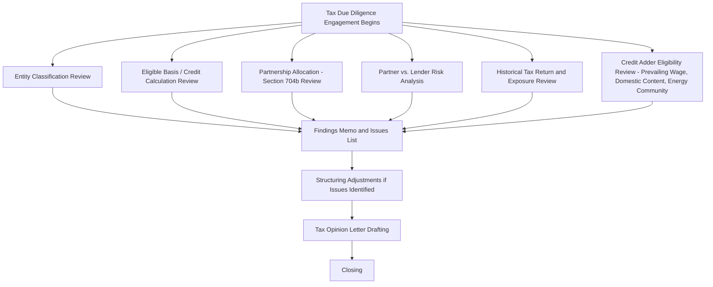

## Tax Due Diligence and Opinion Letters

### Overview

Tax due diligence is the systematic process by which a tax equity investor's tax counsel and advisors verify that a proposed transaction will generate the tax benefits assumed in the tax model, that the underlying structure will withstand IRS scrutiny, and that no undisclosed tax liabilities or structural defects threaten the investor's expected return. This diligence culminates in the tax opinion letters discussed in the prior closing deliverables module, but the diligence process itself — the substantive investigation and analysis — is a distinct, extensive workstream that this module addresses in detail.

### Objectives of Tax Due Diligence

**Key Points**

- Confirm that the **entity classification** as a partnership for federal tax purposes is correct and will be respected, including confirming no unintended entity classification elections (or lack thereof) have created an unexpected tax status.
- Verify the **eligible basis calculation** underlying the ITC (or the production and income calculations underlying PTC) is accurate, properly supported, and consistent with the tax model assumptions the investor is relying on for pricing.
- Confirm the **special allocations** in the operating agreement satisfy the substantial economic effect safe harbor (or are otherwise in accordance with the partners' interests in the partnership) under Section 704(b).
- Assess whether the investor's interest will be respected as genuine partnership equity, rather than being recharacterized as debt, a service arrangement, or some other transaction (the "partner vs. lender" analysis referenced in the opinions module).
- Identify any **historical tax exposure** in the target entity (particularly relevant in MIPA/secondary transactions) that could create indemnification needs or purchase price adjustments.
- Confirm compliance with **credit-specific eligibility requirements**, including prevailing wage and apprenticeship requirements where relevant to bonus credit rates, domestic content requirements, energy community adders, and beginning-of-construction documentation.

### Diagram: Tax Due Diligence Workstream Overview

### Entity Classification Diligence

**Key Points**

- Confirm the target entity has not made (or is not deemed to have made) a **"check-the-box" election** under Treasury Regulation Section 301.7701-3 that would cause it to be treated as an association taxable as a corporation rather than a partnership (or, for a single-member structure prior to the investor's admission, a disregarded entity).
- Review formation documents (articles of organization, initial operating agreement) and any historical elections filed with the IRS (Form 8832, if any) to confirm consistency with the intended partnership classification.
- For structures involving multiple tiers of entities (e.g., a project company held by a holding company, which is held by the tax equity partnership), confirm classification is correct and consistent at **each tier**, since a classification issue at a lower tier can affect the tax treatment of allocations flowing up to the tax equity investor.

### Eligible Basis and Credit Calculation Diligence

**Key Points**

- For **ITC-based deals**, diligence confirms:
  - The **depreciable tax basis** of qualifying energy property is properly calculated, generally based on the cost of the property (which may include certain "soft costs" like engineering and development costs allocable to the property, subject to specific rules on what is includible).
  - Exclusion of **non-qualifying costs** (e.g., certain interconnection or transmission costs beyond specified points, land costs, and costs not properly capitalized to the energy property).
  - Correct application of any **basis reduction rules**, including the 50% basis reduction for the portion of the ITC claimed (under Section 50(c)) and interaction with any grants or other subsidized energy financing that could affect basis under Section 48.
  - Verification of the **placed-in-service date** supporting evidence (commissioning reports, interconnection agreement confirmation, first commercial operation documentation).
- For **PTC-based deals**, diligence confirms:
  - The **beginning-of-construction** documentation supporting the applicable credit rate and any grandfathering of prior law requirements (physical work test or 5% safe harbor documentation, including contemporaneous invoices, contracts, and other supporting records).
  - The **metering and production data methodology** used to calculate the credit amount aligns with the PPA's settlement mechanics and applicable Treasury guidance on eligible production.
- For **bonus credit adders** (prevailing wage and apprenticeship, domestic content, energy community, low-income community adders under current law), diligence confirms the specific documentation and compliance recordkeeping required to substantiate the claimed adder rate, since these adders can materially increase the credit percentage and are subject to their own specific compliance and recordkeeping regimes.

[Unverified] The specific technical rules governing eligible basis calculation, credit adder eligibility, and beginning-of-construction safe harbors are subject to detailed Treasury Regulations and IRS guidance (including periodic updates and clarifications) that should be verified against current authority at the time of any specific transaction, as this is a technically detailed and evolving area of tax law.

### Section 704(b) Allocation Diligence

**Key Points**

- Confirm the operating agreement's **capital account maintenance provisions** conform to the requirements of Treasury Regulation Section 1.704-1(b)(2)(iv).
- Confirm the presence of an effective **qualified income offset** or, alternatively, an unconditional deficit restoration obligation, supporting the validity of allocations that would otherwise lack economic effect for partners without a full DRO.
- Review **minimum gain chargeback** provisions for consistency with the "partnership minimum gain" and "partner nonrecourse debt minimum gain" rules where nonrecourse financing exists at the partnership or lower-tier level.
- Confirm that allocations of tax credits specifically conform to the applicable credit allocation regulations (the ITC allocation percentage rules under Treasury Regulation Section 1.46-3(f), and PTC allocation based on the partnership's income allocation attributable to electricity sales).
- Assess whether the overall allocation scheme, taken as a whole across the pre-flip and post-flip periods, is consistent with how the partners actually share in the economics of the venture (relevant to the alternative "partners' interest in the partnership" test if the primary safe harbor is not fully satisfied).

### Partner vs. Lender Risk Analysis

**Key Points**

- This diligence area assesses whether the IRS could successfully argue the tax equity investor's interest should be recharacterized as **debt** (or some other non-equity arrangement) rather than a genuine partnership interest, which would jeopardize the investor's ability to claim allocated tax credits and depreciation.
- Key diligence factors reviewed include:
  - Whether the investor's return is **capped or guaranteed** in a manner resembling a fixed interest rate, versus genuinely variable based on project performance.
  - The extent of the investor's **exposure to entrepreneurial risk**, including downside risk (e.g., absence of guarantees that effectively eliminate the investor's risk of loss).
  - Whether the **buyout option** available to the sponsor post-flip is priced at genuine fair market value (via appraisal or similar mechanism) rather than a predetermined fixed price that could suggest the "option" is actually a disguised repayment schedule.
  - The investor's **governance participation** — genuine partners typically have some level of consent rights and information rights consistent with an equity holder, not merely a passive lender's covenant package.
- Historical IRS guidance and case law addressing partnership tax equity structures (including guidance specifically addressing renewable energy partnership flip structures) inform this analysis, and tax counsel typically benchmarks the specific deal structure against this body of authority during diligence.

[Inference] The relative weight given to each factor in the partner-vs-lender analysis is a matter of professional judgment applied to the specific facts of each transaction; this is a multi-factor, facts-and-circumstances analysis rather than a mechanical checklist with a fixed threshold, consistent with how this area of tax law has generally developed.

### Historical Tax Return and Exposure Diligence (Particularly for MIPA/Secondary Transactions)

**Key Points**

- Review of the target entity's **historical tax returns** (Form 1065 partnership returns, K-1s issued to existing partners) to confirm consistency with the allocations and elections described in the operating agreement.
- Confirmation of any existing **Section 754 election** (relevant to the buyer's potential basis step-up in a MIPA transaction, as discussed in the earlier module) and its proper historical application.
- Review of any **prior IRS examination history**, including any revenue agent reports, proposed adjustments, or ongoing audits that could create exposure the buyer would inherit or that would need to be specifically indemnified against.
- Confirmation that all required **information returns and elections** (e.g., partnership representative designations under the centralized partnership audit regime enacted by the Bipartisan Budget Act of 2015) have been properly made and are consistent with the buyer's expectations regarding audit control rights post-closing.

### The Tax Opinion Letter: Drafting and Delivery Process

**Key Points**

- The tax opinion is typically drafted by the **sponsor's tax counsel** (or, in some deals, jointly reviewed by both sponsor and investor tax counsel, with the investor's counsel sometimes delivering a reliance letter or its own opinion) after the diligence process has substantively concluded and any identified issues have been resolved through structuring adjustments.
- The opinion typically recites the **specific facts and assumptions** relied upon (often referencing an accompanying factual representation letter signed by the sponsor and/or the entity, since tax opinions are conditioned on the accuracy of underlying factual representations).
- Opinions are delivered at a specified **confidence level** — common levels in tax practice include "will," "should," and "more likely than not" — with "will" representing the highest level of confidence and "more likely than not" representing a lower (but still greater than 50%) level of confidence; the level delivered for each specific conclusion (entity classification, allocation validity, partner status, credit availability) may differ within the same opinion letter based on the strength of authority supporting each conclusion.
- **Opinion qualifications and limitations** are standard and expected — opinions are typically qualified by reference to law and facts as they exist at the time of delivery, and explicitly disclaim any obligation to update the opinion for subsequent changes in law or facts.

[Unverified] The specific confidence-level terminology and its precise definitional thresholds are matters of established tax practice convention; while "will," "should," and "more likely than not" are commonly referenced terms in tax opinion practice, their precise application and any evolving practitioner conventions should be confirmed with current tax opinion counsel for the specific transaction.

### Common Issues Identified During Tax Due Diligence

**Key Points**

- **Eligible basis overstatement risk** — inclusion of non-qualifying soft costs or interconnection costs beyond the eligible scope, requiring basis recalculation and corresponding tax model adjustment.
- **Allocation mechanics not matching cash waterfall** — operating agreement provisions that inadvertently create a mismatch between the tax allocation percentages and the cash distribution percentages in a manner that could undermine the substantial economic effect analysis.
- **Insufficient beginning-of-construction documentation** — inadequate contemporaneous records supporting a claimed beginning-of-construction date, particularly relevant to grandfathered projects claiming credit rates or eligibility rules tied to construction start dates under transitional or prior law provisions.
- **Undocumented prevailing wage/apprenticeship compliance** — gaps in contemporaneous payroll and apprenticeship utilization records needed to substantiate bonus credit rate eligibility.
- **Prior period tax return inconsistencies** (MIPA transactions) — historical K-1 allocations that do not match the operating agreement's stated allocation formulas, requiring investigation and potential amendment.

### Related Topics

- Consents, Opinions, and Closing Deliverables
- Limited Liability Company and Partnership Operating Agreements
- Modeling Compliance and Recapture Risk Scenarios
- Membership Interest Purchase Agreements
- Partner vs. Lender Tax Classification Analysis
- Prevailing Wage and Apprenticeship Requirements Under the Inflation Reduction Act
- Centralized Partnership Audit Regime and Partnership Representative Designation