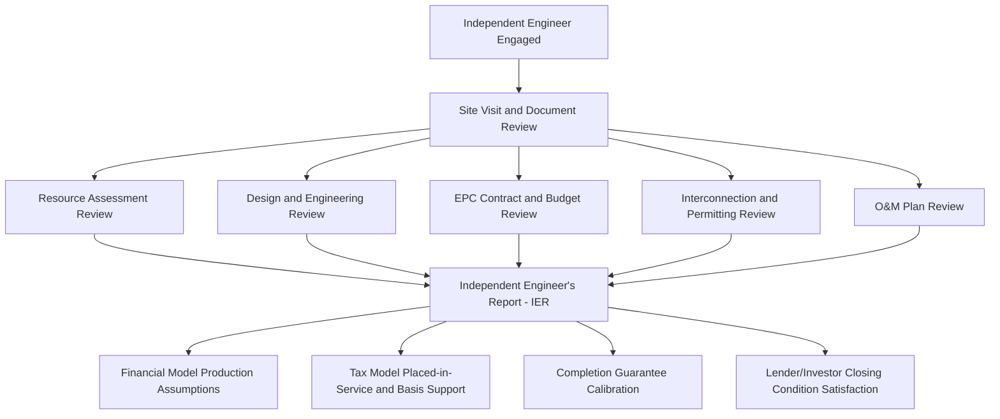

## Technical and Engineering Due Diligence

### Overview

Technical and engineering due diligence is the workstream through which an independent engineer (IE), retained on behalf of the tax equity investor (and often the lender, where debt is present), validates that a renewable energy project is technically sound, capable of achieving its projected performance, and constructed or operating in accordance with industry standards and the representations made by the sponsor. This diligence directly underpins the financial model's production assumptions, the tax model's placed-in-service and eligible basis conclusions, and the risk allocation embedded in completion guarantees and performance warranties.

### Role of the Independent Engineer

**Key Points**

- The **independent engineer** is a third-party technical consultant retained specifically because the tax equity investor (and lender, if applicable) require an assessment that is independent of the sponsor's own technical team and the EPC contractor's self-certifications.
- The IE's work product — typically an **Independent Engineer's Report (IER)** — is relied upon as a condition precedent to closing and, in construction-stage deals, at subsequent funding milestones (e.g., substantial completion, placed-in-service).
- The IE's scope is defined by an **engagement letter** negotiated among the investor (and lender), the IE, and often the sponsor (who typically bears the cost), specifying the deliverables, standard of care, and reliance rights (i.e., which parties may rely on the IE's conclusions).
- IE reports are typically required to be **updated or reaffirmed** at key milestones throughout a construction-stage deal (e.g., an initial report at signing, an updated report at substantial completion, and a final report at placed-in-service), rather than being a single static deliverable.

### Diagram: Technical Diligence Workstream and Its Downstream Uses

### Core Components of Technical Due Diligence

**Key Points**

1. **Resource assessment review** — for solar, this involves reviewing the irradiance data sources, satellite/ground-station data quality, and the P50/P90/P99 exceedance probability energy production estimates; for wind, this involves reviewing wind resource measurement campaigns (met towers, LiDAR/SoDAR data), wake loss modeling, and the corresponding P50/P90 production estimates.
2. **Design and engineering review** — assessment of the system design (equipment selection, layout, electrical design, civil/structural design) against industry standards and manufacturer specifications, confirming the design is appropriate for the site conditions and expected to perform as modeled.
3. **Equipment and technology review** — evaluation of major equipment (modules, inverters, turbines, batteries for storage components) including manufacturer track record, warranty terms, and any technology-specific performance or degradation risk factors.
4. **EPC contract and budget review** — as referenced in the earlier module on interaction with construction agreements, the IE reviews the EPC contract's technical specifications, pricing reasonableness, schedule feasibility, and contractor qualifications/track record.
5. **Permitting and regulatory compliance review** — confirmation that all required permits (construction, environmental, land use) have been obtained or are on track to be obtained consistent with the project schedule.
6. **Interconnection review** — technical assessment of the interconnection agreement's requirements and the project's ability to meet them, cross-referenced with the interconnection diligence discussed in the legal documentation chapter.
7. **Operations and maintenance (O&M) plan review** — assessment of the proposed O&M provider's qualifications, the O&M contract's scope and performance guarantees, and whether the O&M budget is adequate to sustain the modeled performance over the investment horizon.
8. **Degradation and long-term performance review** — assessment of the assumed annual degradation rate (for solar, typically a modest annual percentage decline in module output; for wind, availability and performance degradation over time) against manufacturer warranties and industry data, since degradation assumptions directly affect the long-term production (and therefore PTC and revenue) projections in the financial model.

[Inference] The relative depth of review in each category depends on project stage (pre-construction vs. operating) and technology type (solar photovoltaic review differs meaningfully from wind or storage review in technical focus areas); this list reflects commonly discussed IE diligence categories in project finance practice rather than a single fixed scope applicable to every engagement.

### P50/P90/P99 Production Estimates and Their Financial Model Interaction

**Key Points**

- Energy production estimates are typically presented as **exceedance probabilities**: the P50 estimate represents the production level expected to be exceeded 50% of the time (i.e., the median expectation), while P90 and P99 represent progressively more conservative estimates (exceeded 90% and 99% of the time, respectively), reflecting greater confidence levels at the cost of a lower assumed production figure.
- Tax equity investors and lenders typically require the financial model's **base case** to use a **P50 estimate** for revenue and PTC calculation purposes (reflecting the median/expected outcome), while **debt sizing and coverage ratio stress testing** typically uses a more conservative **P90 or P99 estimate**, ensuring debt service can be met even under a lower-probability, lower-production scenario.
- The IE's independent validation of these production estimates (including review of the resource data quality, the energy yield modeling methodology, and any adjustments for losses such as soiling, shading, wake effects, availability, and electrical losses) is a critical input the tax equity investor relies upon, since production directly drives both revenue and, for PTC-based deals, the credit amount itself.

[Inference] The specific probability thresholds used for base case versus stress case modeling (e.g., P50 vs. P90 vs. P99) reflect common project finance and tax equity market conventions, but the precise thresholds required by any given investor or lender are negotiated on a deal-specific basis and can vary based on technology type, resource data quality, and overall risk tolerance.

### Diagram: Exceedance Probability Curve Illustration (svg_diagram)

<svg xmlns="http://www.w3.org/2000/svg" viewBox="0 0 640 380">
<text x="320" y="24" text-anchor="middle" font-size="16" font-family="sans-serif" font-weight="bold">Energy Production Exceedance Probability Curve (svg_diagram)</text>
<line x1="80" y1="310" x2="580" y2="310" stroke="black" stroke-width="2" />
<line x1="80" y1="310" x2="80" y2="50" stroke="black" stroke-width="2" />
<text x="330" y="345" text-anchor="middle" font-size="13" font-family="sans-serif">Annual Energy Production (relative scale)</text>
<text x="35" y="180" text-anchor="middle" font-size="13" font-family="sans-serif" transform="rotate(-90 35 180)">Probability of Exceedance</text>
<path d="M 100 60 Q 250 90 330 180 Q 420 270 560 300" fill="none" stroke="#2b6cb0" stroke-width="3" />
<line x1="330" y1="180" x2="330" y2="310" stroke="#c53030" stroke-dasharray="4,4" />
<line x1="80" y1="180" x2="330" y2="180" stroke="#c53030" stroke-dasharray="4,4" />
<text x="335" y="330" font-size="12" font-family="sans-serif" fill="#c53030">P50 (median)</text>
<line x1="430" y1="240" x2="430" y2="310" stroke="#d69e2e" stroke-dasharray="4,4" />
<line x1="80" y1="240" x2="430" y2="240" stroke="#d69e2e" stroke-dasharray="4,4" />
<text x="435" y="330" font-size="12" font-family="sans-serif" fill="#d69e2e">P90 (conservative)</text>
<line x1="500" y1="280" x2="500" y2="310" stroke="#38a169" stroke-dasharray="4,4" />
<line x1="80" y1="280" x2="500" y2="280" stroke="#38a169" stroke-dasharray="4,4" />
<text x="500" y="345" text-anchor="middle" font-size="12" font-family="sans-serif" fill="#38a169">P99 (most conservative)</text>
</svg>

### Construction Progress and Milestone Verification

**Key Points**

- For construction-stage investments, the IE typically conducts **periodic site visits** to verify construction progress against the schedule and budget, issuing progress reports that support draw requests under multi-tranche funding structures.
- **Substantial completion verification** — the IE assesses whether the project has met the technical criteria for substantial completion under the EPC contract (e.g., successful completion of commissioning tests, mechanical completion, initial synchronization with the grid), which often triggers a funding milestone and the commencement of performance testing periods.
- **Placed-in-service certification** — a distinct (and, for tax purposes, critical) milestone verification confirming the project has been placed in a condition of readiness for its intended use, supporting the tax model's placed-in-service date used for ITC vesting commencement and depreciation start.
- **Punch list tracking** — the IE typically tracks outstanding minor completion items (the "punch list") that do not prevent substantial completion but must be resolved within a defined post-completion period, with associated retention/holdback amounts tied to their resolution.

### Interaction with Insurance and Warranty Diligence

**Key Points**

- Technical diligence coordinates closely with **insurance diligence**, confirming that property insurance (covering construction and operational risk), business interruption insurance, and any performance/production insurance (where procured) are appropriately sized relative to the IE's assessed risk profile of the project.
- **Equipment warranty review** — the IE assesses the adequacy of manufacturer warranties (e.g., module power output warranties, inverter warranties, turbine availability guarantees) relative to the project's expected operating life and the investment horizon, flagging any gaps where warranty coverage falls short of the tax equity investment period.
- **O&M performance guarantee review** — where the O&M contract includes availability or performance guarantees with associated liquidated damages, the IE assesses whether those guarantees are calibrated appropriately to protect the financial model's production assumptions.

### Common Technical Diligence Findings and Their Downstream Effects

**Key Points**

- **Resource data quality concerns** (e.g., short measurement campaign duration, reliance on a single data source without cross-validation) can lead the IE to recommend a **higher uncertainty/lower confidence production estimate**, which can reduce the financial model's projected revenue and, correspondingly, the tax equity investor's pricing or required credit enhancement.
- **Interconnection or curtailment risk findings** can lead to specific production haircuts in the financial model or trigger additional contractual protections (e.g., curtailment compensation provisions in the PPA, or specific representations regarding known curtailment risk).
- **EPC contractor track record concerns** can lead to requiring additional completion security (payment/performance bonds, letters of credit) beyond what might otherwise be required, directly affecting the guarantee and support agreement structuring discussed in the earlier legal documentation module.
- **Equipment technology risk findings** (e.g., a newer, less field-proven technology) can lead to more conservative degradation assumptions or extended warranty requirements as closing conditions.

### Related Topics

- Guarantees, Indemnities, and Support Agreements
- Interaction with Interconnection, Construction, and Offtake Agreements
- Tax Due Diligence and Opinion Letters
- Modeling Compliance and Recapture Risk Scenarios
- Insurance Diligence and Risk Transfer Structuring
- Offtaker Creditworthiness Analysis in Renewable Energy Financing
- Consents, Opinions, and Closing Deliverables