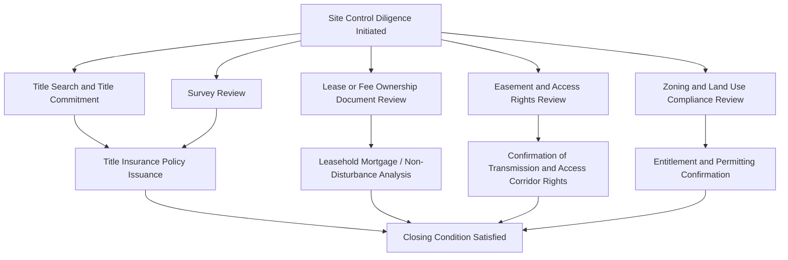

## Title, Real Property, and Site Control Review


### Overview

Title, real property, and site control diligence confirms that the project entity holds a sufficient, durable legal right to occupy and use the land underlying a renewable energy project for its entire intended operating life, free from competing claims or defects that could disrupt construction, operation, or the investor's expected return. Because renewable energy projects typically operate for 20-35+ years and tax equity investments extend at least through the flip period, real property diligence must confirm not just present site control but its durability across the full investment horizon.

### Why Real Property Diligence Is Foundational

**Key Points**

- A tax equity investor's return depends entirely on the project's ability to **continuously generate revenue and tax benefits** over a multi-year period; loss of site control (through a title defect, lease termination, or third-party claim) would be catastrophic to the investment, making this diligence area a threshold, non-negotiable workstream.
- Unlike many other diligence areas where risk can be mitigated through indemnification or insurance, a **fundamental title or site control defect** is often difficult or impossible to cure after the fact, particularly if construction has already commenced or if a competing claimant has superior rights.
- Site control diligence intersects with **interconnection rights** (the interconnection point is tied to a specific parcel), **construction financing** (lenders require clean title as collateral), and the **tax model's basis calculations** (in some structures, land lease payments or land-related costs affect eligible basis calculations).

### Diagram: Site Control Diligence Workstream



### Fee Ownership vs. Leasehold Site Control

**Key Points**

- Some projects are developed on **fee-owned land** (the project entity or an affiliate owns the underlying real property outright), while many others — particularly larger utility-scale solar and wind projects — use **leasehold site control**, leasing land from private landowners or, in some cases, government entities.
- **Leasehold structures** require particular diligence attention to:
  - **Lease term length relative to the investment horizon** — confirming the lease term (including all renewal options) extends comfortably beyond the anticipated project life and the tax equity investment period, since a lease expiring before the end of the useful life of the improvements would undermine the project's value.
  - **Rent escalation and payment terms** — confirming lease payment obligations are consistent with the financial model's operating expense assumptions.
  - **Assignment and financing provisions** — confirming the lease permits assignment to the project entity (if not already the direct tenant) and permits the landowner's consent to any leasehold mortgage or collateral assignment required by project lenders.
  - **Landlord subordination, non-disturbance, and attornment (SNDA) agreements** — critical documents ensuring that in the event of a landlord default (e.g., a foreclosure on the landlord's own financing), the project entity's leasehold rights are not disturbed, and that any successor landlord will recognize and honor the lease.
- **Multiple parcel/multiple landowner aggregations** — many utility-scale projects require leases or easements across numerous separate parcels from different landowners, multiplying the diligence burden and requiring careful tracking of each individual lease's terms, renewal dates, and any inconsistencies among the various agreements.

[Inference] The relative prevalence of leasehold versus fee ownership structures varies by project type, region, and technology (utility-scale wind and solar in the U.S. frequently use leasehold structures given the large land areas required relative to typical parcel sizes); this description reflects generally observed market patterns rather than a documented universal statistic.

### Title Search and Title Insurance

**Key Points**

- A **title search** is conducted to identify the chain of title, existing liens, encumbrances, easements, and any other matters of record affecting the property, culminating in a **title commitment** issued by a title insurance company describing the conditions under which it will issue a title policy.
- **Title insurance policies** relevant to tax equity transactions typically include:
  - An **owner's policy** (or, for leasehold interests, a **leasehold owner's policy**) protecting the project entity's interest in the real property or lease.
  - A **lender's policy**, where project debt exists, protecting the lender's security interest.
- **Common title exceptions and defects reviewed** include: prior liens or mortgages not yet released, boundary disputes, unrecorded easements or claims, mineral rights reservations (particularly relevant in regions where subsurface rights were historically severed from surface rights, which can create conflicts with surface use for renewable energy development), and access rights disputes.
- **Endorsements** commonly negotiated for renewable energy projects include access endorsements, contiguity endorsements (confirming multiple parcels are contiguous, relevant for large multi-parcel sites), and endorsements addressing the specific renewable energy improvements (confirming coverage extends to the specific facility being constructed).

[Unverified] The specific endorsement forms available and customary in renewable energy transactions vary by title insurer and jurisdiction, and should be confirmed with the specific title company and local counsel involved in a given transaction, as title insurance practice can have meaningful regional variation.

### Survey Review

**Key Points**

- An **ALTA/NSPS survey** (or equivalent, depending on jurisdiction) is typically obtained to verify the physical boundaries of the property, confirm the location of improvements (existing and planned), identify encroachments, and confirm consistency between the legal description used in title documents and the actual physical site.
- Survey review confirms alignment between the **leased or owned parcel boundaries** and the **project's actual footprint** (panel/turbine layout, access roads, substation location, transmission corridor), identifying any discrepancies that could require additional easements or lease amendments before construction.
- For projects spanning **multiple parcels**, the survey helps confirm there are no gaps or overlaps in site control coverage across the full project footprint.

### Easements and Access Rights

**Key Points**

- Beyond the primary lease or fee ownership of the generating facility site itself, renewable energy projects typically require a network of **easements** for:
  - **Access roads** — ingress/egress rights for construction and ongoing O&M access, often crossing parcels not otherwise part of the primary project site.
  - **Transmission/gen-tie corridors** — easements for the transmission line connecting the project to the interconnection point, which may cross multiple third-party parcels between the project site and the substation/interconnection point.
  - **Utility and communication easements** — for any auxiliary utility connections (water, telecommunications for SCADA systems) needed for project operation.
- Diligence confirms each required easement is **properly documented, recorded, and includes rights sufficient for the specific project use** (e.g., confirming an access easement permits heavy construction equipment traffic, not just pedestrian or light vehicle access).
- **Easement holder consent to project financing and any subsequent transfer** (similar to landlord consent under a lease) is typically required, since easement agreements may contain their own assignment restrictions.

### Zoning, Land Use, and Entitlement Review

**Key Points**

- Confirmation that the project site is properly **zoned or entitled** for renewable energy development, including any required conditional use permits, special use permits, or variances obtained from the applicable local land use authority.
- Review of **setback requirements, height restrictions, and other development standards** applicable under local zoning codes, confirming the as-designed project complies.
- Assessment of any **pending or threatened land use challenges** (e.g., neighboring landowner opposition, pending litigation regarding permit approvals) that could delay or jeopardize construction or continued operation.
- For projects on land subject to **agricultural preservation programs, conservation easements, or other use restrictions**, confirmation that renewable energy development is a permitted use under those restrictions, or that necessary waivers/amendments have been obtained.

### Government and Tribal Land Considerations

**Key Points**

- Projects sited on **federal, state, or tribal land** involve additional diligence layers, including compliance with the specific leasing regimes applicable to that land ownership category (e.g., Bureau of Land Management right-of-way grants for federal land, or tribal land leasing requirements involving Bureau of Indian Affairs approval processes), which typically involve longer approval timelines and more complex diligence than private land transactions.
- [Unverified] The specific procedural requirements for federal or tribal land leasing arrangements are subject to detailed and periodically updated agency regulations; parties considering such sites should engage specialized counsel experienced in the specific land ownership category involved, as this diligence area involves significant agency-specific procedural complexity beyond general real estate practice.

### Diligence Checklist Summary

**Example**

A representative real property and site control diligence checklist:



```
- Title commitment and underlying title search, reviewed for all exceptions
- Title insurance policy (owner's or leasehold owner's, plus lender's policy if applicable)
- ALTA/NSPS survey, reviewed for boundary and improvement location accuracy
- Executed lease(s) or fee ownership deed(s), reviewed for term, renewal options,
  rent escalation, assignment rights, and financing/collateral assignment provisions
- Subordination, Non-Disturbance, and Attornment (SNDA) agreements from
  landlord's existing lenders (if leasehold structure)
- All easement agreements (access, transmission/gen-tie, utility), reviewed
  for scope, term, and assignability
- Zoning confirmation letter or entitlement documentation
- Confirmation of no pending land use litigation or challenges
- Government/tribal land approvals, if applicable (e.g., BLM right-of-way grant)
- Landlord/easement holder estoppel certificates confirming good standing
  and no known defaults
```

[Inference] This checklist reflects commonly referenced real property diligence items in project finance and tax equity practice; the specific items required, and their relative priority, depend on the project's specific site control structure (fee vs. leasehold, single vs. multiple parcels, private vs. government/tribal land).

### Interaction with Other Diligence Workstreams

**Key Points**

- Real property diligence findings feed directly into the **legal documentation** workstream (title and lease representations in the operating agreement or MIPA, specific indemnities for title defects), the **technical/engineering diligence** workstream (confirming the surveyed site matches the IE's technical assessment of the project footprint), and the **financing** workstream (lender's title insurance and leasehold mortgage requirements).
- Any identified title or site control defect typically triggers a **structuring response** — cure through additional documentation (corrective deeds, easement amendments), a purchase price/capital contribution adjustment, a specific indemnity, or in more serious cases, closing delay pending resolution.

### Related Topics

- Technical and Engineering Due Diligence
- Interaction with Interconnection, Construction, and Offtake Agreements
- Consents, Opinions, and Closing Deliverables
- Guarantees, Indemnities, and Support Agreements
- Environmental Due Diligence in Renewable Energy Transactions
- Tax Due Diligence and Opinion Letters