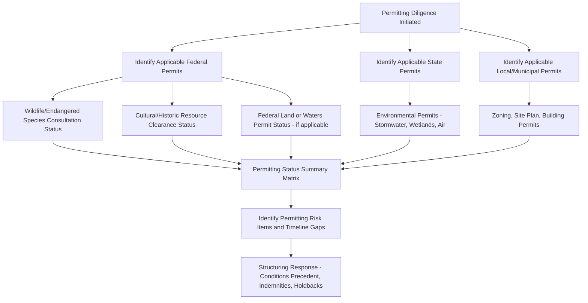

## Permitting and Environmental Diligence

### Overview

Permitting and environmental diligence confirms that a renewable energy project has obtained, or is positioned to timely obtain, all governmental approvals required for construction and operation, and that the project site presents no undisclosed environmental conditions that could create liability, delay, or remediation costs threatening the tax equity investor's return. This workstream spans federal, state, and local regulatory review and typically runs in parallel with the technical/engineering and real property diligence covered in the preceding modules.

### Categories of Required Permits

**Key Points**

Permitting requirements vary significantly by project type, technology, and jurisdiction, but commonly include:

1. **Land use and zoning permits** — conditional use permits, special use permits, or site plan approvals from the local planning/zoning authority (as referenced in the real property diligence module).
2. **Environmental permits** — depending on project scope and location, potentially including stormwater discharge permits (National Pollutant Discharge Elimination System (NPDES) permits or state equivalents for construction stormwater management), wetlands permits (Clean Water Act Section 404 permits for any wetland disturbance), and air quality permits (less commonly a major factor for wind/solar, but potentially relevant for certain construction activities or auxiliary equipment).
3. **Wildlife and habitat permits** — particularly significant for wind projects (avian and bat interaction concerns) and any project affecting habitat for federally or state-listed threatened or endangered species, potentially requiring consultation under the Endangered Species Act and, in some cases, an Incidental Take Permit.
4. **Cultural and historic resource clearances** — review under the National Historic Preservation Act (Section 106 consultation) where federal permitting or funding triggers apply, and coordination with State Historic Preservation Offices (SHPOs) and, where applicable, tribal consultation regarding cultural resources.
5. **Building and construction permits** — standard local building permits, electrical permits, and structural permits applicable to the specific improvements being constructed.
6. **Interconnection-related regulatory approvals** — coordination with (though generally distinct from) the interconnection agreement itself, potentially including state public utility commission approvals for certain interconnection or transmission arrangements.
7. **Federal land or waters permits** — where applicable, right-of-way grants (Bureau of Land Management), Army Corps of Engineers permits (for activities affecting navigable waters or wetlands), or Federal Aviation Administration (FAA) determinations (particularly for wind turbine height clearance near airports or under flight paths).

[Inference] The specific combination of permits required for any given project is highly jurisdiction- and site-specific; this list reflects commonly discussed permit categories in renewable energy project development practice rather than an exhaustive or universally applicable checklist, since permitting regimes vary considerably by state, county, and specific site conditions.

### Diagram: Permitting Diligence Workstream

### Permitting Status and Timing Diligence

**Key Points**

- For **construction-stage investments**, diligence must assess not just whether permits have been obtained, but the **maturity and appeal risk** of each permit — a permit that has been issued but remains within an appeal period, or is subject to pending litigation, carries materially different risk than a final, non-appealable permit.
- **Permit conditions and mitigation obligations** — many permits are issued subject to ongoing conditions (e.g., wildlife monitoring and curtailment protocols for wind turbines near sensitive bird or bat habitat, stormwater management plan compliance, noise monitoring), and diligence must confirm the project's operating budget and O&M plan account for the cost and operational impact of these ongoing compliance obligations.
- **Permit transferability** — confirmation that permits are transferable to, or have been properly issued in the name of, the project entity that will be the tax equity partnership's operating subsidiary, since some permits are non-transferable or require a formal transfer/reissuance process upon a change in project ownership structure.
- **Permit renewal and expiration risk** — for permits with defined terms (as opposed to permanent operational permits), diligence should confirm renewal is administratively routine or, if not, identify what would be required to renew and the risk of non-renewal.

### Environmental Site Assessments

**Key Points**

- A **Phase I Environmental Site Assessment (ESA)**, generally conducted in accordance with the ASTM E1527 standard (or successor/equivalent standard), is the baseline environmental diligence deliverable, involving a review of historical property use, regulatory database searches, a site visit, and interviews to identify **recognized environmental conditions (RECs)** — indications of actual or potential contamination.
- If a Phase I ESA identifies RECs, a **Phase II ESA** (involving actual soil, groundwater, or other environmental sampling and laboratory analysis) may be recommended to determine whether contamination is actually present and, if so, its extent.
- **Wetlands delineation studies** may be required as a distinct environmental diligence deliverable, particularly for larger sites, to confirm the presence, extent, and jurisdictional status of any wetlands that could trigger Clean Water Act permitting requirements or design/layout constraints.
- **Threatened and endangered species surveys** — biological surveys (often multi-season, given seasonal species presence variability) to identify the presence of protected species or critical habitat, informing both permitting requirements and potential project design modifications (e.g., turbine micrositing to avoid sensitive areas).

[Unverified] The specific standards and survey protocols referenced (e.g., ASTM E1527, multi-season biological survey requirements) are subject to periodic updates by the relevant standard-setting bodies and regulatory agencies; practitioners should confirm the current version of applicable standards and any jurisdiction-specific protocol requirements at the time of a given transaction.

### Wind-Specific Environmental Considerations

**Key Points**

- Wind projects face particular scrutiny regarding **avian and bat mortality risk**, often requiring pre-construction and post-construction monitoring studies, and in some cases negotiated **Habitat Conservation Plans (HCPs)** or similar agreements with federal/state wildlife agencies establishing mitigation measures and, where applicable, incidental take authorization.
- **Curtailment protocols** — operational restrictions (e.g., reduced turbine operation during specific times of day, seasons, or wind speed conditions to reduce bat mortality risk) are commonly imposed as permit conditions and must be reflected in the financial model's production assumptions, since curtailment reduces both generation revenue and PTC-eligible production.
- **Noise and shadow flicker studies** — assessments of projected noise levels and shadow flicker effects on nearby residences, often required as part of the local permitting process and sometimes resulting in specific operational restrictions or setback requirements.

### Solar-Specific Environmental Considerations

**Key Points**

- **Glare studies** — particularly relevant near airports or roadways, assessing potential glare impact from photovoltaic panels on aviation or vehicular traffic, sometimes required as part of FAA coordination or local permitting.
- **Stormwater and erosion control** — given the large ground-disturbing footprint of utility-scale solar, stormwater management plan adequacy and erosion/sedimentation control compliance are frequently significant construction-phase permitting and environmental compliance considerations.
- **Agricultural land conversion considerations** — in jurisdictions with agricultural land preservation policies, diligence may need to address compliance with specific agricultural impact mitigation requirements or preservation program interactions (also referenced in the real property module).

### Environmental Indemnification and Insurance Interaction

**Key Points**

- Findings from environmental diligence directly inform the **environmental indemnity provisions** discussed in the earlier guarantees and indemnities module — a Phase I ESA identifying no RECs typically supports a more limited environmental indemnity, while identified RECs or Phase II findings of actual contamination typically require more robust indemnification, escrow, or specific remediation obligations as closing conditions.
- **Environmental insurance** (pollution legal liability insurance) is sometimes procured to supplement or substitute for seller/sponsor indemnification, particularly where historical site use (e.g., prior agricultural, industrial, or mining use) creates residual uncertainty despite a clean Phase I ESA.
- Coordination with the **title insurance** diligence (prior module) is also relevant, since certain environmental liens (e.g., for government-funded remediation) can attach to real property and affect title.

### Diligence Findings Escalation and Resolution

**Key Points**

Common permitting and environmental findings and their typical resolution paths:

| Finding | Typical Structuring Response |
| --- | --- |
| Permit issued but within appeal period | Closing condition requiring appeal period expiration, or specific indemnity for appeal-related delay costs |
| REC identified in Phase I ESA | Phase II ESA required; if contamination confirmed, remediation escrow or specific indemnity |
| Incomplete wildlife survey (seasonal gap) | Condition precedent requiring survey completion before financial close, or holdback pending results |
| Non-transferable permit in sponsor's name | Covenant requiring permit transfer/reissuance as a closing or post-closing condition |
| Pending land use litigation | Closing delay pending resolution, or specific risk allocation via indemnity if investor proceeds notwithstanding |

[Inference] This table illustrates commonly discussed resolution approaches in project finance and tax equity practice; the specific response chosen in any given transaction depends on the materiality of the finding, the sponsor's creditworthiness, and the overall risk tolerance of the investor and lender involved.

### Related Topics

- Title, Real Property, and Site Control Review
- Technical and Engineering Due Diligence
- Guarantees, Indemnities, and Support Agreements
- Interaction with Interconnection, Construction, and Offtake Agreements
- Tax Due Diligence and Opinion Letters
- Consents, Opinions, and Closing Deliverables