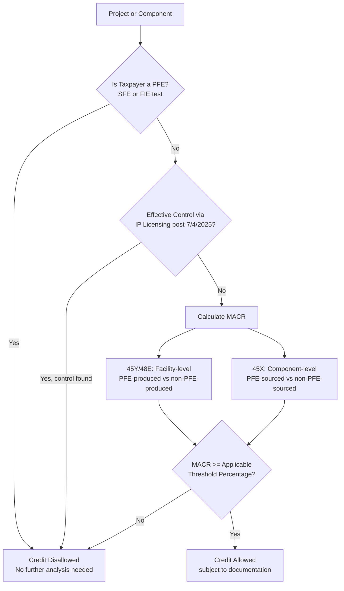

## Foreign Entity of Concern Supply Chain Diligence

### Overview and Statutory Purpose

Foreign Entity of Concern (FEOC) supply chain diligence is the compliance discipline of verifying that a clean energy project, facility, energy storage technology, or manufactured component does not derive disqualifying ownership, control, or material inputs from a "prohibited foreign entity" (PFE), such that a taxpayer can substantiate eligibility for federal clean energy tax credits. FEOC restrictions are primarily intended to prevent Chinese companies from claiming the tax credits and to reduce reliance on China for supply chains of clean energy technologies, though the restrictions also reach entities connected to Russia, Iran, and North Korea. [Bipartisan Policy Center](https://bipartisanpolicy.org/explainer/unpacking-the-feoc-provisions-in-the-one-big-beautiful-bill-act/)

FEOC diligence operates across two historically distinct regimes that practitioners must not conflate:

1. **Section 30D Clean Vehicle Credit FEOC rules** (IRA-era, 2023–2024 origin) — the original battery/critical-mineral sourcing exclusions.
2. **OBBBA Prohibited Foreign Entity (PFE) rules** (2025–2026) — a much broader regime extending FEOC-style restrictions to six additional clean energy tax credits beyond 30D, layering both an entity-status test and a supply-chain material assistance test onto each credit. [Baker Tilly](https://www.bakertilly.com/insights/understanding-foreign-entity-of-concern)

Practitioners working in this area in 2026 are effectively running two diligence tracks simultaneously: a mature, settled 30D vehicle-battery track and a rapidly-evolving OBBBA project/manufacturing track still being defined through interim IRS guidance.

---

### Legislative and Regulatory Timeline

On Friday, July 4, 2025, President Trump signed H.R. 1, the One Big Beautiful Bill Act (OBBB), into law, which extended FEOC restrictions, previously limited to the section 30D clean vehicle credit in the Inflation Reduction Act (IRA), to six additional clean energy tax credits. The EO directs Treasury to issue new "beginning of construction" guidance for purposes of Sections 45Y and 48E by August 18, 2025, reflecting the administration's intent to move quickly on implementation. [Unpacking the FEOC Provisions in the Senate Finance Reconciliation Bill +2](https://bipartisanpolicy.org/explainer/unpacking-the-feoc-provisions-in-the-one-big-beautiful-bill-act/)

Key milestones:

- **December 2023 / May 2024** — Treasury, IRS, and DOE issued final regulations and interpretive guidance for the Section 30D FEOC rules. Pursuant to the Treasury and IRS final rule on the section 30D Clean Vehicle Tax Credit, an EV containing battery components manufactured or assembled by a FEOC will be ineligible to receive the tax credit starting in 2024. [Department of Energy](https://www.energy.gov/articles/doe-releases-final-interpretive-guidance-definition-foreign-entity-concern)
- **July 4, 2025** — OBBBA enacted, creating the PFE/material-assistance regime for §§45X, 45Y, 48E, and other credits.
- **February 12, 2026** — the IRS released interim guidance in the form of IRS Notice 2026-15, on the new prohibited foreign entity (PFE) regime and its material assistance cost ratio (MACR) test applicable to clean electricity projects claiming tax credits under Sections 45Y and 48E, and advanced manufacturing production credits under Section 45X. [McGuireWoods](https://www.mcguirewoods.com/client-resources/alerts/2026/3/irs-releases-initial-feoc-guidance-answers-key-questions-leaves-others-unanswered/)
- **Ongoing (2026)** — Notice 2026-15 expressly defers on rules for prohibited foreign entity determinations to future proposed regulations, meaning entity-status diligence (who counts as a PFE) remains less settled than the cost-ratio mechanics. [Novogradac](https://www.novoco.com/notes-from-novogradac/managing-the-interim-feoc-guidance-irs-notice-2026-15-addresses-material-assistance-for-sections-45y-48e-and-45x-deferring-on-broader-pfe-status-guidance)

[Inference] Given the pace of interim guidance releases (December 2023, May 2024, July 2025, February 2026), practitioners should expect additional Treasury/IRS notices and proposed regulations to refine PFE status definitions and safe harbor tables through 2026–2027; diligence procedures built today should be designed for revision rather than treated as final.

---

### Defining "Foreign Entity of Concern" — Legacy 30D Definition

The IRA defines an FEOC as an entity "owned by," "controlled by," or "subject to the jurisdiction or direction of" a government of a covered country (the People's Republic of China, Iran, North Korea, or Russia). Under DOE's interpretive guidance: [DLA Piper](https://www.dlapiper.com/en/insights/publications/2023/12/proposed-regulations-from-treasury-and-doe)

- the statute identifies certain entities as FEOCs if they appear on certain lists maintained by other agencies (i.e., entities designated as foreign terrorist organizations by the Secretary of State and individuals and entities included on the Specially Designated Nationals and Blocked Persons List (SDN List) maintained by the Department of the Treasury's Office of Foreign Assets Control (OFAC)), as well as persons alleged by the Attorney General to have committed certain crimes. [energy](https://www.energy.gov/mesc/foreign-entity-concern-interpretive-guidance)
- the statute identifies as FEOCs all entities "owned by, controlled by, or subject to the jurisdiction or direction of the government of a covered nation" (defined in 10 USC § 2533c(d)(2) as North Korea, the People's Republic of China (PRC), Russia, and Iran). [energy](https://www.energy.gov/mesc/foreign-entity-concern-interpretive-guidance)

For the 30D credit specifically: Section 30D provides that a clean vehicle credit is disallowed if: (i) beginning in 2024, any of a vehicle's battery components were manufactured or assembled by an FEOC; and (ii) beginning in 2025, the vehicle (battery) contains critical minerals "extracted, processed, or recycled" by an FEOC. [DLA Piper](https://www.dlapiper.com/en/insights/publications/2023/12/proposed-regulations-from-treasury-and-doe)

**"FEOC status of U.S.-incorporated subsidiaries"** was a heavily litigated interpretive question — DOE's final guidance expounds on key definitions, such as those for "senior political officials," clarifies the process for calculating control, and provides edits to the licensing and contracting provisions in response to industry comment. [energy](https://www.energy.gov/sites/default/files/2024-05/2024.05.06%20DOE%20FEOC%20Interpretive%20Guidance%20-%20External_OS.pdf)

---

### The OBBBA Expansion — Prohibited Foreign Entities (PFE)

OBBBA replaces/supplements the simpler 30D-style FEOC test with a two-pronged PFE framework for §§45X, 45Y, and 48E (and other listed credits):

**Prong 1 — Entity Status (Ownership/Control Test)**

the FEOC rules prohibit taxpayers from claiming the Section 45Y PTC or Section 48E ITC if the construction of the project begins after December 31, 2025, and the owner receives material assistance from a disqualifying entity, but *before* reaching material assistance, the taxpayer itself must not be a PFE. these restrictions broaden the categories of restricted foreign entities from those covered by the Biden-era Department of Energy interpretation of FEOC applicable in the context of electric vehicles to a more expansive category of PFEs. the first set includes restrictions related to ownership and control of a project by a "specified foreign entity" (SFE) or a "foreign-influenced entity" (FIE). [The “One Big Beautiful Bill” Act – Navigating the New Energy Landscape | Insights | Sidley Austin LLP +2](https://www.sidley.com/en/insights/newsupdates/2025/07/the-one-big-beautiful-bill-act-navigating-the-new-energy-landscape)

A critical and still-unsettled interpretive point concerns IP licensing arrangements as a proxy for control: Treasury and the IRS intend to issue proposed regulations providing that if a taxpayer makes a payment to a specified foreign entity under any IP licensing agreement with respect to a project, facility or component, and the agreement was entered into or modified on or after July 4, 2025, then the specified foreign entity will be treated as exercising effective control over the project, facility or component, and the taxpayer will be considered a foreign-influenced entity. If considered a foreign-influenced entity, the applicable project, facility or component will not qualify for the Code Section 45Y, 48E or 45X credit. This broad interpretation is consistent with the statutory language in the OBBBA and creates a trap for the unwary — meaning routine technology-licensing arrangements with foreign counterparties (even non-Chinese) can inadvertently trigger disqualification. [Bracewell LLP](https://www.bracewell.com/resources/treasury-and-irs-issue-guidance-on-foreign-entity-of-concern-rules-for-clean-energy-tax-credits/)[Bracewell LLP](https://www.bracewell.com/resources/treasury-and-irs-issue-guidance-on-foreign-entity-of-concern-rules-for-clean-energy-tax-credits/)

Related confirmation on statutory construction: it confirms that the intellectual property "effective control" rules are read properly as a disjunctive list (and therefore apply to applicable contracts, agreements or other arrangements entered into or modified on or after July 4, 2025), and Treasury promises to provide prohibited foreign entity anti-abuse rules authorized under § 7701(a)(51)(D) and (K). [A&O Shearman](https://www.aoshearman.com/en/insights/irs-publishes-guidance-for-the-purposes-of-determining-material-assistance)[A&O Shearman](https://www.aoshearman.com/en/insights/irs-publishes-guidance-for-the-purposes-of-determining-material-assistance)

"Effective control" itself remains an open drafting question: [Unverified/pending regulation] the precise operational test for "effective control" outside the IP-licensing proxy has not yet been finalized in binding regulations as of this writing, and taxpayers must monitor forthcoming proposed regulations.

**Prong 2 — Material Assistance (Supply Chain Test)**

Even a taxpayer that is not itself a PFE can lose credit eligibility if the underlying property embeds too much PFE-sourced input. these amendments deny tax credits for PTC or ITC property that includes "material assistance" from a "prohibited foreign entity" (PFE). Material assistance is determined through a material assistance cost ratio (MACR), which considers costs associated with the PTC or ITC property that are attributable to products or components that are mined, produced, or manufactured by a PFE. [Millerchevalier](https://www.millerchevalier.com/publication/notice-2026-15-provides-guidance-evaluating-material-assistance-section-45y-45x-and-48e)[Millerchevalier](https://www.millerchevalier.com/publication/notice-2026-15-provides-guidance-evaluating-material-assistance-section-45y-45x-and-48e)

---

### The Material Assistance Cost Ratio (MACR) Framework

IRS Notice 2026-15 delivers a framework for calculating "material assistance" under Sections 45Y, 48E and 45X, introducing a detailed MACR methodology, released on February 12, 2026. [Novogradac](https://www.novoco.com/notes-from-novogradac/managing-the-interim-feoc-guidance-irs-notice-2026-15-addresses-material-assistance-for-sections-45y-48e-and-45x-deferring-on-broader-pfe-status-guidance)[Millerchevalier](https://www.millerchevalier.com/publication/notice-2026-15-provides-guidance-evaluating-material-assistance-section-45y-45x-and-48e)

**Basic mechanics — §45Y / §48E (facility-level):**

MACR is calculated as the ratio of total direct manufacturing costs not attributable to PFEs divided by total direct manufacturing costs. Practically: [Baker Tilly](https://www.bakertilly.com/insights/treasury-releases-interim-feoc-macr-safe-harbor-guidance)

$$MACR_{45Y/48E} = \frac{\text{Total Direct Costs} - \text{PFE-Attributable Direct Costs}}{\text{Total Direct Costs}}$$

MACR calculations center on direct costs attributable to manufactured products and manufactured product components incorporated into qualified facilities (sections 48E and 45Y) or eligible components and critical minerals (section 45X). A qualified facility, energy storage technology or eligible component is ineligible for applicable energy credits if its MACR falls below the applicable statutory thresholds. [Baker Tilly](https://www.bakertilly.com/insights/treasury-releases-interim-feoc-macr-safe-harbor-guidance)[Baker Tilly](https://www.bakertilly.com/insights/treasury-releases-interim-feoc-macr-safe-harbor-guidance)

Importantly for diligence scoping: Notice 2026-15 confirms that for sections 48E and 45Y, MACR is calculated using the taxpayer's acquisition cost of manufactured products incorporated into the facility. Project owners are not required to reconstruct the manufacturer's internal cost structure — a significant administrability concession that shifts the deepest tracing burden upstream to manufacturers rather than project developers. [Baker Tilly](https://www.bakertilly.com/insights/treasury-releases-interim-feoc-macr-safe-harbor-guidance)

For any taxable year for which a taxpayer is determining the amount of a § 45Y or § 48E credit, the taxpayer will calculate a separate Clean Electricity MACR for each qualified facility or EST. For example, a taxpayer that places in service two qualified facilities under § 45Y within a taxable year would calculate two Clean Electricity MACRs — MACR is computed per-facility, not on a portfolio or entity-wide basis. [IRS](https://www.irs.gov/pub/irs-drop/n-26-15.pdf)

**Basic mechanics — §45X (component-level):**

Section 45X uses a different, narrower unit of analysis. unlike the facility-level analysis applicable to sections 45Y and 48E, the Section 45X framework focuses on the costs attributable to the specific eligible component being produced and sold. [BakerHostetler](https://www.bakerlaw.com/insights/material-assistance-newly-issued-irs-guidance/)

$$MACR_{45X} = \frac{\text{Total Direct Material Costs} - \text{PFE Direct Material Costs}}{\text{Total Direct Material Costs}}$$

If the MACR falls below the applicable threshold percentage, the eligible component is considered to include material assistance from a prohibited foreign entity. [BakerHostetler](https://www.bakerlaw.com/insights/material-assistance-newly-issued-irs-guidance/)

The §45X calculation steps: taxpayers must identify the "constituent materials" that are directly incorporated into the eligible component (Step 1), then trace and sum PFE-attributable versus non-PFE-attributable costs (Steps 2–3, per Step 3: Determine the total percentage as the sum of the assigned cost percentages for all identified items). [BakerHostetler](https://www.bakerlaw.com/insights/material-assistance-newly-issued-irs-guidance/)[Bracewell LLP](https://www.bracewell.com/resources/treasury-and-irs-issue-guidance-on-foreign-entity-of-concern-rules-for-clean-energy-tax-credits/)

A key sourcing distinction between the two frameworks: the MACR for sections 45Y and 48E focuses on PFE-produced versus non-PFE-produced while the MACR for section 45X focuses on PFE-sourced versus non-PFE-sourced. Significantly, this distinction could result in looking through an MP supplier to determine who produced the MP's MPCs in the case of sections 45Y and 48E, while in the case of section 45X, generally the only relevant determination is whether the supplier of the Constituent Material is a PFE. One exception in the section 45X context is that if a taxpayer acquires a Constituent Material from a "reseller," then the taxpayer must look to the entity that mined, produced, or manufactured the Constituent Material to determine whether the Constituent Material is PFE-sourced or not PFE-sourced. [Millerchevalier](https://www.millerchevalier.com/publication/notice-2026-15-provides-guidance-evaluating-material-assistance-section-45y-45x-and-48e)[Millerchevalier](https://www.millerchevalier.com/publication/notice-2026-15-provides-guidance-evaluating-material-assistance-section-45y-45x-and-48e)

---

### Applicable Threshold Percentages (Phase-In Schedule)

The MACR must equal or exceed a statutory "Applicable Threshold Percentage" that escalates by vintage year, making compliance progressively harder over time — a deliberate design to force supply-chain reshoring.

**Qualified Facilities (§§45Y/48E):**

the Threshold Percentage is 40 percent for a project that begins construction in 2026; 45 percent for a project that begins construction in 2027; 50 percent for a project that begins construction in 2028; 55 percent for a project that begins construction in 2029 or later. [Weil, Gotshal & Manges](https://www.weil.com/-/media/mailings/2026/q1/treasury-and-irs-release-initial-feoc-guidance.pdf?rev=2510bcb3e22d4f088f7344a977eadc36)

**Energy Storage Technology (EST) (§48E):**

the Threshold Percentage is 55 percent for a project that begins construction in 2026; 60 percent for a project that begins construction in 2027; 65 percent for a project that begins construction in 2028; 70 percent for a project that begins construction in 2029 or later. [Weil, Gotshal & Manges](https://www.weil.com/-/media/mailings/2026/q1/treasury-and-irs-release-initial-feoc-guidance.pdf?rev=2510bcb3e22d4f088f7344a977eadc36)

**Eligible Components — Solar (§45X, illustrative):**

for solar components, the Threshold Percentage is 50 percent for components sold in 2026; 60 percent for components sold in 2027; 70 percent for components sold in 2028; 80 percent for components sold in 2029; and, 85 percent for components sold thereafter. the threshold percentage varies by the type of equipment — other component categories (batteries, wind, inverters, critical minerals) carry their own distinct escalating schedules, and diligence teams must confirm the correct table for each product category rather than assume the solar schedule applies uniformly. [Weil, Gotshal & Manges](https://www.weil.com/-/media/mailings/2026/q1/treasury-and-irs-release-initial-feoc-guidance.pdf?rev=2510bcb3e22d4f088f7344a977eadc36)[Troutman Pepper Locke](https://www.troutman.com/insights/treasury-and-irs-issue-feoc-material-assistance-guidance/)

**Effective dates:** material assistance is restricted for Sections 45Y and 48E eligible facilities or ESTs that begin construction after Dec. 31, 2025, and for Section 45X eligible producers beginning the first tax year after the OBBBA was enacted, July 4, 2025. this limitation generally applies for Eligible Components sold in taxable years beginning after July 4, 2025 (i.e., 2026 for calendar year taxpayers). [Novogradac](https://www.novoco.com/notes-from-novogradac/managing-the-interim-feoc-guidance-irs-notice-2026-15-addresses-material-assistance-for-sections-45y-48e-and-45x-deferring-on-broader-pfe-status-guidance)[Weil, Gotshal & Manges](https://www.weil.com/-/media/mailings/2026/q1/treasury-and-irs-release-initial-feoc-guidance.pdf?rev=2510bcb3e22d4f088f7344a977eadc36)

Note the OBBBA extended the ownership/control-based FEOC prohibition timeline differently by credit: for the 45U and 45Z credits, the prohibition on a FIE begins the second tax year after the date of enactment (i.e., 2027). However, for 45X, 45Y, 45Q and 48E, the prohibitions on FIEs begin immediately/earlier — diligence calendars must be built per-credit, not applied uniformly across a client's credit portfolio. [Baker Tilly](https://www.bakertilly.com/insights/understanding-foreign-entity-of-concern)

---

### Interim Safe Harbors

Because full-chain tracing is often impractical, Notice 2026-15 provides administrable shortcuts. the Notice also provides three interim safe harbors, and generally: the Notice provides both general rules and safe harbors for determining the MACR, which must exceed the Applicable Threshold Percentage. Because compliance with the general rules could be difficult, and because the safe harbors are available for the most common projects (including solar, wind, and battery projects), we expect the safe harbors to be widely used [this is the cited firm's forward-looking assessment, not a Treasury statement — treat as informed practitioner commentary, i.e., [Inference] adopted from counsel analysis rather than binding IRS text]. [IRS issues guidance on material assistance of a prohibited foreign entity | RSM US +2](https://rsmus.com/insights/tax-alerts/2026/irs-guidance-material-assistance-prohibited-foreign-entity.html)

the notice prioritizes administrability by allowing reliance on interim safe harbors, supplier certifications and domestic content tables, giving developers and manufacturers clearer compliance pathways amid complex global supply chains — actually sourced more precisely from Novogradac's summary: taxpayers may rely on either interim safe harbors or the Section 3 non safe harbor MACR framework to assess material assistance for Sections 45Y, 48E and 45X until safe harbor tables and proposed regulations are published. [A&O Shearman](https://www.aoshearman.com/en/insights/irs-publishes-guidance-for-the-purposes-of-determining-material-assistance)[Novogradac](https://www.novoco.com/notes-from-novogradac/managing-the-interim-feoc-guidance-irs-notice-2026-15-addresses-material-assistance-for-sections-45y-48e-and-45x-deferring-on-broader-pfe-status-guidance)

Named safe harbor categories referenced across guidance summaries include an **Identification Safe Harbor**, a **Cost Percentage Safe Harbor**, and a **Certification Safe Harbor** — unless relying on one of the safe harbors described elsewhere in Notice 2026-15 (e.g., Identification, Cost Percentage or Certification safe harbors), taxpayers must perform the full multi-step MACR calculation described above. [BakerHostetler](https://www.bakerlaw.com/insights/material-assistance-newly-issued-irs-guidance/)

Existing domestic-content infrastructure is explicitly leveraged as an interim bridge: the Act also directs Treasury to publish "safe harbor tables" in future guidance, which taxpayers may rely on to determine the percentage of costs attributable to manufactured products or eligible components — provided they do not know the listed percentage is inaccurate. In the interim, taxpayers may rely on the tables included in IRS Notice 2025-08, issued under the existing domestic content rules. Consistently, the safe harbor allows taxpayers to trace to the level of detail of the items listed in the IRS's domestic content safe harbor tables with additional averaging rules to account for the business realities of procurement and tracing. [Kirkland & Ellis LLP](https://www.kirkland.com/publications/kirkland-alert/2025/08/one-big-beautiful-bill-act-brings-big-changes-to-green-energy-tax-credits)[Crux](https://www.cruxclimate.com/insights/treasury-releases-initial-foreign-entity-of-concern-rules)

Practical favorability noted by practitioners: the Notice's MACR guidance establishes practical safe harbors and methodologies that are generally favorable, particularly for distributed battery energy storage systems (BESS) under 1 MWAC and Section 45X producers. [McGuireWoods](https://www.mcguirewoods.com/client-resources/alerts/2026/3/irs-releases-initial-feoc-guidance-answers-key-questions-leaves-others-unanswered/)

---

### Supplier Certification and Documentation Standards

Because project developers are generally not required to reconstruct upstream manufacturers' internal cost books (per the 48E/45Y acquisition-cost rule above), the diligence architecture leans heavily on **supplier certifications** flowing down the supply chain.

this interim framework includes instructions on direct cost identification, tracing and calculations of the MACR, optional interim safe harbors, supplier certification rules and documentation standards. [Novogradac](https://www.novoco.com/notes-from-novogradac/managing-the-interim-feoc-guidance-irs-notice-2026-15-addresses-material-assistance-for-sections-45y-48e-and-45x-deferring-on-broader-pfe-status-guidance)

Industry commentary submitted to Treasury during the guidance process (via Clean Air Task Force) illustrates the documentation questions practitioners should build diligence checklists around:

- Treasury should specify what information will be required to demonstrate FEOC compliance, including guidance on supplier certifications in the near term and whether reporting domestic production of the percent of cost of components will be sufficient for reporting (vs. reporting of the non-U.S. percentage). [Clean Air Task Force](https://www.catf.us/2025/09/considerations-for-foreign-entity-of-concern-feoc-guidance/)
- It would be helpful to clarify whether or under what circumstances components further down the supply chain would be attributable to such entities — i.e., how many tiers of subcontractors/subsuppliers a diligence exercise must reach. [Clean Air Task Force](https://www.catf.us/2025/09/considerations-for-foreign-entity-of-concern-feoc-guidance/)
- Treasury should clarify that if a system component or manufactured product is assembled, integrated, and licensed by a non-FEOC, the cost of such component should not be attributable to a FEOC even if some subcomponents originated from a FEOC — the "substantial transformation" question, still contested. [Clean Air Task Force](https://www.catf.us/2025/09/considerations-for-foreign-entity-of-concern-feoc-guidance/)
- Treasury retains discretion to determine, for example, what constitutes sufficiently "similar" agreements or arrangements... or what constitutes an "unrestricted" contractual right, meaning certain contractual carve-outs used to avoid "effective control" characterization are not yet reliably safe. [Clean Air Task Force](https://www.catf.us/2025/09/considerations-for-foreign-entity-of-concern-feoc-guidance/)

[Inference] Given the emphasis on supplier certifications as the primary evidentiary backbone, diligence teams should treat supplier certification language, refresh cadence, and audit/reliance rights as a primary contract negotiation point in procurement agreements for PFE-sensitive components (batteries, inverters, polysilicon, wafers, and critical minerals), even though Treasury has not yet issued a standardized certification form.

---

### Practical Diligence Workflow

A structured FEOC/PFE diligence engagement for a clean energy tax equity transaction typically proceeds through the following phases:

**Phase 1 — Entity Status Screening (Taxpayer/Sponsor Level)**

- Screen the taxpayer, its parent, and controlling equityholders against OFAC SDN lists, State Department FTO designations, and covered-nation ownership/control indicia.
- Review governance documents (board composition, veto rights, voting agreements) for indicia of "effective control" by a specified foreign entity.
- Inventory all IP licensing agreements tied to the project, facility, or component — flag any executed or materially modified on or after July 4, 2025, for effective-control analysis.

**Phase 2 — Supply Chain Mapping**

- Build a bill-of-materials (BOM) tree for the qualified facility, EST, or eligible component down to the constituent-material level used in the relevant domestic content safe harbor tables (Notice 2025-08 tables as interim reference).
- Identify each direct supplier's country of manufacture/production and any known PFE relationships (ownership, JV structures, licensing).
- Flag "reseller" transactions requiring look-through to the original manufacturer under the §45X rule.

**Phase 3 — MACR Calculation**

- Select calculation pathway: full Section 3 general-rule tracing vs. an available interim safe harbor.
- Compute facility-level MACR (45Y/48E) or component-level MACR (45X) using acquisition-cost data.
- Compare computed MACR against the applicable threshold percentage for the relevant construction-start or sale year.

**Phase 4 — Documentation and Certification**

- Collect supplier certifications supporting non-PFE sourcing determinations.
- Document safe harbor election and underlying support (if relying on a safe harbor rather than full tracing).
- Retain contemporaneous records supporting the "beginning of construction" or "placed in service" date used to select the applicable threshold year.

**Phase 5 — Ongoing Monitoring**

- Re-certify supplier status periodically, since PFE designations, ownership structures, and safe harbor tables are subject to change.
- Monitor forthcoming proposed regulations, since Notice 2026-15... expressly defers on rules for prohibited foreign entity determinations to future proposed regulations — the entity-status prong of diligence should be revisited when those regulations issue. [Novogradac](https://www.novoco.com/notes-from-novogradac/managing-the-interim-feoc-guidance-irs-notice-2026-15-addresses-material-assistance-for-sections-45y-48e-and-45x-deferring-on-broader-pfe-status-guidance)

---

### Diligence Checklist Reference Table

| Diligence Area | Key Question | Primary Source |
| --- | --- | --- |
| Entity status (PFE/SFE/FIE) | Is the taxpayer or a controlling party a covered-nation-linked entity? | OBBBA §7701(a)(51); DOE 30D interpretive guidance |
| IP licensing control | Was a relevant IP license entered/modified on or after 7/4/2025 with a specified foreign entity? | Notice 2026-15 §5; Bracewell/AO Shearman summaries |
| MACR calculation method | Facility-level (45Y/48E) or component-level (45X)? | Notice 2026-15 §§3–4 |
| Threshold percentage | What year does construction begin (facility) or sale occur (component)? | Notice 2026-15 safe harbor tables |
| Safe harbor eligibility | Does the project qualify for Identification, Cost Percentage, or Certification safe harbor? | Notice 2026-15 |
| Supplier certification | Does the supplier certification cover non-PFE sourcing at the correct tier (direct vs. reseller look-through)? | Notice 2026-15; CATF comment letter |
| Documentation retention | Is beginning-of-construction and sourcing evidence contemporaneously documented? | General §45Y/48E/45X substantiation practice |

---

### Illustrative Compliance Architecture (svg_diagram)

<svg xmlns="http://www.w3.org/2000/svg" viewBox="0 0 800 460">
<text x="400" y="28" text-anchor="middle" font-size="18" font-weight="bold" fill="#1a1a1a">FEOC / PFE Supply Chain Diligence Architecture (svg_diagram)</text>
<rect x="30" y="55" width="220" height="70" rx="6" fill="#e8f0fe" stroke="#4a6fa5" />
<text x="140" y="80" text-anchor="middle" font-size="13" font-weight="bold" fill="#1a1a1a">Entity Status Screen</text>
<text x="140" y="98" text-anchor="middle" font-size="11" fill="#333">SFE / FIE / OFAC / IP Control</text>
<text x="140" y="114" text-anchor="middle" font-size="11" fill="#333">Taxpayer &amp; Sponsor Level</text>
<rect x="290" y="55" width="220" height="70" rx="6" fill="#e8f0fe" stroke="#4a6fa5" />
<text x="400" y="80" text-anchor="middle" font-size="13" font-weight="bold" fill="#1a1a1a">Supply Chain Mapping</text>
<text x="400" y="98" text-anchor="middle" font-size="11" fill="#333">BOM Tree to Constituent Material</text>
<text x="400" y="114" text-anchor="middle" font-size="11" fill="#333">Direct + Reseller Look-Through</text>
<rect x="550" y="55" width="220" height="70" rx="6" fill="#e8f0fe" stroke="#4a6fa5" />
<text x="660" y="80" text-anchor="middle" font-size="13" font-weight="bold" fill="#1a1a1a">MACR Calculation</text>
<text x="660" y="98" text-anchor="middle" font-size="11" fill="#333">Facility (45Y/48E) or</text>
<text x="660" y="114" text-anchor="middle" font-size="11" fill="#333">Component (45X) level</text>
<line x1="250" y1="90" x2="290" y2="90" stroke="#4a6fa5" stroke-width="2" marker-end="url(#arrow)" />
<line x1="510" y1="90" x2="550" y2="90" stroke="#4a6fa5" stroke-width="2" marker-end="url(#arrow)" />
<line x1="660" y1="125" x2="660" y2="160" stroke="#4a6fa5" stroke-width="2" marker-end="url(#arrow)" />
<rect x="470" y="160" width="380" height="80" rx="6" fill="#fff4e5" stroke="#c98a2c" />
<text x="660" y="185" text-anchor="middle" font-size="13" font-weight="bold" fill="#1a1a1a">Safe Harbor Decision</text>
<text x="660" y="203" text-anchor="middle" font-size="11" fill="#333">Identification | Cost Percentage | Certification</text>
<text x="660" y="219" text-anchor="middle" font-size="11" fill="#333">vs. Full Section 3 General-Rule Tracing</text>
<text x="660" y="233" text-anchor="middle" font-size="11" fill="#333">Notice 2025-08 domestic content tables (interim)</text>
<line x1="660" y1="240" x2="660" y2="275" stroke="#4a6fa5" stroke-width="2" marker-end="url(#arrow)" />
<rect x="470" y="275" width="380" height="70" rx="6" fill="#e6f4ea" stroke="#3a8a52" />
<text x="660" y="300" text-anchor="middle" font-size="13" font-weight="bold" fill="#1a1a1a">Threshold Comparison</text>
<text x="660" y="318" text-anchor="middle" font-size="11" fill="#333">MACR vs. Applicable Threshold Percentage</text>
<text x="660" y="333" text-anchor="middle" font-size="11" fill="#333">(vintage year of construction start / sale)</text>
<line x1="660" y1="345" x2="660" y2="380" stroke="#4a6fa5" stroke-width="2" marker-end="url(#arrow)" />
<rect x="470" y="380" width="380" height="60" rx="6" fill="#fdecec" stroke="#c0392b" />
<text x="660" y="405" text-anchor="middle" font-size="13" font-weight="bold" fill="#1a1a1a">Documentation &amp; Certification</text>
<text x="660" y="423" text-anchor="middle" font-size="11" fill="#333">Supplier certs, safe harbor election, retention</text>
<line x1="140" y1="125" x2="140" y2="380" stroke="#999" stroke-width="1.5" stroke-dasharray="4,3" />
<line x1="140" y1="380" x2="470" y2="410" stroke="#999" stroke-width="1.5" stroke-dasharray="4,3" marker-end="url(#arrow)" />
<text x="140" y="400" text-anchor="middle" font-size="10" fill="#666">Feeds re-cert &amp;</text>
<text x="140" y="413" text-anchor="middle" font-size="10" fill="#666">monitoring cycle</text>
</svg>

---

### Key Distinctions From Ordinary Domestic Content Diligence

FEOC/PFE diligence should not be treated as identical to domestic content bonus credit diligence, though the two share tracing infrastructure:

- **Domestic content** (§45Y/48E/45X domestic content adders) asks "how much U.S. content?" and grants a *bonus*.
- **FEOC/PFE material assistance** asks "how much PFE content?" and functions as a *disqualifier* of the base credit itself if the threshold is missed — the stakes are categorically higher (total credit loss vs. missed bonus).
- The two regimes currently share reference tables (taxpayers may rely on the tables included in IRS Notice 2025-08, issued under the existing domestic content rules) but have independent thresholds, effective dates, and entity-status overlays. [Kirkland & Ellis LLP](https://www.kirkland.com/publications/kirkland-alert/2025/08/one-big-beautiful-bill-act-brings-big-changes-to-green-energy-tax-credits)

[Inference] Because both regimes draw on the same underlying BOM and cost-tracing data, well-run projects should integrate FEOC/PFE and domestic content diligence into a single supply-chain data-collection exercise rather than running duplicate supplier outreach campaigns, even though the two produce legally distinct compliance conclusions.

---

### Open Issues and Unresolved Guidance Gaps

- **Broader PFE entity-status regulations** are not yet finalized — Notice 2026-15... expressly defers on rules for prohibited foreign entity determinations to future proposed regulations. [Novogradac](https://www.novoco.com/notes-from-novogradac/managing-the-interim-feoc-guidance-irs-notice-2026-15-addresses-material-assistance-for-sections-45y-48e-and-45x-deferring-on-broader-pfe-status-guidance)
- **"Effective control" outside IP licensing** — the general test remains undefined by regulation as of the interim notice; only the IP-licensing proxy has been addressed.
- **Look-through depth for indirect suppliers** — it would be helpful to clarify whether or under what circumstances components further down the supply chain would be attributable to such entities, an issue industry commenters flagged as unresolved. [Clean Air Task Force](https://www.catf.us/2025/09/considerations-for-foreign-entity-of-concern-feoc-guidance/)
- **Substantial transformation treatment** — whether non-FEOC assembly/integration cleanses upstream FEOC-origin subcomponents remains a requested clarification rather than settled law per the CATF comment excerpted above.
- **Anti-abuse rules** — promises to provide prohibited foreign entity anti-abuse rules authorized under § 7701(a)(51)(D) and (K) remain outstanding. [A&O Shearman](https://www.aoshearman.com/en/insights/irs-publishes-guidance-for-the-purposes-of-determining-material-assistance)

[Speculation] Given the trajectory of interim guidance (broad computational framework first, entity-status and anti-abuse rules deferred), it is plausible that Treasury will issue entity-status proposed regulations later in 2026, potentially retroactively clarifying transactions structured under the interim notice — transaction documents executed now should reserve flexibility for this possibility.

---

**Related Topics**

- Domestic Content Bonus Credit Diligence (§45Y/48E/48 Adders) and Safe Harbor Tables (Notice 2025-08)
- Beginning of Construction Rules Under §45Y/48E Post-OBBBA
- Specified Foreign Entity (SFE) vs. Foreign-Influenced Entity (FIE) Classification Mechanics
- Tax Equity Partnership Flip Structuring Under Credit-Disqualification Risk (FEOC as a Recapture/Disallowance Trigger)
- Transferability (§6418) Diligence Overlay With FEOC/PFE Representations and Indemnities
- Critical Minerals Sourcing and Extraction/Processing/Recycling Diligence for Battery Supply Chains
- Supplier Certification Contract Drafting for PFE Compliance Representations
- Section 30D Clean Vehicle Credit FEOC Compliance (Legacy Track)
- OFAC Sanctions Screening Integration Into Tax Credit Diligence Workflows