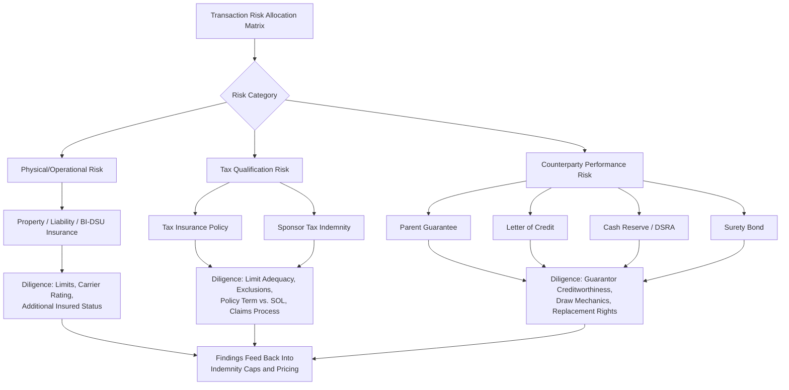

## Insurance and Credit Support Review

### Overview and Role in Transaction Diligence

Insurance and credit support review is the diligence workstream that evaluates the risk-transfer and creditworthiness mechanisms backstopping a tax equity or project finance transaction: property/casualty and liability insurance covering the physical asset, tax insurance covering the credit's technical eligibility, and credit support instruments (guarantees, letters of credit, cash reserves, surety bonds) that backstop counterparty performance obligations. In tax equity transactions specifically, this workstream sits at the intersection of insurance diligence and tax risk allocation, because tax insurance has become a standard deal term used to price and transfer residual technical risk that indemnities alone cannot efficiently absorb.

This review typically runs in parallel with (but distinct from) legal, technical, and tax structuring diligence, and its outputs directly inform pricing, indemnity caps, and closing conditions.

---

### Category 1: Traditional Project Insurance

**Coverage Types Reviewed**

- **Builder's Risk / Course of Construction** — covers physical loss or damage during construction, reviewed for period-of-coverage alignment with the construction schedule and testing/commissioning phases.
- **Property (All-Risk)** — post-completion physical damage coverage for the operating asset; diligence confirms replacement-cost valuation aligns with the asset's actual reconstruction cost, not book or tax basis.
- **General/Umbrella Liability** — third-party bodily injury and property damage; reviewed for adequate limits relative to project scale and site risk profile (e.g., utility-scale solar vs. rooftop).
- **Business Interruption / Delay in Start-Up (DSU)** — revenue replacement for outage periods; diligence checks the indemnity period length against realistic equipment lead times for major component replacement (e.g., inverters, turbines).
- **Environmental/Pollution Liability** — particularly relevant for projects with legacy site contamination risk or battery energy storage systems (fire, thermal runaway, hazardous material release).
- **Wind/Named Storm, Flood, Seismic, and Wildfire** — peril-specific riders reviewed against the project's geographic exposure and often subject to separate sub-limits and higher deductibles.
- **Workers' Compensation / Employer's Liability** — standard construction and O&M coverage.

**Key Diligence Checkpoints**

- Confirm the insured parties list includes the tax equity investor (or its designee) as an **additional insured** and, where applicable, **loss payee** on property policies.
- Verify policy limits are adequate relative to independent engineer replacement-cost estimates, not merely the EPC contract price.
- Check deductible/self-insured retention levels against sponsor balance sheet capacity to absorb them.
- Confirm the policy's cancellation/non-renewal notice provisions give the tax equity investor sufficient lead time (commonly 30–60 days) to respond before coverage lapses.
- Review carrier financial strength ratings (commonly benchmarked to A.M. Best or S&P ratings thresholds specified in transaction documents) to confirm counterparty credit quality of the insurer itself.
- Confirm business interruption/DSU coverage period is long enough to bridge a worst-case equipment replacement scenario without triggering a cash flow default under the tax equity documents.

---

### Category 2: Tax Insurance (Tax Liability / Tax Credit Insurance)

**Purpose in Tax Equity Structures**

Tax insurance has emerged as a standard risk-transfer mechanism in tax equity transactions to address the residual risk that a taxing authority successfully challenges the eligibility, amount, or characterization of tax attributes (ITC, PTC, depreciation) claimed by the transaction parties. Rather than relying solely on sponsor indemnities — which are only as good as the sponsor's ongoing balance sheet — tax insurance shifts that risk to a rated insurance carrier for a one-time premium.

**Typical Risks Covered**

- Recapture risk from a change in ownership, use, or qualifying property status
- Basis/valuation risk (particularly for ITC-eligible property where fair market value is contested)
- Qualification risk (e.g., whether a component meets the statutory definition of "energy property," or increasingly, whether a project or component satisfies domestic content or FEOC/PFE material assistance thresholds)
- Beginning-of-construction risk (whether the taxpayer's claimed start-of-construction date and continuity-of-effort/safe harbor position would survive IRS challenge)
- Transferability-related risk under §6418, where the insurance backstops the transferee's exposure to a successful IRS challenge of the transferred credit

[Inference] Given that FEOC/PFE material assistance determinations rely heavily on interim safe harbors and supplier certifications rather than finalized regulations, tax insurance underwriters are likely to price FEOC-related qualification risk as a distinct, separately-scoped risk category rather than folding it into general ITC qualification coverage, though specific underwriting practice will vary by carrier and should be confirmed directly with placement brokers for any given deal.

**Diligence Checkpoints on the Tax Insurance Policy Itself**

- **Policy limit adequacy** — confirm the limit covers the full at-risk tax benefit (credit amount plus potential gross-up for taxes on the recovery itself, since insurance proceeds may themselves be taxable).
- **Retention/deductible** — confirm the retention level and who bears it (sponsor vs. investor vs. shared).
- **Exclusions** — carefully review carve-outs; common exclusions include known issues disclosed prior to binding, fraud, and criminal conduct by the insured.
- **Claims process and cooperation clauses** — confirm the policy does not require actions inconsistent with the insured's ability to defend an IRS audit efficiently (e.g., carrier consent rights over settlement).
- **Carrier diligence underlying the policy** — review the underwriting diligence report (often prepared by the carrier's outside tax counsel) since gaps identified there may signal residual risk not fully transferred by the policy.
- **Policy term** — confirm the coverage period extends through the applicable statute of limitations for the tax positions covered, not merely through closing or the recapture period nominally described in the credit statute.
- **Subrogation and indemnity interplay** — confirm how the tax insurance policy interacts with sponsor indemnities in the transaction documents (i.e., does the investor look first to insurance, or is insurance a backstop after indemnity limits are exhausted).

---

### Category 3: Credit Support Instruments

**Common Instrument Types**

- **Parent/Sponsor Guarantees** — direct payment or performance guarantees from a creditworthy parent entity, reviewed for enforceability, governing law, and the guarantor's own financial strength.
- **Letters of Credit (LCs)** — bank-issued credit support, reviewed for issuing bank rating, evergreen/auto-renewal provisions, and draw conditions.
- **Cash Reserve Accounts / Debt Service Reserve Accounts (DSRA)** — funded reserves reviewed for minimum balance requirements, permitted investments, and release conditions.
- **Surety Bonds** — particularly common for construction completion guarantees and decommissioning obligations.
- **Parent Company Financial Covenants** — negative covenants, minimum net worth tests, or leverage ratios that function as ongoing credit support even absent a direct guarantee instrument.

**Diligence Checkpoints**

- Confirm the credit support instrument's face amount is sized to the actual exposure it is meant to cover (e.g., indemnity cap, buyout price, decommissioning cost estimate) rather than an arbitrary round number.
- Verify guarantor/issuer creditworthiness independently — review audited financials, credit ratings, and any cross-default provisions in the guarantor's other debt that could impair its ability to perform.
- Confirm draw mechanics are unconditional (a "demand" guarantee/LC) versus conditional (requiring proof of default), since conditional instruments introduce timing risk during a dispute.
- Review replacement rights — what happens if the credit support provider is downgraded below an agreed threshold; confirm the documents require replacement within a defined cure period.
- For decommissioning-related security, confirm the amount escalates over the project life in line with independent decommissioning cost estimates, not a static figure fixed at financial close.
- Confirm perfection of any security interest (UBCC filings, account control agreements for cash reserves) to ensure the credit support is actually enforceable against competing creditors.

---

### Integration Points With Other Diligence Workstreams

Insurance and credit support review does not operate in isolation; findings typically flow into and are cross-checked against:

- **Technical/engineering diligence** — the independent engineer's replacement cost and production estimates directly inform whether property and business interruption coverage limits are adequate.
- **Tax structuring diligence** — the risk allocation matrix built during tax diligence determines which residual risks are candidates for tax insurance versus sponsor indemnity versus investor-absorbed risk.
- **Legal/transaction document review** — indemnity caps, baskets, and survival periods in the purchase or partnership agreement should be calibrated against what insurance and credit support actually cover, avoiding uninsured/unsupported gaps.
- **FEOC/PFE supply chain diligence** — as noted above, qualification risk stemming from unresolved material assistance or effective-control determinations is increasingly a distinct line item within tax insurance scoping discussions.

---

### Illustrative Risk-Transfer Stack (svg_diagram)

<svg xmlns="http://www.w3.org/2000/svg" viewBox="0 0 800 400">
<text x="400" y="28" text-anchor="middle" font-size="18" font-weight="bold" fill="#1a1a1a">Insurance and Credit Support Risk-Transfer Stack (svg_diagram)</text>
<rect x="40" y="60" width="720" height="60" rx="6" fill="#e6f4ea" stroke="#3a8a52" />
<text x="400" y="85" text-anchor="middle" font-size="13" font-weight="bold" fill="#1a1a1a">Layer 1 — Sponsor Retained Risk</text>
<text x="400" y="103" text-anchor="middle" font-size="11" fill="#333">Deductibles, retentions, uninsured operational risk absorbed on sponsor balance sheet</text>
<rect x="40" y="135" width="720" height="60" rx="6" fill="#e8f0fe" stroke="#4a6fa5" />
<text x="400" y="160" text-anchor="middle" font-size="13" font-weight="bold" fill="#1a1a1a">Layer 2 — Traditional Insurance</text>
<text x="400" y="178" text-anchor="middle" font-size="11" fill="#333">Property, Liability, Business Interruption / Delay in Start-Up</text>
<rect x="40" y="210" width="720" height="60" rx="6" fill="#fff4e5" stroke="#c98a2c" />
<text x="400" y="235" text-anchor="middle" font-size="13" font-weight="bold" fill="#1a1a1a">Layer 3 — Credit Support Instruments</text>
<text x="400" y="253" text-anchor="middle" font-size="11" fill="#333">Guarantees, Letters of Credit, Cash Reserves, Surety Bonds</text>
<rect x="40" y="285" width="720" height="60" rx="6" fill="#fdecec" stroke="#c0392b" />
<text x="400" y="310" text-anchor="middle" font-size="13" font-weight="bold" fill="#1a1a1a">Layer 4 — Tax Insurance</text>
<text x="400" y="328" text-anchor="middle" font-size="11" fill="#333">Recapture, Qualification, Basis/Valuation, Transferability Risk</text>
<line x1="400" y1="120" x2="400" y2="135" stroke="#666" stroke-width="1.5" />
<line x1="400" y1="195" x2="400" y2="210" stroke="#666" stroke-width="1.5" />
<line x1="400" y1="270" x2="400" y2="285" stroke="#666" stroke-width="1.5" />

<text x="780" y="90" font-size="10" fill="#666" text-anchor="end">Operational</text>

<text x="780" y="345" font-size="10" fill="#666" text-anchor="end">Tax-Specific</text>

</svg>

---

### Practical Review Checklist Table

| Instrument | Primary Diligence Question | Common Failure Mode |
| --- | --- | --- |
| Property/Casualty Insurance | Are limits based on replacement cost, not tax basis? | Underinsurance relative to independent engineer estimate |
| Business Interruption/DSU | Does the indemnity period cover realistic equipment lead times? | Indemnity period too short for major component replacement |
| Tax Insurance | Does the policy term extend through the statute of limitations? | Coverage lapses before audit exposure period ends |
| Tax Insurance | Are exclusions limited to known/disclosed issues only? | Broad exclusions swallow the coverage for emerging risks (e.g., FEOC) |
| Parent Guarantee | Is the draw mechanism unconditional? | Conditional guarantee introduces dispute-driven payment delay |
| Letter of Credit | Is there an evergreen/auto-renewal provision? | LC lapses without replacement, leaving a coverage gap |
| Cash Reserve | Is the security interest perfected? | Unperfected UCC filing leaves reserve exposed to other creditors |
| Decommissioning Security | Does the amount escalate with updated cost estimates? | Static amount fixed at closing becomes inadequate over asset life |

---

**Next Steps**

- Tax Insurance Underwriting Process and Broker Selection Criteria
- Indemnity Cap and Basket Structuring in Tax Equity Partnership Agreements
- Transferability (§6418) Buyer-Side Insurance and Risk Allocation Practices
- Independent Engineer Reports and Their Use in Setting Insurance Limits
- Decommissioning Cost Estimation and Security Instrument Sizing
- FEOC/PFE Qualification Risk as an Emerging Tax Insurance Underwriting Category
- Recapture Risk Triggers and Their Interaction With Credit Support Replacement Rights
- Carrier Financial Strength Rating Thresholds in Project Finance Documents