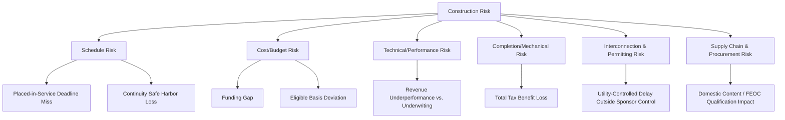

## Construction and Completion Risk

### Overview and Position in Tax Equity Risk Allocation

Construction and completion risk refers to the set of exposures arising between financial close (or investment funding) and mechanical completion / commercial operation of a renewable energy or clean energy project — the risk that the project is not built on time, on budget, to specification, or at all. In tax equity structures, this risk category carries outsized importance because it is directly linked to the availability and amount of the tax credit itself: a project that is not properly completed may fail to be "placed in service," may miss a beginning-of-construction safe harbor deadline, or may be completed with material deviations that affect eligible basis, credit qualification, or domestic content/FEOC thresholds. Construction risk therefore sits at the intersection of engineering diligence, contract risk allocation, and tax qualification risk, and is typically the single largest driver of investor-side conditions precedent, contingency reserves, and indemnity structuring in a partnership flip or sale-leaseback transaction.

---

### Categories of Construction and Completion Risk

**1. Schedule Risk**

The risk that construction takes longer than planned, which can cascade into:

- Missed placed-in-service deadlines relative to statutory phase-down/phase-out schedules
- Loss of a beginning-of-construction safe harbor position if continuity of construction is not maintained
- Delay damages under the tax equity funding agreement (e.g., yield-based delay compensation owed to the investor)
- Interconnection queue slippage, particularly for projects dependent on utility-controlled interconnection milestones outside the sponsor's control

**2. Cost/Budget Risk**

The risk that actual construction costs exceed the budgeted amount, which matters for tax equity in two distinct ways:

- **Funding risk** — cost overruns may exceed committed capital, requiring additional equity or debt that dilutes or subordinates existing investor economics
- **Basis risk** — for ITC-eligible property, the amount of eligible basis is tied to actual cost; underbuilding or cost-cutting substitutions can reduce eligible basis relative to what was underwritten, while cost overruns not properly substantiated can create basis-support risk on audit

**3. Technical/Performance Risk**

The risk that the completed facility does not perform to the specifications underwritten at financial close (capacity factor, degradation rate, availability), which affects the revenue base used to size tax equity return targets even though it does not directly affect credit eligibility.

**4. Completion/Mechanical Risk**

The risk that the project is never actually completed — abandonment, contractor insolvency, or force majeure events that permanently or indefinitely halt construction. This is the most severe manifestation of construction risk because it can result in total loss of the anticipated tax benefits if the project never reaches placed-in-service status.

**5. Interconnection and Permitting Risk**

The risk that a project completes physical construction but cannot achieve commercial operation due to unresolved interconnection agreements, permitting conditions, or utility-side upgrade delays — often the actual binding constraint on placed-in-service timing even when the EPC contractor performs on schedule.

**6. Supply Chain and Procurement Risk**

The risk of equipment delivery delays or substitutions, which has become increasingly intertwined with tax qualification risk: substituting a component from a different manufacturer or country of origin after underwriting can affect domestic content bonus eligibility or FEOC/PFE material assistance cost ratio calculations, converting what was traditionally a pure schedule/cost risk into a tax qualification risk as well.

---

### Primary Risk Allocation Mechanisms

**Fixed-Price, Date-Certain EPC Contracts**

The foundational risk-transfer instrument. A well-structured EPC contract shifts schedule and cost risk to the contractor through:

- A **guaranteed maximum price (GMP)** or fully fixed lump-sum price, minimizing the sponsor's (and by extension, the tax equity investor's) exposure to cost overruns
- A **guaranteed substantial completion date** with **liquidated damages (LDs)** for late completion, sized to compensate for lost revenue and, critically in tax equity deals, lost or delayed tax benefits
- **Performance guarantees** (capacity, availability, degradation) backed by LDs, distinguished from schedule LDs and typically capped separately

**Diligence checkpoints on EPC risk transfer:**

- Confirm LD caps are large enough in the aggregate to meaningfully compensate for a worst-case delay scenario, not merely a token amount
- Confirm LDs are calculated with reference to actual investor return impact (yield-based delay LDs) where the tax equity documents require this, rather than a generic per-day dollar figure disconnected from the deal economics
- Review force majeure carve-outs carefully — an overly broad force majeure definition can effectively convert a "fixed-date" contract into a soft target
- Confirm contractor termination rights do not allow easy exit from LD exposure

**Completion Guarantees**

Separate from EPC contractor obligations, sponsors or their parents commonly provide direct completion guarantees to the tax equity investor, guaranteeing that the project will reach mechanical completion and/or placed-in-service status by an outside date, backed by the guarantor's balance sheet. Diligence here overlaps directly with credit support review (see Insurance and Credit Support Review): the guarantor's creditworthiness, the guarantee's draw mechanics, and replacement rights upon guarantor downgrade all matter.

**Contingency Reserves**

Construction budgets typically include a contingency line item, and tax equity investors diligence:

- Whether the contingency percentage is adequate relative to project type and stage of technical maturity (a novel technology or first-of-a-kind design warrants a materially higher contingency than a standardized, repeatable design)
- Whether contingency draws require investor consent above a threshold
- Whether unused contingency reverts to reduce sponsor equity need or is retained as a buffer through commercial operation

**Independent Engineer (IE) Oversight**

The independent engineer serves as the technical diligence backbone throughout construction, and typically:

- Reviews the EPC contract, construction budget, and schedule at financial close for reasonableness
- Certifies periodic draw requests during construction against percentage-of-completion
- Issues a mechanical completion / substantial completion / final completion certification that often functions as a condition precedent to investor funding tranches or to a partnership flip date calculation

**Retainage**

A percentage of each progress payment (commonly 5–10%) withheld until substantial or final completion, giving the owner (and indirectly the investor) leverage to ensure punch-list items and final documentation are actually completed rather than left outstanding after the contractor has been paid in full.

---

### Interaction With Tax Credit Qualification Timing

Construction risk diligence cannot be separated from the tax timing rules it threatens:

- **Beginning of construction (BOC)** — a project's BOC date (established via the "physical work" test or the "5% safe harbor" test) fixes the applicable credit rate, phase-down percentage, and — critically post-OBBBA — the applicable FEOC/PFE threshold percentage vintage year. Construction delays that break **continuity of construction** (or fail to meet the continuity safe harbor, generally requiring continuous progress toward completion) can cause a project to lose its original BOC date and effectively re-set to a less favorable, later vintage.
- **Placed in service (PIS)** — the date the credit is actually claimed; diligence confirms the construction schedule realistically supports the PIS date used in the tax model, with adequate schedule float to absorb foreseeable delay risk without slipping into a less favorable statutory year.
- **Basis finality** — for investment tax credit transactions, eligible basis is generally locked in as of the placed-in-service date; construction-phase cost changes (change orders, substitutions, scope reductions) must be tracked carefully because they directly affect the credit base, not merely project economics.

[Inference] Because continuity-of-construction determinations are inherently fact-specific and have historically been an IRS audit focus area, tax equity investors typically require sponsors to maintain contemporaneous documentation of construction progress (invoices, physical work logs, schedule updates) throughout the construction period specifically to support the BOC position, rather than relying solely on the original safe harbor election made at the BOC date.

---

### Standard Conditions Precedent Tied to Construction Risk

A typical tax equity funding agreement conditions investor capital contributions (particularly at the "construction funding" or "back-leverage" stage, and the later "credit adjuster"/true-up date) on:

- Delivery of the independent engineer's mechanical completion certificate
- Confirmation that the EPC contract remains in full force with no uncured contractor defaults
- Updated construction budget-to-actual reconciliation showing no material unexplained variance
- Confirmation that no force majeure event is then continuing that would prevent completion by the outside date
- Delivery or reaffirmation of the completion guarantee (if provided by a party other than the EPC contractor)
- Updated insurance certificates reflecting the current phase of construction (builder's risk transitioning to property/casualty at completion)
- Confirmation that any equipment substitutions made during construction have not adversely affected domestic content or FEOC/PFE qualification relative to what was underwritten

---

### Illustrative Construction Risk Timeline (svg_diagram)

<svg xmlns="http://www.w3.org/2000/svg" viewBox="0 0 800 340">
<text x="400" y="26" text-anchor="middle" font-size="18" font-weight="bold" fill="#1a1a1a">Construction and Completion Risk Timeline (svg_diagram)</text>
<line x1="60" y1="170" x2="740" y2="170" stroke="#333" stroke-width="2" />
<circle cx="90" cy="170" r="7" fill="#4a6fa5" />
<text x="90" y="150" text-anchor="middle" font-size="11" font-weight="bold">Financial Close</text>
<text x="90" y="195" text-anchor="middle" font-size="10" fill="#555">BOC safe harbor</text>
<text x="90" y="208" text-anchor="middle" font-size="10" fill="#555">position fixed</text>
<circle cx="260" cy="170" r="7" fill="#c98a2c" />
<text x="260" y="150" text-anchor="middle" font-size="11" font-weight="bold">Construction Period</text>
<text x="260" y="195" text-anchor="middle" font-size="10" fill="#555">IE draw certifications</text>
<text x="260" y="208" text-anchor="middle" font-size="10" fill="#555">Continuity documentation</text>
<circle cx="430" cy="170" r="7" fill="#c98a2c" />
<text x="430" y="150" text-anchor="middle" font-size="11" font-weight="bold">Equipment Delivery</text>
<text x="430" y="195" text-anchor="middle" font-size="10" fill="#555">Substitution/origin risk</text>
<text x="430" y="208" text-anchor="middle" font-size="10" fill="#555">Domestic content/FEOC impact</text>
<circle cx="590" cy="170" r="7" fill="#3a8a52" />
<text x="590" y="150" text-anchor="middle" font-size="11" font-weight="bold">Mechanical Completion</text>
<text x="590" y="195" text-anchor="middle" font-size="10" fill="#555">IE certification</text>
<text x="590" y="208" text-anchor="middle" font-size="10" fill="#555">Retainage release trigger</text>
<circle cx="720" cy="170" r="7" fill="#c0392b" />
<text x="720" y="150" text-anchor="middle" font-size="11" font-weight="bold">Placed in Service</text>
<text x="720" y="195" text-anchor="middle" font-size="10" fill="#555">Eligible basis locked</text>
<text x="720" y="208" text-anchor="middle" font-size="10" fill="#555">Credit claim year fixed</text>
<rect x="60" y="240" width="680" height="70" rx="6" fill="#fdecec" stroke="#c0392b" />
<text x="400" y="262" text-anchor="middle" font-size="12" font-weight="bold" fill="#1a1a1a">Risk-Transfer Instruments Active Across Timeline</text>
<text x="400" y="280" text-anchor="middle" font-size="10" fill="#333">Fixed-Price EPC + LDs | Completion Guarantee | Contingency Reserve | Builder's Risk Insurance | Retainage</text>
<text x="400" y="296" text-anchor="middle" font-size="10" fill="#333">(see Insurance and Credit Support Review for instrument-level diligence)</text>
</svg>

---

### Common Failure Modes Observed in Diligence

| Failure Mode | Consequence |
| --- | --- |
| EPC force majeure clause drafted too broadly | Effectively undermines guaranteed completion date |
| LD cap set too low relative to deal economics | Inadequate compensation for investor yield impact from delay |
| Contingency reserve sized for a standard design applied to a novel technology | Underfunded budget cushion, increased funding-gap risk |
| Equipment substitution made without tax diligence sign-off | Unintended domestic content or FEOC/PFE threshold breach |
| Continuity-of-construction documentation not maintained | BOC safe harbor position vulnerable on IRS audit |
| Completion guarantee provided by an undercapitalized affiliate | Credit support proves illusory if a call is actually made |
| IE draw certifications treated as a formality rather than substantive review | Cost overruns and schedule slippage go undetected until late in construction |

---

**Related Topics**

- Beginning of Construction Safe Harbors: Physical Work Test vs. 5% Safe Harbor
- Continuity of Construction and Continuity Safe Harbor Requirements
- EPC Contract Structuring: Liquidated Damages and Performance Guarantee Drafting
- Insurance and Credit Support Review (Builder's Risk, Completion Guarantees)
- Foreign Entity of Concern Supply Chain Diligence (Equipment Substitution Impact)
- Placed-in-Service Determination and Eligible Basis Finality
- Independent Engineer Scope of Work and Draw Certification Standards
- Force Majeure Allocation in Renewable Energy Construction Contracts