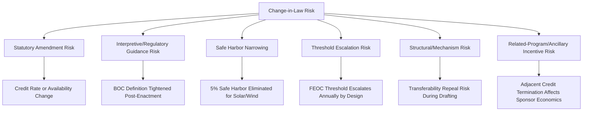

## Change-in-Law Risk and Legislative Uncertainty

### Overview and Framing

Change-in-law risk is the exposure that legislative or regulatory action occurring after a tax equity transaction is structured, priced, or closed will alter the value, availability, or qualification requirements of the tax attributes the transaction was built around. Unlike construction or technical risk, change-in-law risk is not something project-level diligence or contract drafting can eliminate at the source — it originates in Congress and Treasury, not in the project itself — so risk allocation for this category is fundamentally about who bears the *economic consequence* of a legislative shift, not about preventing the shift.

This risk category has moved from a largely theoretical, boilerplate contract provision to a live, frequently-triggered underwriting concern following the One Big Beautiful Bill Act (OBBBA), signed July 4, 2025, which modified the clean energy tax credits and incentives that the Inflation Reduction Act of 2022 (IRA) enacted. Practitioners advising on transactions closing in 2025–2026 have direct, recent experience of change-in-law risk materializing mid-cycle rather than a purely hypothetical drafting exercise.

---

### Sources of Legislative and Regulatory Uncertainty

**1. Statutory Amendment Risk**

Direct legislative change to credit availability, rate, or eligibility — the OBBBA itself is the primary example. wind and solar developers had until July 4, 2026 to begin construction and preserve their eligibility for the federal production and investment tax credits under sections 45Y and 48E of the Internal Revenue Code, a dramatically accelerated timeline relative to the IRA's original phase-out schedule (which ran through 2032 with a technology-neutral phase-down triggered by emissions targets).

**2. Interpretive/Regulatory Guidance Risk**

Even where the statute is fixed, Treasury and IRS retain wide discretion over implementing definitions that can materially tighten or loosen practical eligibility. two days from now, the Treasury Department begins a 45-day countdown to issue guidance that will actively tighten what beginning of construction actually means — guidance ordered by executive action on July 7, 2025. This illustrates that regulatory guidance risk can be as consequential as the underlying statute, since the same statutory text can be interpreted more or less restrictively depending on the guidance that follows.

**3. Safe Harbor Narrowing**

Administrative guidance can retroactively (from a planning perspective) eliminate previously-available compliance pathways. Historically, to establish the beginning of construction (BOC), taxpayers could rely on either the physical work test or the 5% safe harbor; new guidance narrows the options — for purposes of meeting the July 4, 2026, deadline for Section 48E and 45Y: the 5% safe harbor is available only through September 1, 2025, and beginning September 2, 2025, only the physical work test can establish BOC for solar and wind. Projects that had planned around the 5% safe harbor lost that option mid-planning-cycle.

**4. Threshold Escalation Risk**

Some legislative changes do not eliminate a credit outright but impose escalating compliance burdens over time, converting a one-time qualification determination into an ongoing, tightening obligation. Prohibited Foreign Entity restrictions took effect July 4, 2025, with foreign entity thresholds tightening annually: 40 percent in 2026, 45 percent in 2027, 50 percent in 2028, 55 percent in 2029, and 60 percent from 2030 — a structural design feature (not a one-off change) that itself constitutes a form of built-in, scheduled change-in-law risk baked into the statute.

**5. Structural/Mechanism Risk**

The risk that a foundational market mechanism the deal relies on (rather than a specific credit rate) is altered or repealed. The tax credit transferability aspect under Section 6418 remained whole, despite previous versions of the bill proposing either a sunset date or outright repeal of transferability — illustrating that even mechanisms which ultimately survive legislative negotiation can be live risk factors during the drafting process, and deals structured or priced during the uncertainty window had to account for the possibility of repeal.

**6. Related-Program and Ancillary Incentive Risk**

Adjacent programs that inform a project's overall economics (though not the specific credit being transacted) can also be affected. the OBBBA also impacts Section 45L, which provides a credit to builders of energy-efficient homes; the law terminates the credit for homes acquired after June 30, 2026 — relevant where a sponsor's broader portfolio economics (and therefore its credit support capacity) depend on multiple incentive streams, not solely the credit at issue in a given deal.

---

### Risk Allocation Approaches in Transaction Documents

**Grandfathering and Vintage Locking**

The primary structural defense against change-in-law risk is locking in treatment based on a fixed date — typically beginning-of-construction date or execution date of binding contracts — so that subsequent legislative changes do not retroactively apply. this illustrates why practitioners place such heavy emphasis on BOC documentation: OBBBA transition relief explicitly recognized this principle, since taxpayers may exclude certain binding written contracts entered into prior to June 16, 2025 if construction of such facilities begins before August 1, 2025 — a grandfathering mechanism built directly into the statute to mitigate change-in-law risk for deals already in motion at enactment.

**Change-in-Law Clauses in Transaction Agreements**

Standard partnership agreements and purchase/sale agreements for tax credits typically include change-in-law provisions addressing:

- Whether a post-closing legislative change that reduces credit value gives rise to a price adjustment, termination right, or is simply a risk borne by one party as-is
- Whether "change in law" is defined narrowly (only statutory amendments) or broadly (including administrative guidance, judicial decisions, and executive orders)
- Materiality thresholds — whether only changes above a certain economic impact trigger any remedy
- Distinguishing prospective changes (affecting credits not yet earned) from retroactive changes (purporting to affect credits already accrued or claimed)

**Risk-Sharing Mechanisms**

- **Gross-up provisions** — obligating one party to compensate the other for a defined category of adverse legislative change
- **True-up/reset mechanisms** — adjusting investor return targets or purchase price if statutory changes affect the economics after initial pricing but before or shortly after closing
- **Termination/walk-rights** — allowing a party to exit the transaction if a change in law crosses a defined materiality threshold before funding
- **Indemnification carve-outs** — explicitly excluding change-in-law consequences from general tax indemnities, since indemnities are typically designed for factual/compliance failures, not for legislative acts outside either party's control

**Insurance as a Backstop**

Traditional tax insurance (see Insurance and Credit Support Review) is generally underwritten against *existing law being correctly applied*, not against *future legislative change* — [Inference] because insurers price based on known statutory and regulatory frameworks at binding, prospective legislative change is a risk category tax insurance is generally not designed to cover, meaning change-in-law risk typically must be allocated contractually between the transaction parties rather than transferred to a third-party insurer, though specific policy terms should always be confirmed directly with the carrier for any given transaction.

---

### Practical Timing Dynamics Illustrated by the OBBBA Episode

The 2025–2026 OBBBA rollout is a useful live case study of how change-in-law risk actually unfolds in practice, distinct from how it is described in boilerplate contract language:

- **Enactment-to-guidance lag** — the statute was enacted July 4, 2025, but key implementing guidance (BOC narrowing, FEOC MACR mechanics via Notice 2026-15) arrived on a rolling basis over the following year, meaning transaction parties had to price and structure deals against *statutory* uncertainty first, and then *interpretive* uncertainty as guidance emerged incrementally.
- **Market repricing in response to guidance timing** — tax equity markets... reprice risk the moment Treasury guidance drops functions as an observed market dynamic: yield spreads and deal terms can move meaningfully around specific guidance release dates, not just around the original legislative enactment date. [Unverified] The specific magnitude and persistence of any such spread movement is better assessed through direct market data at the time of a given transaction than assumed from general commentary.
- **Covenant interaction risk** — a downstream effect worth flagging for diligence purposes: many utility-scale renewable green bonds issued in 2023 and 2024 carry covenants tied to project eligibility for federal incentives, so a project that loses credit eligibility mid-construction could trigger covenant reviews, renegotiated terms, or in the worst cases, acceleration clauses — illustrating that change-in-law risk in the tax credit itself can cascade into unrelated financing instruments layered on the same project.
- **Net market outcome** — despite significant uncertainty during the drafting process, the ultimate legislative outcome preserved core market infrastructure: the preservation of the IRA's transferability and direct pay mechanisms provides a crucial pillar of support for the market, and Section 6418 transferability survived the OBBBA, illustrating that change-in-law risk assessments must distinguish between credits/mechanisms that are actually eliminated versus those that survive substantially intact after a period of uncertainty.

---

### Illustrative Change-in-Law Risk Allocation Structure (svg_diagram)

<svg xmlns="http://www.w3.org/2000/svg" viewBox="0 0 800 380">
<text x="400" y="26" text-anchor="middle" font-size="18" font-weight="bold" fill="#1a1a1a">Change-in-Law Risk Allocation Structure (svg_diagram)</text>
<rect x="40" y="55" width="330" height="90" rx="6" fill="#e8f0fe" stroke="#4a6fa5" />
<text x="205" y="78" text-anchor="middle" font-size="13" font-weight="bold" fill="#1a1a1a">Pre-Enactment / Drafting Phase</text>
<text x="205" y="98" text-anchor="middle" font-size="11" fill="#333">Statutory amendment risk</text>
<text x="205" y="114" text-anchor="middle" font-size="11" fill="#333">Structural/mechanism repeal risk</text>
<text x="205" y="130" text-anchor="middle" font-size="11" fill="#333">Mitigant: pricing flexibility, walk-rights</text>
<rect x="430" y="55" width="330" height="90" rx="6" fill="#fff4e5" stroke="#c98a2c" />
<text x="595" y="78" text-anchor="middle" font-size="13" font-weight="bold" fill="#1a1a1a">Post-Enactment / Guidance Phase</text>
<text x="595" y="98" text-anchor="middle" font-size="11" fill="#333">Interpretive guidance risk</text>
<text x="595" y="114" text-anchor="middle" font-size="11" fill="#333">Safe harbor narrowing risk</text>
<text x="595" y="130" text-anchor="middle" font-size="11" fill="#333">Mitigant: grandfathering, BOC documentation</text>
<line x1="370" y1="100" x2="430" y2="100" stroke="#4a6fa5" stroke-width="2" marker-end="url(#arrow2)" />
<line x1="595" y1="145" x2="595" y2="180" stroke="#4a6fa5" stroke-width="2" marker-end="url(#arrow2)" />
<rect x="430" y="180" width="330" height="90" rx="6" fill="#e6f4ea" stroke="#3a8a52" />
<text x="595" y="203" text-anchor="middle" font-size="13" font-weight="bold" fill="#1a1a1a">Ongoing Compliance Phase</text>
<text x="595" y="223" text-anchor="middle" font-size="11" fill="#333">Threshold escalation risk (FEOC, domestic content)</text>
<text x="595" y="239" text-anchor="middle" font-size="11" fill="#333">Mitigant: vintage locking at BOC date,</text>
<text x="595" y="255" text-anchor="middle" font-size="11" fill="#333">contractual gross-up/true-up provisions</text>
<line x1="205" y1="145" x2="205" y2="180" stroke="#4a6fa5" stroke-width="2" marker-end="url(#arrow2)" />
<rect x="40" y="180" width="330" height="90" rx="6" fill="#fdecec" stroke="#c0392b" />
<text x="205" y="203" text-anchor="middle" font-size="13" font-weight="bold" fill="#1a1a1a">Downstream Cascade Risk</text>
<text x="205" y="223" text-anchor="middle" font-size="11" fill="#333">Financing covenant triggers</text>
<text x="205" y="239" text-anchor="middle" font-size="11" fill="#333">Mitigant: covenant review, lender coordination</text>
<rect x="150" y="300" width="500" height="55" rx="6" fill="#f5f5f5" stroke="#666" />
<text x="400" y="322" text-anchor="middle" font-size="12" font-weight="bold" fill="#1a1a1a">Allocation Tools Across All Phases</text>
<text x="400" y="340" text-anchor="middle" font-size="10" fill="#333">Change-in-law contract clauses | Grandfathering elections | Materiality thresholds | Termination rights</text>
</svg>

---

### Diligence Checklist for Change-in-Law Exposure

| Diligence Area | Key Question |
| --- | --- |
| Grandfathering eligibility | Does the project qualify for any transition relief tied to pre-enactment contracts or BOC dates? |
| Change-in-law clause scope | Does the definition include regulatory guidance and executive orders, or only statutory amendments? |
| Materiality threshold | What economic impact level triggers a contractual remedy? |
| Retroactivity exposure | Could pending or anticipated guidance apply to credits already accrued, not just future ones? |
| Threshold escalation schedule | Is the applicable FEOC/domestic content threshold locked at the correct vintage year for this project? |
| Covenant interaction | Do any layered financing instruments (bonds, back-leverage debt) contain covenants tied to credit eligibility? |
| Insurance scope | Does the tax insurance policy exclude prospective legislative change, and is that exclusion clearly understood by all parties? |
| Walk-rights/termination triggers | Can a party exit before funding if a material adverse change in law occurs? |

---

**Related Topics**

- Beginning of Construction Safe Harbors: Physical Work Test vs. 5% Safe Harbor (Post-OBBBA Narrowing)
- Foreign Entity of Concern Supply Chain Diligence (Threshold Escalation as Structural Change-in-Law Risk)
- Insurance and Credit Support Review (Scope Limits on Prospective Legislative Change)
- Transferability (§6418) Market Structure and Its Survival Through Legislative Negotiation
- Grandfathering and Transition Relief Drafting in Tax Credit Legislation
- Construction and Completion Risk (Interaction With Accelerated Statutory Deadlines)
- Green Bond and Project Finance Covenant Design Tied to Credit Eligibility
- Executive Order Influence on Treasury Rulemaking Timelines