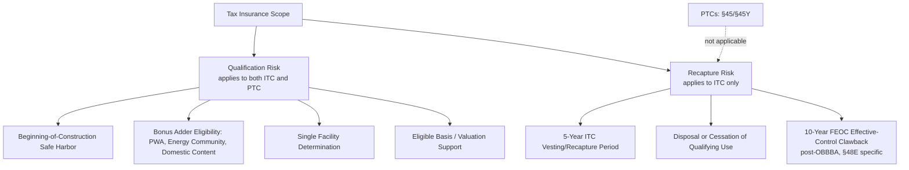

## Tax Insurance for Recapture and Qualification Risk

### Overview and Market Role

Tax insurance for recapture and qualification risk is a specialized insurance product that transfers the risk of an adverse IRS determination — whether a tax credit was properly earned, correctly valued, or will remain intact through its statutory recapture period — from the transaction parties to a rated insurance carrier. Risk mitigation is critical in a new market in which many buyers, from regional banks to corporate tax departments, may not be willing to proceed without added protection, and tax credit insurance has emerged as a key vehicle to manage risk. The product has moved from a niche, deal-specific tool to a mainstream market feature: Crux's data shows that 60–70% of ITC deals included insurance in the first half of 2025.

This topic sits downstream of and complements two adjacent areas: **Insurance and Credit Support Review** (which covers tax insurance as one instrument among several) and **Change-in-Law Risk and Legislative Uncertainty** (which covers the *prospective* legislative risk that tax insurance generally does not cover). This entry focuses specifically on how recapture and qualification risk are underwritten, priced, and structured within a tax insurance policy.

---

### Recapture Risk vs. Qualification Risk — A Critical Distinction

**Qualification Risk** is the risk that a credit was never properly earned in the first place — a threshold, factual, or legal defect existing at or before the credit was claimed. This includes:

- Whether the project constitutes qualifying "energy property" (§48) or a "qualified facility" or "energy storage technology" (§48E)
- Whether the "beginning of construction" safe harbor was properly satisfied
- Whether bonus adders (prevailing wage and apprenticeship (PWA), energy community, domestic content) were properly earned
- Whether the project constitutes a "single facility" within the meaning of existing IRS guidance
- Whether eligible basis and any basis step-up will be respected by the taxing authority

**Recapture Risk** is a distinct, forward-looking risk that applies *after* a credit has already been validly earned and claimed: the risk that a subsequent event during a statutory recapture window causes some or all of the credit to be clawed back. Critically, recapture risk only applies to ITCs; PTCs cannot be recaptured because the credit is only generated after the electricity or manufactured component is produced. This creates a structurally important asymmetry across credit types:

- **ITCs (§48, §48E)** — investment tax credits, including both legacy credits under §48 and tech-neutral credits under §48E, are subject to a five-year recapture period if the facility earning the ITC ceases to be "investment credit property." Mechanically, ITCs vest at 20% per year over five years; if the underlying asset is disposed of or ceases to qualify during this period, the unvested portion must be repaid.
- **PTCs (§45, §45Y)** — unlike ITCs, §45 and §45Y PTCs are not subject to recapture risk, and no wind projects generating PTCs included tax credit insurance in observed market data, directly reflecting this structural difference.
- **§45X Advanced Manufacturing PTC** — while §45X AMPCs are not subject to PWA requirements and do not carry the same recapture risks as §48 and §48E ITCs, they do carry additional qualification risks distinct from power-generation credits (e.g., component-level MACR/FEOC qualification, discussed below).

This asymmetry directly drives insurance purchasing behavior: insurance coverage is less common for PTC deals because PTCs are only generated when a project is producing electricity or a component has already been manufactured, and observed prevalence data confirms this — 62% of ITC deals included insurance coverage in 1H2025, versus 23% for PTCs in the same period.

---

### Modern Policy Structure — Combined Qualitative and Quantitative Coverage

For ITCs, a single tax insurance policy provides coverage for both the qualitative and quantitative tax credit exposures. This dual structure is now standard market practice:

**Qualitative-covered tax positions** typically include:

- Qualification for tax credit bonus adders (PWA, energy community, domestic content)
- Satisfaction of the "begun construction" safe-harbor and other soft factors
- The "single facility" determination

**Quantitative-covered tax positions** typically include:

- That the valuation of the project (often including a basis step-up) and allocation between ITC-eligible and ineligible costs will be respected by the taxing authority

**Recapture coverage** is layered onto the same policy as a distinct rider: coverage includes tax credit recapture due to specific events delineated in the policy's recapture section, meaning the recapture triggers covered are enumerated and negotiated rather than open-ended — diligence on any given policy should confirm exactly which recapture-triggering events (disposal, cessation of qualifying use, specific compliance failures) are within scope versus excluded.

**Repowering and Basis-Specific Products**

Specialized policy variants have developed for repowered facilities: repowering coverage underwrites both the (re)qualification for tax credits and the 80/20 appraisal test used to determine whether a repowered facility is treated as newly placed in service, and can extend to projects originally under the Section 1603 cash grant program. A related, narrower **qualified basis** product confirms that the fair market value used to compute ITCs will be respected by the IRS, with certain recapture risk also includable. For storage assets, coverage is included in a qualified basis policy for battery storage integrated into a solar facility, though dialogue on standalone storage coverage is still ongoing as a distinct market development.

---

### FEOC-Related Recapture: A New, Still-Developing Risk Category

The OBBBA introduced a novel recapture mechanism specifically tied to prohibited foreign entity (PFE) relationships that did not exist under the original IRA recapture framework, and underwriters are actively adapting to it:

For §48E ITCs claimed in tax years beginning after July 4, 2027 (i.e., 2028 for calendar-year taxpayers), the IRS may claw back 100% of the credit if the project makes effective control payments to a PFE within 10 years of being placed in service. This is materially different from the traditional five-year ITC recapture window — it is a longer (10-year), higher-stakes (100% clawback), and behaviorally-triggered (ongoing payment conduct, not a one-time disposal event) recapture exposure.

The market's underwriting response to this new risk category is still forming: the IRS is expected to release further guidance detailing effective control payments and PFE definitions this year; clarity from this guidance will help market participants and insurers fully incorporate this risk into standard underwriting practices — however, the market is already adjusting even ahead of that clarity. [Inference] Given that this FEOC-linked recapture window (10 years) is substantially longer than the traditional 5-year ITC recapture period, and given that "effective control" determinations remain interpretively unsettled (see Foreign Entity of Concern Supply Chain Diligence), insurers are likely to underwrite this exposure as a distinct policy line with its own retention and exclusion language rather than folding it into standard recapture coverage — though the specific underwriting treatment should be confirmed directly with carriers for any given transaction, since standardized market practice had not yet solidified as of the guidance referenced above.

---

### Market Pricing and Capacity Trends

**Premium trends:** strong market demand and limited underwriting capacity have created an underserved market, driving premium increases — over 30% for primary coverage and approximately 20% for excess coverage in the period observed. This reflects a capacity-constrained market rather than a pure risk-repricing event, meaning premium levels are influenced by insurer capacity as much as by underlying project risk.

**Underwriting discipline:** tax credit insurers currently operate under near-zero loss mandates, meaning the underwriting bar is high and a policy that clears it provides strong additional confidence in the transaction. This has an important secondary effect noted in market commentary: insurance serves as independent validation — an expert third party evaluating the project risks and putting its own balance sheet behind them — meaning a successfully underwritten and bound policy functions partly as a de facto diligence signal to the market, not merely as a risk-transfer instrument.

**Segment-specific demand:** insurance is an important tool to de-risk battery and energy storage and solar + storage projects — 80% of reported storage deals in 1H2025 used insurance, including 50% of deals with investment-grade sponsors, reflecting that a larger share of storage projects have merchant revenue models, so insurance serves as a critical de-risking mechanism and supports market liquidity for these deals even where sponsor credit quality alone might otherwise be considered sufficient.

**New credit categories:** insurance can be an important tool to increase buyer comfort with tax credits from newer tax credit categories — new §45Z clean fuel PTCs began to enter the market in the first half of 2025, for instance, and typically included insurance coverage, illustrating that insurance uptake tends to run highest precisely where market/underwriting track record is thinnest.

**Pricing bifurcation by credit type:** market data through mid-2026 shows PTC pricing remaining relatively resilient, reflecting stronger buyer preference for production-based credits based on their lack of recapture risk and simpler qualification requirements, versus ITC pricing softening more meaningfully, with average pricing down approximately 2–3 cents compared to the same time last year, reflecting the market's preference shift toward PTCs — a pricing dynamic directly downstream of the recapture/qualification risk asymmetry described above, and relevant context for why insurance demand concentrates so heavily on the ITC side of the market.

**Complexity and discount interaction:** §48 and §48E ITCs generally carry a larger discount compared to §45 or §45Y PTCs and §45X AMPCs because due diligence is more complex, and credits are subject to risk of §50 recapture — meaning insurance cost must be weighed against, and is partly a function of, this baseline pricing discount rather than evaluated as a standalone line-item expense.

---

### Illustrative Tax Insurance Coverage Map (svg_diagram)

<svg xmlns="http://www.w3.org/2000/svg" viewBox="0 0 800 420">
<text x="400" y="26" text-anchor="middle" font-size="18" font-weight="bold" fill="#1a1a1a">Tax Insurance Coverage Map (svg_diagram)</text>
<rect x="30" y="55" width="360" height="150" rx="6" fill="#e8f0fe" stroke="#4a6fa5" />
<text x="210" y="78" text-anchor="middle" font-size="13" font-weight="bold" fill="#1a1a1a">Qualitative Coverage</text>
<text x="210" y="98" text-anchor="middle" font-size="11" fill="#333">Beginning-of-construction safe harbor</text>
<text x="210" y="116" text-anchor="middle" font-size="11" fill="#333">PWA / energy community / domestic content</text>
<text x="210" y="134" text-anchor="middle" font-size="11" fill="#333">"Single facility" determination</text>
<text x="210" y="152" text-anchor="middle" font-size="11" fill="#333">Applies to ITC and PTC alike</text>
<text x="210" y="175" text-anchor="middle" font-size="10" fill="#555" font-style="italic">Present at claim / placed-in-service date</text>
<rect x="410" y="55" width="360" height="150" rx="6" fill="#fff4e5" stroke="#c98a2c" />
<text x="590" y="78" text-anchor="middle" font-size="13" font-weight="bold" fill="#1a1a1a">Quantitative Coverage</text>
<text x="590" y="98" text-anchor="middle" font-size="11" fill="#333">Fair market valuation / basis step-up</text>
<text x="590" y="116" text-anchor="middle" font-size="11" fill="#333">ITC-eligible vs. ineligible cost allocation</text>
<text x="590" y="134" text-anchor="middle" font-size="11" fill="#333">Qualified basis confirmation</text>
<text x="590" y="152" text-anchor="middle" font-size="11" fill="#333">Applies primarily to ITC</text>
<text x="590" y="175" text-anchor="middle" font-size="10" fill="#555" font-style="italic">Present at claim / placed-in-service date</text>
<rect x="220" y="235" width="360" height="150" rx="6" fill="#fdecec" stroke="#c0392b" />
<text x="400" y="258" text-anchor="middle" font-size="13" font-weight="bold" fill="#1a1a1a">Recapture Coverage</text>
<text x="400" y="278" text-anchor="middle" font-size="11" fill="#333">5-year standard ITC vesting/disposal risk</text>
<text x="400" y="296" text-anchor="middle" font-size="11" fill="#333">10-year FEOC effective-control clawback (§48E)</text>
<text x="400" y="314" text-anchor="middle" font-size="11" fill="#333">Enumerated triggering events per policy</text>
<text x="400" y="332" text-anchor="middle" font-size="11" fill="#333" font-weight="bold">ITC ONLY — not applicable to §45/§45Y PTC</text>
<text x="400" y="355" text-anchor="middle" font-size="10" fill="#555" font-style="italic">Ongoing exposure post-placed-in-service</text>
<line x1="210" y1="205" x2="350" y2="235" stroke="#666" stroke-width="1.5" stroke-dasharray="4,3" />
<line x1="590" y1="205" x2="450" y2="235" stroke="#666" stroke-width="1.5" stroke-dasharray="4,3" />
</svg>

---

### Diligence Checklist for Tax Insurance Policies

| Diligence Area | Key Question |
| --- | --- |
| Coverage scope | Does the policy combine qualitative, quantitative, and recapture coverage, or is recapture a separate rider? |
| Recapture trigger enumeration | Which specific events are covered under the recapture section, and are FEOC/effective-control clawbacks included or excluded? |
| Credit type alignment | Is the policy correctly scoped to the credit's actual risk profile (ITC recapture exposure vs. PTC's lack thereof)? |
| Policy term | Does the coverage period extend through the full applicable recapture window (5-year standard; 10-year for FEOC-linked §48E clawback)? |
| Underwriting basis | Was the policy underwritten against current guidance, and does it address known open questions (e.g., undefined "effective control" mechanics)? |
| Retention/step-up treatment | What retentions apply specifically to basis step-up positions, historically a focus area for insurer-imposed retentions? |
| Repowering/storage fit | If applicable, does the policy correctly address 80/20 appraisal, repowering qualification, or storage-specific coverage? |
| Carrier capacity and pricing context | Is the premium consistent with current market conditions (elevated primary/excess pricing amid constrained capacity)? |

---

**Next Steps**

- Foreign Entity of Concern Supply Chain Diligence (Underlying Qualification Risk Feeding FEOC-Linked Recapture)
- Insurance and Credit Support Review (Tax Insurance Within the Broader Risk-Transfer Stack)
- Change-in-Law Risk and Legislative Uncertainty (Why Tax Insurance Generally Excludes Prospective Legislative Change)
- Transferability (§6418) Buyer Diligence and Insurance as a Closing Condition
- Beginning-of-Construction Documentation Standards Supporting Qualitative Coverage
- Basis Step-Up and Fair Market Valuation Diligence in ITC Transactions
- Repowering Transactions and the 80/20 Test
- Domestic Content and Prevailing Wage/Apprenticeship Bonus Adder Qualification Diligence