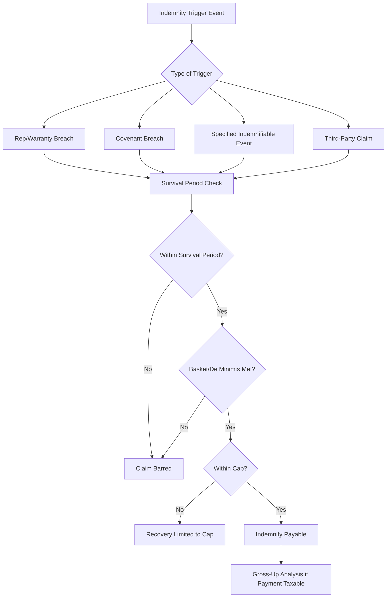

## Indemnification Structures Between Sponsor and Investor

### Overview and Function Within the Risk Allocation Framework

Indemnification structures between sponsor and investor are the contractual mechanisms in a tax equity partnership agreement (or sale-leaseback/inverted lease documents) that allocate responsibility for losses arising from breaches of representations, failures of tax positions, or specified adverse events, by requiring one party to compensate the other for defined categories of loss. Indemnities function as the residual risk-allocation layer that sits behind — and interacts directly with — the other mechanisms already covered in this chapter: insurance and credit support (which transfer risk to third parties), change-in-law provisions (which allocate legislative risk specifically), and tax insurance (which increasingly substitutes for indemnities on qualification and recapture risk). Understanding indemnification requires understanding where it starts and stops relative to those other instruments, since a well-structured transaction avoids both coverage gaps and duplicative risk-transfer for the same exposure.

---

### Core Structural Elements of an Indemnity Provision

**1. Trigger Definition**

Indemnities are typically triggered by one or more of the following categories:

- Breach of a representation or warranty (e.g., regarding title, permits, compliance with law, tax basis accuracy)
- Breach of a covenant (an ongoing obligation, such as maintaining insurance or not taking actions that would cause credit disqualification)
- A specified indemnifiable event (a defined list of adverse outcomes, such as recapture events, third-party claims, or environmental liabilities)
- Third-party claims requiring defense and/or payment

**2. Scope — What Losses Are Covered**

Indemnity provisions define "Losses" (or "Damages") with varying breadth:

- Direct losses (out-of-pocket costs, tax liability actually incurred)
- Defense costs (legal fees incurred responding to a third-party claim or IRS audit)
- Consequential and indirect losses (often expressly excluded or heavily negotiated, since open-ended consequential damages exposure is a major point of sponsor pushback)
- Tax gross-up (where the indemnity payment itself would be taxable income to the recipient, requiring an additional gross-up payment so the after-tax recovery matches the intended loss coverage)

**3. Survival Periods**

Representations and the associated indemnity obligations do not survive indefinitely; survival periods are typically tiered:

- **Fundamental representations** (organization, authority, title, capitalization) — often survive indefinitely or for an extended period (e.g., the applicable statute of limitations plus a defined tail)
- **Tax representations** — typically survive through the relevant statute of limitations for the tax positions at issue, since an IRS challenge cannot be assessed against a party once the indemnity has expired
- **General/operational representations** — shorter, fixed survival periods (commonly 12–24 months post-closing)

**4. Caps and Baskets**

- **Indemnity cap** — the maximum aggregate liability of the indemnifying party, often expressed as a percentage of the total investment or purchase price, with certain categories (fundamental reps, fraud, specified indemnities like tax recapture) frequently carved out from the general cap and subject to no cap or a separate, higher cap
- **Basket/deductible** — a minimum aggregate loss threshold before any indemnity claim can be made, which may operate as a true deductible (only losses above the basket are recoverable) or a tipping basket (once the basket is exceeded, the full amount including the basket is recoverable)
- **De minimis threshold** — a per-claim floor below which individual claims are disregarded entirely, preventing nuisance claims for immaterial amounts

**5. Procedural Mechanics**

- Notice requirements (timing and content of a claim notice)
- Defense and control rights for third-party claims (who controls the defense, consent rights over settlement, cooperation obligations)
- Payment mechanics (direct payment, set-off against distributions, or escrow release)

---

### Common Indemnifiable Events in Tax Equity Transactions

**Sponsor-to-Investor Indemnities (most common direction, since the investor is relying on the sponsor's representations about the project)**

- **Tax credit recapture** arising from a sponsor-caused event (e.g., disposition of the project, cessation of qualifying use, or a compliance failure within the sponsor's control) — see Tax Insurance for Recapture and Qualification Risk for how this exposure is increasingly transferred to a carrier rather than borne solely by sponsor indemnity
- **Basis overstatement** — if the eligible basis or fair market value used to compute the credit is successfully challenged and reduced by the IRS
- **Breach of qualification representations** — including beginning-of-construction position, "single facility" determination, or (increasingly, post-OBBBA) FEOC/PFE material assistance representations
- **Environmental liabilities** — pre-existing site conditions not disclosed during diligence
- **Title and permit defects**
- **Construction defects or EPC contractor breaches** not otherwise remedied through the completion guarantee or contingency reserve mechanisms (see Construction and Completion Risk)
- **Third-party litigation** arising from pre-closing conduct

**Investor-to-Sponsor Indemnities (less common, but present in negotiated deals)**

- Breach of investor representations regarding its own tax status, eligibility to claim credits, or authority to enter the transaction
- Investor actions post-closing that independently cause a compliance failure (e.g., an investor-side change in control that triggers an ownership-related disqualification)
- Breach of confidentiality or other operational covenants

---

### Interaction With Insurance and Credit Support

A central drafting question in every tax equity deal is the **order of recovery** and **overlap avoidance** between indemnities, tax insurance, and credit support instruments:

- **Insurance as primary, indemnity as backstop** — increasingly common structure where the investor looks first to a bound tax insurance policy for qualification/recapture risk, and the sponsor indemnity applies only to the extent losses exceed the policy limit or fall within a policy exclusion (see Tax Insurance for Recapture and Qualification Risk for what such policies typically do and do not cover).
- **Indemnity as primary, insurance as backstop** — the inverse structure, less common but seen where a sponsor's balance sheet is strong and insurance is procured mainly to cover tail risk beyond the sponsor's practical recovery capacity.
- **Credit support as the collection mechanism, not the risk-transfer mechanism** — a guarantee or letter of credit (see Insurance and Credit Support Review) does not itself define what is owed; it exists to ensure the indemnity, once triggered and quantified, is actually collectible. Diligence should confirm the credit support instrument's face amount is sized to the actual indemnity cap, not to a lower, stale, or arbitrary figure.
- **Change-in-law carve-out** — as discussed in Change-in-Law Risk and Legislative Uncertainty, indemnities are typically drafted to exclude losses caused by a prospective change in law, since indemnities are designed to address factual/compliance failures within a party's control, not legislative acts outside either party's control. Practitioners should confirm this carve-out is explicit rather than assumed, since an ambiguously broad "Losses" definition could otherwise be read to sweep in legislative risk neither party intended to allocate via indemnity.

---

### Illustrative Indemnification and Recovery Waterfall (svg_diagram)

<svg xmlns="http://www.w3.org/2000/svg" viewBox="0 0 800 380">
<text x="400" y="26" text-anchor="middle" font-size="18" font-weight="bold" fill="#1a1a1a">Indemnification and Recovery Waterfall (svg_diagram)</text>
<rect x="40" y="55" width="720" height="55" rx="6" fill="#e6f4ea" stroke="#3a8a52" />
<text x="400" y="78" text-anchor="middle" font-size="13" font-weight="bold" fill="#1a1a1a">Step 1 — Loss Identified and Claim Noticed</text>
<text x="400" y="96" text-anchor="middle" font-size="11" fill="#333">Confirm within survival period and above de minimis threshold</text>
<line x1="400" y1="110" x2="400" y2="130" stroke="#666" stroke-width="1.5" />
<rect x="40" y="130" width="720" height="55" rx="6" fill="#e8f0fe" stroke="#4a6fa5" />
<text x="400" y="153" text-anchor="middle" font-size="13" font-weight="bold" fill="#1a1a1a">Step 2 — Tax Insurance Policy Reviewed First (if bound)</text>
<text x="400" y="171" text-anchor="middle" font-size="11" fill="#333">Covered? Recover from carrier up to policy limit</text>
<line x1="400" y1="185" x2="400" y2="205" stroke="#666" stroke-width="1.5" />
<rect x="40" y="205" width="720" height="55" rx="6" fill="#fff4e5" stroke="#c98a2c" />
<text x="400" y="228" text-anchor="middle" font-size="13" font-weight="bold" fill="#1a1a1a">Step 3 — Residual Loss to Sponsor Indemnity</text>
<text x="400" y="246" text-anchor="middle" font-size="11" fill="#333">Excess over policy limit, or policy-excluded losses, subject to basket/cap</text>
<line x1="400" y1="260" x2="400" y2="280" stroke="#666" stroke-width="1.5" />
<rect x="40" y="280" width="720" height="55" rx="6" fill="#fdecec" stroke="#c0392b" />
<text x="400" y="303" text-anchor="middle" font-size="13" font-weight="bold" fill="#1a1a1a">Step 4 — Credit Support Instrument Called if Indemnity Unpaid</text>
<text x="400" y="321" text-anchor="middle" font-size="11" fill="#333">Guarantee/LC draw ensures quantified indemnity is actually collected</text>
<line x1="400" y1="335" x2="400" y2="350" stroke="#666" stroke-width="1.5" marker-end="url(#a3)" />
<text x="400" y="365" text-anchor="middle" font-size="10" fill="#666" font-style="italic">Change-in-law losses excluded from this waterfall throughout</text>
</svg>

---

### Negotiation Points Frequently Contested Between Sponsor and Investor

| Issue | Sponsor Position (Typical) | Investor Position (Typical) |
| --- | --- | --- |
| Indemnity cap | Cap at a modest percentage of investment; carve-outs limited to fraud only | Uncapped or high cap for fundamental/tax reps; broader carve-out list |
| Survival period for tax reps | Shorter period tied to closing | Full statute-of-limitations period plus tail |
| Basket type | True deductible (only excess recoverable) | Tipping basket (full amount recoverable once triggered) |
| Consequential damages | Expressly excluded | Carve-out for damages that are a foreseeable, direct result of breach |
| Insurance vs. indemnity order | Insurance as primary, indemnity capped to gap only | Sponsor indemnity available regardless of insurance, subject to anti-double-recovery language only |
| Gross-up obligation | Resisted or capped | Required whenever indemnity payment itself generates taxable income |
| Defense control | Sponsor controls defense of IRS audit given tax expertise/stake | Investor retains consent rights over settlement affecting its credit position |

---

**Related Topics**

- Tax Insurance for Recapture and Qualification Risk (Interaction With Sponsor Indemnity Scope)
- Insurance and Credit Support Review (Sizing Credit Support to Indemnity Caps)
- Change-in-Law Risk and Legislative Uncertainty (Carve-Out Drafting for Indemnity Provisions)
- Construction and Completion Risk (Completion Guarantee vs. General Indemnity Overlap)
- Partnership Flip Structuring and Capital Account Mechanics
- Tax Gross-Up Mechanics for Indemnity Payments
- Statute of Limitations Considerations in Tax Representation Survival Periods
- Third-Party Claim Defense and Control Provisions in Tax Equity Agreements